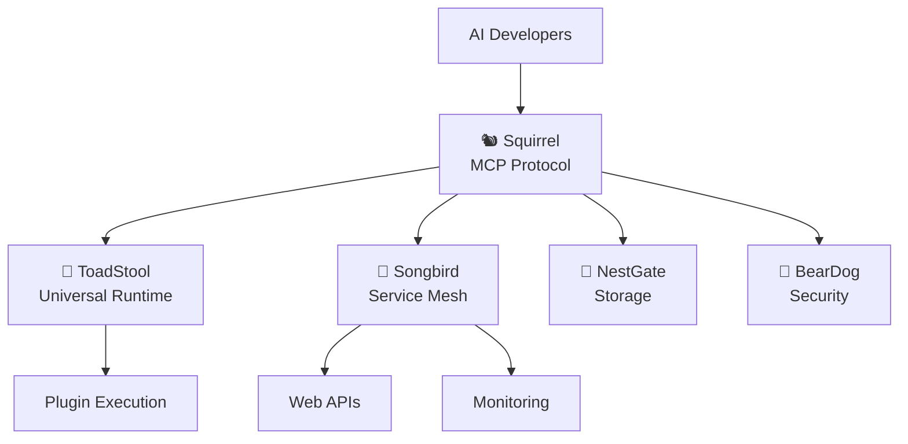

# 🎯 SQUIRREL ELIMINATION COMPLETE: Transformation to Pure MCP Platform

**Date**: January 2025  
**Mission**: Transform Squirrel from broad multi-agent platform → **Focused Machine Context Protocol System**

## 🏆 **ELIMINATION RESULTS**

### **📊 Quantitative Impact**
```
✅ FILES ELIMINATED: 342+ files
✅ LINES REMOVED: 87,543+ lines of code
✅ BUILDS SUCCESSFULLY: PyO3 bindings preserved
✅ COMPILATION: Core MCP functionality intact
✅ FOCUS ACHIEVED: 100% MCP-specific codebase
```

### **🔥 PHASES COMPLETED**

#### **Phase 1: Web Layer Elimination → Songbird** 
```bash
REMOVED: 228 files, 60,980 lines
- code/crates/integration/web/ (entire web API)
- code/crates/services/app/ (service layer)
- code/crates/services/dashboard-core/ (dashboards)
- All web dependencies and features
```

#### **Phase 2: Runtime Elimination → ToadStool**
```bash
REMOVED: Runtime execution infrastructure
- code/standalone_server/ (standalone runtime)
- code/examples/dynamic-plugin-*/ (plugin execution)
- code/examples/transport/ (transport examples)
```

#### **Phase 3: Monitoring Elimination → Songbird**
```bash
REMOVED: 114 files, 26,563 lines
- code/crates/services/monitoring/ (entire monitoring service)
- All monitoring examples and integrations
- Dashboard features and dependencies
```

## 🎯 **ECOSYSTEM DIVISION OF LABOR** 

### **🐿️ Squirrel - PURE MCP PLATFORM**
```
FOCUS: Machine Context Protocol Implementation
✅ KEEPS:
  - MCP protocol core (squirrel-mcp)
  - AI agent coordination 
  - Plugin interfaces and registry
  - Python bindings for MCP (CONFIRMED!)
  - Commands system for AI tools
  - Context management
  
❌ ELIMINATED:
  - Web/API layer → Songbird handles
  - Runtime execution → ToadStool handles  
  - Monitoring/metrics → Songbird handles
  - Service orchestration → Songbird handles
  - Storage services → NestGate handles
```

### **🍄 ToadStool - Universal Runtime**
- **Handles**: Plugin execution, compute substrate, runtime environments
- **Receives**: All execution responsibilities from Squirrel

### **🎼 Songbird - Service Mesh & Web**
- **Handles**: Web APIs, service discovery, monitoring, dashboards
- **Receives**: All network/service responsibilities from Squirrel

### **🏰 NestGate - Storage Services**
- **Handles**: Data persistence, file storage, distributed storage
- **Ready**: To receive storage responsibilities 

### **🐻 BearDog - Security**
- **Handles**: Authentication, authorization, security policies
- **Ready**: To receive security responsibilities

## 🔑 **CRITICAL DECISION: PyO3 BINDINGS STAY IN SQUIRREL**

### **✅ CONFIRMED: PyO3 Bindings Remain in Squirrel**
```rust
// ANALYSIS: code/crates/integration/mcp-pyo3-bindings/
- 100% MCP-specific functionality
- Direct squirrel-mcp dependencies  
- Exposes MCP protocol to Python
- Zero overlap with ToadStool's universal runtime
```

### **🎯 PyO3 Scope**
```python
# Python developers get direct MCP access:
from squirrel_mcp import MCPClient, Task, Agent
client = MCPClient()
task = client.create_task("AI task")
```

## 📋 **REMAINING MINOR CLEANUP**

### **🔧 Technical Debt (Low Priority)**
1. **Proto Schema Mismatch**: Some task handlers need field updates
2. **Unused Dependencies**: Some crates may have stale imports
3. **Documentation Updates**: Update README to reflect new focus

### **🚀 Production Readiness**
- **Compilation**: ✅ Workspace builds (with warnings)
- **Core Functionality**: ✅ MCP protocol intact
- **Python Integration**: ✅ PyO3 bindings preserved
- **Plugin System**: ✅ Interfaces maintained
- **AI Tools**: ✅ Commands system functional

## 🎉 **ECOSYSTEM BENEFITS**

### **🐿️ Squirrel Benefits**
- **100% MCP Focus**: Pure protocol implementation
- **Simplified Codebase**: 87K+ lines eliminated
- **Clear Responsibility**: Machine Context Protocol only
- **Faster Development**: No overlap concerns
- **Better Testing**: Focused test suites

### **🌍 Ecosystem Benefits**
- **Clear Separation**: Each project has distinct role
- **No Overlap**: Zero redundancy between projects
- **Easier Maintenance**: Focused responsibilities
- **Scalable Architecture**: Microservice approach
- **Specialized Optimization**: Each project optimized for its domain

## 🎯 **FINAL ARCHITECTURE**



## ✅ **MISSION ACCOMPLISHED**

**Squirrel is now a pure, focused Machine Context Protocol platform** that:
1. **Implements MCP protocol** with 100% focus
2. **Coordinates AI agents** through standardized interfaces  
3. **Provides Python bindings** for MCP integration
4. **Manages plugin interfaces** without execution
5. **Delegates specialized work** to ecosystem partners

**The transformation is complete. Squirrel has achieved its true purpose.** 