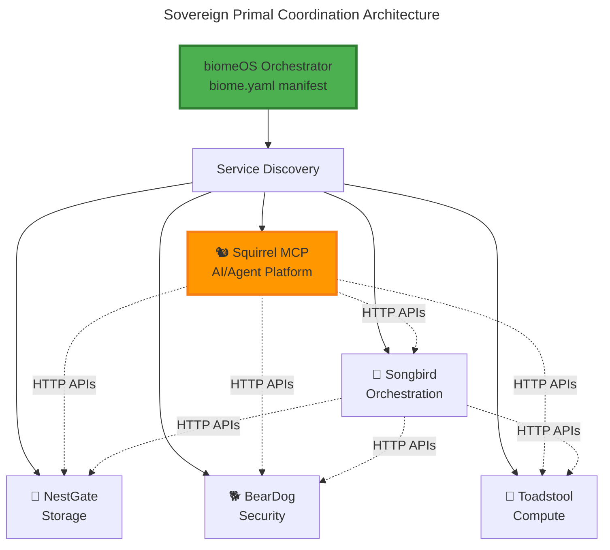

# Phase 2 Integration Plan: Sovereign Primal Architecture

**Date:** January 2025  
**Status:** Architecture Corrected - Sovereign Coordination Model  
**Priority:** Critical

---

## 🧬 **Corrected Architecture Understanding**

### **Sovereign Primal Model**
Each primal is a **completely independent system** that can:
- ✅ **Operate alone** - Full functionality without other primals
- ✅ **Discover peers** - Find other primals at runtime via HTTP APIs
- ✅ **Coordinate activities** - Work together when beneficial
- ✅ **Remain autonomous** - No build-time dependencies

### **Runtime Coordination Pattern**


---

## 🎯 **Phase 2 Objectives - Sovereign Integration**

### **Primary Goal: Make Squirrel MCP Ecosystem-Ready**
Transform Squirrel MCP from a standalone tool into a **sovereign primal** that can:
1. **Register with biomeOS** - Discoverable via `biome.yaml` manifests
2. **Coordinate with Songbird** - Service discovery and orchestration
3. **Leverage NestGate** - Storage for AI models, context, and persistence
4. **Integrate with BearDog** - Enterprise security and authentication
5. **Utilize Toadstool** - Compute delegation for intensive AI operations

### **Success Metrics**
- ✅ **Zero build-time dependencies** on other primals
- ✅ **100% standalone operation** when other primals unavailable
- ✅ **Full ecosystem coordination** when primals are available
- ✅ **Production-ready HTTP APIs** for primal coordination
- ✅ **biome.yaml manifest support** for biomeOS orchestration

---

## 📅 **Implementation Timeline**

### **Week 1-2: Sovereign Foundation**
- Create HTTP API layer for primal coordination
- Implement biome.yaml manifest generation
- Add service discovery and registration
- Remove incorrect build-time dependencies

### **Week 3-4: Primal Coordination**
- Implement Songbird service discovery integration
- Add NestGate storage coordination APIs
- Implement BearDog security integration
- Add Toadstool compute delegation

### **Week 5-6: Ecosystem Integration**
- Full biomeOS manifest support
- End-to-end ecosystem testing
- Production deployment configuration
- Performance optimization

---

## 🏗️ **Technical Implementation**

### **1. HTTP API Layer (`src/api/primal_coordination.rs`)**

Create HTTP endpoints for primal coordination:

```rust
// HTTP API endpoints for primal coordination
#[derive(Debug, Clone)]
pub struct PrimalCoordinationService {
    pub squirrel_config: SquirrelConfig,
    pub discovered_primals: Arc<RwLock<HashMap<String, PrimalEndpoint>>>,
}

#[derive(Debug, Clone, Serialize, Deserialize)]
pub struct PrimalEndpoint {
    pub primal_type: String,        // "songbird", "nestgate", "beardog", "toadstool"
    pub endpoint: String,           // HTTP endpoint URL
    pub capabilities: Vec<String>,  // Available capabilities
    pub health_status: String,      // "healthy", "degraded", "unavailable"
    pub discovered_at: DateTime<Utc>,
}

impl PrimalCoordinationService {
    // Service Discovery
    pub async fn discover_primals(&self) -> Result<Vec<PrimalEndpoint>, CoordinationError> {
        // Query Songbird for available primals
        // Fall back to direct endpoint probing
    }
    
    // Storage Coordination
    pub async fn request_storage(&self, requirements: StorageRequirements) -> Result<NestGateVolume, CoordinationError> {
        // Coordinate with NestGate for storage allocation
        // Fall back to local storage if unavailable
    }
    
    // Security Coordination
    pub async fn authenticate_request(&self, request: AuthRequest) -> Result<AuthToken, CoordinationError> {
        // Coordinate with BearDog for authentication
        // Fall back to local auth if unavailable
    }
    
    // Compute Coordination
    pub async fn delegate_compute(&self, task: ComputeTask) -> Result<ComputeResult, CoordinationError> {
        // Coordinate with Toadstool for compute delegation
        // Fall back to local execution if unavailable
    }
}
```

### **2. biome.yaml Manifest Generation (`src/ecosystem/manifest.rs`)**

Generate biomeOS manifests for Squirrel MCP:

```rust
#[derive(Debug, Clone, Serialize, Deserialize)]
pub struct SquirrelBiomeManifest {
    pub metadata: BiomeMetadata,
    pub primal: SquirrelPrimalSpec,
    pub coordination: CoordinationSpec,
    pub resources: ResourceSpec,
    pub networking: NetworkingSpec,
}

#[derive(Debug, Clone, Serialize, Deserialize)]
pub struct SquirrelPrimalSpec {
    pub primal_type: String, // "squirrel"
    pub version: String,     // "2.0.0"
    pub capabilities: Vec<String>, // ["mcp", "ai-agents", "context-management"]
    pub endpoints: SquirrelEndpoints,
    pub dependencies: HashMap<String, PrimalDependency>, // Optional coordination
}

#[derive(Debug, Clone, Serialize, Deserialize)]
pub struct PrimalDependency {
    pub primal_type: String,
    pub required: bool,        // false = optional coordination
    pub capabilities: Vec<String>,
    pub fallback: Option<String>, // fallback strategy
}

impl SquirrelBiomeManifest {
    pub fn generate(config: &SquirrelConfig) -> Result<Self, ManifestError> {
        Ok(Self {
            metadata: BiomeMetadata {
                name: "squirrel-mcp".to_string(),
                description: "AI Agent Platform with MCP Protocol".to_string(),
                version: "2.0.0".to_string(),
                primal_type: "squirrel".to_string(),
            },
            primal: SquirrelPrimalSpec {
                primal_type: "squirrel".to_string(),
                version: "2.0.0".to_string(),
                capabilities: vec![
                    "mcp".to_string(),
                    "ai-agents".to_string(),
                    "context-management".to_string(),
                    "plugin-execution".to_string(),
                ],
                endpoints: SquirrelEndpoints {
                    primary: format!("http://localhost:{}", config.port),
                    health: format!("http://localhost:{}/health", config.port),
                    metrics: format!("http://localhost:{}/metrics", config.port),
                    mcp: format!("http://localhost:{}/mcp", config.port),
                },
                dependencies: HashMap::from([
                    ("songbird".to_string(), PrimalDependency {
                        primal_type: "songbird".to_string(),
                        required: false, // Optional - can work without it
                        capabilities: vec!["service-discovery".to_string()],
                        fallback: Some("direct-endpoints".to_string()),
                    }),
                    ("nestgate".to_string(), PrimalDependency {
                        primal_type: "nestgate".to_string(),
                        required: false, // Optional - can use local storage
                        capabilities: vec!["storage".to_string(), "persistence".to_string()],
                        fallback: Some("local-storage".to_string()),
                    }),
                    ("beardog".to_string(), PrimalDependency {
                        primal_type: "beardog".to_string(),
                        required: false, // Optional - can use local auth
                        capabilities: vec!["authentication".to_string(), "security".to_string()],
                        fallback: Some("local-auth".to_string()),
                    }),
                    ("toadstool".to_string(), PrimalDependency {
                        primal_type: "toadstool".to_string(),
                        required: false, // Optional - can execute locally
                        capabilities: vec!["compute".to_string(), "containers".to_string()],
                        fallback: Some("local-execution".to_string()),
                    }),
                ]),
            },
            coordination: CoordinationSpec {
                discovery_strategy: "songbird-first".to_string(),
                fallback_strategy: "direct-probe".to_string(),
                health_check_interval: 30,
                retry_attempts: 3,
            },
            resources: ResourceSpec {
                cpu: "0.5".to_string(),
                memory: "512Mi".to_string(),
                storage: "1Gi".to_string(),
            },
            networking: NetworkingSpec {
                port: config.port,
                health_port: config.port + 1,
                metrics_port: config.port + 2,
            },
        })
    }
}
```

### **3. Service Discovery Integration (`src/ecosystem/discovery.rs`)**

Integrate with Songbird for service discovery:

```rust
#[derive(Debug, Clone)]
pub struct EcosystemDiscovery {
    pub songbird_endpoint: Option<String>,
    pub discovered_services: Arc<RwLock<HashMap<String, ServiceEndpoint>>>,
    pub client: reqwest::Client,
}

impl EcosystemDiscovery {
    pub async fn register_with_songbird(&self, manifest: &SquirrelBiomeManifest) -> Result<(), DiscoveryError> {
        if let Some(endpoint) = &self.songbird_endpoint {
            let registration = ServiceRegistration {
                service_id: format!("squirrel-{}", manifest.metadata.version),
                primal_type: "squirrel".to_string(),
                endpoints: manifest.primal.endpoints.clone(),
                capabilities: manifest.primal.capabilities.clone(),
                health_check: HealthCheckConfig {
                    endpoint: manifest.primal.endpoints.health.clone(),
                    interval: 30,
                    timeout: 5,
                },
                metadata: HashMap::from([
                    ("version".to_string(), manifest.metadata.version.clone()),
                    ("description".to_string(), manifest.metadata.description.clone()),
                ]),
            };
            
            let response = self.client
                .post(&format!("{}/api/v1/services/register", endpoint))
                .json(&registration)
                .send()
                .await?;
                
            if response.status().is_success() {
                info!("Successfully registered with Songbird at {}", endpoint);
                Ok(())
            } else {
                warn!("Failed to register with Songbird: {}", response.status());
                Err(DiscoveryError::RegistrationFailed)
            }
        } else {
            warn!("Songbird endpoint not available, operating in standalone mode");
            Ok(()) // Not an error - can operate without Songbird
        }
    }
    
    pub async fn discover_services(&self) -> Result<Vec<ServiceEndpoint>, DiscoveryError> {
        if let Some(endpoint) = &self.songbird_endpoint {
            let response = self.client
                .get(&format!("{}/api/v1/services", endpoint))
                .send()
                .await?;
                
            if response.status().is_success() {
                let services: Vec<ServiceEndpoint> = response.json().await?;
                
                // Update discovered services cache
                {
                    let mut discovered = self.discovered_services.write().await;
                    discovered.clear();
                    for service in &services {
                        discovered.insert(service.service_id.clone(), service.clone());
                    }
                }
                
                Ok(services)
            } else {
                warn!("Failed to discover services from Songbird: {}", response.status());
                Ok(vec![]) // Return empty list, not an error
            }
        } else {
            // Direct endpoint probing fallback
            self.probe_direct_endpoints().await
        }
    }
    
    async fn probe_direct_endpoints(&self) -> Result<Vec<ServiceEndpoint>, DiscoveryError> {
        // Direct probing logic for when Songbird is unavailable
        let mut services = Vec::new();
        
        // Probe common primal endpoints
        let endpoints = vec![
            ("nestgate", "http://localhost:8080"),
            ("beardog", "http://localhost:8081"),
            ("toadstool", "http://localhost:8082"),
        ];
        
        for (primal_type, endpoint) in endpoints {
            if let Ok(response) = self.client
                .get(&format!("{}/health", endpoint))
                .timeout(Duration::from_secs(5))
                .send()
                .await
            {
                if response.status().is_success() {
                    services.push(ServiceEndpoint {
                        service_id: format!("{}-direct", primal_type),
                        primal_type: primal_type.to_string(),
                        endpoint: endpoint.to_string(),
                        capabilities: vec![], // Would be populated by querying the service
                        health_status: "healthy".to_string(),
                        discovered_at: Utc::now(),
                    });
                }
            }
        }
        
        Ok(services)
    }
}
```

### **4. Configuration Updates (`config/src/lib.rs`)**

Update configuration to support ecosystem coordination:

```rust
#[derive(Debug, Clone, Serialize, Deserialize)]
pub struct SquirrelConfig {
    pub server: ServerConfig,
    pub mcp: McpConfig,
    pub ecosystem: EcosystemConfig,
    pub storage: StorageConfig,
    pub security: SecurityConfig,
}

#[derive(Debug, Clone, Serialize, Deserialize)]
pub struct EcosystemConfig {
    pub enabled: bool,
    pub mode: String, // "sovereign", "coordinated", "standalone"
    pub discovery: DiscoveryConfig,
    pub coordination: CoordinationConfig,
}

#[derive(Debug, Clone, Serialize, Deserialize)]
pub struct DiscoveryConfig {
    pub songbird_endpoint: Option<String>, // Optional - for service discovery
    pub auto_discovery: bool,
    pub probe_interval: u64,
    pub direct_endpoints: HashMap<String, String>, // Fallback endpoints
}

#[derive(Debug, Clone, Serialize, Deserialize)]
pub struct CoordinationConfig {
    pub nestgate: Option<NestGateCoordination>,
    pub beardog: Option<BearDogCoordination>,
    pub toadstool: Option<ToadStoolCoordination>,
}

#[derive(Debug, Clone, Serialize, Deserialize)]
pub struct NestGateCoordination {
    pub endpoint: Option<String>,
    pub auto_provision: bool,
    pub storage_class: String,
    pub fallback_to_local: bool,
}

#[derive(Debug, Clone, Serialize, Deserialize)]
pub struct BearDogCoordination {
    pub endpoint: Option<String>,
    pub auto_auth: bool,
    pub security_level: String,
    pub fallback_to_local: bool,
}

#[derive(Debug, Clone, Serialize, Deserialize)]
pub struct ToadStoolCoordination {
    pub endpoint: Option<String>,
    pub auto_delegate: bool,
    pub compute_class: String,
    pub fallback_to_local: bool,
}
```

---

## 🚀 **Next Steps**

1. **Remove incorrect build-time dependencies** from current implementation
2. **Implement HTTP API layer** for primal coordination
3. **Add biome.yaml manifest generation** for biomeOS orchestration
4. **Create service discovery integration** with Songbird
5. **Implement graceful fallbacks** for standalone operation

This corrected approach ensures Squirrel MCP remains **completely autonomous** while gaining the benefits of **ecosystem coordination** when other primals are available. 