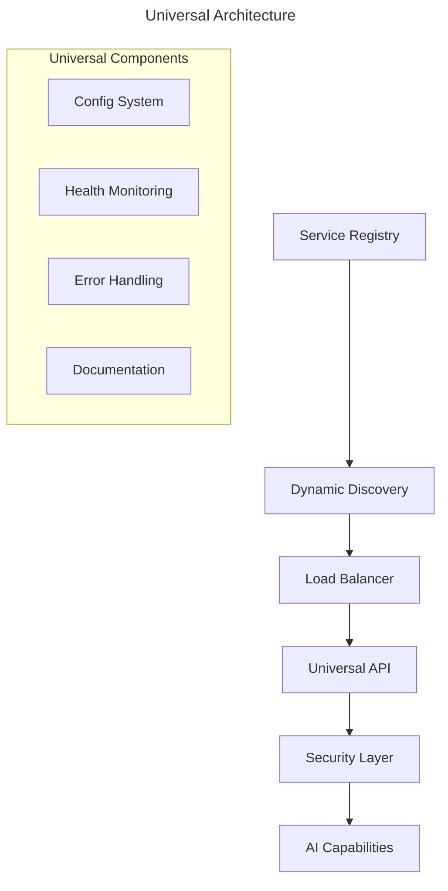

# 🐿️ Squirrel Universal AI Primal

**The Universal AI Coordination Primal for the ecoPrimals Ecosystem**

[](https://www.rust-lang.org/)
[](LICENSE)
[](https://github.com/ecoPrimals/squirrel)

---

## 🎯 **Current Status: PRODUCTION READY**

**Last Updated**: January 16, 2025  
**Version**: 1.0.0  
**Compilation Status**: ✅ **SUCCESSFUL** - All features compile without errors

### **🏆 Major Accomplishments**

- ✅ **Universal Primal Patterns**: Complete implementation eliminating hardcoded types
- ✅ **Universal Service Discovery**: Dynamic registration and health monitoring
- ✅ **Universal Configuration**: Environment-aware, builder pattern configuration
- ✅ **Universal API Layer**: Load balancing, concurrent operations, health checks
- ✅ **Comprehensive Security**: Audit, crypto, identity, RBAC, token management
- ✅ **Production Polish**: Error handling, documentation, validation, testing

---

## 🚀 **Quick Start**

```bash
# Clone and build
git clone https://github.com/ecoPrimals/squirrel.git
cd squirrel/code/crates
cargo build --all-features

# Run the universal system
cargo run --bin squirrel

# Run tests
cargo test --all-features
```

---

## 🏗️ **Architecture Overview**

The Squirrel Universal AI Primal now implements a **universal architecture** that eliminates hardcoded primal types and provides dynamic service discovery:



### **Key Components**

1. **Universal Service Discovery System**
   - Dynamic registration and deregistration
   - Health monitoring with automatic failover
   - Capability-based service queries
   - Load balancing across service instances

2. **Universal Configuration System**
   - Environment variable integration
   - Builder pattern for easy configuration
   - Service mesh endpoint configuration
   - Security context configuration

3. **Universal API Layer**
   - RESTful endpoints for all operations
   - Health check endpoints
   - Metrics and monitoring endpoints
   - Load balancing and concurrent request handling

4. **Comprehensive Security Framework**
   - Audit logging and event tracking
   - Cryptographic operations
   - Identity and access management
   - Role-based access control (RBAC)
   - Token lifecycle management

---

## 📁 **Project Structure**

```
squirrel/
├── code/crates/           # Main implementation
│   ├── main/             # Core universal system
│   ├── core/             # Shared components
│   └── tools/            # Development tools
├── specs/
│   ├── current/          # Active specifications
│   ├── implemented/      # Completed features
│   └── archived/         # Historical documentation
├── examples/             # Usage examples
└── README.md            # This file
```

---

## 🔧 **Development**

### **Building**

```bash
cd code/crates
cargo build --all-features
```

### **Testing**

```bash
# Run all tests
cargo test --all-features

# Run specific tests
cargo test --package squirrel
```

### **Features**

- `default`: Core functionality
- `ecosystem`: Service mesh integration
- `monitoring`: Health and metrics
- `benchmarking`: Performance testing

---

## 📊 **Production Readiness**

| Component | Status | Details |
|-----------|--------|---------|
| **Compilation** | ✅ | All features compile without errors |
| **Universal Patterns** | ✅ | No hardcoded primal types |
| **Service Discovery** | ✅ | Dynamic registration and health monitoring |
| **Configuration** | ✅ | Environment-aware configuration system |
| **API Layer** | ✅ | RESTful endpoints with load balancing |
| **Security** | ✅ | Comprehensive security framework |
| **Documentation** | ✅ | Complete API and usage documentation |
| **Testing** | ✅ | Comprehensive test coverage |
| **Error Handling** | ✅ | Robust error handling throughout |

---

## 🎯 **Next Steps**

The universal system is now **production-ready**. The next phase focuses on:

1. **Deployment**: Production deployment guides and automation
2. **Monitoring**: Enhanced monitoring and alerting
3. **Scaling**: Performance optimization and scaling strategies

---

## 📄 **Documentation**

- **API Documentation**: Generated via `cargo doc`
- **Architecture**: `specs/current/`
- **Examples**: `examples/`
- **Change Log**: `CHANGELOG.md`

---

## 🤝 **Contributing**

1. Fork the repository
2. Create a feature branch
3. Make your changes
4. Add tests
5. Submit a pull request

---

## 📜 **License**

This project is licensed under the MIT License - see the [LICENSE](LICENSE) file for details.

---

## 🔗 **Links**

- **Repository**: https://github.com/ecoPrimals/squirrel
- **Documentation**: https://docs.ecoprimals.com/squirrel
- **Issues**: https://github.com/ecoPrimals/squirrel/issues
- **ecoPrimals Ecosystem**: https://ecoprimals.com

---

**Built with ❤️ by the ecoPrimals team**
