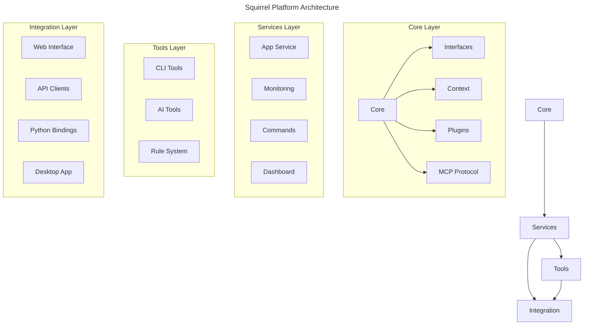

# Squirrel: Multi-Agent Development Platform

> A high-performance, modular platform for building and orchestrating AI agents with integrated monitoring, plugin systems, and cross-platform support.

## 🚀 **Current Status**

✅ **Build Status**: All core modules compile successfully  
✅ **Core Services**: Web server, CLI, MCP protocol ready  
✅ **Monitoring**: Dashboard and metrics system operational  
✅ **Plugin System**: Dynamic loading and sandboxing implemented  
🔧 **Testing**: Test suite needs attention (known issue)  

## 🏗️ **Architecture Overview**



## 🎯 **Key Features**

- **Multi-Agent Architecture**: Orchestrate multiple AI agents with different capabilities
- **MCP Protocol**: Machine Context Protocol for agent communication
- **Plugin System**: Dynamic plugin loading with security sandboxing
- **Real-time Monitoring**: Comprehensive metrics and health monitoring
- **Cross-platform**: Support for Windows, macOS, and Linux
- **Web Interface**: Modern dashboard for monitoring and control
- **CLI Tools**: Command-line interface for automation and management

## 🏃‍♂️ **Quick Start**

### Prerequisites
- Rust 1.70+ 
- Node.js 18+ (for UI components)
- Python 3.8+ (for Python bindings)

### Build & Run

```bash
# Clone and enter directory
git clone <repository-url>
cd squirrel/code

# Build all components
cargo build --release

# Run web server
cargo run --bin web_server

# Run CLI
cargo run --bin squirrel -- help
```

### Development Setup

```bash
# Run with development features
cargo run --bin web_server --features dev

# Run monitoring dashboard
cargo run --bin monitoring_dashboard

# Run with debug logging
RUST_LOG=debug cargo run --bin web_server
```

## 📁 **Project Structure**

```
code/
├── crates/
│   ├── core/               # Core platform components
│   │   ├── core/          # Essential platform core
│   │   ├── interfaces/    # Abstract interfaces
│   │   ├── context/       # Context management
│   │   ├── plugins/       # Plugin system
│   │   └── mcp/           # MCP protocol implementation
│   ├── services/          # Platform services
│   │   ├── app/           # Main application service
│   │   ├── monitoring/    # Monitoring and metrics
│   │   ├── commands/      # Command processing
│   │   └── dashboard-core/# Dashboard backend
│   ├── tools/             # Development and runtime tools
│   │   ├── cli/           # Command-line interface
│   │   ├── ai-tools/      # AI-specific tools
│   │   └── rule-system/   # Rule management system
│   ├── integration/       # External integrations
│   │   ├── web/           # Web server and API
│   │   ├── api-clients/   # External API clients
│   │   ├── mcp-pyo3-bindings/ # Python bindings
│   │   └── tauri-bridge/  # Desktop app bridge
│   └── ui/                # User interface components
│       └── ui-tauri-react/ # React-based desktop UI
```

## 🔧 **Configuration**

### Environment Variables

```bash
# Required
SQUIRREL_CONFIG_PATH=/path/to/config.toml
SQUIRREL_LOG_LEVEL=info

# Optional
SQUIRREL_PLUGIN_DIR=/path/to/plugins
SQUIRREL_WEB_PORT=8080
SQUIRREL_MONITORING_PORT=8081
```

### Configuration File (`config.toml`)

```toml
[server]
host = "127.0.0.1"
port = 8080
workers = 4

[monitoring]
enabled = true
port = 8081
metrics_interval = 30

[plugins]
enabled = true
directory = "./plugins"
sandbox_enabled = true

[mcp]
protocol_version = "1.0"
timeout = 30
max_connections = 100
```

## 📊 **Monitoring & Observability**

The platform includes comprehensive monitoring:

- **Metrics Collection**: System and application metrics
- **Health Checks**: Component health monitoring  
- **Real-time Dashboard**: Web-based monitoring interface
- **Alerting**: Configurable alert system
- **Distributed Tracing**: Request tracing across services

Access the monitoring dashboard at: `http://localhost:8081`

## 🔌 **Plugin Development**

Create plugins using the Plugin API:

```rust
use squirrel_plugins::{Plugin, PluginContext, PluginResult};

#[derive(Debug)]
pub struct MyPlugin;

impl Plugin for MyPlugin {
    fn name(&self) -> &str { "my-plugin" }
    
    async fn execute(&self, ctx: &PluginContext) -> PluginResult<()> {
        // Plugin implementation
        Ok(())
    }
}
```

## 🛠️ **Development**

### Build Targets

```bash
# Build all components
cargo build --workspace

# Build specific components
cargo build -p squirrel-web
cargo build -p squirrel-cli

# Build with features
cargo build --features monitoring,plugins
```

### Testing

```bash
# Run unit tests (Note: integration tests need fixes)
cargo test --lib --workspace

# Run specific test suites
cargo test -p squirrel-core
cargo test -p squirrel-monitoring
```

### Code Quality

```bash
# Format code
cargo fmt --all

# Run linting
cargo clippy --workspace --all-targets

# Check for unused dependencies
cargo machete
```

## 📋 **Known Issues**

- **Test Suite**: Integration tests need updating after recent refactoring
- **Documentation**: Some modules need additional documentation
- **Platform Support**: macOS sandbox implementation incomplete

## 🗺️ **Roadmap**

### Immediate (Current Sprint)
- [ ] Fix integration test suite
- [ ] Complete documentation
- [ ] Set up CI/CD pipeline
- [ ] Performance benchmarking

### Short-term (Next 2 Sprints)
- [ ] Enhanced plugin security
- [ ] Advanced monitoring features
- [ ] Multi-tenant support
- [ ] API rate limiting

### Long-term (Future Sprints)
- [ ] Distributed deployment
- [ ] Advanced AI capabilities
- [ ] Plugin marketplace
- [ ] Enterprise features

## 🤝 **Contributing**

1. Follow the established code style (see `.cursor/rules/`)
2. Add tests for new features
3. Update documentation
4. Submit PR with clear description

## 📝 **License**

[License information to be added]

## 📞 **Support**

- Issues: Use GitHub Issues
- Discussions: Use GitHub Discussions
- Documentation: See `docs/` directory

---

**Built with ❤️ using Rust and modern web technologies**
