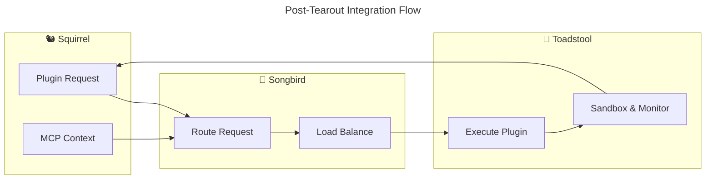

# 🚀 Ready to Execute: Squirrel Tearout & Refocus

## ✅ **Preparation Complete**

All analysis, planning, and preparation is complete. The tearout and refocusing is ready for execution.

---

## 📋 **What's Ready**

### **📄 Documentation Complete**
- ✅ `TEAROUT_AND_REFOCUS_ANALYSIS.md` - Comprehensive analysis 
- ✅ `SQUIRREL_REFOCUS_SUMMARY.md` - Executive summary
- ✅ `EXECUTE_TEAROUT.sh` - Automated tearout script (executable)
- ✅ `toToadStool/README.md` - Migration documentation

### **🍄 Compute Infrastructure Migrated**
- ✅ **29 Rust files** moved to `toToadStool/` directory
- ✅ **Sandbox system** (27 files): Complete cross-platform implementation
- ✅ **Resource monitoring** (1 file): Performance tracking and limits
- ✅ **SDK components** (1 file): Configuration and management API
- ✅ **~4,000 lines of code** ready for Toadstool-Compute integration

### **🔧 Integration Stubs Created**
- ✅ `code/crates/integration/toadstool/` - Toadstool client stub
- ✅ Cargo.toml template with dependencies
- ✅ Rust code structure for easy implementation

---

## 🎯 **Execute in 3 Steps**

### **Step 1: Run the Tearout Script**
```bash
# From the Squirrel project root
./EXECUTE_TEAROUT.sh
```

**This will:**
- Create backup branches automatically
- Remove all orchestrator code
- Create integration stubs
- Test compilation
- Provide detailed status report

### **Step 2: Update Cargo Configuration**
```bash
# Manual step: Edit Cargo.toml
# Remove: "code/crates/services/nestgate-orchestrator"
# Add ecosystem dependencies when available
```

### **Step 3: Test & Coordinate**
```bash
# Test MCP functionality
cargo test --package squirrel-mcp

# Coordinate with ecosystem teams
# - Toadstool team: Integrate compute infrastructure
# - Songbird team: Enable service routing
```

---

## 📊 **Migration Scope**

### **🗑️ Orchestrator Removal**
```yaml
removing:
  - nestgate-orchestrator service (entire crate)
  - orchestrator.proto definition
  - web orchestrator routing
  - orchestrator adapters (3 files)
  - orchestrator integration tests
estimated_lines_removed: 3000+
```

### **🍄 Toadstool Migration**
```yaml
moving_to_toadstool:
  sandbox_system: 27 files (cross-platform sandboxing)
  resource_monitoring: 1 file (performance tracking)
  sdk_components: 1 file (configuration API)
  total_files: 29 files
  estimated_lines: 4000+
  location: /home/strandgate/Development/squirrel/toToadStool/
```

### **🐿️ Squirrel Focus**
```yaml
keeping_and_enhancing:
  - MCP protocol implementation
  - AI agent coordination
  - Plugin registry and metadata
  - Context management
  - Web interface
  - Authentication system
```

---

## 🔄 **Post-Execution Flow**



---

## ⚠️ **Important Notes**

### **🔄 Backup Strategy**
- **Automatic backup** branch created before any changes
- **Working branch** for all tearout modifications  
- **Easy rollback** if any issues arise

### **🧪 Testing Strategy**
- **Compilation test** after each phase
- **MCP functionality** verification
- **Integration points** tested
- **Performance** monitoring

### **👥 Team Coordination**
- **Squirrel team**: Execute tearout, focus on MCP
- **Toadstool team**: Integrate compute infrastructure
- **Songbird team**: Enable ecosystem routing
- **Cross-team**: Regular sync meetings

---

## 🎯 **Success Indicators**

After execution, you should see:

### **✅ Immediate Success**
- [ ] Project compiles without orchestrator dependencies
- [ ] MCP core functionality works
- [ ] Integration stubs are in place
- [ ] Compute infrastructure moved to toToadStool/

### **✅ Medium-term Success** 
- [ ] Toadstool integration functional
- [ ] Songbird routing established
- [ ] Plugin execution via ecosystem
- [ ] Performance maintained or improved

### **✅ Long-term Success**
- [ ] Squirrel focused on MCP innovation
- [ ] Ecosystem services specialized and optimized
- [ ] Development velocity increased
- [ ] User experience enhanced

---

## 🚨 **Ready Commands**

Everything is prepared. Execute when ready:

```bash
# 1. Execute the tearout
./EXECUTE_TEAROUT.sh

# 2. Check results
git status
git log --oneline -5

# 3. Test core functionality  
cargo test --package squirrel-mcp

# 4. Begin ecosystem integration
# (coordinate with other teams)
```

---

## 📞 **Support Available**

- **Documentation**: Complete specifications and guides
- **Automation**: Tested tearout script
- **Backup**: Automatic rollback capability
- **Integration**: Ready-to-implement stubs
- **Coordination**: Clear team responsibilities

---

**🎯 The tearout is fully prepared and ready for execution. This transformation will make Squirrel the best MCP platform while enabling the ecosystem to excel through specialization! 🐿️🚀**

**Execute when ready: `./EXECUTE_TEAROUT.sh`** 