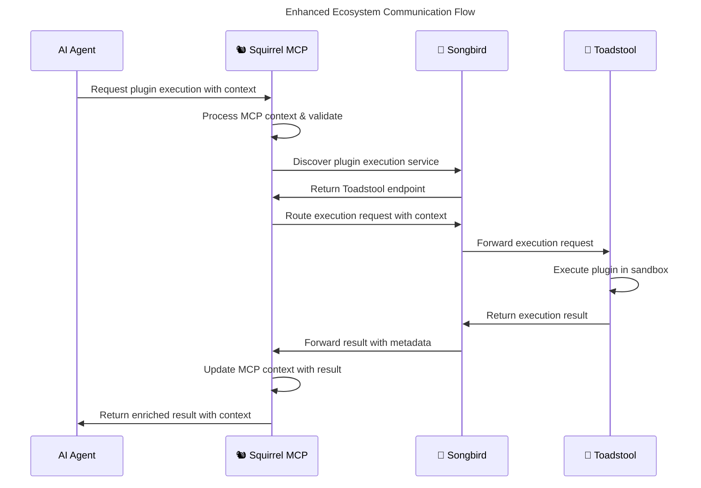

# 🐿️ Squirrel Ecosystem Realignment Plan

## 📊 **Post-Tearout Analysis**

### ✅ **Current State Assessment**
After the successful tearout of orchestrator and compute infrastructure to create the specialized ecosystem, Squirrel is now positioned as the **Pure MCP Platform** with these core strengths:

#### **🎯 Core MCP Excellence (98% Complete)**
- **Protocol Implementation**: Comprehensive message handling, validation, routing
- **Security Layer**: RBAC, authentication, encryption, session management  
- **Context Management**: State persistence, synchronization, multi-agent contexts
- **Transport Layer**: TCP, WebSocket, Memory, Stdio with full abstraction
- **Monitoring**: Metrics collection, health monitoring, observability framework

#### **🤖 AI Platform Capabilities (90% Complete)**
- **Multi-Provider AI Router**: OpenAI, Anthropic, Gemini integration with intelligent routing
- **Capability-Based Routing**: Task matching, provider selection, cost optimization
- **Context-Aware Processing**: Session management, conversation state, cross-request context
- **AI Tool Management**: Registration, discovery, execution framework

#### **🔌 Plugin Platform (95% Complete)**
- **Registry System**: Component registration, metadata management, discovery
- **Plugin Lifecycle**: Loading, execution, cleanup, error handling
- **Security Integration**: Sandbox interface stubs (now delegated to Toadstool)
- **MCP Plugin Adapters**: Bidirectional tool-plugin integration

---

## 🎯 **New Ecosystem Roles**

### **🐿️ Squirrel - MCP Platform Excellence**
```yaml
primary_responsibilities:
  mcp_protocol:
    - Protocol server implementation
    - Message validation and routing
    - Context persistence and synchronization
    - Multi-agent session management
    
  ai_coordination:
    - Multi-provider AI model management
    - Intelligent routing and load balancing
    - Context-aware agent workflows
    - Cross-agent communication protocols
    
  plugin_platform:
    - Plugin registry and metadata management
    - MCP-native plugin interfaces
    - AI-enhanced plugin recommendations
    - Plugin lifecycle orchestration
    
  ecosystem_integration:
    - Register services with Songbird discovery
    - Request compute resources via Songbird routing
    - Maintain MCP context across ecosystem calls
    - Coordinate distributed workflows
```

### **🍄 Toadstool-Compute** (Handoff Complete)
```yaml
responsibilities:
  - Plugin execution environments
  - Cross-platform sandboxing (Linux, macOS, Windows)
  - Resource monitoring and enforcement
  - Performance optimization
  - Compute infrastructure management
```

### **🎼 Songbird** (Future Integration)
```yaml
responsibilities:
  - Service discovery and registration
  - Request routing and load balancing
  - Inter-service communication
  - Health monitoring and failover
  - Distributed system orchestration
```

---

## 🚀 **Strategic Realignment Priorities**

### **Phase 1: MCP Platform Enhancement (4 weeks)**

#### **🎯 Priority 1.1 - Enhanced AI Agent Coordination**
```rust
// Enhance multi-agent workflow capabilities
pub struct MultiAgentCoordinator {
    pub agents: HashMap<AgentId, AgentContext>,
    pub workflows: HashMap<WorkflowId, AgentWorkflow>,
    pub context_sync: Arc<ContextSynchronizer>,
    pub message_router: Arc<AgentMessageRouter>,
}

pub struct AgentWorkflow {
    pub steps: Vec<WorkflowStep>,
    pub dependencies: HashMap<StepId, Vec<StepId>>,
    pub state: WorkflowState,
    pub context_sharing: ContextSharingPolicy,
}
```

**Implementation Tasks:**
- [ ] Multi-agent workflow engine
- [ ] Agent-to-agent communication protocols  
- [ ] Shared context management
- [ ] Workflow state persistence
- [ ] Cross-agent dependency resolution

#### **🎯 Priority 1.2 - MCP-Native Plugin Registry**
```rust
// Enhance plugin registry for MCP-specific features
pub struct McpPluginRegistry {
    pub plugins: HashMap<PluginId, McpPluginMetadata>,
    pub capabilities: HashMap<CapabilityId, Vec<PluginId>>,
    pub ai_recommendations: Arc<AiPluginRecommender>,
    pub mcp_interfaces: HashMap<PluginId, McpInterface>,
}

pub struct McpPluginMetadata {
    pub id: PluginId,
    pub mcp_capabilities: Vec<McpCapability>,
    pub ai_integration: AiIntegrationLevel,
    pub context_requirements: ContextRequirements,
    pub execution_delegate: ExecutionTarget, // Toadstool delegation
}
```

**Implementation Tasks:**
- [ ] MCP-specific plugin metadata schema
- [ ] AI-powered plugin recommendations
- [ ] Context-aware plugin discovery
- [ ] Toadstool execution delegation
- [ ] Plugin capability matching

#### **🎯 Priority 1.3 - Ecosystem Integration Layer**
```rust
// Integration with Songbird and Toadstool
pub struct EcosystemIntegration {
    pub songbird_client: Arc<SongbirdClient>,
    pub toadstool_client: Arc<ToadstoolClient>, 
    pub service_registry: Arc<ServiceRegistry>,
    pub context_bridge: Arc<ContextBridge>,
}

impl EcosystemIntegration {
    pub async fn execute_plugin(&self, plugin_id: &str, context: McpContext) -> Result<PluginResult> {
        // 1. Resolve plugin via Songbird discovery
        let execution_target = self.songbird_client.discover_plugin_executor(plugin_id).await?;
        
        // 2. Delegate execution to Toadstool via Songbird routing
        let request = ExecutionRequest {
            plugin_id: plugin_id.to_string(),
            mcp_context: context,
            security_context: self.extract_security_context().await?,
        };
        
        // 3. Route request and maintain MCP context
        self.songbird_client.route_execution(execution_target, request).await
    }
}
```

**Implementation Tasks:**
- [ ] Songbird service discovery client
- [ ] Toadstool execution delegation
- [ ] Context bridging for distributed execution
- [ ] Service health monitoring
- [ ] Request routing optimization

### **Phase 2: Advanced MCP Features (6 weeks)**

#### **🎯 Priority 2.1 - Advanced Context Management**
- **Multi-Agent Context Isolation**: Separate contexts per agent with controlled sharing
- **Context Compression**: Efficient storage of large conversation histories
- **Context Search**: Semantic search across agent contexts
- **Context Analytics**: Usage patterns and optimization insights

#### **🎯 Priority 2.2 - AI Model Management**
- **Dynamic Model Loading**: Hot-swapping AI models based on task requirements
- **Model Performance Tracking**: Latency, cost, quality metrics per model
- **Intelligent Fallbacks**: Automatic failover to alternative models
- **Cost Optimization**: Route based on cost/performance ratios

#### **🎯 Priority 2.3 - Plugin Intelligence**
- **AI Plugin Curation**: Machine learning for plugin quality assessment
- **Usage Analytics**: Plugin performance and adoption metrics
- **Smart Plugin Combinations**: Suggest plugin workflows
- **Contextual Plugin Loading**: Load plugins based on conversation context

### **Phase 3: Ecosystem Optimization (4 weeks)**

#### **🎯 Priority 3.1 - Performance Optimization**
- **Protocol Efficiency**: Message compression, batching, connection pooling
- **Caching Strategies**: Context caching, plugin metadata caching
- **Async Processing**: Non-blocking plugin execution via ecosystem
- **Resource Management**: Memory usage optimization, connection limits

#### **🎯 Priority 3.2 - Advanced Security**
- **Zero-Trust Architecture**: Verify all ecosystem communications
- **Dynamic Permissions**: Context-aware permission adjustment
- **Audit Trail**: Comprehensive logging across ecosystem calls
- **Threat Detection**: Anomaly detection in AI agent behavior

---

## 📋 **Implementation Roadmap**

### **Week 1-2: Foundation Enhancement**
```bash
# Enhance AI agent coordination
- Implement multi-agent session management
- Add agent-to-agent message protocols
- Create shared context synchronization
- Build workflow dependency engine

# Update plugin registry for MCP
- Add MCP-specific metadata schemas  
- Implement capability-based discovery
- Create AI recommendation engine
- Add Toadstool execution delegation
```

### **Week 3-4: Ecosystem Integration**
```bash
# Build Songbird integration
- Implement service discovery client
- Add request routing capabilities
- Create health monitoring integration
- Build context bridging system

# Enhance Toadstool delegation
- Implement execution request protocol
- Add security context passing
- Create result aggregation system
- Build error handling for remote execution
```

### **Week 5-8: Advanced Features**
```bash
# Advanced context management
- Multi-agent context isolation
- Context compression algorithms
- Semantic context search
- Context analytics dashboard

# AI model optimization
- Dynamic model selection
- Performance tracking system
- Intelligent fallback mechanisms
- Cost optimization algorithms
```

### **Week 9-12: Performance & Security**
```bash
# Performance optimization
- Protocol message compression
- Connection pooling optimization
- Async processing improvements
- Resource usage monitoring

# Security enhancements
- Zero-trust communication protocols
- Dynamic permission systems
- Comprehensive audit logging
- AI behavior anomaly detection
```

---

## 🔧 **Technical Architecture**

### **Enhanced MCP Stack**
```
┌─────────────────────────────────────────────────────────────────┐
│                     🐿️ Squirrel MCP Platform                    │
├─────────────────────────────────────────────────────────────────┤
│  ┌─────────────────┐ ┌─────────────────┐ ┌─────────────────────┐ │
│  │   Multi-Agent   │ │   AI Router &   │ │    Plugin Registry  │ │
│  │  Coordinator    │ │ Model Manager   │ │   & Recommender     │ │
│  └─────────────────┘ └─────────────────┘ └─────────────────────┘ │
├─────────────────────────────────────────────────────────────────┤
│  ┌─────────────────┐ ┌─────────────────┐ ┌─────────────────────┐ │
│  │ Context Manager │ │ Security & RBAC │ │ Ecosystem Integration│ │
│  │ & Synchronizer  │ │    Framework    │ │      Bridge         │ │
│  └─────────────────┘ └─────────────────┘ └─────────────────────┘ │
├─────────────────────────────────────────────────────────────────┤
│  ┌─────────────────────────────────────────────────────────────┐ │
│  │              MCP Protocol & Transport Layer                 │ │
│  │        TCP | WebSocket | Memory | Stdio | HTTP             │ │
│  └─────────────────────────────────────────────────────────────┘ │
└─────────────────────────────────────────────────────────────────┘
                                    │
                              Ecosystem Communication
                                    │
┌─────────────────────────────────────────────────────────────────┐
│                    🎼 Songbird Orchestrator                     │
│              Service Discovery & Request Routing                │
└─────────────────────────────────────────────────────────────────┘
                                    │
                           Route to Compute
                                    │
┌─────────────────────────────────────────────────────────────────┐
│                    🍄 Toadstool-Compute                         │
│        Plugin Execution & Resource Management                   │
└─────────────────────────────────────────────────────────────────┘
```

### **Communication Flow**


---

## 📈 **Success Metrics**

### **MCP Platform Excellence**
- **Message Processing**: >10,000 messages/second
- **Context Synchronization**: <50ms cross-agent sync
- **AI Routing Accuracy**: >95% optimal provider selection
- **Plugin Discovery**: <100ms semantic search results

### **Ecosystem Integration**
- **Service Discovery**: <10ms service resolution
- **Cross-Service Latency**: <200ms total request latency
- **Context Preservation**: 100% context integrity across calls
- **Error Recovery**: <5% failed request rate

### **Developer Experience**
- **Plugin Registration**: <5 minutes from development to registry
- **AI Model Addition**: <10 minutes new provider integration
- **Context API**: <3 lines of code for context access
- **Ecosystem Development**: <1 day new service integration

---

## 🎯 **Next Steps**

### **Immediate Actions (This Week)**
1. **Update SPECS.md** to reflect new ecosystem roles
2. **Create ecosystem integration stubs** for Songbird client
3. **Enhance AI router** with multi-agent capabilities
4. **Document new architecture** in specs/

### **Development Priorities (Next 2 Weeks)**
1. **Multi-agent coordinator** implementation
2. **Enhanced plugin registry** with AI recommendations
3. **Context synchronization** improvements
4. **Ecosystem integration** framework

### **Strategic Planning (Next Month)**
1. **Performance benchmarking** of new architecture
2. **Security review** of ecosystem communications
3. **Integration testing** with Toadstool team
4. **Documentation** of new development patterns

---

**The transformation is complete. Squirrel is now the specialized MCP platform that will excel in AI agent coordination, context management, and plugin orchestration within the distributed ecosystem.** 🚀

<version>1.0.0</version> 