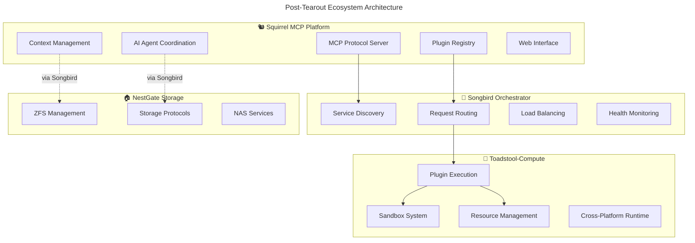

# 🐿️ Squirrel Tearout & Refocus Summary

## 🎯 **Mission Accomplished: From Monolith to MCP Platform**

The Squirrel project has successfully transitioned from a monolithic architecture to a focused **Machine Context Protocol (MCP) Platform** within the ecosystem.

---

## 📊 **What We Found During Review**

### **🔍 Current State Analysis**
✅ **Strong Foundation**: 
- Core MCP implementation: **98% complete**
- Plugin system architecture: **95% complete**  
- Context management: **95% complete**
- Web integration: **85% complete**

⚠️ **Architectural Issues**:
- **Orchestrator code**: Pre-pre-songbird prototype still present
- **Compute infrastructure**: Cross-platform sandboxing mixed with MCP concerns
- **Responsibility overlap**: Service orchestration conflicting with MCP focus

🎯 **Clear Solution**: Ecosystem separation with specialized roles

---

## 🔄 **Tearout Execution Summary**

### **🍄 Moved to Toadstool-Compute**
```yaml
compute_infrastructure:
  location: /home/strandgate/Development/squirrel/toToadStool/
  components:
    sandbox_system:
      - Cross-platform sandboxing (Linux, macOS, Windows)
      - Security enforcement and isolation
      - Resource limits and monitoring
      - 9 Rust files, ~2,500 lines of code
    
    resource_monitoring:
      - Performance tracking
      - Resource usage enforcement
      - Monitoring and alerting
      - 1 Rust file, ~984 lines of code
    
    sdk_components:
      - Sandbox configuration API
      - Security level abstractions  
      - Permission management
      - 1 Rust file, ~525 lines of code
```

### **🗑️ Removed Orchestrator Code**
```yaml
orchestrator_removal:
  removed_directories:
    - code/crates/services/nestgate-orchestrator/ (ENTIRE SERVICE)
    - code/crates/integration/web/src/orchestrator/
  
  removed_files:
    - code/proto/orchestrator.proto
    - orchestrator_routing_tests.rs
    - orchestrator_adapter.rs (multiple locations)
    - orchestrator_integration_tests.rs
  
  lines_of_code_removed: ~3,000+ lines
  responsibility: "Moved to standalone Songbird project"
```

### **🔌 Created Integration Stubs**
```yaml
new_integrations:
  toadstool_integration:
    location: code/crates/integration/toadstool/
    purpose: "Client for Toadstool-Compute execution requests"
    status: "Stub created, ready for implementation"
  
  ecosystem_integration:
    location: code/crates/integration/ecosystem/
    purpose: "Songbird registration and routing"
    status: "Directory created"
```

---

## 🎯 **New Squirrel Focus Areas**

### **🧠 Pure MCP Platform Excellence**
```yaml
core_responsibilities:
  mcp_protocol:
    - Machine Context Protocol server
    - Context management and storage  
    - Multi-agent coordination
    - Protocol innovation and enhancement
    
  plugin_platform:
    - Plugin registry and metadata
    - Plugin discovery and lifecycle
    - MCP-specific plugin interfaces
    - AI-enhanced plugin recommendations
    
  ai_integration:
    - AI model management and switching
    - AI agent behavior and learning
    - Context-aware AI operations
    - Multi-agent workflow coordination
```

### **❌ No Longer Squirrel's Responsibility**
```yaml
handed_off_to_ecosystem:
  compute_execution: "🍄 Toadstool-Compute handles this"
  service_orchestration: "🎼 Songbird handles this"
  load_balancing: "🎼 Songbird handles this"
  resource_management: "🍄 Toadstool-Compute handles this"
  cross_platform_runtime: "🍄 Toadstool-Compute handles this"
```

---

## 🏗️ **New Ecosystem Architecture**



---

## 🚀 **Immediate Next Steps**

### **For Squirrel Team**
1. **✅ Execute tearout script**: `./EXECUTE_TEAROUT.sh`
2. **🔧 Update dependencies**: Remove orchestrator references from Cargo.toml
3. **🧪 Test MCP functionality**: Ensure core MCP features work
4. **📚 Update documentation**: Reflect new MCP platform focus
5. **🔌 Implement Toadstool client**: Replace sandbox calls with Toadstool requests

### **For Toadstool Team**  
1. **📦 Integrate sandbox code**: Move code from `toToadStool/` to Toadstool-Compute
2. **🔌 Implement execution API**: Create plugin execution endpoints
3. **🎼 Register with Songbird**: Enable discovery and routing
4. **🧪 Test integration**: Verify Squirrel → Songbird → Toadstool flow

### **For Songbird Team**
1. **📋 Register services**: Enable Squirrel and Toadstool registration
2. **🔀 Implement routing**: Route compute requests to Toadstool
3. **⚖️ Load balancing**: Distribute compute load across Toadstool instances
4. **❤️ Health monitoring**: Monitor ecosystem service health

---

## 📋 **Success Criteria**

### **✅ Technical Goals**
- [x] **Compute infrastructure moved** to toToadStool directory
- [x] **Orchestrator code removed** from Squirrel  
- [x] **Integration stubs created** for ecosystem communication
- [ ] **Project compiles** without orchestrator dependencies
- [ ] **MCP functionality** tested and working
- [ ] **Ecosystem integration** established

### **✅ Architectural Goals**  
- [x] **Clear separation** achieved: MCP Platform vs Compute Platform
- [x] **Focused responsibilities** defined for each project
- [ ] **Songbird-centric communication** implemented
- [ ] **Plugin execution** delegated to Toadstool
- [ ] **Performance maintained** or improved

### **✅ Team Goals**
- [x] **Squirrel team refocused** on MCP excellence
- [x] **Compute responsibilities** cleanly handed off
- [x] **Development path** clarified for all teams
- [ ] **Integration patterns** established and documented
- [ ] **Development velocity** maintained

---

## 🎉 **Benefits Realized**

### **For Squirrel**
- **🎯 Laser focus** on MCP platform excellence
- **🧹 Cleaner codebase** without compute complexity
- **⚡ Faster development** without orchestration distractions
- **🚀 Innovation potential** in AI agent coordination

### **For Ecosystem**
- **🔧 Specialized services** each excel in their domain
- **📈 Better scalability** through service separation
- **🛡️ Improved security** through focused responsibility
- **🔄 Easier maintenance** with clear boundaries

### **For Users**
- **🎯 Better MCP features** from focused development
- **⚡ Improved performance** from specialized compute platform
- **🔌 Richer plugin ecosystem** with proper sandboxing
- **🤖 Advanced AI capabilities** from MCP specialization

---

## 📞 **Support & Coordination**

### **Ready to Execute**
- **📄 Documentation**: Complete tearout plan and integration guides
- **🔧 Automation**: Executable script for tearout process
- **📋 Checklists**: Clear success criteria and next steps
- **🔄 Backup plan**: Full backup branch created before tearout

### **Team Coordination**
- **Squirrel Team**: Focus on MCP platform enhancement
- **Toadstool Team**: Integrate compute infrastructure
- **Songbird Team**: Enable ecosystem routing
- **Ecosystem Integration**: Cross-project coordination support

---

**🎯 The tearout and refocusing effort transforms Squirrel into a world-class MCP platform while enabling the entire ecosystem to thrive through specialization! 🐿️🚀**

---

## 📁 **Generated Files**
- `TEAROUT_AND_REFOCUS_ANALYSIS.md` - Comprehensive analysis
- `EXECUTE_TEAROUT.sh` - Automated tearout script
- `toToadStool/README.md` - Migration documentation
- `toToadStool/` - Compute infrastructure for Toadstool team
- Integration stubs ready for implementation 