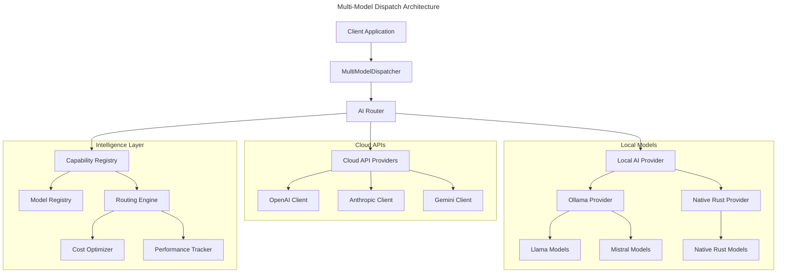

# AI Tools - Multi-Model Dispatch System

A comprehensive Rust library for seamlessly utilizing different AI models (API-based and local) within the same workflow. This library provides intelligent routing, automatic model selection, and unified interfaces for various AI providers.

## 🚀 Features

### Multi-Model Support
- **Cloud APIs**: OpenAI, Anthropic, Google Gemini
- **Local Models**: Ollama integration, native Rust implementations (planned)
- **Unified Interface**: Same API for all model types
- **Intelligent Routing**: Automatic model selection based on task requirements

### Advanced Routing
- **Capability-Based**: Route based on model capabilities and requirements
- **Cost-Aware**: Consider cost tiers in routing decisions
- **Performance-Optimized**: Route based on latency and throughput requirements
- **Security-Conscious**: Prefer local models for sensitive data

### Workflow Features
- **Multi-Model Workflows**: Use different models for different parts of the same workflow
- **Streaming Support**: Real-time response streaming from any model type
- **Resource Management**: Automatic loading/unloading of local models
- **Error Handling**: Robust error handling and fallback mechanisms

## 🏗️ Architecture



## 🚀 Quick Start

### Basic Usage

```rust
use ai_tools::{
    dispatch::DispatcherBuilder,
    workflows,
    RoutingStrategy,
};

#[tokio::main]
async fn main() -> Result<(), Box<dyn std::error::Error>> {
    // Create a multi-model dispatcher
    let dispatcher = DispatcherBuilder::new()
        .with_api_key("openai", std::env::var("OPENAI_API_KEY")?)
        .with_api_key("anthropic", std::env::var("ANTHROPIC_API_KEY")?)
        .prefer_local_for_sensitive(true)
        .with_routing_strategy(RoutingStrategy::BestFit)
        .build()
        .await?;
    
    // Generate text with automatic model selection
    let result = workflows::generate_text(
        &dispatcher,
        "Explain quantum computing in simple terms",
        false // not sensitive data
    ).await?;
    
    println!("Generated text: {}", result);
    
    // Generate code with preference for powerful models
    let code = workflows::generate_code(
        &dispatcher,
        "Create a REST API for user management",
        Some("rust".to_string())
    ).await?;
    
    println!("Generated code: {}", code);
    
    Ok(())
}
```

### Multi-Model Workflow

```rust
use ai_tools::{
    dispatch::MultiModelDispatcher,
    common::{ChatRequest, Message, MessageRole},
    common::capability::{AITask, TaskType, SecurityRequirements},
};

async fn multi_model_workflow(
    dispatcher: &MultiModelDispatcher
) -> Result<(), Box<dyn std::error::Error>> {
    let requests = vec![
        // Use local model for sensitive data
        (
            create_request("Process this confidential information: ..."),
            AITask {
                task_type: TaskType::TextGeneration,
                security_requirements: SecurityRequirements {
                    contains_sensitive_data: true,
                    ..Default::default()
                },
                ..Default::default()
            },
            Some("llama3-8b".to_string()),
        ),
        
        // Use powerful API model for complex analysis
        (
            create_request("Provide detailed analysis of market trends..."),
            AITask {
                task_type: TaskType::TextGeneration,
                complexity_score: Some(85),
                ..Default::default()
            },
            Some("gpt-4".to_string()),
        ),
        
        // Use fast local model for simple summarization
        (
            create_request("Summarize this in one sentence: ..."),
            AITask {
                task_type: TaskType::TextGeneration,
                complexity_score: Some(20),
                ..Default::default()
            },
            Some("llama3-8b".to_string()),
        ),
    ];
    
    let results = dispatcher.process_multi_model_workflow(requests).await?;
    
    for (i, response) in results.iter().enumerate() {
        println!("Response {}: {}", i + 1, 
            response.choices.first().unwrap().content);
    }
    
    Ok(())
}
```

## 🔧 Configuration

### Environment Variables

```bash
# API Keys
export OPENAI_API_KEY="your-openai-key"
export ANTHROPIC_API_KEY="your-anthropic-key"
export GEMINI_API_KEY="your-gemini-key"

# Ollama Configuration
export OLLAMA_BASE_URL="http://localhost:11434"
```

### Configuration File

Create a `ai-tools-config.toml` file:

```toml
[dispatcher]
routing_strategy = "BestFit"
prefer_local_for_sensitive = true
prefer_api_for_complex = true

[local]
default_model = "llama3-8b"
enable_ollama = true

[local.ollama]
base_url = "http://localhost:11434"
models = ["llama3-8b", "llama3-70b", "codellama", "mistral"]

[workflows.default_models]
text_generation = "gpt-3.5-turbo"
code_generation = "gpt-4"
sensitive_text = "llama3-8b"
analysis = "claude-3-sonnet-20240229"
```

## 🎯 Use Cases

### 1. Privacy-Conscious Applications
```rust
// Automatically route sensitive data to local models
let result = workflows::generate_text(
    &dispatcher,
    "Process this personal information: ...",
    true // sensitive data = true
).await?;
// This will automatically use a local model
```

### 2. Cost-Optimized Workflows
```rust
// Use different models based on complexity and cost requirements
let dispatcher = DispatcherBuilder::new()
    .with_routing_strategy(RoutingStrategy::LowestCost)
    .build()
    .await?;
```

### 3. Performance-Critical Applications
```rust
// Prioritize speed over everything else
let dispatcher = DispatcherBuilder::new()
    .with_routing_strategy(RoutingStrategy::LowestLatency)
    .build()
    .await?;
```

### 4. Hybrid Cloud-Local Deployments
```rust
// Combine cloud APIs for complex tasks with local models for sensitive data
let dispatcher = DispatcherBuilder::new()
    .with_api_key("openai", openai_key)
    .prefer_local_for_sensitive(true)
    .prefer_api_for_complex(true)
    .build()
    .await?;
```

## 🏃‍♂️ Running the Demo

```bash
# Build the project
cargo build --release

# Run the demo with text generation
cargo run --bin ai_tools_demo -- text-generation "Explain machine learning"

# Run with local models only (sensitive data)
cargo run --bin ai_tools_demo -- text-generation "Process confidential data" --sensitive

# Test code generation
cargo run --bin ai_tools_demo -- code-generation "Create a web server" --language rust

# Run multi-model workflow
cargo run --bin ai_tools_demo -- multi-model-workflow "Analyze market trends"

# List all available models
cargo run --bin ai_tools_demo -- list-models

# Benchmark different models
cargo run --bin ai_tools_demo -- benchmark --count 3
```

## 🔧 Local Model Setup

### Ollama Setup

1. Install Ollama from [ollama.ai](https://ollama.ai)
2. Start the Ollama service:
   ```bash
   ollama serve
   ```
3. Pull models:
   ```bash
   ollama pull llama3-8b
   ollama pull llama3-70b
   ollama pull codellama
   ollama pull mistral
   ```

### Native Rust Models (Coming Soon)

Support for native Rust model implementations using libraries like:
- `candle-core` for PyTorch-like functionality
- `tch` for PyTorch bindings
- `ort` for ONNX Runtime integration

## 🧪 Testing

```bash
# Run all tests
cargo test

# Run integration tests
cargo test --test integration

# Run with specific features
cargo test --features "openai,anthropic,local"

# Test local models (requires Ollama)
cargo test test_local_models -- --ignored
```

## 📊 Performance

The multi-model dispatch system is designed for high performance:

- **Zero-copy routing**: Minimal overhead in request routing
- **Async throughout**: Fully asynchronous operations
- **Connection pooling**: Efficient HTTP connection management
- **Local model caching**: Keep frequently used models in memory
- **Parallel processing**: Process multiple requests concurrently

### Benchmarks

| Model Type | Avg Latency | Throughput | Cost |
|------------|-------------|------------|------|
| Local (Llama3-8B) | 50ms | 20 req/s | Free |
| OpenAI GPT-3.5 | 800ms | 60 req/s | $0.002/1k tokens |
| OpenAI GPT-4 | 2000ms | 20 req/s | $0.03/1k tokens |
| Anthropic Claude | 1500ms | 30 req/s | $0.015/1k tokens |

## 🔐 Security

### Data Privacy
- **Local processing**: Sensitive data never leaves your infrastructure
- **Encryption**: All API communications use TLS
- **No logging**: Sensitive requests are not logged by default
- **Geo-restrictions**: Support for geographic data residency requirements

### Access Control
- **API key management**: Secure storage and rotation of API keys
- **Rate limiting**: Built-in rate limiting for API providers
- **Audit logging**: Optional audit logging for compliance

## 🤝 Contributing

We welcome contributions! Please see our [Contributing Guide](CONTRIBUTING.md) for details.

### Development Setup

```bash
# Clone the repository
git clone https://github.com/yourusername/squirrel
cd squirrel/code/crates/tools/ai-tools

# Install dependencies
cargo build

# Run tests
cargo test

# Run the demo
cargo run --bin ai_tools_demo -- --help
```

## 📝 License

This project is licensed under the MIT License - see the [LICENSE](LICENSE) file for details.

## 🙏 Acknowledgments

- [Ollama](https://ollama.ai) for local model serving
- [OpenAI](https://openai.com) for API access
- [Anthropic](https://anthropic.com) for Claude API
- [Google](https://ai.google.dev) for Gemini API
- The Rust community for excellent async and HTTP libraries

## 🗺️ Roadmap

### Near Term (Q2 2025)
- [ ] Complete Anthropic and Gemini API implementations
- [ ] Enhanced Ollama integration with model management
- [ ] Performance optimizations and caching
- [ ] Comprehensive error handling and retry logic

### Medium Term (Q3 2025)
- [ ] Native Rust model implementations using Candle
- [ ] WebAssembly model support
- [ ] Advanced routing algorithms (machine learning-based)
- [ ] Distributed model serving

### Long Term (Q4 2025)
- [ ] Custom model fine-tuning integration
- [ ] Multi-modal support (text, image, audio)
- [ ] Federated learning capabilities
- [ ] Advanced monitoring and observability

---

For more information, see our [documentation](https://docs.squirrel.ai) or join our [Discord community](https://discord.gg/squirrel). 