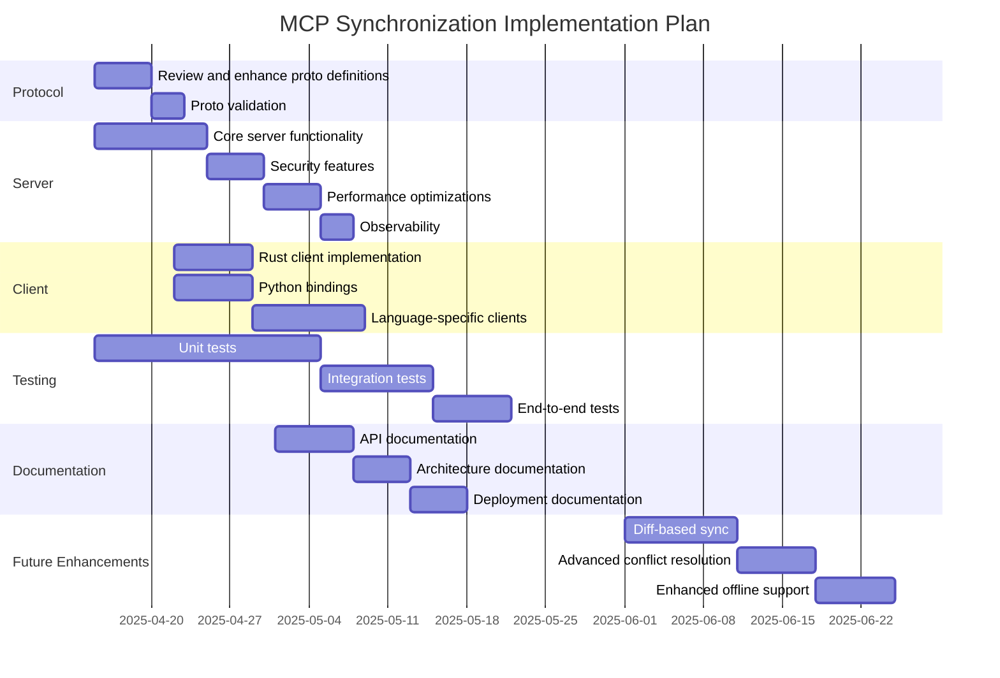

# gRPC Implementation Completion Plan for MCP Synchronization

## Current Status

The MCP synchronization system currently has:

- A basic protocol buffer definition (`proto/mcp_sync.proto`)
- A stub server implementation (`crates/mcp/src/bin/sync_server_stub.rs`)
- A full server implementation (`crates/mcp/src/bin/sync_server.rs`)
- Python test client with both direct gRPC and bindings support
- Basic bidirectional sync functionality

## Completion Roadmap

### 1. Protocol Refinement

- **Review and enhance proto definitions**
  - Add versioning to protocol messages
  - Add authentication/authorization fields
  - Implement proper error codes and messages
  - Add support for batch operations

- **Proto validation**
  - Ensure compatibility with all target languages (Rust, Python, etc.)
  - Add documentation for all message fields
  - Implement validation rules for field types and constraints

### 2. Server Implementation

- **Finalize Core Server Functionality**
  - Complete `MCPSyncServer` implementation
  - Add proper concurrency handling with `tokio::sync::Mutex`
  - Implement conflict resolution strategies
  - Add transaction support for atomic updates

- **Add Security Features**
  - Implement TLS support for secure communication
  - Add client authentication mechanism
  - Add authorization checks for operations
  - Implement proper error handling with secure error messages

- **Improve Performance**
  - Add connection pooling
  - Optimize message serialization/deserialization
  - Implement batch processing for multiple changes
  - Add caching mechanisms for frequent queries

- **Add Observability**
  - Implement detailed logging for all operations
  - Add metrics collection (requests, latency, errors)
  - Create health check endpoint
  - Add diagnostic tools for troubleshooting

### 3. Client Implementation

- **Complete Rust Client**
  - Finalize `MCPSync` implementation
  - Add proper error handling and retry mechanisms
  - Implement connection management (pooling, reconnection)
  - Add local caching for offline operation

- **Complete Python Bindings**
  - Ensure full compatibility with Rust implementation
  - Add proper Python-specific error handling
  - Implement async support for Python clients
  - Create comprehensive Python API documentation

- **Add Language-Specific Clients**
  - JavaScript/TypeScript client for web applications
  - Java client for Android applications
  - Swift client for iOS applications
  - C# client for Windows applications

### 4. Testing

- **Unit Tests**
  - Test each component in isolation
  - Mock dependencies for focused testing
  - Test error cases and edge conditions
  - Test concurrency and race conditions

- **Integration Tests**
  - Test client-server interactions
  - Test multiple clients syncing simultaneously
  - Test conflict resolution scenarios
  - Test performance under load

- **End-to-End Tests**
  - Test complete workflows across all clients
  - Test offline operation and reconnection
  - Test long-running sync operations
  - Test backward compatibility with older versions

### 5. Documentation

- **API Documentation**
  - Document all public APIs with examples
  - Create API reference documentation
  - Add tutorials for common use cases
  - Document error codes and troubleshooting steps

- **Architecture Documentation**
  - Document system architecture and components
  - Create sequence diagrams for key operations
  - Document design decisions and trade-offs
  - Add performance characteristics and limitations

- **Deployment Documentation**
  - Document server deployment options
  - Create configuration reference
  - Document scaling and high availability setup
  - Add monitoring and alerting guidelines

### 6. Future Enhancements

- **Implement Diff-Based Sync**
  - Add support for partial context updates
  - Implement efficient diff generation and application
  - Add conflict resolution for partial updates
  - Optimize bandwidth usage for large contexts

- **Advanced Conflict Resolution**
  - Implement field-level conflict resolution
  - Add support for custom merge strategies
  - Provide conflict visualization tools
  - Add manual conflict resolution options

- **Enhanced Offline Support**
  - Improve local persistence of pending changes
  - Add priority-based sync for critical updates
  - Implement better handling of long disconnections
  - Add sync progress indicators

## Implementation Schedule

### Phase 1: Protocol and Core Server (2 weeks)
- Finalize protocol buffer definitions
- Implement core server functionality 
- Add basic authentication and security
- Create comprehensive unit tests

### Phase 2: Client Implementation (3 weeks)
- Complete Rust client implementation
- Finalize Python bindings
- Add proper error handling and reconnection logic
- Implement local caching for offline operation

### Phase 3: Advanced Features (2 weeks)
- Add conflict resolution strategies
- Implement batch processing
- Add performance optimizations
- Create observability tools

### Phase 4: Testing and Documentation (3 weeks)
- Create comprehensive test suite
- Develop end-to-end tests
- Write documentation for all components
- Create deployment guidelines

### Phase 5: Future Enhancements (4 weeks)
- Implement diff-based sync approach
- Add advanced conflict resolution
- Enhance offline support
- Optimize for specific client platforms

## Success Metrics

- **Functionality**: All features working as specified
- **Performance**: 
  - Support for 100+ concurrent clients
  - Latency below 100ms for normal operations
  - Efficient handling of large context data
- **Reliability**: 
  - Zero data loss on network failures
  - Automatic reconnection and resynchronization
  - Proper conflict resolution
- **Security**:
  - All communications encrypted
  - Proper authentication and authorization
  - Secure error handling without information leakage

## Sync Approach Implementation

The implementation will follow these sync strategies in sequence:

1. **Initial Implementation - Full Context Changes**: 
   - Send complete context data for create and update operations
   - Simple to implement and validate
   - Guaranteed consistency at the cost of bandwidth

2. **Future Enhancement - Diff-Based Updates**:
   - Only send changed fields during updates
   - Add field-level version tracking
   - Implement smart merge operations on the server
   - Optimize bandwidth usage for large context objects

This phased approach allows us to get a functional system in place quickly while planning for optimizations based on real-world usage patterns.

## Conclusion

This plan outlines the steps needed to complete the gRPC implementation for MCP synchronization. By following this structured approach, we'll deliver a robust, secure, and efficient synchronization system that meets the needs of all clients and ensures data consistency across distributed instances.

