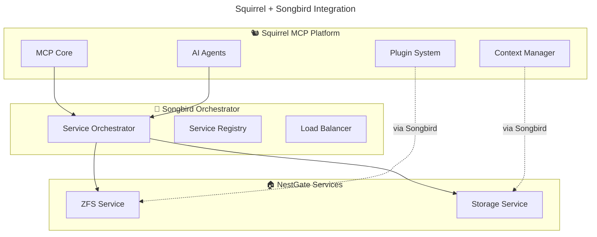

# 🐿️ Squirrel MCP Platform Refocus Guide

## 🎯 **Your New Mission: The MCP Platform**

After removing the orchestrator code, Squirrel becomes the **definitive Machine Context Protocol platform**. Here's what that means:

---

## ✅ **What Makes Squirrel Unique**

### **🧠 Machine Context Protocol Excellence**
```yaml
your_core_competency:
  context_management: "Store and manage AI agent contexts"
  multi_agent_coordination: "Coordinate multiple AI agents"
  protocol_implementation: "Pure MCP server implementation"
  agent_communication: "Inter-agent message passing"
```

### **🔌 Plugin Ecosystem Leader**
```yaml
plugin_platform:
  dynamic_loading: "Hot-load plugins without restart"
  sandboxing: "Secure plugin isolation"
  cross_platform: "Windows, macOS, Linux support"
  plugin_discovery: "Auto-discover and manage plugins"
```

### **🤖 AI Integration Specialist**
```yaml
ai_capabilities:
  model_management: "Switch between AI models dynamically"
  processing_pipeline: "AI request processing and routing"
  context_awareness: "Maintain context across AI interactions"
  optimization: "Model selection and performance tuning"
```

---

## 🔥 **High-Value Focus Areas**

### **1. MCP Protocol Innovation**
```rust
// Example: Advanced context management
pub struct ContextManager {
    contexts: HashMap<AgentId, AgentContext>,
    shared_memory: SharedContextPool,
    persistence: ContextPersistence,
}

impl ContextManager {
    // Innovation: Context sharing between agents
    pub async fn share_context(&self, from: AgentId, to: AgentId, context_slice: ContextSlice) -> Result<()> {
        // Your innovation here
    }
    
    // Innovation: Context optimization
    pub async fn optimize_context(&self, agent: AgentId) -> Result<OptimizedContext> {
        // Your innovation here
    }
}
```

### **2. Plugin System Excellence**
```rust
// Example: Advanced plugin management
pub struct PluginManager {
    plugins: PluginRegistry,
    sandbox: PluginSandbox,
    discovery: PluginDiscovery,
}

impl PluginManager {
    // Innovation: Plugin composition
    pub async fn compose_plugins(&self, workflow: PluginWorkflow) -> Result<ComposedPlugin> {
        // Your innovation here
    }
    
    // Innovation: Plugin security
    pub async fn validate_plugin_security(&self, plugin: &Plugin) -> SecurityAssessment {
        // Your innovation here
    }
}
```

### **3. AI Agent Orchestration (Different from Service Orchestration)**
```rust
// Note: This is AGENT orchestration, not SERVICE orchestration
pub struct AgentCoordinator {
    agents: HashMap<AgentId, Agent>,
    coordination_rules: CoordinationRules,
    message_bus: AgentMessageBus,
}

impl AgentCoordinator {
    // Innovation: Multi-agent workflows
    pub async fn coordinate_workflow(&self, workflow: AgentWorkflow) -> Result<WorkflowResult> {
        // Your innovation here - this is about AI agents, not services
    }
}
```

---

## 🚫 **What You DON'T Do Anymore**

### **Service Infrastructure (Songbird's Job)**
```yaml
NOT_your_job:
  service_orchestration: "❌ Songbird handles this"
  load_balancing: "❌ Songbird handles this"
  service_registry: "❌ Songbird handles this"
  connection_proxy: "❌ Songbird handles this"
  health_monitoring: "❌ Songbird handles this"
  circuit_breakers: "❌ Songbird handles this"
```

### **Domain-Specific Services (NestGate's Job)**
```yaml
NOT_your_job:
  zfs_management: "❌ NestGate handles this"
  storage_protocols: "❌ NestGate handles this"
  nas_functionality: "❌ NestGate handles this"
```

---

## 🚀 **Post-Tearout Development Priorities**

### **Sprint 1: Core MCP Platform (2 weeks)**
```yaml
priorities:
  1_context_management: "Advanced agent context storage and sharing"
  2_protocol_optimization: "MCP protocol performance improvements"
  3_plugin_security: "Enhanced plugin sandboxing and validation"
  4_ai_integration: "Better AI model management and switching"
```

### **Sprint 2: Plugin Ecosystem (2 weeks)**
```yaml
priorities:
  1_plugin_discovery: "Auto-discovery and management UI"
  2_plugin_composition: "Ability to combine plugins into workflows"
  3_plugin_marketplace: "Plugin sharing and distribution system"
  4_developer_tools: "Plugin development toolkit and templates"
```

### **Sprint 3: Advanced AI Features (2 weeks)**
```yaml
priorities:
  1_multi_agent_workflows: "Complex multi-agent coordination patterns"
  2_context_optimization: "Intelligent context pruning and optimization"
  3_agent_learning: "Agents that learn from interactions"
  4_performance_monitoring: "AI agent performance analytics"
```

---

## 🎯 **Success Metrics for Refocused Squirrel**

### **Technical Excellence**
- [ ] **Pure MCP Implementation**: Best-in-class Machine Context Protocol server
- [ ] **Plugin Ecosystem**: Thriving ecosystem of secure, composable plugins
- [ ] **AI Agent Coordination**: Advanced multi-agent workflows
- [ ] **Cross-Platform Support**: Seamless operation on all platforms

### **Developer Experience**
- [ ] **Easy Integration**: Simple SDK for building MCP-enabled applications
- [ ] **Rich Documentation**: Comprehensive guides and tutorials
- [ ] **Plugin Development**: Excellent tooling for plugin creators
- [ ] **Community Growth**: Active community of MCP developers

### **Performance & Reliability**
- [ ] **High Performance**: Optimized for low-latency AI interactions
- [ ] **Scalability**: Handles hundreds of concurrent AI agents
- [ ] **Security**: Industry-leading plugin sandboxing and security
- [ ] **Stability**: Production-ready reliability and error handling

---

## 🔌 **Integration with Songbird**

### **How It Works Together**


### **Clean Integration Pattern**
```rust
// Squirrel registers as an MCP service with Songbird
use songbird_orchestrator::prelude::*;

pub async fn integrate_with_songbird() -> Result<()> {
    let mcp_service = SquirrelMcpService::new().await?;
    
    // Register with Songbird orchestrator
    let orchestrator = OrchestratorClient::connect("http://songbird:8080").await?;
    orchestrator.register_service("squirrel-mcp", Box::new(mcp_service)).await?;
    
    Ok(())
}
```

---

## 🎉 **Your Unique Value Proposition**

After the tearout, Squirrel becomes:

### **🐿️ The MCP Platform**
- **Industry-leading** Machine Context Protocol implementation
- **Rich ecosystem** of secure, composable plugins
- **Advanced AI agent** coordination and management
- **Cross-platform** support with excellent developer experience

### **🚀 Innovation Opportunities**
- **Context Intelligence**: Smart context management and optimization
- **Plugin Composition**: Revolutionary plugin workflow system
- **Multi-Agent AI**: Advanced coordination patterns for AI agents
- **Developer Tools**: Best-in-class tooling for MCP development

---

## 📞 **Support for Refocusing**

### **Resources Available**
- **Songbird Team**: Integration support and orchestration expertise
- **NestGate Team**: Domain service integration examples
- **Documentation**: Comprehensive specs and implementation guides

### **Next Steps**
1. **Complete tearout** using [ORCHESTRATOR_TEAROUT_PLAN.md](./ORCHESTRATOR_TEAROUT_PLAN.md)
2. **Focus development** on MCP platform excellence
3. **Build plugin ecosystem** and developer community
4. **Integrate cleanly** with Songbird orchestrator

---

**🎯 Ready to become the definitive MCP platform! 🐿️** 