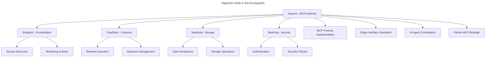

# Squirrel Specifications - MCP Protocol Platform

> **Machine Context Protocol Authority for the Ecosystem**

## 🎯 Overview

Following the **ecosystem elimination of 2025**, Squirrel has been transformed from a broad multi-agent platform into a **laser-focused Machine Context Protocol (MCP) implementation**. This specifications directory reflects that new identity.

## 📁 Specification Structure

### **mcp-focused/** - Core Squirrel Specifications

#### 🔌 **mcp-protocol/**
Complete MCP protocol implementation and compliance specifications
- Protocol definitions and message formats
- Compliance testing requirements
- Version compatibility guidelines
- Error handling and recovery patterns

#### 🧩 **plugins/**
Plugin interfaces and registry system specifications
- Plugin interface definitions (usable across ecosystem)
- Plugin lifecycle management
- Registry and discovery patterns
- Capability negotiation protocols

#### 🤖 **ai-agents/**
AI agent coordination pattern specifications
- Agent-to-agent communication via MCP
- Coordination protocols and patterns
- Multi-agent workflow definitions
- Agent capability registration

#### ⚡ **commands/**
AI tools command system specifications
- Command interface definitions
- Tool orchestration patterns
- Execution protocols
- Result handling and validation

#### 🧠 **context/**
Context state management specifications (not persistence)
- Application state management patterns
- Context sharing between components
- State synchronization protocols
- Memory management (NestGate handles persistence)

#### 🐍 **python-bindings/**
PyO3 MCP bindings for Python specifications
- Python API interface definitions
- Binding implementation patterns
- Error handling in Python context
- Performance optimization guidelines

#### 🔗 **ecosystem-integration/**
Cross-ecosystem communication protocol specifications
- Integration with Songbird (orchestration)
- Integration with ToadStool (compute)
- Integration with NestGate (storage)
- Integration with BearDog (security)

#### 🏗️ **architecture/**
Core MCP architecture documentation
- System architecture patterns
- Component interaction diagrams
- Deployment and scaling guidelines
- Performance and reliability requirements

## 🗄️ Archived Specifications

### **ecosystem-elimination-archive/2025/**
Components eliminated during the ecosystem refocus:
- **ui/**: User interface specifications → Moved to specialized UI projects
- **monitoring/**: Monitoring and observability → Moved to Songbird
- **web-api/**: Web services and APIs → Moved to Songbird
- **storage/**: Storage and persistence → Moved to NestGate
- **security/**: Security and authentication → Moved to BearDog
- **runtime/**: Runtime execution → Moved to ToadStool

## 🌐 Ecosystem Architecture

## ✅ Squirrel's Core Responsibilities

1. **MCP Protocol Authority**: Definitive implementation and compliance
2. **Plugin Interface Standards**: Ecosystem-wide plugin definitions
3. **AI Agent Coordination**: Multi-agent communication patterns
4. **Command System**: AI tool orchestration and execution
5. **Context State Management**: Application state (not persistence)
6. **Python Integration**: PyO3 bindings for Python MCP clients

## ❌ Eliminated Responsibilities

- **Web Services**: Now handled by Songbird
- **UI Components**: Distributed to specialized projects
- **Monitoring**: Centralized in Songbird
- **Storage/Persistence**: Managed by NestGate
- **Security/Auth**: Handled by BearDog
- **Runtime Execution**: Provided by ToadStool

## 🔄 Integration Patterns

### **Songbird Integration**
- Service discovery for MCP endpoints
- Monitoring of MCP protocol health
- Orchestration of multi-service AI workflows

### **ToadStool Integration**
- Runtime execution of AI tools and commands
- Resource allocation for AI agent processes
- Compute scaling for MCP workloads

### **NestGate Integration**
- Persistence of AI agent state and context
- Storage of plugin configurations and metadata
- Data operations for MCP protocol state

### **BearDog Integration**
- Authentication for MCP protocol access
- Authorization policies for AI agent operations
- Security compliance for cross-ecosystem communication

## 📈 Benefits of the New Focus

### **Specialized Excellence**
- Deep expertise in MCP protocol implementation
- Authoritative plugin interface definitions
- Optimized AI agent coordination patterns

### **Zero Redundancy**
- No overlap with other ecosystem projects
- Clear separation of concerns
- Reduced cognitive complexity

### **Ecosystem Synergy**
- MCP as universal communication protocol
- Shared plugin standards across projects
- Coordinated development and evolution

## 🚀 Development Guidelines

### **Contributing to Specs**
1. Focus on MCP protocol compliance and standards
2. Ensure plugin interfaces are ecosystem-compatible
3. Design for cross-ecosystem integration
4. Maintain clear separation from other project domains

### **Cross-Ecosystem Coordination**
1. Coordinate MCP protocol changes with all ecosystem projects
2. Ensure plugin standards meet ecosystem needs
3. Validate integration patterns with project teams
4. Maintain backward compatibility across ecosystem

---

## 📋 Summary

Squirrel has successfully transformed from a broad multi-agent platform into the **authoritative Machine Context Protocol implementation** for the entire ecosystem. The specifications in this directory reflect that focused mission and enable **seamless integration** with specialized ecosystem projects.

**Result**: Clear boundaries, specialized excellence, and powerful ecosystem synergy through the Machine Context Protocol. 