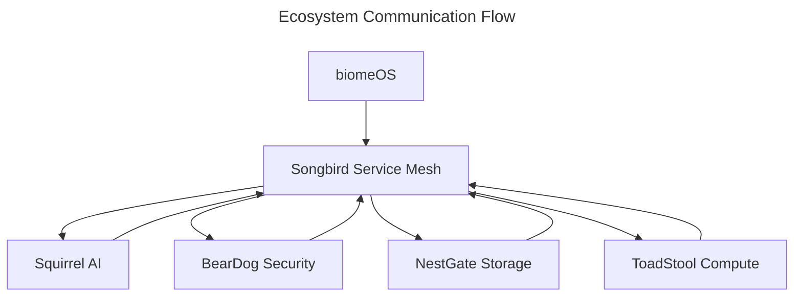

# Universal Patterns Specification

## Overview

This specification defines the comprehensive universal patterns framework for the ecoPrimals ecosystem, establishing standardized interfaces, communication protocols, and integration patterns that enable seamless interoperability between all primals through the Songbird service mesh.

## Executive Summary

The Universal Patterns Framework provides:
- **Unified API Standard**: Consistent interfaces across all primals
- **Songbird-Centric Communication**: All inter-primal communication via service mesh
- **Multi-Instance Support**: Context-aware routing and load balancing
- **Dynamic Capability System**: Runtime capability discovery and management
- **Federation Support**: Cross-platform sovereignty and consensus mechanisms

## Architecture Principles

### 1. Songbird-Centric Communication
All ecosystem communication flows through Songbird's service mesh. No direct primal-to-primal communication is permitted.



### 2. Universal Provider Interface
All primals must implement the `UniversalPrimalProvider` trait for ecosystem integration.

### 3. Capability-Based Architecture
Services are discovered and composed based on their declared capabilities.

### 4. Context-Aware Routing
Requests are routed based on user, device, and security context.

## Core Specifications

### 1. Universal Primal Provider Interface

```rust
#[async_trait]
pub trait UniversalPrimalProvider: Send + Sync {
    /// Unique primal identifier
    fn primal_id(&self) -> &str;
    
    /// Instance identifier for multi-instance support
    fn instance_id(&self) -> &str;
    
    /// User/device context this primal instance serves
    fn context(&self) -> &PrimalContext;
    
    /// Primal type category
    fn primal_type(&self) -> PrimalType;
    
    /// Capabilities this primal provides
    fn capabilities(&self) -> Vec<PrimalCapability>;
    
    /// Health check for this primal
    async fn health_check(&self) -> PrimalHealth;
    
    /// Handle inter-primal communication
    async fn handle_primal_request(&self, request: PrimalRequest) -> UniversalResult<PrimalResponse>;
    
    /// Initialize with configuration
    async fn initialize(&mut self, config: serde_json::Value) -> UniversalResult<()>;
    
    /// Register with Songbird service mesh
    async fn register_with_songbird(&mut self, songbird_endpoint: &str) -> UniversalResult<String>;
    
    /// Handle ecosystem request (standardized format)
    async fn handle_ecosystem_request(&self, request: EcosystemRequest) -> UniversalResult<EcosystemResponse>;
}
```

### 2. Ecosystem Integration Interface

```rust
#[async_trait]
pub trait EcosystemIntegration: Send + Sync {
    /// Register service with Songbird
    async fn register_with_songbird(&self) -> Result<String, EcosystemError>;
    
    /// Handle incoming requests from other services
    async fn handle_ecosystem_request(&self, request: EcosystemRequest) -> Result<EcosystemResponse, EcosystemError>;
    
    /// Report health status to Songbird
    async fn report_health(&self, health: HealthStatus) -> Result<(), EcosystemError>;
    
    /// Update service capabilities
    async fn update_capabilities(&self, capabilities: ServiceCapabilities) -> Result<(), EcosystemError>;
    
    /// Deregister from ecosystem
    async fn deregister(&self) -> Result<(), EcosystemError>;
}
```

### 3. Standardized Request/Response Format

```rust
#[derive(Debug, Clone, Serialize, Deserialize)]
pub struct EcosystemRequest {
    pub request_id: Uuid,
    pub source_service: String,
    pub target_service: String,
    pub operation: String,
    pub payload: serde_json::Value,
    pub security_context: SecurityContext,
    pub metadata: HashMap<String, String>,
    pub timestamp: DateTime<Utc>,
}

#[derive(Debug, Clone, Serialize, Deserialize)]
pub struct EcosystemResponse {
    pub request_id: Uuid,
    pub status: ResponseStatus,
    pub payload: serde_json::Value,
    pub metadata: HashMap<String, String>,
    pub timestamp: DateTime<Utc>,
}
```

### 4. Capability System

```rust
#[derive(Debug, Clone, PartialEq, Eq, Serialize, Deserialize)]
pub enum PrimalCapability {
    // AI capabilities (Squirrel)
    ModelInference { models: Vec<String> },
    AgentFramework { mcp_support: bool },
    MachineLearning { training_support: bool },
    NaturalLanguage { languages: Vec<String> },
    
    // Security capabilities (BearDog)
    Authentication { methods: Vec<String> },
    Encryption { algorithms: Vec<String> },
    KeyManagement { hsm_support: bool },
    ThreatDetection { ml_enabled: bool },
    
    // Storage capabilities (NestGate)
    FileSystem { supports_zfs: bool },
    ObjectStorage { backends: Vec<String> },
    VolumeManagement { protocols: Vec<String> },
    BackupRestore { incremental: bool },
    
    // Compute capabilities (ToadStool)
    ContainerRuntime { orchestrators: Vec<String> },
    ServerlessExecution { languages: Vec<String> },
    GpuAcceleration { cuda_support: bool },
    
    // Network capabilities (Songbird)
    ServiceDiscovery { protocols: Vec<String> },
    LoadBalancing { algorithms: Vec<String> },
    CircuitBreaking { enabled: bool },
    
    // OS capabilities (biomeOS)
    Orchestration { primals: Vec<String> },
    Manifests { formats: Vec<String> },
    Deployment { strategies: Vec<String> },
}
```

### 5. Context-Aware Routing

```rust
#[derive(Debug, Clone, Serialize, Deserialize)]
pub struct PrimalContext {
    pub user_id: String,
    pub device_id: String,
    pub session_id: String,
    pub security_level: SecurityLevel,
    pub biome_id: Option<String>,
    pub network_location: NetworkLocation,
    pub metadata: HashMap<String, String>,
}

#[derive(Debug, Clone, Serialize, Deserialize)]
pub enum SecurityLevel {
    Public,
    Internal,
    Restricted,
    Confidential,
}
```

### 6. Service Registration Standard

```rust
#[derive(Debug, Clone, Serialize, Deserialize)]
pub struct EcosystemServiceRegistration {
    pub service_id: String,
    pub primal_type: PrimalType,
    pub biome_id: Option<String>,
    pub capabilities: ServiceCapabilities,
    pub endpoints: ServiceEndpoints,
    pub resource_requirements: ResourceSpec,
    pub security_config: SecurityConfig,
    pub health_check: HealthCheckConfig,
    pub metadata: HashMap<String, String>,
}
```

## Implementation Status

### Current Implementation Status

| Component | Status | Implementation Location |
|-----------|--------|-------------------------|
| Universal Patterns Framework | 80% | `crates/universal-patterns/` |
| Ecosystem API | 85% | `crates/ecosystem-api/` |
| Squirrel Universal Provider | 90% | `crates/main/src/universal_provider.rs` |
| Squirrel Universal Adapter | 85% | `crates/main/src/universal_adapter.rs` |
| Configuration System | 75% | `crates/universal-patterns/src/config/` |
| Federation Framework | 60% | `crates/universal-patterns/src/federation/` |
| Security Integration | 70% | `crates/universal-patterns/src/security/` |

### Primal Integration Status

| Primal | Status | Required Actions |
|--------|--------|------------------|
| **Squirrel** | ✅ 95% Complete | Minor optimizations |
| **Songbird** | ✅ 95% Complete | Reference implementation |
| **ToadStool** | ✅ 90% Complete | Reference implementation |
| **biomeOS** | ✅ 85% Complete | Reference implementation |
| **BearDog** | 🟡 75% Complete | Needs alignment |
| **NestGate** | 🔴 60% Complete | Major expansion needed |

## Missing Implementations

### 1. Federation Framework (40% Missing)
- **Location**: `crates/universal-patterns/src/federation/`
- **Missing Components**:
  - Cross-platform executor implementation
  - Consensus mechanism completion
  - Sovereign data management
  - Universal execution environment

### 2. Advanced Configuration (25% Missing)
- **Location**: `crates/universal-patterns/src/config/`
- **Missing Components**:
  - Dynamic configuration updates
  - Environment-specific presets
  - Validation framework completion
  - Configuration migration tools

### 3. Security Integration (30% Missing)
- **Location**: `crates/universal-patterns/src/security/`
- **Missing Components**:
  - Universal security client
  - Security provider framework
  - Threat detection integration
  - Compliance frameworks

### 4. Registry Enhancements (20% Missing)
- **Location**: `crates/universal-patterns/src/registry/`
- **Missing Components**:
  - Enhanced statistics
  - Dynamic service discovery
  - Health monitoring integration
  - Load balancing algorithms

## Implementation Roadmap

### Phase 1: Foundation Completion (Weeks 1-2)
1. **Complete Federation Framework**
   - Implement cross-platform executor
   - Finish consensus mechanisms
   - Add sovereign data management

2. **Expand Configuration System**
   - Add dynamic configuration updates
   - Implement environment presets
   - Complete validation framework

3. **Enhance Security Integration**
   - Implement universal security client
   - Add threat detection
   - Complete compliance frameworks

### Phase 2: Primal Integration (Weeks 3-4)
1. **BearDog Alignment**
   - Implement EcosystemIntegration trait
   - Add UniversalPrimalProvider
   - Standardize configuration

2. **NestGate Expansion**
   - Major API surface expansion
   - Complete service registration
   - Add comprehensive endpoints

3. **Integration Testing**
   - Cross-primal communication tests
   - Load balancing verification
   - Health monitoring validation

### Phase 3: Advanced Features (Weeks 5-6)
1. **Dynamic Capability Management**
   - Runtime capability updates
   - Capability discovery optimization
   - Load balancing improvements

2. **Enhanced Monitoring**
   - Comprehensive health checks
   - Performance metrics
   - Alerting system

3. **Documentation & Examples**
   - Complete API documentation
   - Implementation examples
   - Best practices guide

## Success Criteria

### Technical Requirements
- [ ] 100% API compatibility across all primals
- [ ] Sub-100ms inter-primal communication latency
- [ ] 99.9% service mesh uptime
- [ ] Zero-configuration integration for new services
- [ ] Complete federation support

### Developer Experience
- [ ] Single API standard for all integrations
- [ ] Consistent error handling across ecosystem
- [ ] Unified configuration format
- [ ] Comprehensive documentation
- [ ] Working examples for each primal

## Testing Requirements

### Unit Tests
- [ ] Universal provider trait implementations
- [ ] Capability system validation
- [ ] Configuration management
- [ ] Security integration

### Integration Tests
- [ ] Cross-primal communication
- [ ] Service discovery and registration
- [ ] Health monitoring
- [ ] Load balancing and failover

### Performance Tests
- [ ] Inter-primal communication latency
- [ ] Service discovery performance
- [ ] Health check overhead
- [ ] Load balancing efficiency

## Security Considerations

### Authentication & Authorization
- All inter-primal communication must be authenticated
- Role-based access control for service operations
- Secure credential management across primals

### Data Protection
- End-to-end encryption for sensitive data
- Secure key distribution and management
- Compliance with regulatory requirements

### Threat Detection
- Real-time monitoring for security threats
- Automated response to security incidents
- Audit logging for all operations

## Performance Requirements

### Latency
- Inter-primal communication: < 100ms
- Service discovery: < 5s
- Health checks: < 1s

### Throughput
- Support 10,000+ concurrent requests
- Handle 1,000+ service registrations
- Process 100+ health checks per second

### Resource Usage
- Memory overhead: < 100MB per primal
- CPU usage: < 10% under normal load
- Network bandwidth: Optimized for minimal usage

## Monitoring and Observability

### Metrics
- Service discovery latency
- Inter-primal communication metrics
- Health check success rates
- Resource utilization

### Logging
- Structured logging for all operations
- Trace correlation across primals
- Error tracking and alerting

### Alerting
- Service health degradation
- Communication failures
- Security incidents
- Performance anomalies

## Conclusion

The Universal Patterns Framework provides the foundation for a unified, scalable, and secure ecosystem of primals. The implementation is well underway with strong foundations in place. The remaining work focuses on completing the federation framework, expanding primal integrations, and ensuring comprehensive testing and documentation.

The framework enables dynamic primal evolution while maintaining strict compatibility and security requirements, positioning the ecoPrimals ecosystem for long-term success and scalability. 