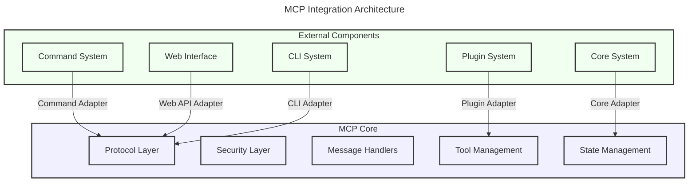

# MCP Integration Guide

> **Note (April 2026):** This is a **gen2-era guide** (June 2024). The current integration surface uses JSON-RPC 2.0 with `domain.verb` methods over Unix sockets. See `crates/core/mcp/README.md` and `specs/active/mcp-protocol/README.md` for current status.

## Overview

The Machine Context Protocol (MCP) crate provides a robust messaging and context management system for Squirrel. This guide provides comprehensive instructions on how to effectively integrate other crates with MCP, focusing on adapter patterns, key integration points, and best practices.

## Integration Architecture

The MCP crate is designed to be integrated with other components through well-defined interfaces and adapter patterns. This architecture ensures loose coupling between components while maintaining robust communication capabilities.



## Adapter Pattern

The primary integration mechanism for MCP is the adapter pattern, which provides a standardized way to connect external components with MCP functionality.

### 1. Core Adapter Structure

```rust
/// Adapter for integrating an external component with MCP
pub struct MCPComponentAdapter<T> {
    /// The inner component instance
    inner: Option<Arc<T>>,
    /// The MCP protocol interface
    mcp: Option<Arc<mcp::Protocol>>,
    /// Optional configuration
    config: AdapterConfig,
}

impl<T> MCPComponentAdapter<T> {
    /// Creates a new adapter without initializing it
    pub fn new() -> Self {
        Self {
            inner: None,
            mcp: None,
            config: AdapterConfig::default(),
        }
    }
    
    /// Creates an adapter with existing components
    pub fn with_components(component: Arc<T>, mcp: Arc<mcp::Protocol>) -> Self {
        Self {
            inner: Some(component),
            mcp: Some(mcp),
            config: AdapterConfig::default(),
        }
    }
    
    /// Initializes with custom configuration
    pub fn with_config(config: AdapterConfig) -> Self {
        Self {
            inner: None,
            mcp: None,
            config,
        }
    }
    
    /// Checks if the adapter is initialized
    pub fn is_initialized(&self) -> bool {
        self.inner.is_some() && self.mcp.is_some()
    }
}
```

### 2. Adapter Implementation Example: Command System

This example shows how to create an adapter between the command system and MCP:

```rust
pub struct CommandMCPAdapter {
    registry: Arc<Mutex<CommandRegistry>>,
    mcp: Arc<MCPProtocol>,
    auth_manager: Arc<AuthManager>,
}

impl CommandMCPAdapter {
    pub fn new(
        registry: Arc<Mutex<CommandRegistry>>,
        mcp: Arc<MCPProtocol>,
        auth_manager: Arc<AuthManager>,
    ) -> Self {
        Self {
            registry,
            mcp,
            auth_manager,
        }
    }
    
    pub async fn handle_command_request(&self, request: &MCPCommandRequest) -> MCPCommandResponse {
        // 1. Authenticate the request
        let user = match self.authenticate(request).await {
            Ok(user) => user,
            Err(e) => return MCPCommandResponse::error(e.to_string()),
        };
        
        // 2. Authorize the command
        if let Err(e) = self.authorize(&user, &request.command).await {
            return MCPCommandResponse::error(e.to_string());
        }
        
        // 3. Execute the command
        match self.execute_command(&request.command, &request.arguments).await {
            Ok(output) => MCPCommandResponse::success(output),
            Err(e) => MCPCommandResponse::error(e.to_string()),
        }
    }
    
    async fn authenticate(&self, request: &MCPCommandRequest) -> Result<User, AuthError> {
        // Authentication logic
        if let Some(credentials) = &request.credentials {
            self.auth_manager.authenticate(credentials).await
        } else {
            Err(AuthError::NoCredentials)
        }
    }
    
    async fn authorize(&self, user: &User, command: &str) -> Result<(), AuthError> {
        // Authorization logic
        self.auth_manager.authorize(user, command).await
    }
    
    async fn execute_command(&self, command: &str, args: &[String]) -> Result<String, CommandError> {
        // Command execution logic
        let registry = self.registry.lock().map_err(|_| CommandError::LockError)?;
        let cmd = registry.get_command(command)?;
        cmd.execute(args)
    }
}
```

## Key Integration Points

### 1. Protocol Integration

The MCP Protocol provides the core messaging capabilities:

```rust
// Protocol interface
pub trait MCPProtocol: Send + Sync {
    // Send a message through the MCP protocol
    async fn send_message(&self, message: MCPMessage) -> Result<MCPResponse, MCPError>;
    
    // Register a message handler for a specific message type
    async fn register_handler(
        &self, 
        message_type: MessageType, 
        handler: Box<dyn MessageHandler>,
    ) -> Result<(), MCPError>;
    
    // Subscribe to messages of a specific type
    async fn subscribe(
        &self, 
        message_type: MessageType,
    ) -> Result<MCPSubscription, MCPError>;
}

// Example integration with MCP protocol
async fn integrate_with_protocol(mcp: Arc<dyn MCPProtocol>) -> Result<(), Error> {
    // Register a handler for a specific message type
    mcp.register_handler(
        MessageType::Command,
        Box::new(MyCommandHandler::new()),
    ).await?;
    
    // Send a message
    let message = MCPMessage::new(
        MessageType::Command,
        "command_payload".into(),
    );
    
    let response = mcp.send_message(message).await?;
    
    // Process the response
    match response.status {
        Status::Success => println!("Success: {}", response.payload),
        Status::Error => println!("Error: {}", response.error.unwrap()),
        _ => println!("Other status: {:?}", response.status),
    }
    
    Ok(())
}
```

### 2. Tool Management Integration

The MCP Tool Manager handles the lifecycle of tools:

```rust
// Tool management interface
pub trait ToolManager: Send + Sync {
    // Register a tool with the manager
    async fn register_tool(&self, tool: Tool) -> Result<ToolId, ToolError>;
    
    // Execute a tool capability with parameters
    async fn execute_tool(
        &self,
        tool_id: ToolId,
        capability: &str,
        parameters: Value,
    ) -> Result<Value, ToolError>;
    
    // Get information about available tools
    async fn list_tools(&self) -> Result<Vec<ToolInfo>, ToolError>;
}

// Example integration with Tool Manager
async fn integrate_with_tool_manager(tool_manager: Arc<dyn ToolManager>) -> Result<(), Error> {
    // Create a new tool
    let tool = Tool::builder()
        .id("my-tool")
        .name("My Tool")
        .description("A sample tool")
        .capability(Capability::new("analyze", vec![
            Parameter::new("input", "string", true),
            Parameter::new("options", "object", false),
        ]))
        .build();
    
    // Register the tool
    let tool_id = tool_manager.register_tool(tool).await?;
    
    // Execute the tool capability
    let result = tool_manager.execute_tool(
        tool_id,
        "analyze",
        json!({
            "input": "sample input",
            "options": {
                "fast": true
            }
        }),
    ).await?;
    
    println!("Tool execution result: {}", result);
    
    Ok(())
}
```

### 3. Security Integration

MCP's security system handles authentication and authorization:

```rust
// Security interface
pub trait SecurityManager: Send + Sync {
    // Authenticate user credentials
    async fn authenticate(&self, credentials: &Credentials) -> Result<User, SecurityError>;
    
    // Check if a user has permission for an action
    async fn authorize(
        &self,
        user: &User,
        resource: &str,
        action: Action,
    ) -> Result<(), SecurityError>;
    
    // Generate a security token
    async fn generate_token(&self, user: &User) -> Result<Token, SecurityError>;
    
    // Validate a security token
    async fn validate_token(&self, token: &Token) -> Result<User, SecurityError>;
}

// Example integration with Security Manager
async fn integrate_with_security(security: Arc<dyn SecurityManager>) -> Result<(), Error> {
    // Authenticate a user
    let credentials = Credentials::Basic {
        username: "user".to_string(),
        password: "password".to_string(),
    };
    
    let user = security.authenticate(&credentials).await?;
    
    // Check user permissions
    security.authorize(&user, "reports", Action::Read).await?;
    
    // Generate a token for the user
    let token = security.generate_token(&user).await?;
    
    // Use the token for subsequent operations
    let validated_user = security.validate_token(&token).await?;
    
    println!("Authenticated user: {}", validated_user.username);
    
    Ok(())
}
```

## Best Practices for Integration

### 1. Use Dependency Injection

Favor dependency injection for integrating MCP components:

```rust
// Dependency injection with constructor
pub struct MyComponent {
    mcp: Arc<dyn MCPProtocol>,
    tool_manager: Arc<dyn ToolManager>,
    security: Arc<dyn SecurityManager>,
}

impl MyComponent {
    pub fn new(
        mcp: Arc<dyn MCPProtocol>,
        tool_manager: Arc<dyn ToolManager>,
        security: Arc<dyn SecurityManager>,
    ) -> Self {
        Self {
            mcp,
            tool_manager,
            security,
        }
    }
    
    // Component methods using injected dependencies
}
```

### 2. Handle Asynchronous Operations Safely

Ensure proper async handling when integrating with MCP:

```rust
async fn execute_with_mcp(&self, command: &str) -> Result<String, Error> {
    // Use scoped locks to prevent holding locks across await points
    let cmd = {
        let registry = self.registry.lock().map_err(|_| Error::LockError)?;
        registry.get_command(command)?.clone()
    }; // Lock is released here
    
    // Now safe to await without holding the lock
    let message = MCPMessage::new(
        MessageType::Command,
        json!({ "command": command }),
    );
    
    let response = self.mcp.send_message(message).await?;
    
    // Process the response
    if response.status == Status::Success {
        Ok(response.payload.to_string())
    } else {
        Err(Error::CommandFailed(response.error.unwrap_or_default()))
    }
}
```

### 3. Apply Circuit Breaker Pattern

Use circuit breakers when integrating with MCP to handle potential failures:

```rust
pub struct MCPCircuitBreaker {
    mcp: Arc<dyn MCPProtocol>,
    state: AtomicU8,
    threshold: u32,
    timeout_ms: u64,
    failures: AtomicU32,
}

impl MCPCircuitBreaker {
    pub async fn send_message(&self, message: MCPMessage) -> Result<MCPResponse, MCPError> {
        // Check if circuit is open
        if self.is_open() {
            return Err(MCPError::CircuitOpen);
        }
        
        // Try to send the message
        match self.mcp.send_message(message).await {
            Ok(response) => {
                // Reset failure counter on success
                self.failures.store(0, Ordering::SeqCst);
                Ok(response)
            }
            Err(e) => {
                // Increment failure counter
                let failures = self.failures.fetch_add(1, Ordering::SeqCst) + 1;
                
                // Open circuit if threshold reached
                if failures >= self.threshold {
                    self.open_circuit();
                    
                    // Schedule automatic reset after timeout
                    let breaker = self.clone();
                    tokio::spawn(async move {
                        tokio::time::sleep(Duration::from_millis(breaker.timeout_ms)).await;
                        breaker.half_open_circuit();
                    });
                }
                
                Err(e)
            }
        }
    }
    
    fn is_open(&self) -> bool {
        self.state.load(Ordering::SeqCst) == CIRCUIT_OPEN
    }
    
    fn open_circuit(&self) {
        self.state.store(CIRCUIT_OPEN, Ordering::SeqCst);
    }
    
    fn half_open_circuit(&self) {
        self.state.store(CIRCUIT_HALF_OPEN, Ordering::SeqCst);
    }
}
```

### 4. Implement Comprehensive Logging and Metrics

Add logging and metrics for MCP integration:

```rust
async fn handle_mcp_message(&self, message: MCPMessage) -> Result<MCPResponse, Error> {
    // Log message receipt with structured data
    self.logger.info("Received MCP message", json!({
        "message_id": message.id,
        "message_type": message.message_type,
        "component": "my_component"
    }));
    
    // Record message timing
    let timer = self.metrics.start_timer("mcp_message_processing");
    
    // Process the message
    let result = match self.process_message(message).await {
        Ok(response) => {
            // Record success
            self.metrics.increment_counter("mcp_messages_success");
            Ok(response)
        }
        Err(e) => {
            // Record failure
            self.metrics.increment_counter("mcp_messages_error");
            self.logger.error("Failed to process message", json!({
                "error": e.to_string(),
                "component": "my_component"
            }));
            Err(e)
        }
    };
    
    // Stop the timer and record duration
    let duration = timer.stop();
    self.metrics.record_histogram("mcp_message_duration", duration);
    
    result
}
```

### 5. Handle Message Serialization Correctly

Ensure proper message serialization when integrating with MCP:

```rust
fn create_mcp_message<T: Serialize>(&self, message_type: MessageType, payload: T) -> Result<MCPMessage, Error> {
    // Try to serialize the payload
    let payload_value = match serde_json::to_value(payload) {
        Ok(value) => value,
        Err(e) => {
            self.logger.error("Failed to serialize payload", json!({
                "error": e.to_string(),
                "component": "my_component"
            }));
            return Err(Error::SerializationFailed(e));
        }
    };
    
    // Create the message
    Ok(MCPMessage {
        id: Uuid::new_v4().to_string(),
        message_type,
        payload: payload_value,
        metadata: HashMap::new(),
        timestamp: chrono::Utc::now(),
        version: "1.0".to_string(),
    })
}
```

## Integration Testing

### 1. Unit Testing with Mock MCP Components

```rust
#[tokio::test]
async fn test_component_with_mock_mcp() {
    // Create mock MCP protocol
    let mock_mcp = Arc::new(MockMCPProtocol::new());
    
    // Configure mock behavior
    mock_mcp.expect_send_message()
        .times(1)
        .returning(|message| {
            Ok(MCPResponse {
                id: message.id,
                status: Status::Success,
                payload: json!({ "result": "success" }),
                error: None,
                timestamp: chrono::Utc::now(),
            })
        });
    
    // Create component with mock
    let component = MyComponent::new(mock_mcp.clone());
    
    // Execute test
    let result = component.do_something().await;
    
    // Verify result
    assert!(result.is_ok());
    
    // Verify expectations
    mock_mcp.checkpoint();
}
```

### 2. Integration Testing with In-Memory MCP

```rust
#[tokio::test]
async fn test_integration_with_in_memory_mcp() {
    // Create in-memory MCP instance
    let mcp = Arc::new(InMemoryMCPProtocol::new());
    
    // Create and register handler
    let handler = Arc::new(TestMessageHandler::new());
    mcp.register_handler(MessageType::Command, Box::new(handler.clone())).await.unwrap();
    
    // Create component with real in-memory MCP
    let component = MyComponent::new(mcp.clone());
    
    // Execute test
    let result = component.do_something().await;
    
    // Verify result
    assert!(result.is_ok());
    
    // Verify handler was called correctly
    assert_eq!(handler.call_count(), 1);
    assert_eq!(handler.last_message().unwrap().message_type, MessageType::Command);
}
```

## Common Integration Patterns

### 1. Command Adapter Pattern

```rust
// Command adapter for MCP integration
pub struct MCPCommandAdapter {
    registry: Arc<Mutex<CommandRegistry>>,
    mcp: Arc<dyn MCPProtocol>,
}

impl MCPCommandAdapter {
    // Register the adapter as a message handler for commands
    pub async fn register_with_mcp(&self) -> Result<(), Error> {
        let handler = Box::new(self.clone());
        self.mcp.register_handler(MessageType::Command, handler).await?;
        Ok(())
    }
}

// Implement MessageHandler for the adapter
#[async_trait]
impl MessageHandler for MCPCommandAdapter {
    async fn handle_message(&self, message: MCPMessage) -> Result<MCPResponse, MCPError> {
        // Extract command from message
        let command = match extract_command_from_message(&message) {
            Ok(cmd) => cmd,
            Err(e) => return Ok(create_error_response(&message, e)),
        };
        
        // Execute the command
        let result = {
            let registry = match self.registry.lock() {
                Ok(r) => r,
                Err(e) => return Ok(create_error_response(&message, Error::Lock(e.to_string()))),
            };
            
            let cmd = match registry.get_command(&command.name) {
                Ok(c) => c,
                Err(e) => return Ok(create_error_response(&message, e)),
            };
            
            cmd.execute(&command.args)
        };
        
        // Create response
        match result {
            Ok(output) => Ok(create_success_response(&message, output)),
            Err(e) => Ok(create_error_response(&message, e)),
        }
    }
}
```

### 2. Plugin Integration Pattern

```rust
// Plugin adapter for MCP integration
pub struct MCPPluginAdapter {
    plugin_system: Arc<PluginSystem>,
    mcp: Arc<dyn MCPProtocol>,
}

impl MCPPluginAdapter {
    // Initialize plugins from MCP messages
    pub async fn init_plugins_from_mcp(&self) -> Result<(), Error> {
        // Subscribe to plugin registration messages
        let mut subscription = self.mcp.subscribe(MessageType::PluginRegistration).await?;
        
        // Process registration messages
        while let Some(message) = subscription.next().await {
            if let Err(e) = self.handle_plugin_registration(message).await {
                self.logger.error("Failed to register plugin", json!({
                    "error": e.to_string(),
                }));
            }
        }
        
        Ok(())
    }
    
    // Handle a plugin registration message
    async fn handle_plugin_registration(&self, message: MCPMessage) -> Result<(), Error> {
        // Extract plugin info
        let plugin_info: PluginInfo = serde_json::from_value(message.payload)?;
        
        // Create plugin instance
        let plugin = plugin_info.create_plugin()?;
        
        // Register with plugin system
        self.plugin_system.register_plugin(plugin).await?;
        
        // Send confirmation message
        let response = MCPMessage::new(
            MessageType::PluginRegistrationConfirmed,
            json!({ "plugin_id": plugin_info.id }),
        );
        
        self.mcp.send_message(response).await?;
        
        Ok(())
    }
}
```

## API Updates - July 2024

### Message Structure Changes

The `MCPMessage` structure has been updated to match the specification more closely:

```rust
pub struct MCPMessage {
    /// Unique identifier for the message
    pub id: MessageId,
    /// Type of the message (Command, Response, Event, Error)
    pub type_: MessageType,
    /// Message payload as JSON value
    pub payload: serde_json::Value,
    /// Optional metadata about the message
    pub metadata: Option<serde_json::Value>,
    /// Security-related metadata
    pub security: SecurityMetadata,
    /// Timestamp when the message was created
    pub timestamp: chrono::DateTime<chrono::Utc>,
    /// Protocol version used by the message
    pub version: ProtocolVersion,
    /// Optional trace ID for distributed tracing
    pub trace_id: Option<String>,
}
```

Key changes:
- `message_type` field renamed to `type_`
- Added metadata, security, timestamp, version, and trace_id fields
- Added supporting structures like SecurityMetadata and EncryptionInfo

### MessageType Updates

The `MessageType` enum now includes additional variants:

```rust
pub enum MessageType {
    Command,
    Response,
    Event,
    Error,
    Setup,
    Heartbeat,  // New
    Sync,       // New
}
```

### Security Manager Updates

The `SecurityManager` trait now requires an authenticate method:

```rust
#[async_trait]
pub trait SecurityManager: Send + Sync {
    /// Authenticate a user with credentials
    /// Returns the user ID if authentication is successful
    async fn authenticate(&self, credentials: &Credentials) -> Result<String>;
    
    // ... other methods ...
}
```

Important:
- All code that uses SecurityManager must use the trait object syntax: `Arc<dyn SecurityManager>` rather than `Arc<SecurityManager>`
- Implementations must provide the authenticate method

## Conclusion

Effective integration with the MCP crate requires understanding its core components and following proper integration patterns. By using adapters, dependency injection, and appropriate error handling, you can create robust integrations that leverage the full power of the Machine Context Protocol.

Key points to remember:
- Use the adapter pattern for clean separation of concerns
- Follow proper async safety practices
- Implement proper error handling and circuit breakers
- Add comprehensive logging and metrics
- Write thorough tests for your integrations

For more information, see the `capability_registry.toml` at the project root and the
`CURRENT_STATUS.md` for the latest integration status.

---

*Created by ecoPrimals Contributors* 