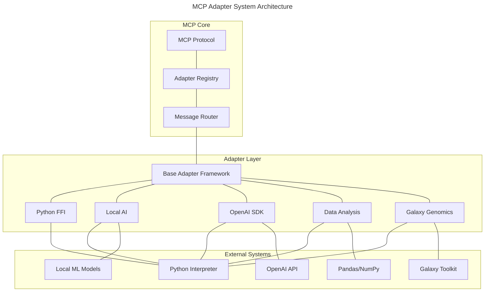

# MCP Adapters Architecture Overview

## Introduction

The Machine Context Protocol (MCP) Adapters system provides a flexible, modular approach to extending MCP functionality with various external systems and languages. This document outlines the high-level architecture of the adapter system, focusing on the design principles, component structure, and integration patterns.

The primary goal of these adapters is to enable seamless integration between the Squirrel MCP core and various external tools, libraries, and systems, particularly those implemented in Python, while maintaining the security, reliability, and performance of the core system.

## Architecture Principles

### 1. Separation of Concerns

Each adapter focuses on a specific integration domain:
- **Python FFI**: Core Python language integration
- **Local AI**: Local machine learning model execution
- **OpenAI Python SDK**: Advanced OpenAI capabilities via Python
- **Data Analysis**: Scientific and statistical analysis tools
- **Galaxy Integration**: Genomic toolkit integration

### 2. Protocol Standardization

- All adapters communicate with the core system using the MCP protocol
- Data formats are standardized across all adapters
- Protocol versioning ensures compatibility between components

### 3. Security by Design

- Adapters run in sandboxed environments
- Resource usage is monitored and limited
- Data access follows the principle of least privilege
- All external code is isolated from the core system

### 4. Modularity and Extensibility

- Adapters can be enabled or disabled independently
- New adapters can be added without modifying existing code
- Common functionality is shared via base libraries

## System Components

### MCP Core Integration



### Component Descriptions

1. **MCP Core Components**
   - **Protocol**: Defines message formats and serialization
   - **Adapter Registry**: Manages and tracks available adapters
   - **Message Router**: Routes messages between core and adapters

2. **Adapter Layer**
   - **Base Adapter Framework**: Shared functionality for all adapters
   - **Python FFI**: Core Python language bridge
   - **Local AI**: Integration with locally run AI models
   - **OpenAI SDK**: OpenAI capabilities via Python SDK
   - **Data Analysis**: Scientific and statistical tools
   - **Galaxy Genomics**: Genomic toolkit integration

3. **External Systems**
   - **Python Interpreter**: Python runtime environment
   - **Local ML Models**: Machine learning models running locally
   - **OpenAI API**: External OpenAI services
   - **Pandas/NumPy**: Data analysis libraries
   - **Galaxy Toolkit**: Genomic analysis toolkit

## Adapter Lifecycle

### 1. Registration

```rust
pub trait MCPAdapter {
    /// Register the adapter with the MCP system
    fn register(&self, registry: &AdapterRegistry) -> Result<AdapterID>;
    
    /// Get adapter metadata
    fn metadata(&self) -> AdapterMetadata;
    
    /// Get adapter capabilities
    fn capabilities(&self) -> Vec<AdapterCapability>;
}
```

### 2. Initialization

```rust
pub trait MCPAdapter {
    /// Initialize the adapter with configuration
    async fn initialize(&mut self, config: AdapterConfig) -> Result<()>;
    
    /// Check if the adapter is ready
    async fn is_ready(&self) -> bool;
}
```

### 3. Message Handling

```rust
pub trait MCPAdapter {
    /// Process a message and return a response
    async fn process_message(
        &self, 
        message: MCPMessage,
    ) -> Result<MCPMessage>;
    
    /// Process a message asynchronously
    async fn process_message_async(
        &self,
        message: MCPMessage,
        callback: Box<dyn Fn(MCPMessage) + Send + Sync>,
    ) -> Result<()>;
}
```

### 4. Shutdown

```rust
pub trait MCPAdapter {
    /// Gracefully shut down the adapter
    async fn shutdown(&self) -> Result<()>;
}
```

## Message Flow

1. **Client to MCP**:
   - Client sends request to MCP
   - MCP determines appropriate adapter
   - MCP routes message to adapter

2. **MCP to Adapter**:
   - Adapter receives MCP message
   - Message is translated to adapter-specific format
   - Processing occurs in adapter environment

3. **Adapter to External System**:
   - Adapter communicates with external system
   - External processing occurs
   - Results are returned to adapter

4. **Adapter to MCP**:
   - Adapter translates results to MCP format
   - MCP receives response
   - MCP routes response to client

## Adapter Configuration

Each adapter has its own configuration schema, but follows this common pattern:

```rust
pub struct AdapterConfig {
    /// Unique identifier for the adapter
    pub id: String,
    
    /// Human-readable name
    pub name: String,
    
    /// Version information
    pub version: semver::Version,
    
    /// Enabled state
    pub enabled: bool,
    
    /// Resource limits
    pub resource_limits: ResourceLimits,
    
    /// Environment variables
    pub environment: HashMap<String, String>,
    
    /// Adapter-specific configuration
    pub specific_config: Value,
}
```

## Error Handling

Adapters implement standardized error handling:

```rust
pub enum AdapterError {
    /// Initialization failure
    InitializationError(String),
    
    /// Configuration error
    ConfigurationError(String),
    
    /// Processing error
    ProcessingError(String),
    
    /// Communication error
    CommunicationError(String),
    
    /// Resource exhausted
    ResourceExhausted(String),
    
    /// Security violation
    SecurityViolation(String),
    
    /// External system error
    ExternalSystemError(String),
}
```

## Resource Management

### Monitored Resources

1. **CPU Usage**: Limited by configuration
2. **Memory Usage**: Hard and soft limits
3. **Storage Access**: Restricted to specific paths
4. **Network Access**: Optional, controlled access
5. **Execution Time**: Timeout limits per operation

### Resource Limits

```rust
pub struct ResourceLimits {
    /// Maximum CPU time (milliseconds)
    pub max_cpu_time: u64,
    
    /// Maximum memory usage (bytes)
    pub max_memory: u64,
    
    /// Maximum storage usage (bytes)
    pub max_storage: u64,
    
    /// Maximum execution time (milliseconds)
    pub max_execution_time: u64,
    
    /// Maximum concurrent operations
    pub max_concurrent_operations: u32,
}
```

## Security Model

### Sandboxing Approaches

1. **Process Isolation**: Run in separate processes
2. **Namespace Isolation**: Linux namespace isolation
3. **Container-based**: Optional Docker/container isolation
4. **Permission Restrictions**: Fine-grained access control

### Access Control

- **Filesystem**: Limited to specific directories
- **Network**: Limited to allowed endpoints
- **System**: Limited to required system calls
- **Resources**: Limited to allocated resources

## Cross-Cutting Concerns

### Logging and Monitoring

- All adapters implement standardized logging
- Performance metrics are collected
- Health status is reported to monitoring system

### Configuration Management

- Adapters support dynamic configuration
- Changes are validated before application
- Configuration history is maintained

### Error Recovery

- Adapters implement retry mechanisms
- Circuit breaker pattern prevents cascading failures
- Health checks ensure system stability

## Implementation Guidelines

1. **Code Organization**:
   - Each adapter lives in its own crate
   - Common functionality in shared libraries
   - Clear separation between adapter and integrated systems

2. **Dependency Management**:
   - Minimal dependencies for core functionality
   - Optional features for extended capabilities
   - Careful version management for external systems

3. **Testing Strategy**:
   - Unit tests for adapter logic
   - Integration tests with mock external systems
   - End-to-end tests with real external systems
   - Performance benchmarks

## Adapter-Specific Documentation

For detailed specifications of individual adapters, see:

- [Python FFI Integration](python-ffi-integration.md)
- [Local AI Integration](local-ai-integration.md)
- [OpenAI Python SDK Integration](openai-python-sdk.md)
- [Data Analysis Adapter](data-analysis-adapter.md)
- [Security and Sandboxing](security-sandboxing.md)

## Implementation Timeline

| Component | Priority | Timeline | Dependencies |
|-----------|----------|----------|--------------|
| Base Adapter Framework | High | 4 weeks | None |
| Python FFI Integration | High | 6 weeks | Base Adapter Framework |
| Local AI Integration | Medium | 8 weeks | Python FFI Integration |
| OpenAI Python SDK | High | 4 weeks | Python FFI Integration |
| Data Analysis Adapter | Medium | 6 weeks | Python FFI Integration |
| Galaxy Integration | Low | 10 weeks | Python FFI Integration |

<version>1.0.0</version> 