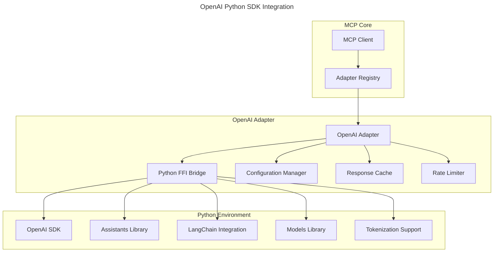

# OpenAI Python SDK Integration Specification

## Overview

The OpenAI Python SDK Integration provides a bridge between the Squirrel MCP system and the official OpenAI Python SDK, enabling advanced AI capabilities through Python while maintaining the security, performance, and reliability of the core Rust system. This specification outlines the design and implementation of the OpenAI Python SDK adapter.

## Rationale

While the Rust ecosystem has libraries for OpenAI API integration, there are several advantages to using the official Python SDK:

1. **Feature Completeness**: The official Python SDK is maintained by OpenAI and has the most complete feature set
2. **Early Access**: New features appear in the Python SDK first before third-party libraries
3. **Advanced Features**: The Python SDK includes advanced features like function calling, tool use, and assistants API
4. **Ecosystem Integration**: Better integration with Python AI ecosystem (LangChain, etc.)
5. **Extensive Documentation**: Comprehensive documentation and examples provided by OpenAI

## Architecture

The OpenAI Python SDK adapter builds on the [Python FFI Integration](python-ffi-integration.md) to provide seamless access to OpenAI's API capabilities.

### Component Diagram



## Implementation Details

### OpenAI SDK Configuration

The adapter will support the following OpenAI SDK configuration options:

```rust
pub struct OpenAIConfig {
    /// API key for OpenAI
    pub api_key: SecretString,
    
    /// Organization ID (optional)
    pub organization_id: Option<String>,
    
    /// API base URL (defaults to https://api.openai.com/v1)
    pub api_base: Option<String>,
    
    /// API version
    pub api_version: Option<String>,
    
    /// API type (e.g., openai, azure)
    pub api_type: ApiType,
    
    /// Default model to use
    pub default_model: String,
    
    /// Request timeout in seconds
    pub timeout: u64,
    
    /// Maximum retries for failed requests
    pub max_retries: u32,
    
    /// Proxy configuration (optional)
    pub proxy: Option<ProxyConfig>,
}

pub enum ApiType {
    /// Standard OpenAI API
    OpenAI,
    
    /// Azure OpenAI Service
    Azure {
        /// Azure deployment name
        deployment_name: String,
        
        /// Azure resource name
        resource_name: String,
    },
}
```

### Python Module Structure

The adapter will set up the following Python module structure:

```
mcp_openai/
├── __init__.py
├── client.py         # OpenAI client wrapper
├── assistants.py     # Assistants API helpers
├── chat.py           # Chat API helpers
├── embeddings.py     # Embeddings API helpers
├── models.py         # Models API helpers
├── tools.py          # Function/tool calling helpers
├── files.py          # File handling utilities
├── streaming.py      # Streaming response helpers
└── utils/
    ├── __init__.py
    ├── tokenizer.py  # Tokenization utilities
    ├── rate_limit.py # Rate limiting utilities
    ├── cache.py      # Caching utilities
    └── logging.py    # Logging utilities
```

### OpenAI Client Implementation

The main client implementation in Python:

```python
# client.py
import os
import openai
from typing import Any, Dict, List, Optional, Union, AsyncIterator

class MCPOpenAIClient:
    """OpenAI client wrapper for MCP."""
    
    def __init__(self, config: Dict[str, Any]):
        """Initialize the OpenAI client with the provided configuration."""
        # Set up configuration
        self.config = config
        
        # Configure the OpenAI client
        openai.api_key = config['api_key']
        
        if 'organization_id' in config and config['organization_id']:
            openai.organization = config['organization_id']
        
        if 'api_base' in config and config['api_base']:
            openai.base_url = config['api_base']
        
        if 'timeout' in config:
            openai.timeout = config['timeout']
        
        if 'max_retries' in config:
            openai.max_retries = config['max_retries']
        
        # Create client instance
        self.client = openai.OpenAI()
        
        # For azure, use AzureOpenAI client
        if config.get('api_type') == 'azure':
            self.client = openai.AzureOpenAI(
                api_key=config['api_key'],
                azure_endpoint=config['api_base'],
                api_version=config.get('api_version', '2023-07-01-preview'),
            )
    
    async def chat_completion(self, 
                             messages: List[Dict[str, Any]], 
                             model: Optional[str] = None,
                             temperature: Optional[float] = None,
                             max_tokens: Optional[int] = None,
                             tools: Optional[List[Dict[str, Any]]] = None,
                             tool_choice: Optional[Dict[str, Any]] = None,
                             **kwargs) -> Dict[str, Any]:
        """Create a chat completion."""
        # Use default model if not specified
        model = model or self.config.get('default_model', 'gpt-3.5-turbo')
        
        # Create completion
        response = await self.client.chat.completions.create(
            model=model,
            messages=messages,
            temperature=temperature,
            max_tokens=max_tokens,
            tools=tools,
            tool_choice=tool_choice,
            **kwargs
        )
        
        # Convert to dictionary
        return response.model_dump()
    
    async def chat_completion_stream(self,
                                    messages: List[Dict[str, Any]],
                                    model: Optional[str] = None,
                                    temperature: Optional[float] = None,
                                    max_tokens: Optional[int] = None,
                                    tools: Optional[List[Dict[str, Any]]] = None,
                                    tool_choice: Optional[Dict[str, Any]] = None,
                                    **kwargs) -> AsyncIterator[Dict[str, Any]]:
        """Create a streaming chat completion."""
        # Use default model if not specified
        model = model or self.config.get('default_model', 'gpt-3.5-turbo')
        
        # Set streaming to True
        kwargs['stream'] = True
        
        # Create streaming completion
        stream = await self.client.chat.completions.create(
            model=model,
            messages=messages,
            temperature=temperature,
            max_tokens=max_tokens,
            tools=tools,
            tool_choice=tool_choice,
            **kwargs
        )
        
        # Yield chunks
        async for chunk in stream:
            yield chunk.model_dump()
    
    async def embeddings(self, 
                        texts: List[str], 
                        model: Optional[str] = None,
                        **kwargs) -> Dict[str, Any]:
        """Create embeddings for the given texts."""
        # Use default embedding model if not specified
        model = model or self.config.get('embedding_model', 'text-embedding-3-small')
        
        # Create embeddings
        response = await self.client.embeddings.create(
            model=model,
            input=texts,
            **kwargs
        )
        
        # Convert to dictionary
        return response.model_dump()
    
    async def list_models(self) -> List[Dict[str, Any]]:
        """List available models."""
        response = await self.client.models.list()
        return [model.model_dump() for model in response.data]
    
    async def create_assistant(self, 
                              name: str,
                              instructions: str,
                              tools: Optional[List[Dict[str, Any]]] = None,
                              model: Optional[str] = None,
                              **kwargs) -> Dict[str, Any]:
        """Create an assistant."""
        # Use default model if not specified
        model = model or self.config.get('default_model', 'gpt-3.5-turbo')
        
        # Create assistant
        response = await self.client.beta.assistants.create(
            name=name,
            instructions=instructions,
            tools=tools or [],
            model=model,
            **kwargs
        )
        
        # Convert to dictionary
        return response.model_dump()
```

### FFI Interface

The Rust side will define an interface for interacting with the OpenAI Python SDK:

```rust
pub struct OpenAIPythonAdapter {
    /// Python FFI adapter
    python_adapter: Arc<PythonFFIAdapter>,
    
    /// Configuration
    config: OpenAIConfig,
    
    /// Module handle
    openai_module: Option<PythonModule>,
    
    /// Client handle
    client: Option<PythonObject>,
    
    /// Cache for responses
    cache: Arc<AsyncCache<CacheKey, CacheValue>>,
    
    /// Rate limiter
    rate_limiter: Arc<RateLimiter>,
}

impl OpenAIPythonAdapter {
    /// Create a new OpenAI Python adapter
    pub async fn new(config: OpenAIConfig) -> Result<Self> {
        // Create Python FFI adapter
        let python_adapter = Arc::new(PythonFFIAdapter::new().await?);
        
        // Create cache and rate limiter
        let cache = Arc::new(AsyncCache::new(1000)); // 1000 items max
        let rate_limiter = Arc::new(RateLimiter::new(
            config.rate_limit_requests,
            config.rate_limit_period,
        ));
        
        Ok(Self {
            python_adapter,
            config,
            openai_module: None,
            client: None,
            cache,
            rate_limiter,
        })
    }
    
    /// Initialize the adapter
    pub async fn initialize(&mut self) -> Result<()> {
        // Import the module
        let module = self.python_adapter
            .import_module("mcp_openai")
            .await?;
        
        // Create client configuration
        let config = json!({
            "api_key": self.config.api_key.expose_secret(),
            "organization_id": self.config.organization_id,
            "api_base": self.config.api_base,
            "api_version": self.config.api_version,
            "api_type": match self.config.api_type {
                ApiType::OpenAI => "openai",
                ApiType::Azure { .. } => "azure",
            },
            "default_model": self.config.default_model,
            "timeout": self.config.timeout,
            "max_retries": self.config.max_retries,
        });
        
        // Create client
        let client = module.call_function(
            "create_client",
            &[config],
            &HashMap::new(),
        ).await?;
        
        // Store module and client
        self.openai_module = Some(module);
        self.client = Some(client);
        
        Ok(())
    }
    
    /// Create a chat completion
    pub async fn chat_completion(
        &self,
        messages: Vec<ChatMessage>,
        options: ChatCompletionOptions,
    ) -> Result<ChatCompletion> {
        // Apply rate limiting
        self.rate_limiter.acquire().await?;
        
        // Check cache if enabled
        if options.use_cache {
            let cache_key = CacheKey::new(&messages, &options);
            if let Some(cached) = self.cache.get(&cache_key).await {
                return Ok(cached.value);
            }
        }
        
        // Convert messages to Python format
        let py_messages = self.messages_to_python(&messages)?;
        
        // Prepare options
        let kwargs = self.options_to_python(&options)?;
        
        // Call Python function
        let client = self.client.as_ref().ok_or(Error::NotInitialized)?;
        let result = client.call_method(
            "chat_completion",
            &[py_messages],
            &kwargs,
        ).await?;
        
        // Parse response
        let completion: ChatCompletion = serde_json::from_value(result)?;
        
        // Update cache if enabled
        if options.use_cache {
            let cache_key = CacheKey::new(&messages, &options);
            let cache_value = CacheValue::new(completion.clone());
            self.cache.insert(cache_key, cache_value).await;
        }
        
        Ok(completion)
    }
    
    /// Create a streaming chat completion
    pub async fn chat_completion_stream(
        &self,
        messages: Vec<ChatMessage>,
        options: ChatCompletionOptions,
    ) -> Result<impl Stream<Item = Result<ChatCompletionChunk>>> {
        // Apply rate limiting
        self.rate_limiter.acquire().await?;
        
        // Convert messages to Python format
        let py_messages = self.messages_to_python(&messages)?;
        
        // Prepare options
        let kwargs = self.options_to_python(&options)?;
        
        // Call Python function
        let client = self.client.as_ref().ok_or(Error::NotInitialized)?;
        let stream = client.call_method(
            "chat_completion_stream",
            &[py_messages],
            &kwargs,
        ).await?;
        
        // Convert to Rust stream
        let rust_stream = stream
            .map(|result| {
                result.map_err(Error::from)
                    .and_then(|chunk| {
                        serde_json::from_value(chunk)
                            .map_err(Error::from)
                    })
            });
        
        Ok(rust_stream)
    }
    
    // Additional methods for embeddings, models, assistants, etc.
}
```

### Assistants API Support

The adapter will include comprehensive support for the OpenAI Assistants API:

```rust
pub struct Assistant {
    /// Assistant ID
    pub id: String,
    
    /// Assistant name
    pub name: String,
    
    /// Assistant description
    pub description: Option<String>,
    
    /// Instructions
    pub instructions: String,
    
    /// Model
    pub model: String,
    
    /// Tools
    pub tools: Vec<AssistantTool>,
    
    /// File IDs
    pub file_ids: Vec<String>,
    
    /// Metadata
    pub metadata: HashMap<String, String>,
}

impl OpenAIPythonAdapter {
    /// Create a new assistant
    pub async fn create_assistant(
        &self,
        name: String,
        instructions: String,
        tools: Option<Vec<AssistantTool>>,
        model: Option<String>,
        metadata: Option<HashMap<String, String>>,
    ) -> Result<Assistant> {
        // Apply rate limiting
        self.rate_limiter.acquire().await?;
        
        // Prepare arguments
        let args = json!({
            "name": name,
            "instructions": instructions,
            "tools": tools.unwrap_or_default(),
            "model": model.unwrap_or_else(|| self.config.default_model.clone()),
            "metadata": metadata.unwrap_or_default(),
        });
        
        // Call Python function
        let client = self.client.as_ref().ok_or(Error::NotInitialized)?;
        let result = client.call_method(
            "create_assistant",
            &[args],
            &HashMap::new(),
        ).await?;
        
        // Parse response
        let assistant: Assistant = serde_json::from_value(result)?;
        
        Ok(assistant)
    }
    
    /// Create a thread
    pub async fn create_thread(
        &self,
        messages: Option<Vec<ThreadMessage>>,
        metadata: Option<HashMap<String, String>>,
    ) -> Result<Thread> {
        // Implementation here
    }
    
    /// Create a message
    pub async fn create_message(
        &self,
        thread_id: String,
        content: String,
        role: MessageRole,
        file_ids: Option<Vec<String>>,
        metadata: Option<HashMap<String, String>>,
    ) -> Result<ThreadMessage> {
        // Implementation here
    }
    
    /// Create a run
    pub async fn create_run(
        &self,
        thread_id: String,
        assistant_id: String,
        instructions: Option<String>,
        tools: Option<Vec<AssistantTool>>,
        metadata: Option<HashMap<String, String>>,
    ) -> Result<Run> {
        // Implementation here
    }
    
    /// Poll a run until it completes
    pub async fn poll_run(
        &self,
        thread_id: String,
        run_id: String,
        interval: Duration,
        timeout: Duration,
    ) -> Result<Run> {
        // Implementation here
    }
    
    /// List messages
    pub async fn list_messages(
        &self,
        thread_id: String,
        limit: Option<u32>,
        order: Option<ListOrder>,
        after: Option<String>,
        before: Option<String>,
    ) -> Result<ListResponse<ThreadMessage>> {
        // Implementation here
    }
}
```

### Function Calling and Tool Use

The adapter will provide special support for function calling and tool use:

```rust
pub struct Tool {
    /// Tool type
    pub type_: ToolType,
    
    /// Function definition
    pub function: Option<FunctionDefinition>,
}

pub enum ToolType {
    /// Function calling
    Function,
    
    /// Code interpreter
    CodeInterpreter,
    
    /// Retrieval
    Retrieval,
}

pub struct FunctionDefinition {
    /// Function name
    pub name: String,
    
    /// Function description
    pub description: Option<String>,
    
    /// Parameters schema in JSON Schema format
    pub parameters: Value,
}

pub struct ToolCall {
    /// Tool call ID
    pub id: String,
    
    /// Tool type
    pub type_: ToolType,
    
    /// Function call (for function type)
    pub function: Option<FunctionCall>,
}

pub struct FunctionCall {
    /// Function name
    pub name: String,
    
    /// Arguments as JSON string
    pub arguments: String,
}

impl OpenAIPythonAdapter {
    /// Execute a tool call
    pub async fn execute_tool_call(
        &self,
        tool_call: ToolCall,
        context: HashMap<String, Value>,
    ) -> Result<Value> {
        // Get function name
        let function_name = match &tool_call.function {
            Some(function) => &function.name,
            None => return Err(Error::InvalidToolCall("Missing function".into())),
        };
        
        // Get function arguments
        let arguments = match &tool_call.function {
            Some(function) => &function.arguments,
            None => return Err(Error::InvalidToolCall("Missing arguments".into())),
        };
        
        // Parse arguments
        let args: Value = serde_json::from_str(arguments)
            .map_err(|e| Error::InvalidToolCall(format!("Invalid arguments: {}", e)))?;
        
        // Prepare Python code
        let code = format!(
            r#"
import json
import mcp_openai.tools as tools

# Load context
context = json.loads({context_json})

# Load arguments
args = json.loads({args_json})

# Execute function
result = tools.{function_name}(args, context)

# Convert to JSON
result_json = json.dumps(result)
            "#,
            context_json = serde_json::to_string(&context)?,
            args_json = serde_json::to_string(&args)?,
            function_name = function_name,
        );
        
        // Execute Python code
        let result = self.python_adapter.execute_code(
            &code,
            None,
            None,
        ).await?;
        
        // Parse result
        let result_json = result.get("result_json")
            .ok_or(Error::PythonExecution("Missing result_json".into()))?
            .as_str()
            .ok_or(Error::PythonExecution("result_json is not a string".into()))?;
        
        let result_value: Value = serde_json::from_str(result_json)
            .map_err(|e| Error::PythonExecution(format!("Invalid JSON: {}", e)))?;
        
        Ok(result_value)
    }
}
```

### Model Management

The adapter will include utilities for managing model parameters and token counting:

```rust
pub struct ModelInfo {
    /// Model ID
    pub id: String,
    
    /// Model name
    pub name: String,
    
    /// Maximum context length
    pub max_context_length: usize,
    
    /// Training data cutoff
    pub training_data_cutoff: Option<String>,
    
    /// Model capabilities
    pub capabilities: ModelCapabilities,
}

pub struct ModelCapabilities {
    /// Supports function calling
    pub function_calling: bool,
    
    /// Supports tool use
    pub tool_use: bool,
    
    /// Supports vision
    pub vision: bool,
    
    /// Supports json mode
    pub json_mode: bool,
}

impl OpenAIPythonAdapter {
    /// List available models
    pub async fn list_models(&self) -> Result<Vec<ModelInfo>> {
        // Apply rate limiting
        self.rate_limiter.acquire().await?;
        
        // Call Python function
        let client = self.client.as_ref().ok_or(Error::NotInitialized)?;
        let result = client.call_method(
            "list_models",
            &[],
            &HashMap::new(),
        ).await?;
        
        // Parse response
        let models: Vec<ModelInfo> = serde_json::from_value(result)?;
        
        Ok(models)
    }
    
    /// Count tokens in a message
    pub async fn count_tokens(
        &self,
        messages: &[ChatMessage],
        model: Option<String>,
    ) -> Result<usize> {
        // Apply rate limiting
        self.rate_limiter.acquire().await?;
        
        // Convert messages to Python format
        let py_messages = self.messages_to_python(messages)?;
        
        // Prepare options
        let kwargs = HashMap::from_iter([(
            "model".to_string(), 
            json!(model.unwrap_or_else(|| self.config.default_model.clone())),
        )]);
        
        // Call Python function
        let client = self.client.as_ref().ok_or(Error::NotInitialized)?;
        let result = client.call_method(
            "count_tokens",
            &[py_messages],
            &kwargs,
        ).await?;
        
        // Parse response
        let count: usize = serde_json::from_value(result)?;
        
        Ok(count)
    }
}
```

## Integration with MCP

The OpenAI Python SDK adapter will integrate with MCP through the standard adapter interface:

```rust
pub struct OpenAIMCPAdapter {
    /// OpenAI Python adapter
    openai_adapter: Arc<OpenAIPythonAdapter>,
    
    /// MCP client
    mcp_client: Arc<MCPClient>,
    
    /// Configuration
    config: OpenAIMCPConfig,
    
    /// Active assistants
    assistants: RwLock<HashMap<String, Assistant>>,
    
    /// Active threads
    threads: RwLock<HashMap<String, Thread>>,
}

impl MCPAdapter for OpenAIMCPAdapter {
    async fn initialize(&mut self, config: AdapterConfig) -> Result<()> {
        // Parse adapter-specific config
        let openai_config: OpenAIConfig = serde_json::from_value(config.specific_config.clone())?;
        
        // Initialize OpenAI adapter
        let mut openai_adapter = OpenAIPythonAdapter::new(openai_config).await?;
        openai_adapter.initialize().await?;
        
        self.openai_adapter = Arc::new(openai_adapter);
        
        Ok(())
    }
    
    async fn process_message(&self, message: MCPMessage) -> Result<MCPMessage> {
        // Extract command from message
        let command: OpenAICommand = serde_json::from_value(message.payload.clone())?;
        
        // Process command
        let result = match command {
            OpenAICommand::ChatCompletion { messages, options } => {
                let completion = self.openai_adapter.chat_completion(messages, options).await?;
                serde_json::to_value(completion)?
            },
            OpenAICommand::CreateAssistant { name, instructions, tools, model, metadata } => {
                let assistant = self.openai_adapter.create_assistant(
                    name, instructions, tools, model, metadata,
                ).await?;
                serde_json::to_value(assistant)?
            },
            // Handle other commands...
        };
        
        // Create response
        let response = MCPMessage {
            id: Uuid::new_v4().to_string(),
            correlation_id: message.id,
            source: message.destination,
            destination: message.source,
            message_type: "openai.response".to_string(),
            payload: result,
            metadata: HashMap::new(),
            timestamp: Utc::now(),
        };
        
        Ok(response)
    }
    
    async fn shutdown(&self) -> Result<()> {
        // Clean up resources
        Ok(())
    }
}
```

## Security Considerations

The OpenAI Python SDK adapter inherits the security model from the Python FFI integration. Key additional considerations include:

1. **API Key Management**: 
   - API keys are stored securely using `SecretString`
   - Keys are never logged or exposed in plaintext
   - Keys are only passed to the Python interpreter when needed

2. **Request Validation**:
   - All requests are validated before being sent to OpenAI
   - Input sanitization prevents injection attacks
   - Output validation ensures proper response handling

3. **Rate Limiting**:
   - Built-in rate limiting prevents abuse of the OpenAI API
   - Configurable limits respect OpenAI's usage policies
   - Circuit breaker prevents cascading failures during API outages

4. **Cost Management**:
   - Token counting provides cost estimates before sending requests
   - Budget limits can be enforced at the adapter level
   - Usage tracking and reporting

5. **Content Filtering**:
   - Optional content filtering for sensitive information
   - PII detection and removal
   - Configurable content policy enforcement

## Performance Considerations

1. **Caching**:
   - Response caching reduces duplicate API calls
   - Configurable cache TTL and size
   - Cache invalidation on model or parameter changes

2. **Batching**:
   - Request batching for embeddings and similar operations
   - Automatic batching of similar requests to reduce API calls
   - Configurable batch size and timing

3. **Streaming Optimization**:
   - Efficient streaming response handling
   - Proper backpressure handling
   - Cancelable requests to prevent wasted resources

4. **Resource Management**:
   - Proper cleanup of resources
   - Monitoring of usage patterns
   - Adaptive rate limiting based on response times

## Usage Examples

### Chat Completion

```rust
// Initialize adapter
let mut adapter = OpenAIMCPAdapter::new(config).await?;

// Create a chat completion
let completion = adapter.chat_completion(
    vec![
        ChatMessage {
            role: MessageRole::System,
            content: "You are a helpful assistant.".to_string(),
            name: None,
            tool_calls: None,
        },
        ChatMessage {
            role: MessageRole::User,
            content: "Tell me about Rust programming.".to_string(),
            name: None,
            tool_calls: None,
        },
    ],
    ChatCompletionOptions {
        model: Some("gpt-4-turbo".to_string()),
        temperature: Some(0.7),
        max_tokens: Some(1000),
        ..Default::default()
    },
).await?;

println!("Completion: {}", completion.choices[0].message.content);
```

### Function Calling

```rust
// Define a function
let functions = vec![
    FunctionDefinition {
        name: "get_weather".to_string(),
        description: Some("Get the current weather for a location".to_string()),
        parameters: json!({
            "type": "object",
            "properties": {
                "location": {
                    "type": "string",
                    "description": "The location to get weather for, e.g. 'San Francisco, CA'"
                },
                "unit": {
                    "type": "string",
                    "enum": ["celsius", "fahrenheit"],
                    "description": "The unit of temperature"
                }
            },
            "required": ["location"]
        }),
    },
];

// Create a chat completion with function calling
let completion = adapter.chat_completion(
    vec![
        ChatMessage {
            role: MessageRole::System,
            content: "You are a helpful assistant.".to_string(),
            name: None,
            tool_calls: None,
        },
        ChatMessage {
            role: MessageRole::User,
            content: "What's the weather like in San Francisco?".to_string(),
            name: None,
            tool_calls: None,
        },
    ],
    ChatCompletionOptions {
        model: Some("gpt-4-turbo".to_string()),
        tools: Some(vec![
            Tool {
                type_: ToolType::Function,
                function: Some(functions[0].clone()),
            },
        ]),
        tool_choice: Some(ToolChoice::Auto),
        ..Default::default()
    },
).await?;

// Check if there's a tool call
if let Some(tool_calls) = &completion.choices[0].message.tool_calls {
    for tool_call in tool_calls {
        // Execute the tool call
        let result = adapter.execute_tool_call(
            tool_call.clone(),
            HashMap::new(), // Context
        ).await?;
        
        // Send the result back to continue the conversation
        let completion = adapter.chat_completion(
            vec![
                ChatMessage {
                    role: MessageRole::System,
                    content: "You are a helpful assistant.".to_string(),
                    name: None,
                    tool_calls: None,
                },
                ChatMessage {
                    role: MessageRole::User,
                    content: "What's the weather like in San Francisco?".to_string(),
                    name: None,
                    tool_calls: None,
                },
                ChatMessage {
                    role: MessageRole::Assistant,
                    content: String::new(),
                    name: None,
                    tool_calls: Some(tool_calls.clone()),
                },
                ChatMessage {
                    role: MessageRole::Tool,
                    content: serde_json::to_string(&result)?,
                    name: Some(tool_call.function.as_ref().unwrap().name.clone()),
                    tool_calls: None,
                },
            ],
            ChatCompletionOptions {
                model: Some("gpt-4-turbo".to_string()),
                ..Default::default()
            },
        ).await?;
        
        println!("Final response: {}", completion.choices[0].message.content);
    }
}
```

### Assistant API

```rust
// Create an assistant
let assistant = adapter.create_assistant(
    "Research Assistant".to_string(),
    "You are a research assistant that helps with finding and summarizing information.".to_string(),
    Some(vec![
        AssistantTool {
            type_: ToolType::Retrieval,
            function: None,
        },
        AssistantTool {
            type_: ToolType::CodeInterpreter,
            function: None,
        },
    ]),
    Some("gpt-4-turbo".to_string()),
    None,
).await?;

// Create a thread
let thread = adapter.create_thread(None, None).await?;

// Add a message
let message = adapter.create_message(
    thread.id.clone(),
    "I need a summary of the latest research on quantum computing.".to_string(),
    MessageRole::User,
    None,
    None,
).await?;

// Create a run
let run = adapter.create_run(
    thread.id.clone(),
    assistant.id.clone(),
    None,
    None,
    None,
).await?;

// Poll until complete
let completed_run = adapter.poll_run(
    thread.id.clone(),
    run.id.clone(),
    Duration::from_secs(1),
    Duration::from_secs(300),
).await?;

// Get the messages
let messages = adapter.list_messages(
    thread.id.clone(),
    Some(10),
    Some(ListOrder::Descending),
    None,
    None,
).await?;

// Print the assistant's response
for message in messages.data {
    if message.role == MessageRole::Assistant {
        println!("Assistant: {}", message.content);
    }
}
```

## Implementation Timeline

| Phase | Description | Timeline | Dependencies |
|-------|-------------|----------|--------------|
| SDK Integration | Implement basic Python SDK integration | 2 weeks | Python FFI Integration |
| Chat Completions | Implement chat completion API | 1 week | SDK Integration |
| Embeddings API | Implement embeddings API | 1 week | SDK Integration |
| Assistants API | Implement assistants API | 2 weeks | Chat Completions |
| Tool Support | Implement function calling and tools | 1 week | Chat Completions |
| Performance Optimizations | Implement caching and batching | 1 week | All previous phases |
| Security Controls | Implement security features | 1 week | All previous phases |
| Testing & Validation | Comprehensive testing | 2 weeks | All previous phases |

<version>1.0.0</version> 