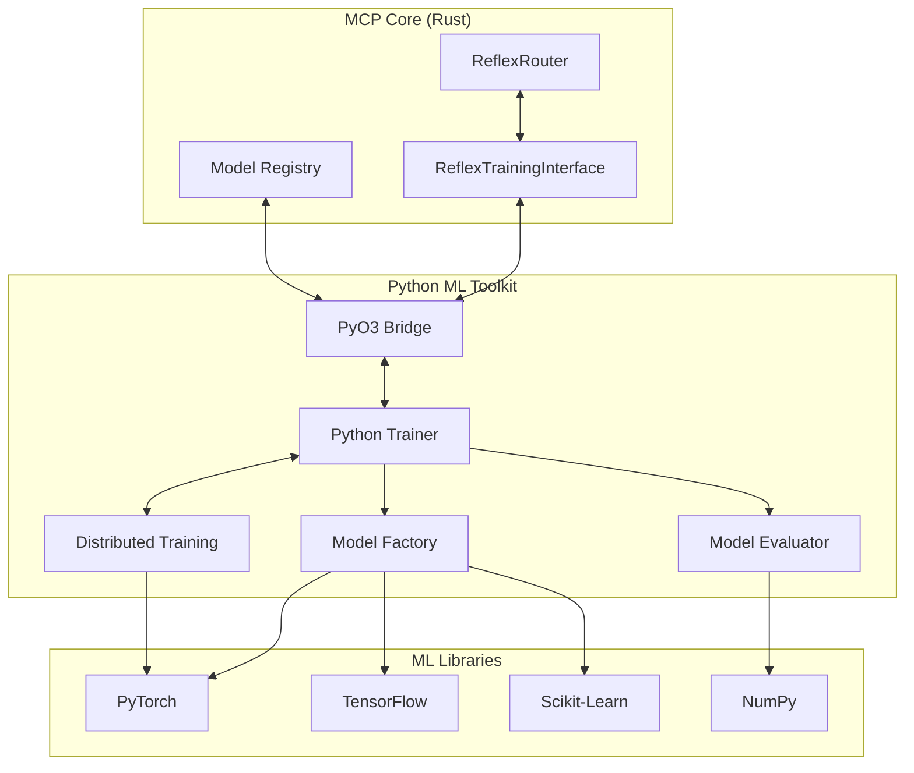
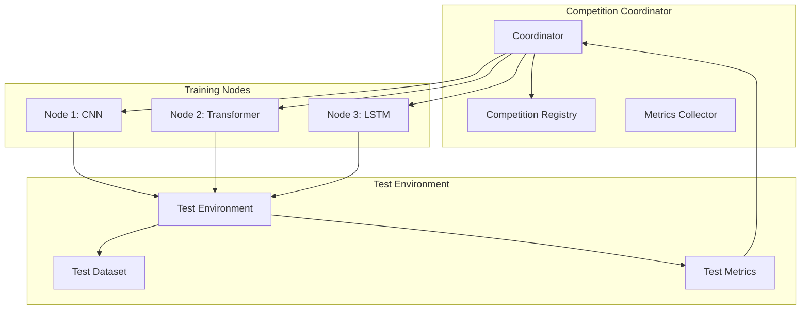
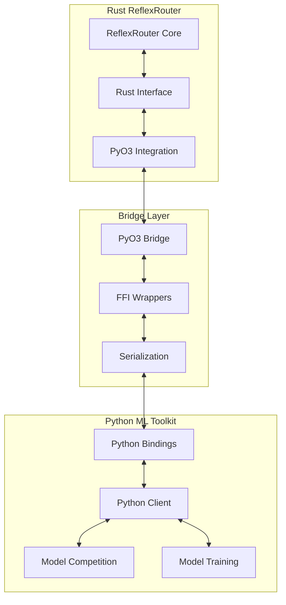
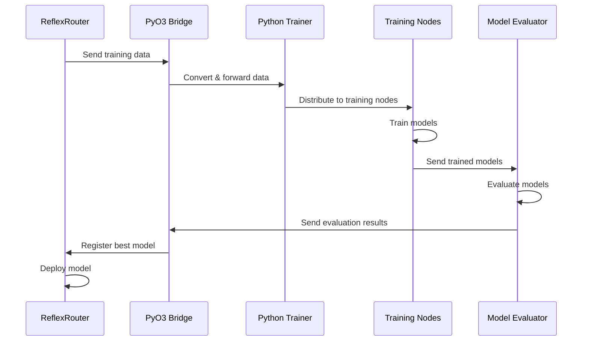
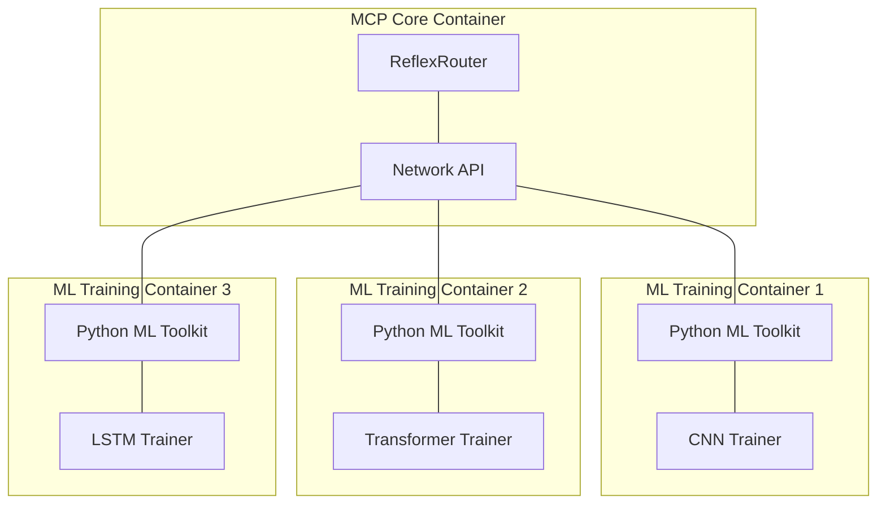

# Python ML Toolkit for ReflexRouter

## Introduction

The Python ML Toolkit provides a specialized adapter between the Rust-based ReflexRouter in the MCP core and Python machine learning libraries. This adapter enables the development, training, and evaluation of neural network models for the ReflexRouter's pattern matching and decision-making capabilities in a language optimized for machine learning while maintaining the performance benefits of the Rust core implementation.

### GPU Resource Management

For optimal utilization of commercial GPUs (RTX 5090, 3090), we are evaluating integration with select components from the [InferX platform](https://github.com/inferx-net/inferx). As detailed in the [InferX evaluation](../pyo3/inferx-evaluation.md), this would provide:

- Efficient GPU slicing to run multiple models concurrently on a single GPU
- Fast model loading using snapshot-based techniques
- Improved GPU utilization (targeting 80%+ vs. typical 40-60%)
- Higher model deployment density

These capabilities will enhance the ML Toolkit's ability to manage multiple concurrent model trainings and evaluations efficiently.

## Objectives

- Provide a Python interface to train and evolve neural network models for the ReflexRouter
- Enable seamless integration between Python ML frameworks and the Rust MCP core
- Facilitate distributed training and evaluation of models across multiple nodes
- Leverage PyTorch, TensorFlow, and other Python ML libraries for advanced pattern recognition
- Maintain compatibility with the ReflexRouter's core architecture and protocols

## Architecture

### Component Overview



### Key Components

#### 1. PyO3 Bridge

The PyO3 Bridge serves as the interface layer between the Rust-based MCP core and the Python ML toolkit.

```python
# Python interface exposed via PyO3
class ReflexRouterBridge:
    def get_training_data(self) -> Dict[str, Any]:
        """Retrieve training data from the ReflexRouter"""
        # Implemented in Rust, exposed to Python via PyO3
        pass
        
    def upload_model(self, model_data: bytes, metadata: Dict[str, Any]) -> str:
        """Upload a trained model to the ReflexRouter"""
        # Implemented in Rust, exposed to Python via PyO3
        pass
        
    def evaluate_model_performance(self, model_id: str) -> Dict[str, float]:
        """Get performance metrics for a specific model"""
        # Implemented in Rust, exposed to Python via PyO3
        pass
```

#### 2. Python Trainer

The Python Trainer coordinates the training process for ReflexRouter models.

```python
class ReflexRouterTrainer:
    def __init__(self, bridge: ReflexRouterBridge, config: Dict[str, Any]):
        self.bridge = bridge
        self.config = config
        self.model_factory = ModelFactory(config)
        self.evaluator = ModelEvaluator(bridge)
        
    def train_new_model(self, model_type: str, hyperparams: Dict[str, Any] = None) -> str:
        """Train a new model and return the model ID"""
        # Get training data from the bridge
        training_data = self.bridge.get_training_data()
        
        # Create and train the model
        model = self.model_factory.create_model(model_type, hyperparams)
        model.train(training_data)
        
        # Serialize and upload the model
        model_bytes = model.serialize()
        model_id = self.bridge.upload_model(model_bytes, model.metadata)
        
        return model_id
        
    def run_distributed_training(self, nodes: List[str], model_type: str) -> str:
        """Coordinate distributed training across multiple nodes"""
        dist_trainer = DistributedTrainer(self.bridge, nodes)
        return dist_trainer.train_model(model_type)
```

#### 3. Model Factory

The Model Factory creates various types of neural network models suited for different pattern matching tasks.

```python
class ModelFactory:
    def __init__(self, config: Dict[str, Any]):
        self.config = config
        
    def create_model(self, model_type: str, hyperparams: Dict[str, Any] = None) -> BaseModel:
        """Create a model of the specified type with given hyperparameters"""
        if model_type == "cnn":
            return CNNModel(hyperparams or {})
        elif model_type == "transformer":
            return TransformerModel(hyperparams or {})
        elif model_type == "lstm":
            return LSTMModel(hyperparams or {})
        else:
            raise ValueError(f"Unknown model type: {model_type}")
```

#### 4. Model Evaluator

The Model Evaluator assesses model performance and provides metrics for model selection.

```python
class ModelEvaluator:
    def __init__(self, bridge: ReflexRouterBridge):
        self.bridge = bridge
        
    def evaluate_model(self, model: BaseModel, test_data: Dict[str, Any] = None) -> Dict[str, float]:
        """Evaluate a model's performance on test data"""
        if test_data is None:
            # Use test data from the bridge if none provided
            test_data = self.bridge.get_training_data(split="test")
            
        # Run evaluation
        metrics = model.evaluate(test_data)
        return metrics
        
    def compare_models(self, model_ids: List[str]) -> Dict[str, Any]:
        """Compare performance of multiple models"""
        results = {}
        for model_id in model_ids:
            results[model_id] = self.bridge.evaluate_model_performance(model_id)
        return results
```

#### 5. Distributed Training

The Distributed Training component enables training and evaluation across multiple nodes.

```python
class DistributedTrainer:
    def __init__(self, bridge: ReflexRouterBridge, nodes: List[str]):
        self.bridge = bridge
        self.nodes = nodes
        
    def train_model(self, model_type: str) -> str:
        """Train a model across multiple nodes and return the best model ID"""
        # Initialize distributed training environment
        self._setup_distributed_env()
        
        # Distribute training data
        training_data = self.bridge.get_training_data()
        shards = self._create_data_shards(training_data, len(self.nodes))
        
        # Train models on each node
        model_ids = self._train_on_nodes(model_type, shards)
        
        # Evaluate and select best model
        best_model_id = self._select_best_model(model_ids)
        
        return best_model_id
```

## Multi-Node Competition

The Python ML Toolkit implements a distributed model competition system that works in conjunction with the ReflexRouter's multi-node training infrastructure. This system allows multiple nodes to train different model architectures or use different hyperparameters, then compete to determine the most effective model.

### Competition Architecture



### Competition Implementation

```python
class ModelCompetition:
    def __init__(self, bridge: ReflexRouterBridge, config: Dict[str, Any]):
        self.bridge = bridge
        self.config = config
        self.nodes = []
        self.status = CompetitionStatus.IDLE
        self.results = {}
        
    def register_node(self, node_url: str, model_type: str, hyperparams: Dict[str, Any] = None):
        """Register a node for the competition"""
        self.nodes.append({
            "url": node_url,
            "model_type": model_type,
            "hyperparams": hyperparams or {},
            "status": NodeStatus.REGISTERED
        })
        
    def start_competition(self) -> str:
        """Start the competition and return a competition ID"""
        if len(self.nodes) < 2:
            raise ValueError("Need at least 2 nodes for a competition")
            
        # Initialize competition
        competition_id = str(uuid.uuid4())
        self.status = CompetitionStatus.PREPARING
        
        # Prepare dataset
        training_data = self.bridge.get_training_data(split="train")
        validation_data = self.bridge.get_training_data(split="validation")
        test_data = self.bridge.get_training_data(split="test")
        
        # Distribute data to nodes
        for node in self.nodes:
            self._distribute_data_to_node(
                node["url"], 
                training_data, 
                validation_data
            )
            node["status"] = NodeStatus.TRAINING
            
        self.status = CompetitionStatus.TRAINING
        
        # Start training on all nodes asynchronously
        training_tasks = []
        for node in self.nodes:
            task = asyncio.create_task(
                self._train_model_on_node(
                    node["url"], 
                    node["model_type"], 
                    node["hyperparams"]
                )
            )
            training_tasks.append(task)
            
        # Wait for all training to complete
        asyncio.gather(*training_tasks)
        
        # Evaluate models
        self.status = CompetitionStatus.EVALUATING
        for node in self.nodes:
            model_id = node["model_id"]
            metrics = self._evaluate_model(model_id, test_data)
            self.results[model_id] = metrics
            node["metrics"] = metrics
            node["status"] = NodeStatus.EVALUATED
            
        # Select winner
        self.status = CompetitionStatus.SELECTING
        winning_model_id = self._select_winner()
        
        # Register competition results
        self.bridge.register_competition_results(
            competition_id=competition_id,
            results=self.results,
            winning_model_id=winning_model_id
        )
        
        self.status = CompetitionStatus.COMPLETED
        return competition_id
        
    async def _train_model_on_node(self, node_url: str, model_type: str, hyperparams: Dict[str, Any]) -> str:
        """Train a model on a specific node"""
        # Implementation to train model on remote node
        # Returns model_id
        pass
        
    def _evaluate_model(self, model_id: str, test_data: Dict[str, Any]) -> Dict[str, float]:
        """Evaluate a model's performance"""
        # Implementation to evaluate model
        pass
        
    def _select_winner(self) -> str:
        """Select the winning model based on metrics"""
        # Implementation to select best model
        pass
        
    def get_status(self, competition_id: str = None) -> Dict[str, Any]:
        """Get the current status of the competition"""
        return {
            "status": self.status.value,
            "nodes": [
                {
                    "url": node["url"],
                    "model_type": node["model_type"],
                    "status": node["status"].value,
                    "metrics": node.get("metrics", {})
                }
                for node in self.nodes
            ],
            "winning_model_id": self.winning_model_id if self.status == CompetitionStatus.COMPLETED else None
        }
```

### Model Templates

The Python ML Toolkit provides optimized model templates that can be used as starting points for training:

```python
class BaseModelTemplate:
    """Base class for all model templates"""
    def __init__(self, hyperparams: Dict[str, Any]):
        self.hyperparams = hyperparams
        self.model = None
        
    def build(self):
        """Build the model architecture"""
        raise NotImplementedError
        
    def train(self, training_data: Dict[str, Any], validation_data: Dict[str, Any] = None):
        """Train the model using the provided data"""
        raise NotImplementedError
        
    def evaluate(self, test_data: Dict[str, Any]) -> Dict[str, float]:
        """Evaluate the model and return metrics"""
        raise NotImplementedError
        
    def serialize(self) -> bytes:
        """Serialize the model to a byte array"""
        raise NotImplementedError
        
    def deserialize(self, data: bytes):
        """Load a model from a byte array"""
        raise NotImplementedError

# CNN-based model template for pattern matching
class CNNPatternMatcher(BaseModelTemplate):
    def build(self):
        """Build CNN architecture for pattern matching"""
        import tensorflow as tf
        
        input_shape = self.hyperparams.get("input_shape", [64])
        filters = self.hyperparams.get("filters", [32, 64, 128])
        dense_units = self.hyperparams.get("dense_units", [128, 64])
        
        model = tf.keras.Sequential()
        model.add(tf.keras.layers.Reshape(input_shape + [1], input_shape=input_shape))
        
        # Convolutional layers
        for f in filters:
            model.add(tf.keras.layers.Conv1D(f, 3, activation='relu'))
            model.add(tf.keras.layers.MaxPooling1D(2))
            
        model.add(tf.keras.layers.Flatten())
        
        # Dense layers
        for units in dense_units:
            model.add(tf.keras.layers.Dense(units, activation='relu'))
            model.add(tf.keras.layers.Dropout(0.2))
            
        # Output layer
        model.add(tf.keras.layers.Dense(self.hyperparams.get("num_classes", 10), activation='softmax'))
        
        model.compile(
            optimizer=tf.keras.optimizers.Adam(learning_rate=self.hyperparams.get("learning_rate", 0.001)),
            loss=self.hyperparams.get("loss", "categorical_crossentropy"),
            metrics=self.hyperparams.get("metrics", ["accuracy"])
        )
        
        self.model = model
        return model

# Transformer-based model template
class TransformerPatternMatcher(BaseModelTemplate):
    def build(self):
        """Build Transformer architecture for pattern matching"""
        import tensorflow as tf
        
        # Implementation for transformer model
        # ...
```

## Enhanced PyO3 Bridge

The PyO3 Bridge is enhanced to support the full range of operations required for multi-node model competition and training. This includes capabilities for data exchange, model registration, and competition coordination.

```python
class ReflexRouterBridge:
    def __init__(self, router_url: str = None):
        """Initialize the bridge to the Rust ReflexRouter"""
        # If router_url is None, connect to local instance via PyO3
        # Otherwise, connect to remote instance via gRPC
        pass
        
    def get_training_data(self, split: str = "all", limit: int = 1000) -> Dict[str, Any]:
        """Retrieve training data from the ReflexRouter
        
        Args:
            split: Data split to retrieve ("train", "validation", "test", or "all")
            limit: Maximum number of samples to retrieve
            
        Returns:
            Dictionary containing features and labels
        """
        pass
        
    def upload_model(self, model_data: bytes, metadata: Dict[str, Any]) -> str:
        """Upload a trained model to the ReflexRouter
        
        Args:
            model_data: Serialized model bytes
            metadata: Model metadata including architecture, hyperparameters, etc.
            
        Returns:
            Model ID for the uploaded model
        """
        pass
        
    def evaluate_model_performance(self, model_id: str, test_data: Dict[str, Any] = None) -> Dict[str, float]:
        """Get performance metrics for a specific model
        
        Args:
            model_id: ID of the model to evaluate
            test_data: Optional test data to use (if None, uses ReflexRouter's test data)
            
        Returns:
            Dictionary of performance metrics
        """
        pass
        
    def register_competition_results(self, competition_id: str, results: Dict[str, Dict[str, float]], winning_model_id: str) -> bool:
        """Register the results of a model competition
        
        Args:
            competition_id: ID of the competition
            results: Dictionary mapping model IDs to their performance metrics
            winning_model_id: ID of the winning model
            
        Returns:
            True if successfully registered
        """
        pass
        
    def deploy_model(self, model_id: str) -> bool:
        """Deploy a model to production
        
        Args:
            model_id: ID of the model to deploy
            
        Returns:
            True if successfully deployed
        """
        pass
        
    def get_routing_statistics(self, time_range: Tuple[datetime, datetime] = None) -> Dict[str, Any]:
        """Get routing statistics from the ReflexRouter
        
        Args:
            time_range: Optional time range to limit the statistics
            
        Returns:
            Dictionary of routing statistics
        """
        pass
```

### Bidirectional Integration

The enhanced PyO3 bridge provides a bidirectional integration between the Rust-based ReflexRouter and the Python ML toolkit:



This bidirectional integration enables:

1. Rust code to call Python ML functions through PyO3
2. Python code to call Rust router functions through PyO3
3. Seamless data transfer between the two languages
4. Efficient model training and deployment workflow

## Data Flow



## Implementation Plan

### Phase 1: Basic Integration (2 weeks)

1. Implement the PyO3 bridge interface in the ReflexRouter
2. Create the Python package structure for the ML toolkit
3. Implement basic model training and evaluation
4. Establish data conversion between Rust and Python

### Phase 2: Advanced Models (3 weeks)

1. Implement CNN, Transformer, and LSTM models for pattern matching
2. Add hyperparameter optimization
3. Implement model serialization and versioning
4. Create comprehensive evaluation metrics

### Phase 3: Distributed Training (4 weeks)

1. Implement multi-node training coordination
2. Add data sharding and distribution
3. Implement model competition and selection
4. Create monitoring and visualization tools

### Phase 4: Integration & Testing (3 weeks)

1. Integrate with ReflexRouter core
2. Implement end-to-end testing
3. Performance optimization
4. Documentation and examples

## Deployment Architecture

For production deployments, the Python ML Toolkit can be configured in two modes:

### 1. Embedded Mode

The toolkit is embedded directly in the Rust ReflexRouter process using PyO3. This provides low-overhead integration but may impact performance of the routing system during training.

### 2. Distributed Mode

The toolkit runs in separate processes or containers that communicate with the ReflexRouter via a network API. This provides better isolation and scalability.



## Performance Considerations

- Minimize data transfer between Rust and Python
- Use efficient serialization formats for model exchange
- Consider using NumPy arrays for zero-copy memory sharing
- Cache training data appropriately to reduce redundant transfers
- Profile and optimize the PyO3 bridge for minimal overhead
- Use batched operations for large data transfers
- Implement appropriate thread and process isolation for training

## Testing Requirements

1. Unit tests for individual components
2. Integration tests between Rust and Python components
3. Performance benchmarks for model training and inference
4. Distributed training tests with simulated nodes
5. Compatibility tests with different Python ML frameworks

## Future Enhancements

1. Support for additional ML frameworks
2. Online learning and continuous model improvement
3. Federated learning across multiple instances
4. Advanced visualization and debugging tools
5. Model compression and optimization for deployment
6. AutoML capabilities for automatic model selection and tuning 