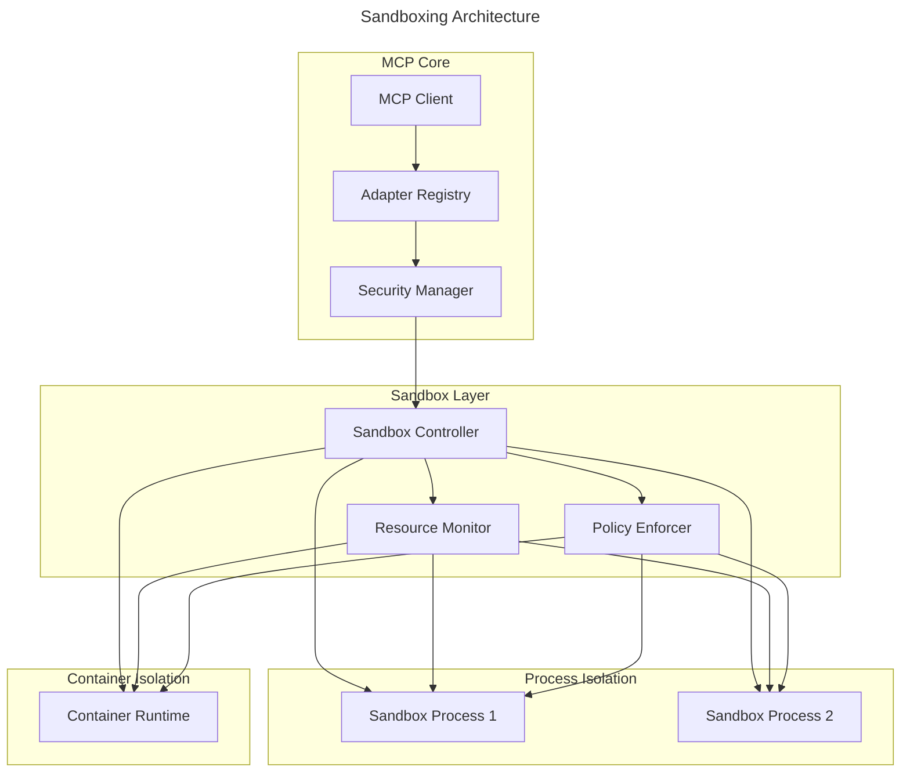

# Security and Sandboxing Specification

## Overview

This specification outlines the security model and sandboxing requirements for the MCP adapter system, with a focus on Python FFI integration. It defines principles, mechanisms, and implementation guidelines to ensure that external code execution occurs in a secure, isolated environment with appropriate resource constraints.

## Security Principles

1. **Defense in Depth**: Multiple layers of security controls
2. **Principle of Least Privilege**: Minimal access rights
3. **Isolation**: Strong boundaries between components
4. **Secure by Default**: Conservative security posture
5. **Fail Securely**: Graceful handling of failures

## Sandboxing Architecture



## Implementation Requirements

### Process Isolation

```rust
pub struct SandboxProcess {
    /// Process handle
    process: Child,
    
    /// Communication channel
    channel: Channel,
    
    /// Resource usage
    resources: ResourceUsage,
    
    /// Process state
    state: ProcessState,
}

impl SandboxProcess {
    /// Create a new sandboxed process
    pub fn new(config: SandboxConfig) -> Result<Self> {
        // Configure process with isolation
        let mut cmd = Command::new(&config.executable);
        
        // Set up resource limits
        #[cfg(target_family = "unix")]
        {
            cmd.rlimit_cpu(config.limits.cpu_time)
               .rlimit_memory(config.limits.memory)
               .rlimit_files(config.limits.files);
        }
        
        // Set up security features
        #[cfg(target_os = "linux")]
        {
            cmd.namespaces(vec![Namespace::User, Namespace::Pid, Namespace::Net])
               .seccomp_filter(config.seccomp_policy)
               .capabilities(config.capabilities);
        }
        
        // Set up environment variables
        cmd.env_clear()
           .envs(config.environment);
        
        // Launch process
        let process = cmd.spawn()?;
        
        // Set up communication channel
        let channel = Channel::new(process.stdin.take(), process.stdout.take())?;
        
        Ok(Self {
            process,
            channel,
            resources: ResourceUsage::default(),
            state: ProcessState::Running,
        })
    }
}
```

### Resource Monitoring

```rust
pub struct ResourceMonitor {
    /// Monitored processes
    processes: HashMap<ProcessId, ProcessStats>,
    
    /// Resource limits
    limits: ResourceLimits,
    
    /// Monitoring interval
    interval: Duration,
    
    /// Shutdown signal
    shutdown: watch::Receiver<bool>,
}

impl ResourceMonitor {
    /// Start monitoring resources
    pub async fn start(&mut self) -> Result<()> {
        let mut interval = tokio::time::interval(self.interval);
        
        loop {
            tokio::select! {
                _ = interval.tick() => {
                    self.update_stats().await?;
                    self.enforce_limits().await?;
                }
                _ = self.shutdown.changed() => {
                    break;
                }
            }
        }
        
        Ok(())
    }
    
    /// Update resource usage statistics
    async fn update_stats(&mut self) -> Result<()> {
        for (id, stats) in &mut self.processes {
            // Get current resource usage
            let usage = self.get_process_stats(*id).await?;
            
            // Update stats
            stats.update(usage);
            
            // Check for terminated processes
            if !self.is_process_alive(*id).await? {
                stats.state = ProcessState::Terminated;
            }
        }
        
        Ok(())
    }
    
    /// Enforce resource limits
    async fn enforce_limits(&mut self) -> Result<()> {
        for (id, stats) in &self.processes {
            // Check memory usage
            if stats.memory > self.limits.memory {
                self.terminate_process(*id).await?;
                continue;
            }
            
            // Check CPU usage
            if stats.cpu_time > self.limits.cpu_time {
                self.terminate_process(*id).await?;
                continue;
            }
            
            // Check execution time
            if stats.elapsed_time > self.limits.execution_time {
                self.terminate_process(*id).await?;
                continue;
            }
        }
        
        Ok(())
    }
}
```

### Security Policies

```rust
pub struct SecurityPolicy {
    /// Filesystem access policy
    filesystem: FilesystemPolicy,
    
    /// Network access policy
    network: NetworkPolicy,
    
    /// System call policy
    syscalls: SyscallPolicy,
    
    /// Process execution policy
    execution: ExecutionPolicy,
}

pub enum FilesystemPolicy {
    /// No filesystem access
    None,
    
    /// Read-only access to specific paths
    ReadOnly(Vec<PathBuf>),
    
    /// Read-write access to specific paths
    ReadWrite(Vec<PathBuf>),
}

pub enum NetworkPolicy {
    /// No network access
    None,
    
    /// Access to specific hosts and ports
    Limited(Vec<NetworkAccess>),
    
    /// Full network access
    Full,
}

pub struct NetworkAccess {
    /// Host or IP address
    pub host: String,
    
    /// Port or port range
    pub port: PortSpec,
    
    /// Protocol (TCP or UDP)
    pub protocol: Protocol,
}

pub enum SyscallPolicy {
    /// Allow specific syscalls, deny all others
    Allowlist(Vec<Syscall>),
    
    /// Deny specific syscalls, allow all others
    Denylist(Vec<Syscall>),
}
```

## Python-Specific Security Measures

### Python Interpreter Sandboxing

1. **Module Restrictions**:
   ```python
   import sys
   
   # Only allow specific modules
   allowed_modules = {
       'json', 'math', 'datetime', 'typing',
       'collections', 're', 'uuid', 'hashlib',
       # Additional allowed modules...
   }
   
   # Override sys.modules to block imports
   original_import = __builtins__.__import__
   
   def secure_import(name, *args, **kwargs):
       if name in allowed_modules:
           return original_import(name, *args, **kwargs)
       raise ImportError(f"Module {name} is not allowed")
   
   __builtins__.__import__ = secure_import
   ```

2. **Filesystem Restrictions**:
   ```python
   import os
   import io
   
   # Only allow specific paths
   allowed_paths = {
       '/tmp/sandbox',
       '/data/read_only',
   }
   
   # Override open function
   original_open = open
   
   def secure_open(file, *args, **kwargs):
       file_path = os.path.abspath(file)
       
       # Check if path is allowed
       if not any(file_path.startswith(path) for path in allowed_paths):
           raise PermissionError(f"Access to {file_path} is not allowed")
       
       return original_open(file, *args, **kwargs)
   
   # Replace built-in open
   __builtins__.open = secure_open
   ```

3. **Code Validation**:
   ```python
   import ast
   
   def validate_code(code_str):
       """Validate Python code for security issues."""
       try:
           # Parse the code
           tree = ast.parse(code_str)
           
           # Check for suspicious patterns
           for node in ast.walk(tree):
               # Disallow exec and eval
               if isinstance(node, ast.Call):
                   if isinstance(node.func, ast.Name):
                       if node.func.id in ('exec', 'eval', 'compile'):
                           raise ValueError(f"Use of {node.func.id}() is not allowed")
               
               # Disallow __import__
               if isinstance(node, ast.Call):
                   if isinstance(node.func, ast.Name) and node.func.id == '__import__':
                       raise ValueError("Use of __import__() is not allowed")
               
               # Check for other dangerous patterns...
       
       except SyntaxError as e:
           raise ValueError(f"Syntax error: {e}")
       
       return True
   ```

## Container-Based Isolation

For stronger isolation, a container-based approach can be used:

```rust
pub struct ContainerSandbox {
    /// Container ID
    container_id: String,
    
    /// Communication channel
    channel: Channel,
    
    /// Resource usage
    resources: ResourceUsage,
    
    /// Container state
    state: ContainerState,
}

impl ContainerSandbox {
    /// Create a new container sandbox
    pub async fn new(config: ContainerConfig) -> Result<Self> {
        // Prepare container configuration
        let container_config = json!({
            "Image": config.image,
            "Cmd": config.command,
            "Env": config.environment,
            "WorkingDir": config.working_dir,
            "HostConfig": {
                "Memory": config.limits.memory,
                "CpuPeriod": 100000,
                "CpuQuota": config.limits.cpu_percent * 1000,
                "ReadonlyRootfs": true,
                "NetworkMode": "none",
                "Binds": config.volumes,
                "SecurityOpt": ["no-new-privileges"],
                "CapDrop": ["ALL"],
            }
        });
        
        // Create container
        let container_id = self.docker_api.create_container(container_config).await?;
        
        // Start container
        self.docker_api.start_container(&container_id).await?;
        
        // Set up communication channel
        let channel = self.docker_api.attach_container(&container_id).await?;
        
        Ok(Self {
            container_id,
            channel,
            resources: ResourceUsage::default(),
            state: ContainerState::Running,
        })
    }
    
    /// Execute code in the container
    pub async fn execute(&mut self, code: &str) -> Result<String> {
        // Send code to container
        self.channel.write(code.as_bytes()).await?;
        
        // Wait for response
        let mut buffer = Vec::new();
        self.channel.read_to_end(&mut buffer).await?;
        
        // Parse response
        let response = String::from_utf8(buffer)?;
        
        Ok(response)
    }
    
    /// Stop and remove the container
    pub async fn cleanup(self) -> Result<()> {
        // Stop container
        self.docker_api.stop_container(&self.container_id).await?;
        
        // Remove container
        self.docker_api.remove_container(&self.container_id).await?;
        
        Ok(())
    }
}
```

## Cross-Platform Considerations

### Windows

1. **Job Objects**:
   - Use Job Objects to limit process resources
   - Set `JOB_OBJECT_LIMIT_PROCESS_MEMORY` and related limits
   - Assign process to job object after creation

2. **Restricted Tokens**:
   - Create restricted security tokens
   - Remove unnecessary privileges
   - Use integrity levels to restrict access

3. **Desktop Isolation**:
   - Create a separate desktop for sandbox processes
   - Prevent UI interaction with main desktop

### macOS

1. **App Sandbox**:
   - Use App Sandbox entitlements for process isolation
   - Configure entitlements for limited resource access
   - Use Security-Scoped Bookmarks for file access

2. **Seatbelt**:
   - Apply Seatbelt profiles to restrict process capabilities
   - Create custom profiles for specific requirements

### Linux

1. **Namespaces**:
   - Use PID, mount, user, and network namespaces
   - Create isolated environments for processes
   - Prevent access to system resources

2. **Seccomp Filters**:
   - Apply seccomp filters to restrict syscalls
   - Create allowlists of permitted syscalls
   - Block dangerous operations

3. **CGroups**:
   - Limit CPU, memory, and other resources
   - Apply accounting and throttling
   - Control and monitor resource usage

## Integration with MCP

### Security Manager

```rust
pub struct SecurityManager {
    /// Security policies
    policies: HashMap<AdapterID, SecurityPolicy>,
    
    /// Sandbox controller
    controller: SandboxController,
    
    /// Resource monitor
    monitor: ResourceMonitor,
}

impl SecurityManager {
    /// Create a new security manager
    pub fn new() -> Self {
        Self {
            policies: HashMap::new(),
            controller: SandboxController::new(),
            monitor: ResourceMonitor::new(),
        }
    }
    
    /// Create a secure sandbox for an adapter
    pub async fn create_sandbox(
        &mut self,
        adapter_id: AdapterID,
        adapter_type: AdapterType,
        config: AdapterConfig,
    ) -> Result<SandboxID> {
        // Get or create security policy
        let policy = self.get_policy(adapter_id, adapter_type)?;
        
        // Create sandbox
        let sandbox_id = self.controller.create_sandbox(policy, config).await?;
        
        // Start monitoring
        self.monitor.add_sandbox(sandbox_id).await?;
        
        Ok(sandbox_id)
    }
    
    /// Execute code in a sandbox
    pub async fn execute(
        &self,
        sandbox_id: SandboxID,
        code: &str,
    ) -> Result<ExecutionResult> {
        // Validate code
        self.validate_code(code)?;
        
        // Execute in sandbox
        let result = self.controller.execute(sandbox_id, code).await?;
        
        // Check for security violations
        if self.monitor.has_violations(sandbox_id).await? {
            return Err(Error::SecurityViolation("Resource limits exceeded".into()));
        }
        
        Ok(result)
    }
    
    /// Destroy a sandbox
    pub async fn destroy_sandbox(&mut self, sandbox_id: SandboxID) -> Result<()> {
        // Stop monitoring
        self.monitor.remove_sandbox(sandbox_id).await?;
        
        // Destroy sandbox
        self.controller.destroy_sandbox(sandbox_id).await?;
        
        Ok(())
    }
}
```

## Security Event Handling

```rust
pub struct SecurityEvent {
    /// Event type
    pub event_type: SecurityEventType,
    
    /// Adapter ID
    pub adapter_id: AdapterID,
    
    /// Sandbox ID
    pub sandbox_id: Option<SandboxID>,
    
    /// Timestamp
    pub timestamp: DateTime<Utc>,
    
    /// Additional information
    pub details: Value,
}

pub enum SecurityEventType {
    /// Resource limit exceeded
    ResourceLimitExceeded,
    
    /// Security policy violation
    PolicyViolation,
    
    /// Suspicious activity detected
    SuspiciousActivity,
    
    /// Sandbox terminated
    SandboxTerminated,
    
    /// Adapter disabled
    AdapterDisabled,
}

impl SecurityManager {
    /// Handle a security event
    pub async fn handle_security_event(&mut self, event: SecurityEvent) -> Result<()> {
        // Log event
        log::warn!(
            "Security event: {:?} - Adapter: {} - Sandbox: {:?}",
            event.event_type,
            event.adapter_id,
            event.sandbox_id,
        );
        
        // Take action based on event type
        match event.event_type {
            SecurityEventType::ResourceLimitExceeded => {
                // Terminate the sandbox
                if let Some(sandbox_id) = event.sandbox_id {
                    self.destroy_sandbox(sandbox_id).await?;
                }
            }
            SecurityEventType::PolicyViolation => {
                // Disable the adapter
                self.disable_adapter(event.adapter_id).await?;
            }
            SecurityEventType::SuspiciousActivity => {
                // Increase monitoring
                if let Some(sandbox_id) = event.sandbox_id {
                    self.monitor.increase_monitoring(sandbox_id).await?;
                }
            }
            SecurityEventType::SandboxTerminated => {
                // Clean up resources
                if let Some(sandbox_id) = event.sandbox_id {
                    self.controller.cleanup_sandbox(sandbox_id).await?;
                }
            }
            SecurityEventType::AdapterDisabled => {
                // Notify administrator
                self.notify_admin(event).await?;
            }
        }
        
        Ok(())
    }
}
```

## Implementation Timeline

| Phase | Description | Timeline | Dependencies |
|-------|-------------|----------|--------------|
| Architecture Design | Design security architecture | 2 weeks | None |
| Process Isolation | Implement process isolation | 3 weeks | Architecture Design |
| Resource Monitoring | Implement resource monitoring | 2 weeks | Process Isolation |
| Security Policies | Implement security policy enforcement | 2 weeks | Process Isolation |
| Python Sandbox | Implement Python-specific security | 2 weeks | Process Isolation |
| Container Sandbox | Implement container-based isolation | 2 weeks | Security Policies |
| Integration | Integrate with MCP | 2 weeks | All previous phases |
| Testing | Security testing and validation | 3 weeks | All previous phases |

<version>1.0.0</version> 