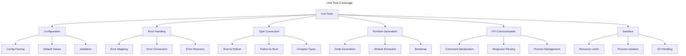
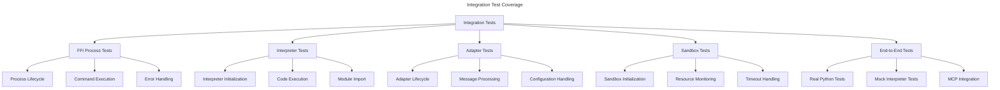

# MCP Python Adapter Testing Framework

## Overview

The MCP Python Adapter testing framework provides comprehensive test coverage for all components of the Python integration, ensuring reliability, security, and proper functionality. This specification outlines the testing strategy, test categories, and implementation details.

## Objectives

1. **Verify Functionality**: Ensure all adapter components work as expected
2. **Validate Security**: Test security mechanisms and sandboxing
3. **Check Resource Management**: Verify resource limits and monitoring
4. **Ensure Error Handling**: Test proper error handling and recovery
5. **Validate Integration**: Verify integration with the MCP system
6. **Enable Automation**: Support automated testing without external dependencies

## Test Categories

### Unit Tests

Unit tests focus on individual components and functions within the adapter:



### Integration Tests

Integration tests verify the interaction between components:



## Implementation Details

### Mock Python Interpreter

To enable automated testing without requiring a real Python environment, we've implemented a mock Python interpreter:

```bash
#!/bin/bash
# Mock Python interpreter that responds to commands in a predictable way
echo "{\"response_type\": \"started\", \"status\": \"ready\"}" >&2

while read -r line; do
    # Parse the JSON command
    if [[ "$line" == *"execute_code"* ]]; then
        # Respond with a predefined result for execute_code
        echo "{\"response_type\": \"result\", \"value\": 42, \"success\": true}" >&2
    elif [[ "$line" == *"import_module"* ]]; then
        # Respond with a module reference
        echo "{\"response_type\": \"module\", \"module_id\": \"math_001\", \"success\": true}" >&2
    # Additional command handlers...
    fi
done
```

This approach allows for testing the full FFI flow without requiring a real Python environment, making tests reliable and consistent.

### FFI Process Tests

The FFI process tests verify the functionality of the `ProcessFFI` component:

```rust
// Test the lifecycle of the ProcessFFI
#[tokio::test]
async fn test_process_ffi_lifecycle() -> Result<()> {
    // Setup mock interpreter
    // ...
    
    // Start the FFI process
    ffi.start().await?;
    
    // Verify it's running
    assert!(ffi.is_running());
    
    // Stop the FFI process
    ffi.stop().await?;
    
    // Verify it's not running
    assert!(!ffi.is_running());
    
    Ok(())
}

// Test sending commands and receiving responses
#[tokio::test]
async fn test_process_ffi_command_response() -> Result<()> {
    // ...
}

// Test error handling
#[tokio::test]
async fn test_process_ffi_error_handling() -> Result<()> {
    // ...
}

// Test process restart
#[tokio::test]
async fn test_process_ffi_restart() -> Result<()> {
    // ...
}
```

### Sandbox Tests

The sandbox tests verify the functionality of the `Sandbox` component:

```rust
#[tokio::test]
async fn test_sandbox_process_manual() -> Result<()> {
    // ...
    
    // Start the sandbox
    sandbox.start().await?;
    
    // Check the process state
    assert_eq!(sandbox.get_state().await, ProcessState::Running);
    
    // Send a command and read the output
    sandbox.write_line("hello").await?;
    let output = sandbox.read_line().await?;
    assert_eq!(output, "Hello, world!");
    
    // ...
}

#[tokio::test]
async fn test_sandbox_lifecycle() -> Result<()> {
    // ...
}

#[tokio::test]
async fn test_sandbox_timeout() -> Result<()> {
    // ...
}

#[tokio::test]
async fn test_sandbox_error_handling() -> Result<()> {
    // ...
}

#[tokio::test]
#[cfg(feature = "process-isolation")]
async fn test_sandbox_resource_monitoring() -> Result<()> {
    // ...
}
```

### Integration Tests with Mock Interpreter

The integration tests verify the functionality of the entire adapter:

```rust
#[tokio::test]
async fn test_mock_interpreter_integration() -> Result<()> {
    // Create a mock Python interpreter
    // ...
    
    // Create and initialize the adapter
    let mut adapter = MCPPythonAdapter::new(config).await?;
    adapter.initialize().await?;
    
    // Start the adapter
    adapter.start().await?;
    
    // Execute code (should return 42 from our mock)
    let result = adapter.execute("print(21 * 2)").await?;
    assert_eq!(result.as_int(), Some(42));
    
    // Import a module (should return a mock module ref)
    let math = adapter.import_module("math").await?;
    assert!(matches!(math, PythonValue::ObjectRef(_)));
    
    // ...
    
    // Stop the adapter
    adapter.stop().await?;
    
    Ok(())
}
```

### Error Handling Tests

The error handling tests verify the adapter's ability to handle various error conditions:

```rust
#[tokio::test]
async fn test_adapter_error_handling() -> Result<()> {
    // Create adapter with default configuration
    let mut adapter = MCPPythonAdapter::new_default().await?;
    
    // Test accessing methods before initialization
    let result = adapter.execute("print('hello')").await;
    assert!(result.is_err());
    assert!(matches!(result.unwrap_err(), Error::NotInitialized));
    
    // ...
}
```

### Manual Integration Tests

For full integration testing with a real Python environment:

```rust
#[tokio::test]
#[cfg(feature = "manual-tests")]
async fn test_full_integration() {
    // Create adapter with custom configuration
    let mut config = AdapterConfig::default();
    
    // Increase timeouts for testing
    config.ffi.interpreter.command_timeout = Some(30);
    
    // Disable sandbox for integration test
    config.ffi.interpreter.use_sandbox = false;
    config.ffi.security.use_sandbox = false;
    
    // Create and initialize the adapter
    let mut adapter = MCPPythonAdapter::new(config).await.unwrap();
    adapter.initialize().await.unwrap();
    
    // Execute various Python operations
    // ...
}
```

## Test Coverage Matrix

| Component | Unit Tests | Integration Tests | Manual Tests |
|-----------|------------|-------------------|-------------|
| Configuration | ✅ | ✅ | ✅ |
| Error Handling | ✅ | ✅ | ✅ |
| FFI Process | ✅ | ✅ | ✅ |
| Sandbox | ✅ | ✅ | ✅ |
| Interpreter | ✅ | ✅ | ✅ |
| Type Conversion | ✅ | ✅ | ✅ |
| Runtime Generation | ✅ | ✅ | ✅ |
| Resource Limits | ✅ | ✅ | ✅ |
| MCP Integration | ❌ | ✅ | ✅ |
| Security Features | ✅ | ✅ | ✅ |

## Test Implementation Status

### Completed Tests

- ✅ FFI Process unit tests
- ✅ Sandbox unit tests
- ✅ Error handling tests
- ✅ Configuration tests
- ✅ Mock interpreter integration tests
- ✅ Adapter lifecycle tests

### In Progress Tests

- 🔄 Resource limit enforcement tests
- 🔄 Security feature tests
- 🔄 Performance benchmarks
- 🔄 Stress tests

### Planned Tests

- 📅 MCP integration tests
- 📅 Python package integration tests
- 📅 Multi-threading tests
- 📅 Error recovery tests
- 📅 Long-running task tests

## Best Practices

1. **Use Mock Interpreters**: For automated testing, use mock interpreters instead of real Python environments
2. **Test Edge Cases**: Include tests for boundary conditions and error cases
3. **Verify Resource Cleanup**: Ensure all resources are properly released after tests
4. **Check Error Handling**: Verify that errors are properly handled and reported
5. **Test Configuration Options**: Test all configuration options and combinations
6. **Automate Test Execution**: Ensure tests can run in CI/CD pipelines
7. **Keep Tests Independent**: Tests should not depend on each other
8. **Use Realistic Data**: Use realistic data and scenarios in integration tests
9. **Avoid Hard-Coded Values**: Use constants and configuration for test parameters
10. **Document Test Requirements**: Clearly document test requirements and dependencies

## Integration with CI/CD

The testing framework is designed to integrate with CI/CD pipelines:

1. **Unit Tests**: Run on every PR and commit
2. **Integration Tests**: Run on every PR merge
3. **Manual Tests**: Run before releases
4. **Benchmark Tests**: Run weekly to track performance

Tests with external dependencies (like `feature = "manual-tests"`) are skipped in automated builds unless explicitly enabled.

## Conclusion

The MCP Python Adapter testing framework provides comprehensive test coverage for all adapter components, ensuring reliability, security, and proper functionality. The use of mock interpreters allows for automated testing without requiring a real Python environment, making tests reliable and consistent.

<version>1.0.0</version> 