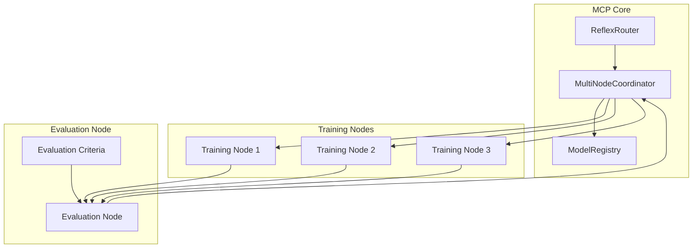
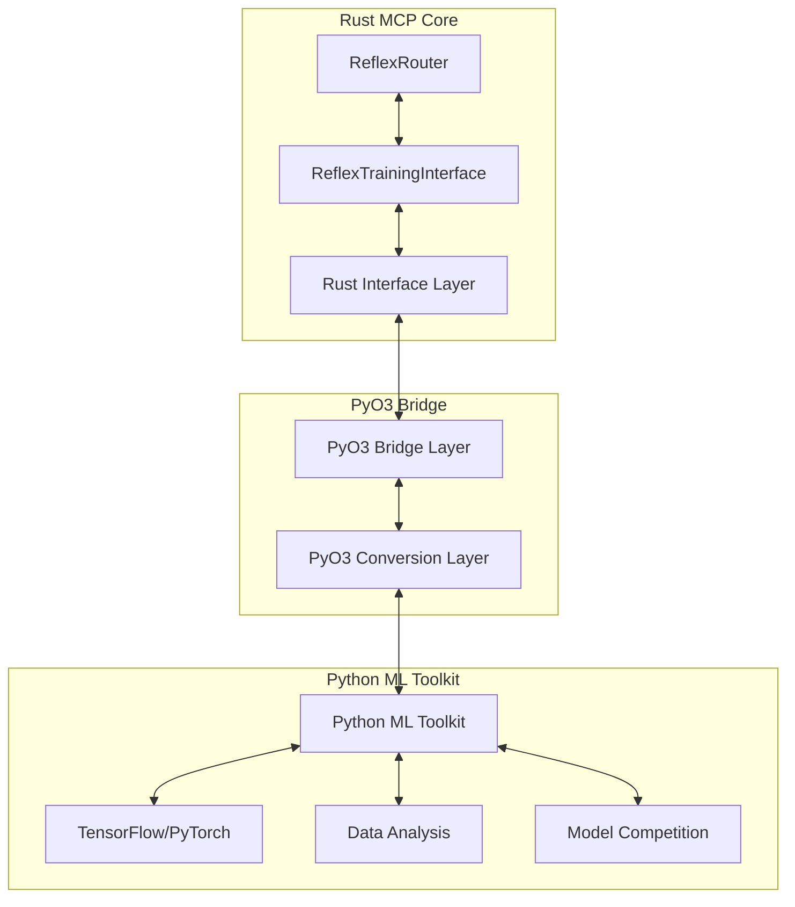
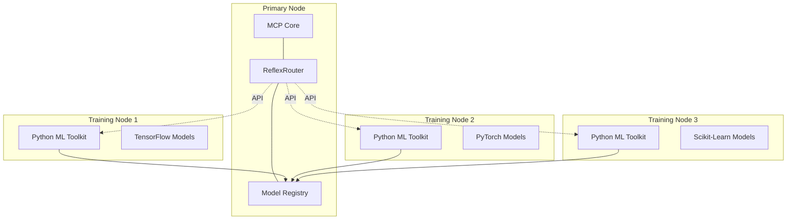

# MCP ReflexRouter Specification

> **Note (April 2026):** This is a **gen2-era proposal** (October 2024) that was never implemented. AI routing is handled by `AiRouter` in `crates/main/src/api/ai/router.rs` using capability-based provider discovery. Retained as reference material.

## Overview

The ReflexRouter is a neuromorphic-inspired component for the MCP system that provides fast, pattern-based routing of messages and actions with minimal computational overhead. It serves as an intelligent intermediary layer between incoming messages/events and the appropriate handlers, optimizing for speed and efficiency while learning from past routing decisions.

## Objectives

1. Provide near-instantaneous routing decisions for MCP messages
2. Reduce computational overhead for common message patterns
3. Learn from message flow patterns to improve routing efficiency
4. Support fallback to traditional routing when necessary
5. Integrate with the existing MCP resilience framework

## Architecture

The ReflexRouter consists of several interconnected components:

```
reflex/
├── router.rs            # Core router implementation
├── patterns.rs          # Pattern recognition and matching
├── training.rs          # Online learning system
├── storage.rs           # Pattern storage and retrieval
├── metrics.rs           # Performance metrics
└── fallback.rs          # Fallback mechanisms
```

## Core Components

### 1. Neuromorphic Pattern Matcher

The core of the ReflexRouter is a neuromorphic-inspired pattern matching system that can quickly identify message patterns and route them to appropriate handlers.

#### Implementation

```rust
/// Pattern definition for ReflexRouter
#[derive(Debug, Clone, Serialize, Deserialize)]
pub struct ReflexPattern {
    /// Pattern ID
    pub id: Uuid,
    /// Pattern signature (feature vector)
    pub signature: Vec<f32>,
    /// Pattern weight (confidence)
    pub weight: f32,
    /// Associated handler ID
    pub handler_id: String,
    /// Performance metrics
    pub metrics: PatternMetrics,
    /// Creation timestamp
    pub created_at: DateTime<Utc>,
    /// Last modified timestamp
    pub modified_at: DateTime<Utc>,
}

/// ReflexRouter core
pub struct ReflexRouter {
    /// Pattern index for fast retrieval
    pattern_index: Arc<RwLock<PatternIndex>>,
    /// Online learning system
    learner: Arc<ReflexLearner>,
    /// Storage backend
    storage: Arc<dyn ReflexStorage>,
    /// Configuration
    config: ReflexRouterConfig,
    /// Metrics collection
    metrics: ReflexMetrics,
    /// Circuit breaker for resilience
    circuit_breaker: Arc<CircuitBreaker>,
}

impl ReflexRouter {
    /// Create a new ReflexRouter with the specified configuration
    pub fn new(config: ReflexRouterConfig, storage: Arc<dyn ReflexStorage>) -> Self {
        // Implementation
    }
    
    /// Route a message to the appropriate handler
    pub async fn route(&self, message: &McpMessage) -> Result<RouterDecision, ReflexError> {
        // Extract features from the message
        let features = self.extract_features(message)?;
        
        // Circuit breaker for resilience
        self.circuit_breaker.execute(async {
            // Check if we have a pattern match
            match self.find_pattern_match(&features).await {
                Some(pattern) => {
                    // Increase pattern usage count
                    self.record_pattern_usage(&pattern.id).await?;
                    
                    // Return routing decision
                    Ok(RouterDecision::new(
                        pattern.handler_id.clone(),
                        pattern.weight,
                        true,
                    ))
                }
                None => {
                    // Fallback to traditional routing
                    let decision = self.fallback_route(message).await?;
                    
                    // Learn from this routing decision
                    self.learn_from_decision(message, &decision).await?;
                    
                    Ok(decision)
                }
            }
        }).await
    }
    
    /// Extract features from a message for pattern matching
    fn extract_features(&self, message: &McpMessage) -> Result<Vec<f32>, ReflexError> {
        // Implementation
    }
    
    /// Find matching pattern for feature vector
    async fn find_pattern_match(&self, features: &[f32]) -> Option<ReflexPattern> {
        // Implementation
    }
    
    /// Record pattern usage for metrics and learning
    async fn record_pattern_usage(&self, pattern_id: &Uuid) -> Result<(), ReflexError> {
        // Implementation
    }
    
    /// Learn from a routing decision
    async fn learn_from_decision(
        &self,
        message: &McpMessage,
        decision: &RouterDecision,
    ) -> Result<(), ReflexError> {
        // Implementation
    }
    
    /// Fallback to traditional routing
    async fn fallback_route(&self, message: &McpMessage) -> Result<RouterDecision, ReflexError> {
        // Implementation
    }
}
```

### 2. Online Learning System

The ReflexRouter includes an online learning system that continuously improves routing decisions based on observed patterns.

```rust
/// Online learning system for ReflexRouter
pub struct ReflexLearner {
    /// Learning configuration
    config: LearnerConfig,
    /// Feature extractor
    feature_extractor: Box<dyn FeatureExtractor>,
    /// Pattern storage
    storage: Arc<dyn ReflexStorage>,
    /// Learning metrics
    metrics: LearnerMetrics,
}

impl ReflexLearner {
    /// Create a new learner
    pub fn new(config: LearnerConfig, storage: Arc<dyn ReflexStorage>) -> Self {
        // Implementation
    }
    
    /// Learn from a message and routing decision
    pub async fn learn(
        &self,
        message: &McpMessage,
        decision: &RouterDecision,
    ) -> Result<(), LearnerError> {
        // Extract features
        let features = self.feature_extractor.extract(message)?;
        
        // Check if we already have a similar pattern
        if let Some(existing) = self.find_similar_pattern(&features).await? {
            // Update existing pattern
            self.update_pattern(existing, features, decision).await?;
        } else {
            // Create new pattern
            self.create_pattern(features, decision).await?;
        }
        
        Ok(())
    }
    
    /// Find similar existing pattern
    async fn find_similar_pattern(&self, features: &[f32]) -> Result<Option<ReflexPattern>, LearnerError> {
        // Implementation
    }
    
    /// Update existing pattern
    async fn update_pattern(
        &self,
        pattern: ReflexPattern,
        features: Vec<f32>,
        decision: &RouterDecision,
    ) -> Result<(), LearnerError> {
        // Implementation
    }
    
    /// Create new pattern
    async fn create_pattern(
        &self,
        features: Vec<f32>,
        decision: &RouterDecision,
    ) -> Result<(), LearnerError> {
        // Implementation
    }
}
```

### 3. Pattern Storage Interface

The ReflexRouter uses a storage interface that can be backed by different storage engines, including ZFS in the future.

```rust
/// Storage interface for ReflexRouter
#[async_trait]
pub trait ReflexStorage: Send + Sync {
    /// Store a pattern
    async fn store_pattern(&self, pattern: &ReflexPattern) -> Result<(), StorageError>;
    
    /// Retrieve a pattern by ID
    async fn get_pattern(&self, id: &Uuid) -> Result<Option<ReflexPattern>, StorageError>;
    
    /// Find patterns similar to the given feature vector
    async fn find_similar_patterns(
        &self,
        features: &[f32],
        threshold: f32,
        limit: usize,
    ) -> Result<Vec<ReflexPattern>, StorageError>;
    
    /// Update pattern usage metrics
    async fn update_pattern_metrics(
        &self,
        id: &Uuid,
        metrics: &PatternMetrics,
    ) -> Result<(), StorageError>;
    
    /// List all patterns
    async fn list_patterns(&self, limit: usize, offset: usize) -> Result<Vec<ReflexPattern>, StorageError>;
    
    /// Delete a pattern
    async fn delete_pattern(&self, id: &Uuid) -> Result<(), StorageError>;
    
    /// Count patterns
    async fn count_patterns(&self) -> Result<usize, StorageError>;
}
```

## Integration with MCP

### ReflexRouter Registration

```rust
// Register ReflexRouter with MCP
pub fn register_reflex_router(mcp: &mut Mcp) -> Result<(), McpError> {
    // Create ReflexRouter
    let config = ReflexRouterConfig::default();
    let storage = create_reflex_storage(&config.storage)?;
    let router = Arc::new(ReflexRouter::new(config, storage));
    
    // Register with MCP
    mcp.register_message_preprocessor(router.clone());
    
    Ok(())
}
```

### MessagePreprocessor Implementation

```rust
#[async_trait]
impl MessagePreprocessor for ReflexRouter {
    async fn preprocess(
        &self,
        message: &McpMessage,
        context: &McpContext,
    ) -> Result<PreprocessorDecision, McpError> {
        match self.route(message).await {
            Ok(decision) => {
                if decision.is_certain() {
                    // Route directly to handler
                    Ok(PreprocessorDecision::RouteToHandler(decision.handler_id))
                } else {
                    // Let MCP decide
                    Ok(PreprocessorDecision::Continue)
                }
            }
            Err(err) => {
                // Log error and continue with normal processing
                log::error!("ReflexRouter error: {}", err);
                Ok(PreprocessorDecision::Continue)
            }
        }
    }
}
```

## Multi-Node Training and Competition

The ReflexRouter uses a distributed competitive training system where models are trained and evaluated on separate nodes. This approach allows for more efficient pattern discovery and model improvement while maintaining system stability.

### Architecture



```rust
/// Multi-node training coordinator
pub struct MultiNodeTrainer {
    /// Configuration
    config: MultiNodeConfig,
    /// Connection to training nodes
    node_connections: HashMap<NodeId, Arc<NodeConnection>>,
    /// Model registry
    model_registry: Arc<ModelRegistry>,
    /// Competition results
    competition_results: Arc<RwLock<CompetitionResults>>,
    /// Training state
    training_state: AtomicU8,
}

impl MultiNodeTrainer {
    /// Create a new multi-node trainer
    pub fn new(config: MultiNodeConfig) -> Result<Self, TrainerError> {
        // Implementation
    }
    
    /// Start training across nodes
    pub async fn start_training(&self) -> Result<(), TrainerError> {
        // Check current state
        let current_state = self.training_state.load(Ordering::SeqCst);
        if current_state != TrainingState::Idle as u8 {
            return Err(TrainerError::InvalidState(format!(
                "Cannot start training in state {:?}",
                TrainingState::from(current_state)
            )));
        }
        
        // Set state to preparing
        self.training_state.store(TrainingState::Preparing as u8, Ordering::SeqCst);
        
        // Prepare training data
        let training_data = self.prepare_training_data().await?;
        
        // Distribute to nodes
        for (node_id, connection) in &self.node_connections {
            connection.distribute_training_data(training_data.clone()).await?;
        }
        
        // Set state to training
        self.training_state.store(TrainingState::Training as u8, Ordering::SeqCst);
        
        // Start training on all nodes
        let training_futures = self.node_connections.values()
            .map(|conn| conn.start_training())
            .collect::<Vec<_>>();
            
        // Wait for all to complete
        futures::future::join_all(training_futures).await;
        
        // Set state to evaluating
        self.training_state.store(TrainingState::Evaluating as u8, Ordering::SeqCst);
        
        // Evaluate models
        self.evaluate_models().await?;
        
        // Select best model
        let best_model = self.select_best_model().await?;
        
        // Deploy the winning model
        self.deploy_model(best_model).await?;
        
        // Set state back to idle
        self.training_state.store(TrainingState::Idle as u8, Ordering::SeqCst);
        
        Ok(())
    }
    
    /// Prepare training data
    async fn prepare_training_data(&self) -> Result<TrainingData, TrainerError> {
        // Implementation
    }
    
    /// Evaluate models from all nodes
    async fn evaluate_models(&self) -> Result<(), TrainerError> {
        // Implementation
    }
    
    /// Select the best model based on evaluation results
    async fn select_best_model(&self) -> Result<ModelId, TrainerError> {
        // Implementation
    }
    
    /// Deploy the winning model to the production system
    async fn deploy_model(&self, model_id: ModelId) -> Result<(), TrainerError> {
        // Implementation
    }
}
```

## External Integration Interfaces

The ReflexRouter provides well-defined interfaces for integration with external training systems, including Python-based ML frameworks through PyO3. This approach allows leveraging Python's rich machine learning ecosystem while maintaining the core routing functionality in Rust for optimal performance.

### PyO3 Integration Architecture



### Rust Interface Implementation

```rust
/// External training interface for ReflexRouter
#[derive(Debug, Clone)]
pub struct ReflexTrainingInterface {
    /// Router reference
    router: Arc<ReflexRouter>,
    /// Training configuration
    config: TrainingConfig,
}

impl ReflexTrainingInterface {
    /// Create a new training interface
    pub fn new(router: Arc<ReflexRouter>, config: TrainingConfig) -> Self {
        Self { router, config }
    }
    
    /// Get current patterns
    pub fn get_patterns(&self) -> Result<Vec<ReflexPattern>, TrainingError> {
        // Implementation
    }
    
    /// Submit new pattern from external training
    pub fn submit_pattern(&self, pattern: ReflexPattern) -> Result<PatternId, TrainingError> {
        // Implementation
    }
    
    /// Get training data
    pub fn get_training_data(&self, limit: usize) -> Result<TrainingData, TrainingError> {
        // Implementation
    }
    
    /// Submit model evaluation results
    pub fn submit_evaluation_results(
        &self,
        model_id: ModelId,
        results: EvaluationResults,
    ) -> Result<(), TrainingError> {
        // Implementation
    }
}

/// PyO3 compatible interface for Python integration
#[cfg(feature = "python")]
pub mod python {
    use super::*;
    use pyo3::prelude::*;
    
    /// Python-compatible ReflexRouter interface
    #[pyclass]
    pub struct PyReflexRouter {
        /// Inner router
        router: Arc<ReflexRouter>,
    }
    
    #[pymethods]
    impl PyReflexRouter {
        /// Create a new router
        #[new]
        pub fn new() -> PyResult<Self> {
            let config = ReflexRouterConfig::default();
            let storage = create_reflex_storage(&config.storage)?;
            let router = Arc::new(ReflexRouter::new(config, storage));
            
            Ok(Self { router })
        }
        
        /// Route a message
        pub fn route(&self, message: &PyAny) -> PyResult<String> {
            // Convert Python message to Rust
            // Route message
            // Return handler ID
            Ok("handler_id".to_string())
        }
        
        /// Get training interface
        pub fn get_training_interface(&self) -> PyResult<PyReflexTrainingInterface> {
            let config = TrainingConfig::default();
            let interface = ReflexTrainingInterface::new(self.router.clone(), config);
            
            Ok(PyReflexTrainingInterface { interface })
        }
        
        /// Export routing data for Python training
        pub fn export_training_data(&self, format: &str, limit: usize) -> PyResult<PyObject> {
            Python::with_gil(|py| {
                // Implementation to export training data in a Python-friendly format
                // This could return a pandas DataFrame, numpy array, or other format
                // depending on the specified format parameter
                
                // Example returning a dictionary for now
                let dict = PyDict::new(py);
                dict.set_item("message_patterns", PyList::empty(py))?;
                dict.set_item("routing_decisions", PyList::empty(py))?;
                dict.set_item("performance_metrics", PyDict::new(py))?;
                
                Ok(dict.into())
            })
        }
        
        /// Import model from Python
        pub fn import_model(&self, model_data: &PyAny, metadata: &PyDict) -> PyResult<String> {
            // Implementation to import a model trained in Python
            // This would handle serialized model data and metadata
            
            Ok("model_id".to_string())
        }
    }
    
    /// Python-compatible training interface
    #[pyclass]
    pub struct PyReflexTrainingInterface {
        /// Inner interface
        interface: ReflexTrainingInterface,
    }
    
    #[pymethods]
    impl PyReflexTrainingInterface {
        /// Get patterns
        pub fn get_patterns(&self) -> PyResult<Vec<PyReflexPattern>> {
            // Implementation
            Ok(vec![])
        }
        
        /// Submit pattern
        pub fn submit_pattern(&self, pattern: &PyAny) -> PyResult<String> {
            // Convert Python pattern to Rust
            // Submit pattern
            // Return pattern ID
            Ok("pattern_id".to_string())
        }
        
        /// Get training data
        pub fn get_training_data(&self, limit: usize) -> PyResult<&PyAny> {
            // Implementation
            Python::with_gil(|py| {
                let data = py.None();
                Ok(data)
            })
        }
        
        /// Submit evaluation results
        pub fn submit_evaluation_results(&self, model_id: &str, results: &PyAny) -> PyResult<()> {
            // Implementation
            Ok(())
        }
        
        /// Start distributed competition
        pub fn start_competition(&self, nodes: Vec<&str>, config: &PyDict) -> PyResult<String> {
            // Implementation to start a model competition across nodes
            // Returns a competition ID that can be used to track progress
            
            Ok("competition_id".to_string())
        }
        
        /// Get competition status
        pub fn get_competition_status(&self, competition_id: &str) -> PyResult<&PyAny> {
            Python::with_gil(|py| {
                // Implementation to check status of a competition
                let status = PyDict::new(py);
                status.set_item("status", "running")?;
                status.set_item("progress", 0.5)?;
                status.set_item("nodes_completed", 1)?;
                status.set_item("nodes_total", 3)?;
                
                Ok(status.into_py(py))
            })
        }
    }
    
    /// Python-compatible pattern
    #[pyclass]
    pub struct PyReflexPattern {
        /// Inner pattern
        pattern: ReflexPattern,
    }
    
    /// Register PyO3 module
    #[pymodule]
    fn reflex_router(_py: Python, m: &PyModule) -> PyResult<()> {
        m.add_class::<PyReflexRouter>()?;
        m.add_class::<PyReflexTrainingInterface>()?;
        m.add_class::<PyReflexPattern>()?;
        
        Ok(())
    }
}
```

The MCP ReflexRouter works in conjunction with Python-based ML adapters defined in the [Python ML Toolkit](../mcp-adapters/python-ml-toolkit.md) specification. These adapters leverage the PyO3 extension pattern to connect Python ML frameworks with the Rust MCP components.

### Python Integration Benefits

1. **Access to Advanced ML Frameworks**: Integration with TensorFlow, PyTorch, and other Python machine learning libraries.
2. **Specialized Training Tools**: Utilization of Python's rich ecosystem for model training, evaluation, and optimization.
3. **Performance Isolation**: Training intensive operations run in separate processes, preventing impact on the core routing performance.
4. **Scientific Computing**: Access to Python's statistical and scientific computing libraries for advanced pattern analysis.
5. **Visualization Tools**: Leverage Python's visualization libraries for analyzing router performance and patterns.

### Multi-Node Deployment Architecture



In this architecture, the Python ML Toolkit on separate training nodes can:

1. Fetch training data from the ReflexRouter
2. Train models using different ML frameworks
3. Evaluate model performance
4. Submit trained models back to the Model Registry
5. Participate in model competitions to determine the best performing model
6. Monitor router performance and suggest optimizations

## Performance Considerations

1. **Memory Footprint**: The ReflexRouter should maintain a small memory footprint, with pattern storage optimized for quick retrieval.
2. **Computation Speed**: Pattern matching should complete in microseconds to avoid adding latency.
3. **Adaptability**: The learning system should adapt to changing patterns without requiring explicit retraining.
4. **Persistence**: Patterns should be persisted efficiently to survive system restarts.

## Future Enhancements

The ReflexRouter design includes considerations for future enhancements, which will be built on top of the core architecture:

1. **Advanced Pattern Matchers**: More sophisticated pattern matching algorithms that can handle complex, nested patterns across message hierarchies.
2. **Reinforcement Learning Integration**: Enhancing the learning system with reinforcement learning to optimize for long-term routing effectiveness.
3. **Multi-node Training and Competition**: Implementation of a distributed system where multiple ReflexRouter nodes can:
   - Compete on routing tasks and effectiveness
   - Share optimized models across the network
   - Train on specialized workloads and contribute to a collective knowledge base
   - See the [Python ML Toolkit](../mcp-adapters/python-ml-toolkit.md) specification for implementation details of the ML training system
4. **Expanded Metrics and Telemetry**: More comprehensive metrics collection and analysis to identify routing patterns, bottlenecks, and opportunities for optimization.
5. **Dynamic Rule Generation**: Capability to automatically generate new routing rules based on observed patterns and feedback.

## Testing Requirements

1. **Performance Testing**: Validate that the ReflexRouter does not add significant latency.
2. **Learning Validation**: Verify that the router learns correctly from observed patterns.
3. **Resilience Testing**: Ensure the router integrates correctly with the resilience framework.
4. **Memory Usage**: Monitor memory usage under various load conditions.

## Implementation Plan

1. **Phase 1**: Core ReflexRouter and basic pattern matching (4 weeks)
2. **Phase 2**: Online learning system integration (3 weeks)
3. **Phase 3**: Storage backends and persistence (2 weeks)
4. **Phase 4**: Performance optimization and testing (3 weeks)
5. **Phase 5**: Documentation and examples (2 weeks)

## Dependencies

- MCP Core
- Resilience Framework
- Metrics Collection System
- Storage Backend (File-based initially, ZFS in future)

## Integration with External Systems

The ReflexRouter is designed to integrate with various components of the MCP ecosystem:

### MCP Core Integration

ReflexRouter will be deeply integrated with the MCP core, providing a fast path for message routing that can be leveraged by other components.

### External Machine Learning Integration

The ReflexRouter will integrate with:

- **Python ML Toolkit**: A specialized adapter for training and evaluating neural network models using Python's rich ecosystem of machine learning libraries. See the [Python ML Toolkit](../mcp-adapters/python-ml-toolkit.md) specification for details on:
  - PyO3-based bridge between Rust and Python
  - Distributed training architecture
  - Model competition and selection mechanisms
  - Performance optimization techniques

### Storage System Integration

The Router will interface with the MCP storage systems for:

1. Persisting trained models and their configurations
2. Storing routing statistics and performance metrics
3. Loading and saving routing rules and configurations 