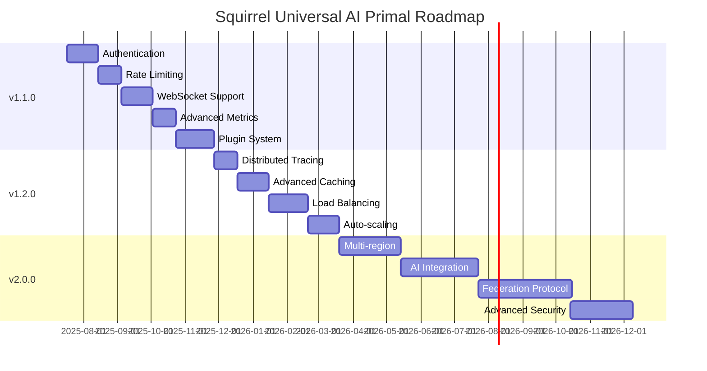

# Squirrel Universal AI Primal - Next Phase Roadmap

## 📅 Roadmap Date: 2025-07-17

## 🎯 Current Status: Production Ready v1.0.0 → Next Phase Planning

With the successful completion of the Production Ready v1.0.0 release, we now enter the next phase of development focused on advanced features, ecosystem expansion, and scalability enhancements.

---

## 🚀 Phase 2: Advanced Features & Ecosystem Expansion

### 📋 Phase Overview
**Duration**: 3-6 months  
**Focus**: Advanced functionality, security hardening, and ecosystem integration  
**Target**: v1.1.0 - v1.2.0 releases

---

## 🎯 Version 1.1.0 - Advanced Features Release

### 🔐 Authentication & Authorization
**Priority**: High | **Effort**: 3-4 weeks

#### Features
- **JWT Token Authentication** - Secure token-based authentication
- **API Key Management** - Generate, rotate, and revoke API keys
- **Role-Based Access Control** - Different permission levels for users
- **OAuth2 Integration** - Third-party authentication providers
- **Session Management** - Secure session handling and expiration

#### Implementation Plan
1. **Week 1**: JWT infrastructure and token generation
2. **Week 2**: API key management system
3. **Week 3**: RBAC implementation and permissions
4. **Week 4**: OAuth2 integration and testing

#### Success Criteria
- [ ] JWT tokens working with all endpoints
- [ ] API key authentication functional
- [ ] Role-based permissions enforced
- [ ] OAuth2 providers integrated
- [ ] Comprehensive security testing passed

### 🚦 Rate Limiting & Abuse Prevention
**Priority**: High | **Effort**: 2-3 weeks

#### Features
- **Request Rate Limiting** - Per-user and per-endpoint limits
- **Adaptive Rate Limiting** - Dynamic adjustment based on load
- **DDoS Protection** - Basic protection against attacks
- **Request Queuing** - Queue management for burst traffic
- **Abuse Detection** - Automatic detection and response

#### Implementation Plan
1. **Week 1**: Basic rate limiting implementation
2. **Week 2**: Adaptive algorithms and queue management
3. **Week 3**: Abuse detection and DDoS protection

#### Success Criteria
- [ ] Rate limiting working across all endpoints
- [ ] Adaptive algorithms responding to load
- [ ] DDoS protection effective
- [ ] Abuse detection and response automated
- [ ] Performance impact minimal

### 🔄 WebSocket Support
**Priority**: Medium | **Effort**: 3-4 weeks

#### Features
- **Real-time Updates** - Live status updates for primals
- **Event Streaming** - Stream ecosystem events to clients
- **Bidirectional Communication** - Client-server interaction
- **Connection Management** - Handle WebSocket lifecycle
- **Message Broadcasting** - Broadcast updates to multiple clients

#### Implementation Plan
1. **Week 1**: WebSocket infrastructure setup
2. **Week 2**: Real-time update system
3. **Week 3**: Event streaming implementation
4. **Week 4**: Broadcasting and connection management

#### Success Criteria
- [ ] WebSocket connections stable
- [ ] Real-time updates working
- [ ] Event streaming functional
- [ ] Broadcasting system operational
- [ ] Connection management robust

### 📊 Advanced Metrics & Alerting
**Priority**: Medium | **Effort**: 2-3 weeks

#### Features
- **Custom Metrics** - User-defined metrics collection
- **Advanced Alerting** - Intelligent alert rules
- **Metric Aggregation** - Roll-up and aggregation functions
- **Historical Analysis** - Long-term trend analysis
- **Predictive Alerting** - ML-based anomaly detection

#### Implementation Plan
1. **Week 1**: Custom metrics framework
2. **Week 2**: Advanced alerting system
3. **Week 3**: Aggregation and historical analysis

#### Success Criteria
- [ ] Custom metrics collection working
- [ ] Advanced alerts firing correctly
- [ ] Metric aggregation functional
- [ ] Historical analysis available
- [ ] Predictive alerting operational

### 🔌 Plugin System Foundation
**Priority**: Low | **Effort**: 4-5 weeks

#### Features
- **Plugin Architecture** - Extensible plugin framework
- **Plugin Registry** - Discover and manage plugins
- **Plugin Lifecycle** - Load, unload, and update plugins
- **Plugin API** - Standardized plugin interface
- **Security Sandbox** - Isolated plugin execution

#### Implementation Plan
1. **Week 1**: Plugin architecture design
2. **Week 2**: Plugin registry and discovery
3. **Week 3**: Lifecycle management
4. **Week 4**: API standardization
5. **Week 5**: Security sandbox implementation

#### Success Criteria
- [ ] Plugin architecture working
- [ ] Plugin registry functional
- [ ] Lifecycle management operational
- [ ] API standardized and documented
- [ ] Security sandbox effective

---

## 🎯 Version 1.2.0 - Scalability & Performance Release

### 🔍 Distributed Tracing
**Priority**: High | **Effort**: 2-3 weeks

#### Features
- **OpenTelemetry Integration** - Standard tracing implementation
- **Request Tracing** - End-to-end request tracking
- **Performance Analysis** - Identify bottlenecks and optimize
- **Error Correlation** - Link errors across services
- **Distributed Context** - Propagate context across services

#### Implementation Plan
1. **Week 1**: OpenTelemetry setup and basic tracing
2. **Week 2**: Request tracing and performance analysis
3. **Week 3**: Error correlation and context propagation

#### Success Criteria
- [ ] OpenTelemetry integration complete
- [ ] Request tracing working end-to-end
- [ ] Performance bottlenecks identified
- [ ] Error correlation functional
- [ ] Distributed context propagated

### 🗄️ Advanced Caching
**Priority**: High | **Effort**: 3-4 weeks

#### Features
- **Multi-level Caching** - L1 (memory), L2 (Redis), L3 (database)
- **Cache Invalidation** - Smart cache invalidation strategies
- **Cache Warming** - Proactive cache population
- **Cache Analytics** - Hit rates and performance metrics
- **Distributed Caching** - Shared cache across instances

#### Implementation Plan
1. **Week 1**: Multi-level cache architecture
2. **Week 2**: Cache invalidation strategies
3. **Week 3**: Cache warming and analytics
4. **Week 4**: Distributed caching implementation

#### Success Criteria
- [ ] Multi-level caching operational
- [ ] Cache invalidation working correctly
- [ ] Cache warming improving performance
- [ ] Analytics providing insights
- [ ] Distributed caching functional

### ⚖️ Load Balancing & High Availability
**Priority**: High | **Effort**: 4-5 weeks

#### Features
- **Multiple Instance Support** - Run multiple API server instances
- **Load Balancing** - Distribute requests across instances
- **Health Checks** - Monitor instance health
- **Failover** - Automatic failover to healthy instances
- **Session Affinity** - Sticky sessions when needed

#### Implementation Plan
1. **Week 1**: Multiple instance architecture
2. **Week 2**: Load balancing implementation
3. **Week 3**: Health checks and monitoring
4. **Week 4**: Failover mechanisms
5. **Week 5**: Session affinity and testing

#### Success Criteria
- [ ] Multiple instances running
- [ ] Load balancing working
- [ ] Health checks monitoring instances
- [ ] Failover automatic and fast
- [ ] Session affinity functional

### 📈 Auto-scaling
**Priority**: Medium | **Effort**: 3-4 weeks

#### Features
- **Resource Monitoring** - Monitor CPU, memory, and request load
- **Scaling Policies** - Define when to scale up/down
- **Instance Management** - Start and stop instances automatically
- **Kubernetes Integration** - HPA (Horizontal Pod Autoscaler) support
- **Cost Optimization** - Balance performance and cost

#### Implementation Plan
1. **Week 1**: Resource monitoring setup
2. **Week 2**: Scaling policies implementation
3. **Week 3**: Instance management automation
4. **Week 4**: Kubernetes integration and optimization

#### Success Criteria
- [ ] Resource monitoring accurate
- [ ] Scaling policies working
- [ ] Instance management automated
- [ ] Kubernetes integration functional
- [ ] Cost optimization effective

---

## 🎯 Version 2.0.0 - Enterprise & Global Scale

### 🌍 Multi-region Support
**Priority**: High | **Effort**: 6-8 weeks

#### Features
- **Global Deployment** - Deploy across multiple regions
- **Data Replication** - Synchronize data across regions
- **Regional Failover** - Automatic failover between regions
- **Latency Optimization** - Route requests to nearest region
- **Compliance** - Regional data compliance requirements

### 🤖 Advanced AI Integration
**Priority**: Medium | **Effort**: 8-10 weeks

#### Features
- **Machine Learning Models** - Integrate ML for predictions
- **Anomaly Detection** - AI-powered anomaly detection
- **Intelligent Routing** - AI-based request routing
- **Predictive Scaling** - ML-based auto-scaling
- **Natural Language Interface** - AI-powered API interface

### 🔗 Federation Protocol
**Priority**: High | **Effort**: 10-12 weeks

#### Features
- **Inter-primal Communication** - Direct primal-to-primal communication
- **Federated Identity** - Cross-primal authentication
- **Distributed Consensus** - Consensus across primals
- **Cross-primal Transactions** - Atomic operations across primals
- **Global State Management** - Distributed state synchronization

### 🔒 Advanced Security
**Priority**: High | **Effort**: 6-8 weeks

#### Features
- **End-to-end Encryption** - Encrypt all communications
- **Zero-trust Architecture** - Never trust, always verify
- **Advanced Threat Detection** - AI-powered threat detection
- **Compliance Framework** - SOC2, ISO27001 compliance
- **Security Audit Logging** - Comprehensive audit trails

---

## 📊 Resource Planning

### Development Team Requirements
| Role | v1.1.0 | v1.2.0 | v2.0.0 |
|------|--------|--------|--------|
| **Backend Engineers** | 2-3 | 3-4 | 4-5 |
| **DevOps Engineers** | 1-2 | 2-3 | 3-4 |
| **Security Engineers** | 1 | 1-2 | 2-3 |
| **QA Engineers** | 1-2 | 2 | 2-3 |
| **Technical Writers** | 1 | 1 | 1-2 |

### Infrastructure Requirements
| Component | v1.1.0 | v1.2.0 | v2.0.0 |
|-----------|--------|--------|--------|
| **Compute** | 2-4 cores | 4-8 cores | 8-16 cores |
| **Memory** | 4-8GB | 8-16GB | 16-32GB |
| **Storage** | 100GB | 500GB | 1TB+ |
| **Network** | 1Gbps | 10Gbps | 10Gbps+ |

### Timeline Overview

---

## 🎯 Success Metrics

### Version 1.1.0 Targets
- **Security**: 100% authenticated endpoints
- **Performance**: <100ms response time with auth
- **Scalability**: Handle 5,000 concurrent users
- **Reliability**: 99.9% uptime with new features

### Version 1.2.0 Targets
- **Performance**: <50ms response time with caching
- **Scalability**: Handle 50,000 concurrent users
- **Availability**: 99.95% uptime with load balancing
- **Efficiency**: 50% reduction in resource usage

### Version 2.0.0 Targets
- **Global Scale**: Multi-region deployment
- **Intelligence**: AI-powered optimization
- **Federation**: Inter-primal communication
- **Security**: Enterprise-grade security

---

## 🚨 Risk Assessment

### High Risk Items
- **Authentication Complexity** - Complex security implementation
- **Multi-region Deployment** - Significant infrastructure complexity
- **AI Integration** - Emerging technology with unknowns
- **Federation Protocol** - Novel inter-primal communication

### Mitigation Strategies
- **Phased Rollout** - Gradual feature deployment
- **Extensive Testing** - Comprehensive testing at each phase
- **Fallback Plans** - Rollback capabilities for all features
- **Expert Consultation** - Engage specialists for complex features

---

## 📋 Next Steps

### Immediate Actions (Next 2 weeks)
1. **Team Planning** - Finalize team assignments
2. **Architecture Design** - Detailed design for v1.1.0 features
3. **Development Environment** - Set up development infrastructure
4. **Testing Strategy** - Plan comprehensive testing approach

### Short-term Goals (Next 1 month)
1. **Authentication Implementation** - Begin JWT and API key implementation
2. **Rate Limiting Design** - Design rate limiting architecture
3. **WebSocket Planning** - Plan WebSocket implementation
4. **Documentation Updates** - Update documentation for new features

### Medium-term Goals (Next 3 months)
1. **v1.1.0 Release** - Complete and release advanced features
2. **Performance Testing** - Comprehensive performance validation
3. **Security Audit** - Third-party security assessment
4. **v1.2.0 Planning** - Begin planning for scalability features

---

**🐿️ The Squirrel Universal AI Primal is ready for the next phase of evolution! 🚀** 