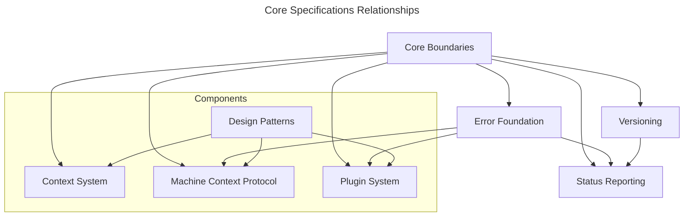

# Core Specifications

## Overview

This directory contains specifications for the minimal foundational components of the Squirrel ecosystem. The core specifications define the essential shared functionality that is used throughout the system while maintaining a minimal footprint and clear boundaries.

## Core Philosophy

The Squirrel core is designed to be:

1. **Minimal**: Only including essential cross-cutting concerns
2. **Stable**: Rarely changing once established
3. **Foundational**: Providing a solid base for all other components
4. **Focused**: Addressing only system-wide needs

## Specification Structure

The core specifications are organized into the following directories:

| Directory | Purpose |
|:----------|:--------|
| [`context/`](context/) | Context management system specifications |
| [`mcp/`](mcp/) | Machine Context Protocol specifications |
| [`plugins/`](plugins/) | Plugin system specifications |
| [`patterns/`](patterns/) | Shared design pattern specifications |
| [`modules/`](modules/) | Specialized module specifications |

## Core Specification Index

| Specification | Description | Status |
|:--------------|:------------|:-------|
| [Core Boundaries](core-boundaries.md) | Defines what belongs in core vs. plugins | Active |
| [Error Foundation](error-foundation.md) | Defines the error type system | Active |
| [Versioning](versioning.md) | Defines version and build information | Active |
| [Status Reporting](status-reporting.md) | Defines health and diagnostic information | Active |

## Key Component Status

| Component | Status | Documentation |
|:----------|:-------|:--------------|
| **Context System** | 95% Complete | [Context Overview](context/overview.md) |
| **Machine Context Protocol** | 100% Complete | [MCP Progress](mcp/PROGRESS.md) |
| **Plugin System** | 95% Complete | [Implementation Complete](plugins/IMPLEMENTATION_COMPLETE.md) |
| **Design Patterns** | 80% Complete | [Patterns README](patterns/README.md) |

## Relationships

## Implementation Status

Overall implementation status of core specifications:

- Core Boundaries: **Implemented**
- Error Foundation: **Implemented**
- Versioning: **Implemented**
- Status Reporting: **Partially Implemented**
- Context System: **95% Complete**
- Machine Context Protocol: **100% Complete**
- Plugin System: **95% Complete**
- Design Patterns: **80% Complete**

## Recent Updates

- **September 2024**: MCP implementation completed with addition of comprehensive cryptography module
- **September 2024**: Plugin system implementation completed with cross-platform testing framework
- **August 2024**: RBAC implementation refactored for improved security model
- **August 2024**: Context management system expanded with rule-based capabilities

## Design Principles

When working with or extending the core specifications, follow these principles:

1. **Separation of Concerns**: Keep core focused on fundamental concerns
2. **Minimal Dependencies**: Avoid unnecessary dependencies in core
3. **Stability First**: Prioritize stability and backward compatibility
4. **Clear Boundaries**: Maintain clear boundaries between core and plugins
5. **Consistent Patterns**: Use consistent design patterns across core components

## Future Roadmap

Future enhancements to core specifications will focus on:

1. **Extension Points**: Well-defined integration points for plugins
2. **Minimal Plugin Registry**: Core interface for plugin discovery
3. **Enhanced Error Context**: Improved error context and propagation
4. **Cross-Cutting Concerns**: Identification of additional core concerns
5. **AI Integration**: Framework for integrating AI capabilities into core components

## Conclusion

The core specifications define the minimal but essential foundation for the Squirrel ecosystem. By maintaining clear boundaries and focused responsibilities, these specifications enable higher-level components to evolve independently while sharing common fundamental patterns and types.

## Contact

For questions or feedback on core specifications, contact the Core Team at core-team@squirrel-labs.org. 