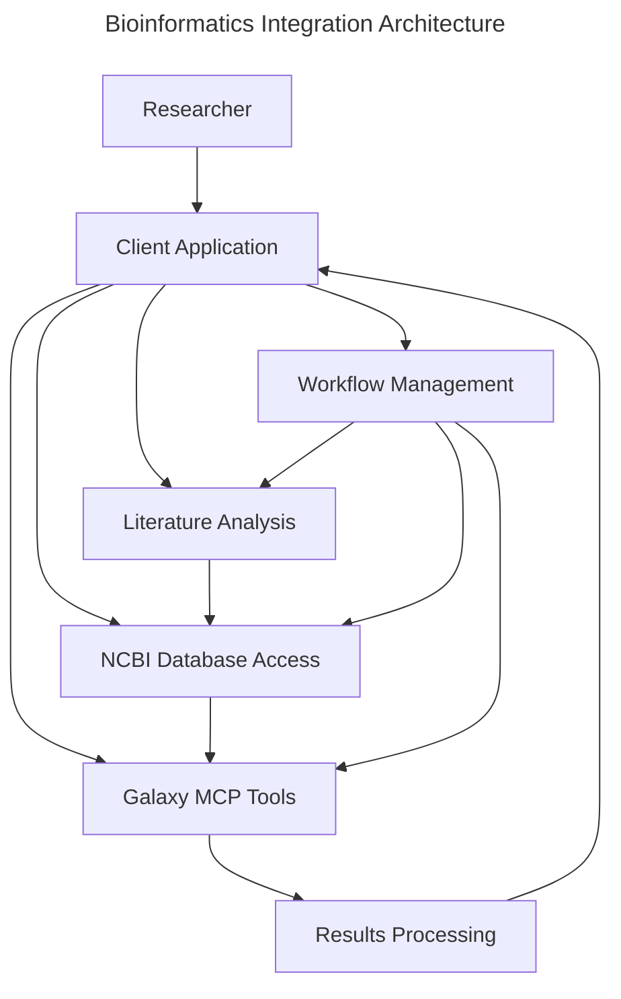
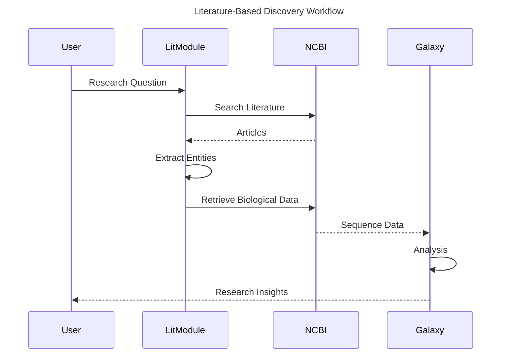
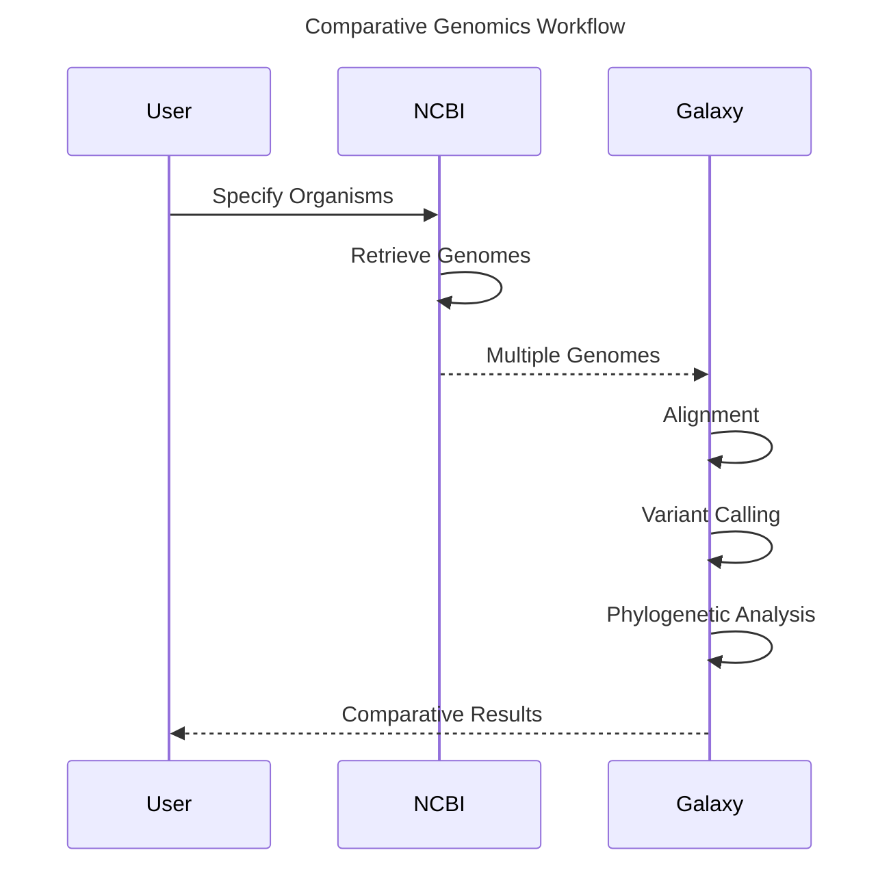
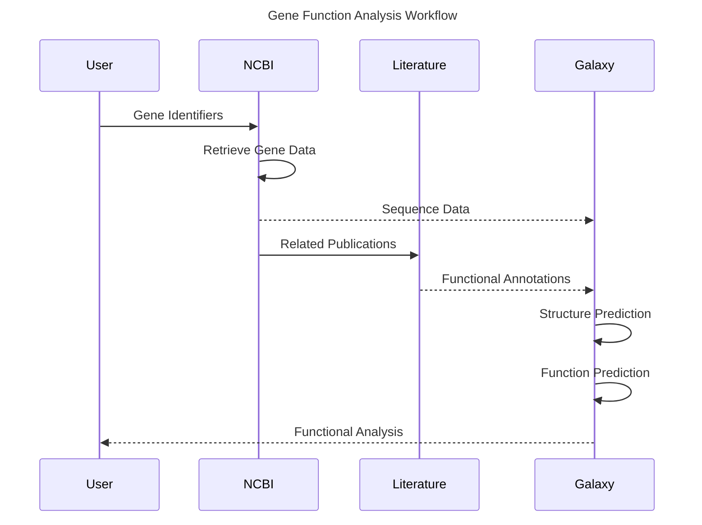

# Bioinformatics Integration Specifications

## Overview

This directory contains specifications for the bioinformatics integration components of the Squirrel project. These components enable scientific research workflows by connecting data sources like NCBI with analysis tools provided through Galaxy MCP integration. Together, they form a comprehensive ecosystem for AI-assisted bioinformatics research.

## Vision

The bioinformatics integration builds upon the existing MCP framework to create specialized research tools that:

1. **Bridge Information Sources**: Connect scientific literature with genomic, proteomic, and other biological databases
2. **Enable Automated Analysis**: Automate the transition from data retrieval to analysis using Galaxy tools
3. **Support Reproducible Research**: Create auditable, reproducible research workflows
4. **Facilitate AI-Assisted Discovery**: Leverage AI to extract insights from literature and data
5. **Enable Collaborative Research**: Provide tools for sharing workflows and findings

## Architecture

The bioinformatics integration follows a modular architecture where each component handles a specific aspect of the research process:

## Key Components

### 1. NCBI Database Integration

The NCBI integration provides access to literature, genomic data, and biological information:

- Literature search and retrieval (PubMed, PMC)
- Genome and gene sequence retrieval
- Taxonomic information access
- Data extraction and entity recognition

[NCBI Integration Specification](./ncbi/README.md)

### 2. Galaxy MCP Integration

The Galaxy MCP integration enables access to a wide range of bioinformatics tools:

- Tool discovery and execution
- Workflow management
- Results retrieval and interpretation
- Data management

[Galaxy MCP Integration](../galaxy/galaxy-mcp-integration.md)

### 3. Workflow Integration

The workflow integration connects data sources with analysis tools in cohesive end-to-end workflows:

- Literature-to-analysis workflows
- Comparative genomics workflows
- Gene function prediction workflows
- Custom workflow creation and execution

[Workflow Integration Specification](./workflows.md)

### 4. Implementation Strategy

The implementation strategy addresses technical decisions including language selection, architecture, and integration patterns:

- Multi-tier architecture recommendations
- Language selection guidelines
- Interoperability patterns
- Performance considerations

[Implementation Strategy](./implementation-strategy.md)

## Use Cases

The bioinformatics integration supports a variety of research scenarios:

### 1. Literature-Based Discovery

A researcher starts with a scientific question, searches literature, extracts relevant biological entities, and analyzes them using appropriate tools:

### 2. Comparative Genomics

A researcher compares multiple genomes to identify evolutionary relationships, functional elements, or pathogenic characteristics:

### 3. Gene Function Analysis

A researcher investigates the function of specific genes using multiple lines of evidence:

## Implementation Roadmap

The bioinformatics integration will be implemented in phases:

1. **Phase 1: Core Components** (Q2 2025)
   - NCBI database client implementation
   - Basic literature extraction
   - Galaxy MCP adapter enhancements

2. **Phase 2: Workflow Integration** (Q3 2025)
   - Workflow coordination framework
   - State management implementation
   - Data storage management

3. **Phase 3: Analysis Components** (Q4 2025)
   - Results processing implementation
   - Visualization components
   - Analysis pipeline integration

4. **Phase 4: User Interfaces** (Q1 2026)
   - Web interface development
   - Dashboard implementation
   - Workflow creation tools

## Integration with Existing Systems

The bioinformatics components integrate with existing Squirrel systems:

- **MCP Crate**: Used for standardized tool communication
- **Context Crate**: Provides context management for data and state
- **AI Tools**: Leverage for literature analysis and entity extraction
- **API Client**: Extends with specialized bioinformatics API clients

## Next Steps

1. Review and finalize core specifications
2. Create detailed API definitions
3. Develop proof-of-concept implementations
4. Establish integration testing framework
5. Begin implementation of core components

## Related Specifications

- [Galaxy MCP Integration](../../galaxy/galaxy-mcp-integration.md)
- [API Client Framework](../api_client/README.md)
- [AI Tools Integration](../ai_tools/README.md)
- [Data Management Lifecycle](../../galaxy/data-management.md) 