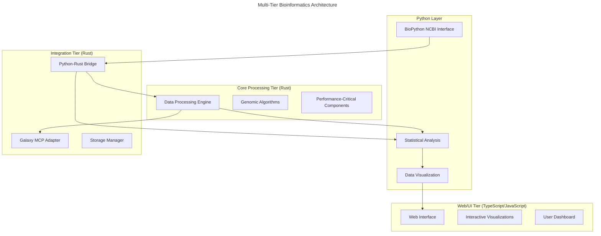
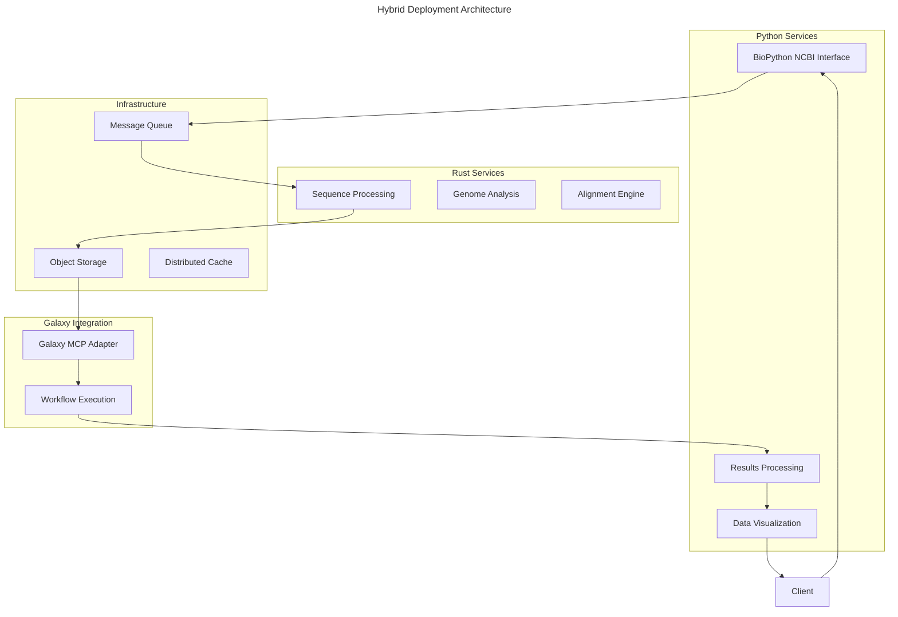

# Bioinformatics Implementation Strategy

## Overview

This document outlines the technical implementation strategy for bioinformatics integrations, specifically addressing language selection, architecture decisions, and integration patterns. We analyze whether Rust should be the primary implementation language for all components, or if a multi-language approach would be more beneficial.

## Language Evaluation

### Rust Advantages

1. **Performance**:
   - Close-to-metal performance is critical for processing large genomic datasets
   - Memory efficiency reduces resource requirements for large-scale operations
   - Zero-cost abstractions enable high-level code without sacrificing performance

2. **Memory Safety**:
   - Prevents memory-related bugs through ownership system
   - Critical for bioinformatics software where memory corruption could lead to incorrect scientific results
   - No garbage collection pauses during time-sensitive computations

3. **Concurrency**:
   - Safe concurrent programming through ownership and borrowing
   - Async/await support for efficient I/O handling
   - Parallel processing capabilities for compute-intensive operations

4. **Type System**:
   - Strong typing helps model complex bioinformatics data structures
   - Compile-time checks prevent many runtime errors
   - Traits enable flexible abstractions for bioinformatics algorithms

5. **Existing Ecosystem**:
   - Growing bioinformatics ecosystem (`rust-bio`, `rust-htslib`)
   - Strong HTTP client libraries for API integrations
   - Excellent serialization/deserialization libraries

### Alternative Languages

1. **Python**:
   - **Advantages**:
     - De facto standard in bioinformatics with extensive libraries (Biopython, scikit-bio)
     - Excellent for data analysis and visualization
     - Rapid development and prototyping
     - Strong machine learning/AI integration
     - **BioPython's mature NCBI interaction modules**
   - **Disadvantages**:
     - Performance limitations for large-scale data processing
     - GIL limits true parallelism
     - Dynamic typing can lead to runtime errors

2. **Julia**:
   - **Advantages**:
     - Designed for scientific computing with near-C performance
     - Dynamic but with optional typing
     - First-class support for parallelism
     - Multiple dispatch allows elegant bioinformatics algorithms
   - **Disadvantages**:
     - Smaller ecosystem than Python or Rust
     - Compilation latency (improving but still an issue)
     - Less mature package management

3. **Go**:
   - **Advantages**:
     - Simple concurrency model with goroutines
     - Fast compilation
     - Good performance
     - Strong standard library
   - **Disadvantages**:
     - Less expressive type system than Rust
     - Garbage collection can cause latency
     - Less mature bioinformatics ecosystem

4. **C/C++**:
   - **Advantages**:
     - Maximum performance
     - Extensive legacy bioinformatics libraries
     - Direct hardware access
   - **Disadvantages**:
     - Manual memory management prone to errors
     - Complex build systems
     - Steeper learning curve

## Recommended Multi-Tier Architecture

Rather than a one-size-fits-all approach, we recommend a multi-tier architecture with language selection based on component requirements:



## BioPython for NCBI Integration

As noted correctly, network latency when interacting with NCBI services will typically be the bottleneck rather than language performance. BioPython offers significant advantages for this specific use case:

### BioPython Advantages for NCBI Interaction

1. **Mature Library Ecosystem**:
   - `Entrez` module provides comprehensive access to NCBI's E-utilities
   - `SeqIO` handles various sequence file formats seamlessly
   - `NCBI.blast` simplifies BLAST searches

2. **Network-Bound Operations**:
   - For operations limited by network speed, Python's performance overhead is negligible
   - BioPython handles retries, rate limiting, and error recovery gracefully

3. **Rapid Development**:
   - Fewer lines of code for equivalent functionality
   - Extensive documentation and community support
   - Interactive development with notebooks for prototyping

### Example: BioPython NCBI Integration

```python
# Python module for NCBI interactions
from Bio import Entrez, SeqIO
import json

class NCBIInterface:
    def __init__(self, email, api_key=None):
        Entrez.email = email
        if api_key:
            Entrez.api_key = api_key
    
    def search_pubmed(self, query):
        """Search PubMed for articles matching query"""
        handle = Entrez.esearch(db="pubmed", term=query, retmax=100)
        record = Entrez.read(handle)
        handle.close()
        return record["IdList"]
    
    def fetch_article(self, pmid):
        """Fetch article details by PMID"""
        handle = Entrez.efetch(db="pubmed", id=pmid, retmode="xml")
        records = Entrez.read(handle)
        handle.close()
        return records
    
    def get_sequence(self, accession):
        """Retrieve a sequence by accession number"""
        handle = Entrez.efetch(db="nucleotide", id=accession, rettype="gb", retmode="text")
        record = SeqIO.read(handle, "genbank")
        handle.close()
        return record
        
    def fetch_and_prepare_for_rust(self, accession):
        """Fetch data and prepare it for processing in Rust"""
        record = self.get_sequence(accession)
        # Convert to format suitable for Rust processing
        prepared_data = {
            "sequence": str(record.seq),
            "features": [
                {
                    "type": f.type,
                    "location": str(f.location),
                    "qualifiers": {k: "".join(v) for k, v in f.qualifiers.items()}
                }
                for f in record.features
            ],
            "metadata": {
                "id": record.id,
                "name": record.name,
                "description": record.description,
                "annotations": record.annotations
            }
        }
        return json.dumps(prepared_data)
```

## Python-Rust Integration

We can combine the strengths of BioPython for NCBI interactions with Rust's performance for data processing:

### 1. Service-Based Approach (Recommended)

Use Python for the NCBI interface layer, communicating with Rust services through HTTP/gRPC:

```python
# Python NCBI client service
from fastapi import FastAPI
from ncbi_interface import NCBIInterface
import requests

app = FastAPI()
ncbi = NCBIInterface("researcher@example.com", api_key="YOUR_API_KEY")

@app.get("/api/pubmed/search")
async def search_pubmed(query: str):
    return {"ids": ncbi.search_pubmed(query)}

@app.get("/api/sequence/{accession}")
async def get_sequence(accession: str, process: bool = False):
    data = ncbi.fetch_and_prepare_for_rust(accession)
    
    if process:
        # Send to Rust service for processing
        response = requests.post(
            "http://rust-processor:8000/api/process",
            json={"data": data, "type": "sequence"}
        )
        return response.json()
    
    return {"data": data}
```

```rust
// Rust processing service
use actix_web::{web, App, HttpServer, Resp};
use serde::{Deserialize, Serialize};

#[derive(Deserialize)]
struct ProcessRequest {
    data: String,
    r#type: String,
}

#[derive(Serialize)]
struct ProcessResponse {
    results: Vec<AnalysisResult>,
    processing_time: f64,
}

async fn process_data(req: web::Json<ProcessRequest>) -> web::Json<ProcessResponse> {
    // Parse the JSON data from Python
    let sequence_data: SequenceData = serde_json::from_str(&req.data)
        .expect("Failed to parse sequence data");
    
    // Perform high-performance processing
    let results = process_sequence(&sequence_data);
    
    web::Json(ProcessResponse {
        results,
        processing_time: 0.123, // Actual processing time
    })
}

#[actix_web::main]
async fn main() -> std::io::Result<()> {
    HttpServer::new(|| {
        App::new()
            .route("/api/process", web::post().to(process_data))
    })
    .bind("0.0.0.0:8000")?
    .run()
    .await
}
```

### 2. Direct Integration with PyO3

For tighter integration, we can use PyO3 to create Rust extensions for Python:

```rust
// Rust extension for Python
use pyo3::prelude::*;
use pyo3::types::{PyDict, PyList};

#[pyfunction]
fn process_sequence(py: Python, data: &str) -> PyResult<Py<PyDict>> {
    // Parse the JSON data
    let sequence_data: SequenceData = serde_json::from_str(data)?;
    
    // Perform high-performance processing
    let results = perform_analysis(&sequence_data);
    
    // Convert results back to Python
    let result_dict = PyDict::new(py);
    let py_results = PyList::empty(py);
    
    for result in results {
        let py_result = PyDict::new(py);
        py_result.set_item("feature", result.feature)?;
        py_result.set_item("score", result.score)?;
        py_results.append(py_result)?;
    }
    
    result_dict.set_item("results", py_results)?;
    result_dict.set_item("processing_time", results.processing_time)?;
    
    Ok(result_dict.into())
}

#[pymodule]
fn bio_processor(_py: Python, m: &PyModule) -> PyResult<()> {
    m.add_function(wrap_pyfunction!(process_sequence, m)?)?;
    Ok(())
}
```

```python
# Python code using Rust extension
from bio_processor import process_sequence
from ncbi_interface import NCBIInterface

ncbi = NCBIInterface("researcher@example.com")

# Get data from NCBI
data = ncbi.fetch_and_prepare_for_rust("NC_000913")

# Process with high-performance Rust code
results = process_sequence(data)
print(f"Processed {len(results['results'])} features in {results['processing_time']}s")
```

## Implementation Recommendations

Based on the hybrid approach leveraging BioPython for NCBI interactions:

### 1. NCBI Data Retrieval Layer (Python)

Use BioPython to handle all NCBI database interactions:

```python
# Example of a more complex BioPython workflow
def fetch_related_sequences(gene_name, organism, max_results=10):
    """Search for a gene and retrieve related sequences"""
    # Search for the gene
    search_handle = Entrez.esearch(db="gene", term=f"{gene_name}[Gene Name] AND {organism}[Organism]")
    search_results = Entrez.read(search_handle)
    search_handle.close()
    
    if not search_results["IdList"]:
        return []
    
    # Get gene details
    gene_id = search_results["IdList"][0]
    gene_handle = Entrez.efetch(db="gene", id=gene_id, retmode="xml")
    gene_record = Entrez.read(gene_handle)
    gene_handle.close()
    
    # Find related proteins
    protein_ids = []
    for gene in gene_record:
        if "Entrezgene_locus" in gene:
            for product in gene["Entrezgene_locus"][0]["Gene-commentary_products"]:
                if "Gene-commentary_accession" in product:
                    protein_ids.append(product["Gene-commentary_accession"])
    
    # Get protein sequences
    sequences = []
    for protein_id in protein_ids[:max_results]:
        seq_handle = Entrez.efetch(db="protein", id=protein_id, rettype="fasta", retmode="text")
        sequences.append(SeqIO.read(seq_handle, "fasta"))
        seq_handle.close()
    
    return sequences
```

### 2. Data Processing Layer (Rust)

Use Rust for computationally intensive processing:

```rust
pub struct SequenceProcessor {
    // Configuration and state
}

impl SequenceProcessor {
    pub fn new() -> Self {
        // Initialize processor
        Self { }
    }
    
    pub fn analyze_sequence(&self, sequence: &str, features: &[Feature]) -> Vec<AnalysisResult> {
        // Parallel feature analysis using Rayon
        features.par_iter()
                .map(|feature| self.analyze_feature(sequence, feature))
                .collect()
    }
    
    fn analyze_feature(&self, sequence: &str, feature: &Feature) -> AnalysisResult {
        // Compute-intensive analysis of a genomic feature
        // ...
    }
    
    pub fn find_motifs(&self, sequence: &str, motifs: &[&str], max_mismatches: usize) -> Vec<MotifMatch> {
        // Fast motif finding with FM-index or similar algorithm
        // ...
    }
}
```

### 3. Integration Layer (Python + Rust)

Combine both languages efficiently:

```python
# Python orchestration code
from bio_processor import SequenceProcessor
from ncbi_interface import NCBIInterface
import tempfile
import json

class BioinformaticsWorkflow:
    def __init__(self):
        self.ncbi = NCBIInterface("researcher@example.com")
        self.processor = SequenceProcessor()  # Rust extension
    
    def analyze_genome(self, accession):
        """Full workflow combining Python and Rust"""
        # Use BioPython for data retrieval
        genome_data = self.ncbi.fetch_and_prepare_for_rust(accession)
        
        # Use Rust for compute-intensive processing
        results = self.processor.analyze_sequence(
            genome_data["sequence"],
            genome_data["features"]
        )
        
        # Use Python for results organization and visualization
        return self.generate_report(results, genome_data["metadata"])
    
    def generate_report(self, results, metadata):
        """Use Python's rich visualization libraries"""
        # Generate report with matplotlib, seaborn, etc.
        pass
```

## Performance Considerations

The hybrid approach is guided by these principles:

1. **I/O Bound vs. CPU Bound**: 
   - Use Python (BioPython) for I/O-bound operations like API calls to NCBI
   - Use Rust for CPU-bound operations like sequence analysis and alignment

2. **Data Volume Thresholds**:
   - For small datasets (<10MB), the language overhead is negligible
   - For medium datasets (10MB-1GB), Python with NumPy/Pandas may be sufficient
   - For large datasets (>1GB), Rust processing offers significant advantages

3. **Development Efficiency**:
   - Start with Python for rapid prototyping
   - Identify bottlenecks through profiling
   - Gradually replace performance-critical sections with Rust

## Deployment Model

The hybrid approach requires a cohesive deployment strategy:



## Conclusion: Should Everything Be in Rust?

Based on the updated analysis, we recommend a pragmatic hybrid approach:

1. **NCBI Data Retrieval**: **Use Python with BioPython** - leverage the mature, well-tested modules for interacting with NCBI databases where network is the bottleneck
2. **Core Data Processing**: **Use Rust** - for performance-critical algorithms and processing of large datasets
3. **API Integration**: **Mixed approach** - Python for NCBI, Rust for Galaxy MCP
4. **Workflow Management**: **Use Rust** - for reliability and performance
5. **Data Analysis**: **Mixed approach** - Python/R for statistical analysis, Rust for performance-critical stages
6. **Visualization**: **Use Python/JavaScript** - leverage powerful visualization libraries

This balanced approach acknowledges that different parts of the bioinformatics pipeline have different requirements. Network-bound operations like API calls to NCBI will not benefit significantly from Rust's performance advantages, while compute-intensive operations like genome assembly or alignment will.

The integration between Python and Rust components can be achieved through service boundaries (HTTP/gRPC) or direct integration (PyO3), depending on the specific requirements of each component.

## Implementation Roadmap

1. **Phase 1**: Create Python NCBI interface using BioPython
2. **Phase 2**: Develop core Rust processing libraries
3. **Phase 3**: Implement Python-Rust integration (PyO3 or services)
4. **Phase 4**: Build Galaxy MCP adapter in Rust
5. **Phase 5**: Develop workflow orchestration layer
6. **Phase 6**: Create visualization and reporting components in Python

## Related Specifications

- [NCBI Database Integration](./ncbi/README.md)
- [Galaxy MCP Integration](../../galaxy/galaxy-mcp-integration.md)
- [Workflow Integration](./workflows.md)
- [Rust Safety Standards](../../rules/1001-rust-safety.mdc) 