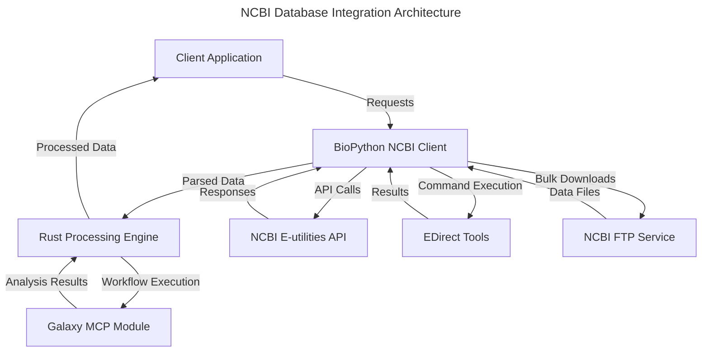
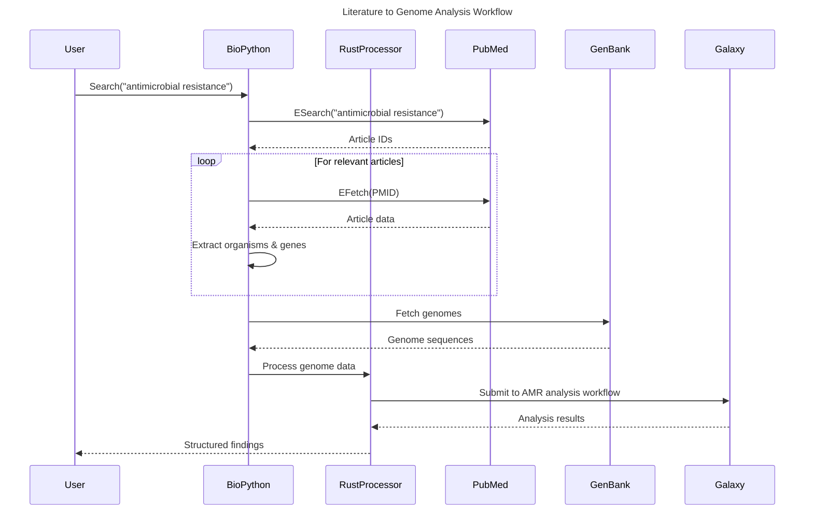
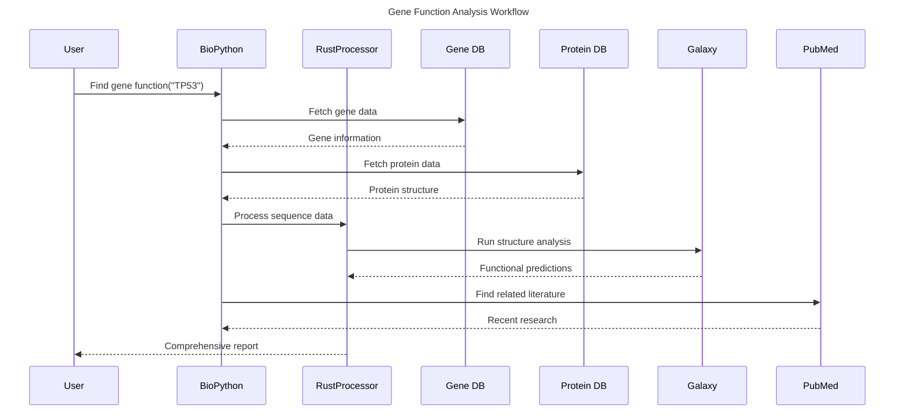

# NCBI Database Integration Specification

## Overview

This specification defines the architecture and implementation strategy for integrating with the National Center for Biotechnology Information (NCBI) databases. The integration enables AI assistants to search, retrieve, and analyze scientific literature, genomic data, and genetic information through a standardized interface that can connect with Galaxy MCP for downstream analysis. The implementation leverages BioPython for efficient NCBI data retrieval and Rust for high-performance data processing.

## Integration Goals

1. **Literature Discovery**: Search and retrieve scientific articles from PubMed and PMC
2. **Genomic Data Access**: Retrieve genome sequences and annotations from GenBank, RefSeq, and other NCBI databases
3. **Microbial Information**: Access microbial genome data and taxonomic information
4. **Gene Retrieval**: Extract gene sequences, annotations, and functional information
5. **Workflow Integration**: Enable seamless data flow from NCBI to Galaxy MCP for analysis

## Architecture



## Component Design

### 1. BioPython NCBI Client

The core client responsible for communication with NCBI services, utilizing BioPython's mature ecosystem:

```python
from Bio import Entrez, SeqIO
import json
import os

class NcbiClient:
    def __init__(self, email, api_key=None, tool_name="BioinformaticsWorkflow"):
        """Initialize NCBI client with credentials"""
        Entrez.email = email
        Entrez.tool = tool_name
        if api_key:
            Entrez.api_key = api_key
        self.cache_dir = os.path.expanduser("~/.cache/ncbi_client")
        os.makedirs(self.cache_dir, exist_ok=True)
    
    def search_pubmed(self, query, max_results=100):
        """Search PubMed for articles matching query"""
        handle = Entrez.esearch(db="pubmed", term=query, retmax=max_results)
        record = Entrez.read(handle)
        handle.close()
        return {
            "count": int(record["Count"]),
            "ids": record["IdList"]
        }
    
    def fetch_article(self, pmid):
        """Fetch article details by PMID"""
        handle = Entrez.efetch(db="pubmed", id=pmid, retmode="xml")
        records = Entrez.read(handle)
        handle.close()
        # Process into a clean format
        article = self._process_pubmed_article(records['PubmedArticle'][0])
        return article
    
    def _process_pubmed_article(self, article_data):
        """Convert PubMed XML data to clean dictionary format"""
        article = article_data['MedlineCitation']['Article']
        pmid = article_data['MedlineCitation']['PMID']
        
        # Extract authors
        authors = []
        if 'AuthorList' in article:
            for author in article['AuthorList']:
                if 'LastName' in author and 'ForeName' in author:
                    authors.append({
                        'last_name': author['LastName'],
                        'fore_name': author['ForeName'],
                        'affiliations': author.get('AffiliationInfo', [])
                    })
        
        # Build clean article representation
        return {
            'pmid': pmid,
            'title': article['ArticleTitle'],
            'abstract': article.get('Abstract', {}).get('AbstractText', []),
            'authors': authors,
            'journal': article['Journal']['Title'],
            'publication_date': article['Journal']['JournalIssue']['PubDate'],
            'keywords': article_data['MedlineCitation'].get('KeywordList', [[]])[0]
        }
    
    def get_genome(self, accession):
        """Retrieve genome data by accession number"""
        handle = Entrez.efetch(db="nucleotide", id=accession, rettype="gb", retmode="text")
        record = SeqIO.read(handle, "genbank")
        handle.close()
        
        # Convert to a dictionary format suitable for processing
        genome_data = {
            "accession": record.id,
            "organism": record.annotations.get("organism", ""),
            "taxonomy": record.annotations.get("taxonomy", []),
            "sequence": str(record.seq),
            "features": [
                {
                    "type": f.type,
                    "location": str(f.location),
                    "start": int(f.location.start),
                    "end": int(f.location.end),
                    "strand": f.location.strand,
                    "qualifiers": {k: "".join(v) if isinstance(v, list) else v 
                                  for k, v in f.qualifiers.items()}
                }
                for f in record.features
            ],
            "metadata": {
                "molecule_type": record.annotations.get("molecule_type", ""),
                "topology": record.annotations.get("topology", ""),
                "date": record.annotations.get("date", ""),
                "references": [
                    {
                        "title": ref.title,
                        "authors": ref.authors,
                        "journal": ref.journal,
                    }
                    for ref in record.annotations.get("references", [])
                ]
            }
        }
        
        return genome_data
    
    def get_gene(self, gene_id):
        """Retrieve gene data by Gene ID"""
        handle = Entrez.efetch(db="gene", id=gene_id, retmode="xml")
        record = Entrez.read(handle)
        handle.close()
        
        # Process gene data
        gene_data = self._process_gene_record(record[0])
        
        # Get associated sequence if available
        if 'genomic_accession' in gene_data:
            gene_data['sequence'] = self._get_gene_sequence(
                gene_data['genomic_accession'], 
                gene_data['start'], 
                gene_data['end']
            )
            
        return gene_data
    
    def _process_gene_record(self, gene_record):
        """Process gene record from NCBI Gene database"""
        # Extract key information from complex Gene record structure
        gene_data = {
            'gene_id': gene_record['Entrezgene_track-info']['Gene-track']['Gene-track_geneid'],
            'symbol': gene_record['Entrezgene_gene']['Gene-ref']['Gene-ref_locus'],
            'description': gene_record['Entrezgene_gene']['Gene-ref']['Gene-ref_desc'],
            'organism': {
                'scientific_name': gene_record['Entrezgene_source']['BioSource']['BioSource_org']['Org-ref']['Org-ref_taxname'],
                'taxonomy_id': gene_record['Entrezgene_source']['BioSource']['BioSource_org']['Org-ref']['Org-ref_db'][0]['Dbtag']['Dbtag_tag']['Object-id']['Object-id_id']
            }
        }
        
        # Extract genomic location if available
        if 'Entrezgene_locus' in gene_record:
            for locus in gene_record['Entrezgene_locus']:
                if 'Gene-commentary_accession' in locus:
                    gene_data['genomic_accession'] = locus['Gene-commentary_accession']
                    gene_data['start'] = locus['Gene-commentary_seqs'][0]['Seq-loc_int']['Seq-interval']['Seq-interval_from']
                    gene_data['end'] = locus['Gene-commentary_seqs'][0]['Seq-loc_int']['Seq-interval']['Seq-interval_to']
                    break
        
        return gene_data
    
    def _get_gene_sequence(self, accession, start, end):
        """Retrieve gene sequence from genomic coordinates"""
        handle = Entrez.efetch(
            db="nucleotide", 
            id=accession, 
            seq_start=start+1,  # NCBI uses 1-based indexing
            seq_stop=end+1,
            rettype="fasta", 
            retmode="text"
        )
        record = SeqIO.read(handle, "fasta")
        handle.close()
        return str(record.seq)
    
    def get_taxonomy(self, taxid):
        """Retrieve taxonomic information"""
        handle = Entrez.efetch(db="taxonomy", id=taxid, retmode="xml")
        records = Entrez.read(handle)
        handle.close()
        
        if not records:
            return None
            
        taxonomy_data = {
            'taxid': records[0]['TaxId'],
            'scientific_name': records[0]['ScientificName'],
            'common_name': records[0].get('CommonName', ''),
            'rank': records[0]['Rank'],
            'division': records[0]['Division'],
            'lineage': records[0]['Lineage'],
            'genetic_code': records[0]['GeneticCode']['GCName'],
            'mitochondrial_genetic_code': records[0]['MitoGeneticCode']['MGCName']
        }
        
        # Build lineage path
        taxonomy_data['lineage_ex'] = [
            {
                'taxid': item['TaxId'],
                'scientific_name': item['ScientificName'],
                'rank': item['Rank']
            }
            for item in records[0].get('LineageEx', [])
        ]
        
        return taxonomy_data
    
    def fetch_for_processing(self, accession):
        """Fetch and prepare data for Rust processing"""
        return json.dumps(self.get_genome(accession))
```

### 2. Rust Processing Engine

Core processing engine for computationally intensive operations:

```rust
pub struct SequenceProcessor {
    processing_config: ProcessingConfig,
}

impl SequenceProcessor {
    pub fn new(config: ProcessingConfig) -> Self {
        Self { processing_config: config }
    }
    
    pub fn process_genome(&self, genome_data: GenomeData) -> Result<ProcessedGenome, ProcessingError> {
        // High-performance genome processing
        let features = self.extract_features(&genome_data);
        let statistics = self.compute_statistics(&genome_data);
        let regions_of_interest = self.identify_regions_of_interest(&genome_data);
        
        Ok(ProcessedGenome {
            accession: genome_data.accession,
            organism: genome_data.organism,
            features,
            statistics,
            regions_of_interest,
        })
    }
    
    pub fn find_patterns(&self, sequence: &str, patterns: &[Pattern]) -> Vec<PatternMatch> {
        // Parallel pattern matching using Rayon
        patterns.par_iter()
                .flat_map(|pattern| self.find_pattern_matches(sequence, pattern))
                .collect()
    }
    
    pub fn align_sequences(&self, sequences: &[&str]) -> AlignmentResult {
        // Efficient multiple sequence alignment
        // Implementation using high-performance algorithms
    }
}
```

### 3. Data Models

Core data structures for NCBI data:

```rust
#[derive(Debug, Serialize, Deserialize)]
pub struct GenomeData {
    pub accession: String,
    pub organism: String,
    pub taxonomy: Vec<String>,
    pub sequence: String,
    pub features: Vec<Feature>,
    pub metadata: GenomeMetadata,
}

#[derive(Debug, Serialize, Deserialize)]
pub struct Feature {
    pub feature_type: String,
    pub location: String,
    pub start: usize,
    pub end: usize,
    pub strand: i8,
    pub qualifiers: HashMap<String, String>,
}

#[derive(Debug, Serialize, Deserialize)]
pub struct Article {
    pub pmid: String,
    pub title: String,
    pub abstract_text: String,
    pub authors: Vec<Author>,
    pub journal: String,
    pub publication_date: PublicationDate,
    pub keywords: Vec<String>,
}
```

### 4. Python-Rust Bridge

Component for bridging BioPython with the Rust processing engine:

```python
# bridge.py
import json
from rust_bio_extensions import process_genome, find_patterns

class BioProcessor:
    def __init__(self, config=None):
        self.config = config or {}
    
    def process_genome_data(self, genome_data):
        """Process genome data using Rust extension"""
        # Convert Python dict to JSON string for Rust
        if isinstance(genome_data, dict):
            genome_json = json.dumps(genome_data)
        else:
            genome_json = genome_data
            
        # Call Rust extension
        result_json = process_genome(genome_json, self.config)
        
        # Parse back to Python dict
        return json.loads(result_json)
    
    def find_patterns(self, sequence, patterns):
        """Find patterns in sequence using Rust extension"""
        patterns_json = json.dumps(patterns)
        result_json = find_patterns(sequence, patterns_json)
        return json.loads(result_json)
```

### 5. NCBI-Galaxy Integration

Components for connecting NCBI data with Galaxy workflows:

```python
class NcbiGalaxyIntegration:
    def __init__(self, ncbi_client, galaxy_adapter):
        self.ncbi = ncbi_client
        self.galaxy = galaxy_adapter
        self.processor = BioProcessor()
    
    async def article_to_workflow(self, pmid, workflow_id):
        """Process article and submit relevant data to Galaxy workflow"""
        # Get article data
        article = self.ncbi.fetch_article(pmid)
        
        # Extract organisms mentioned in article
        organisms = self._extract_organisms_from_article(article)
        
        # Get genomes for detected organisms
        genomes = []
        for organism in organisms:
            if 'taxonomy_id' in organism:
                # Get reference genome for this organism
                genome_data = self.ncbi.get_reference_genome_by_taxid(organism['taxonomy_id'])
                if genome_data:
                    genomes.append(genome_data)
        
        # Process genomes with Rust
        processed_genomes = [self.processor.process_genome_data(g) for g in genomes]
        
        # Send to Galaxy workflow
        workflow_invocation = await self.galaxy.invoke_workflow(
            workflow_id,
            inputs={
                'article': article,
                'genomes': processed_genomes
            }
        )
        
        return workflow_invocation
    
    def _extract_organisms_from_article(self, article):
        """Extract organism mentions from article text"""
        # Implementation using NLP or pattern matching
        pass
```

## Workflow Examples

### 1. Literature-to-Genome Analysis



### 2. Gene Function Analysis



## API Endpoints

### Base URL: `/api/v1/ncbi/`

| Endpoint | Method | Description |
|----------|--------|-------------|
| `/literature/search` | GET | Search scientific literature |
| `/literature/{pmid}` | GET | Get article by PMID |
| `/genome/search` | GET | Search genomic data |
| `/genome/{accession}` | GET | Get genome by accession |
| `/gene/search` | GET | Search gene data |
| `/gene/{gene_id}` | GET | Get gene by ID |
| `/taxonomy/{taxid}` | GET | Get taxonomy information |
| `/integrated/article-to-workflow` | POST | Process article and run Galaxy workflow |
| `/integrated/genome-to-workflow` | POST | Process genome and run Galaxy workflow |

## Implementation Considerations

### 1. Rate Limiting and Quotas

NCBI E-utilities has specific usage guidelines:
- No more than 3 requests per second without API key
- No more than 10 requests per second with API key
- Include email and tool name in requests

BioPython advantages for handling these requirements:
- Built-in rate limiting support
- Automatic handling of required headers
- Robust error handling and retries

Implementation includes:
- Python-based request throttling
- Proper identification headers managed by BioPython
- Quota monitoring
- Error handling for rate limits

### 2. Data Management

Large genomic datasets require special handling:
- Streaming downloads for large files (handled by BioPython)
- Efficient conversion to formats suitable for Rust processing
- Caching strategy for frequently accessed data
- Garbage collection for temporary files

### 3. Authentication

- Support for NCBI API keys via BioPython
- Secure credential storage
- Environment variable configuration

## Technology Stack

The hybrid implementation approach uses:

1. **Python with BioPython** for NCBI data retrieval:
   - Mature, well-tested modules for interacting with NCBI E-utilities
   - Excellent support for various bioinformatics file formats
   - Simplified handling of complex NCBI data structures
   - Network latency becomes the bottleneck, not language performance

2. **Rust** for performance-critical processing:
   - High performance for data processing
   - Memory safety for genomic data handling
   - Strict typing for bioinformatics data models
   - Parallel processing for compute-intensive tasks

3. **Integration Approaches**:
   - Service-based integration via HTTP/gRPC
   - Direct integration via PyO3 for Rust-Python binding
   - Shared data formats (JSON) for interoperability

4. **Key Libraries**:
   - `BioPython` for NCBI interactions
   - `rust-bio` for bioinformatics algorithms
   - `tokio` for async runtime in Rust
   - `PyO3` for Python-Rust integration
   - `FastAPI` for REST API services

## Security Considerations

1. **Data Protection**:
   - Genomic data may be sensitive
   - Implement proper access controls
   - Encrypt data in transit

2. **Credential Management**:
   - Secure API key storage
   - Use environment variables or secure vaults
   - Rotate credentials regularly

3. **Data Validation**:
   - Validate all inputs from external sources
   - Sanitize data before processing

## Testing Strategy

1. **Unit Tests**:
   - Test BioPython retrieval functions
   - Test Rust processing algorithms
   - Validate Python-Rust data exchange

2. **Integration Tests**:
   - Test end-to-end data flow
   - Verify correct handling of various NCBI data types
   - Test Galaxy MCP integration

3. **Mock Services**:
   - Create mock NCBI services for testing
   - Cache real NCBI responses for reproducible tests
   - Simulate error conditions

## Next Steps

1. Implement BioPython NCBI client with E-utilities support
2. Create Rust processing engine for genomic data
3. Develop Python-Rust bridge (PyO3 or services)
4. Build Galaxy MCP integration in Rust
5. Add workflow templates for common bioinformatics tasks
6. Implement caching and optimizations

## Related Specifications

- [Galaxy MCP Integration](../../galaxy/galaxy-mcp-integration.md)
- [API Client Framework](../api_client/README.md)
- [Implementation Strategy](../implementation-strategy.md)
- [Data Management Lifecycle](../../galaxy/data-management.md) 