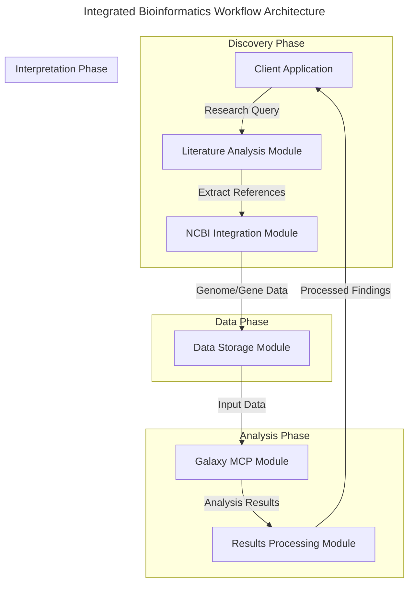
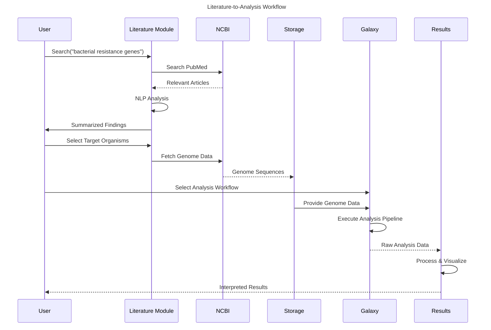
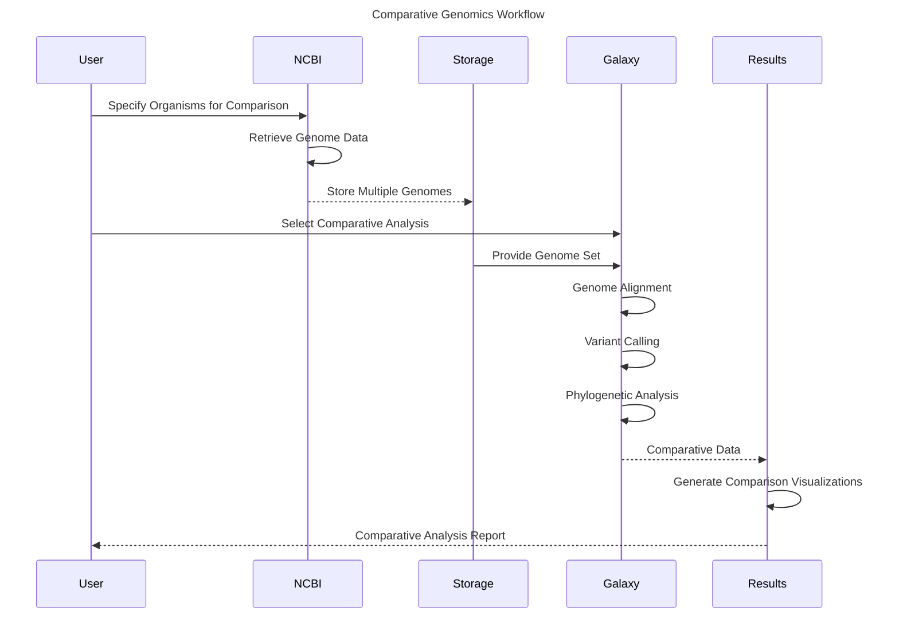
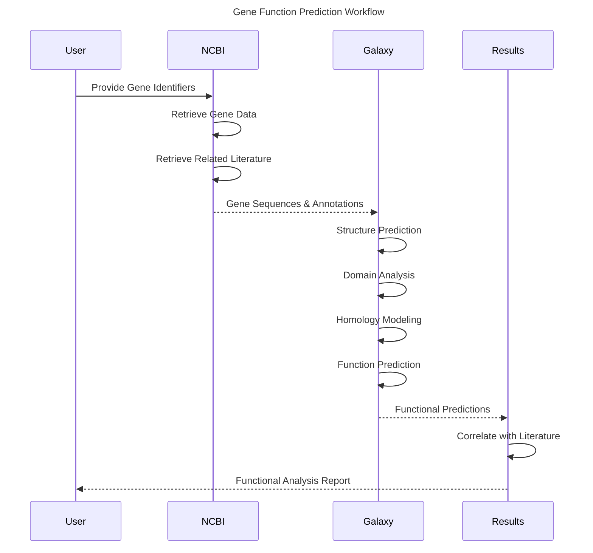

# Bioinformatics Workflow Integration Specification

## Overview

This specification defines comprehensive bioinformatics workflows that integrate data retrieval from NCBI databases with analysis tools provided through Galaxy MCP. These workflows enable end-to-end research processes from literature discovery to analysis results, creating a cohesive ecosystem for AI-assisted bioinformatics research.

## Workflow Architecture

The integration follows a modular architecture where distinct components handle specific phases of the research process:



## Core Workflows

### 1. Literature-to-Analysis Workflow

This workflow begins with scientific literature and follows data through to analysis results:



### 2. Comparative Genomics Workflow

This workflow focuses on comparing multiple genomes retrieved from NCBI:



### 3. Gene Function Prediction Workflow

This workflow retrieves gene data and predicts functions using Galaxy tools:



## Integration Components

### 1. Workflow Coordinator

Central component managing the workflow execution:

```rust
pub struct WorkflowCoordinator {
    literature_module: LiteratureModule,
    ncbi_client: NcbiClient,
    galaxy_adapter: GalaxyAdapter,
    storage_manager: StorageManager,
    results_processor: ResultsProcessor,
}

impl WorkflowCoordinator {
    pub fn new(config: WorkflowConfig) -> Self {
        // Initialize with all required components
    }
    
    pub async fn execute_literature_to_analysis(&self, query: &str, options: WorkflowOptions) 
        -> Result<WorkflowResults, WorkflowError> {
        // Execute the full literature to analysis workflow
    }
    
    pub async fn execute_comparative_genomics(&self, genome_ids: Vec<&str>, analysis_type: ComparativeAnalysisType) 
        -> Result<ComparativeResults, WorkflowError> {
        // Execute comparative genomics workflow
    }
    
    pub async fn execute_gene_function_prediction(&self, gene_ids: Vec<&str>) 
        -> Result<FunctionPredictionResults, WorkflowError> {
        // Execute gene function prediction workflow
    }
}
```

### 2. State Management

Tracks the state of long-running workflows:

```rust
pub struct WorkflowState {
    workflow_id: String,
    workflow_type: WorkflowType,
    stages: Vec<WorkflowStage>,
    current_stage: usize,
    start_time: DateTime<Utc>,
    stage_progress: HashMap<String, f32>,
    artifacts: HashMap<String, ArtifactMetadata>,
    status: WorkflowStatus,
}

impl WorkflowState {
    pub fn new(workflow_type: WorkflowType) -> Self {
        // Initialize workflow state
    }
    
    pub fn advance_to_stage(&mut self, stage_name: &str) -> Result<(), StateError> {
        // Advance workflow to next stage
    }
    
    pub fn update_progress(&mut self, stage_name: &str, progress: f32) {
        // Update progress for the current stage
    }
    
    pub fn add_artifact(&mut self, name: &str, metadata: ArtifactMetadata) {
        // Add output artifact to the workflow
    }
    
    pub fn complete(&mut self) {
        // Mark workflow as complete
    }
}
```

### 3. Literature Analysis Module

Processes scientific literature to extract relevant information:

```rust
pub struct LiteratureModule {
    ncbi_client: NcbiClient,
    nlp_engine: NlpEngine,
}

impl LiteratureModule {
    pub fn new(ncbi_config: NcbiConfig, nlp_config: NlpConfig) -> Self {
        // Initialize with required components
    }
    
    pub async fn search_literature(&self, query: &str, options: SearchOptions) 
        -> Result<Vec<ArticleSummary>, LiteratureError> {
        // Search literature and summarize findings
    }
    
    pub async fn extract_biological_entities(&self, article: &Article) 
        -> Result<BiologicalEntities, LiteratureError> {
        // Extract organisms, genes, and other biological entities
    }
    
    pub async fn generate_research_summary(&self, articles: &[Article]) 
        -> Result<ResearchSummary, LiteratureError> {
        // Generate comprehensive research summary
    }
}
```

### 4. Data Storage Manager

Manages temporary and persistent storage of large biological datasets:

```rust
pub struct StorageManager {
    config: StorageConfig,
    temp_storage: TempStorage,
    persistent_storage: PersistentStorage,
}

impl StorageManager {
    pub fn new(config: StorageConfig) -> Self {
        // Initialize with storage configuration
    }
    
    pub async fn store_genome(&self, genome: GenomeData) -> Result<StorageLocation, StorageError> {
        // Store genome data
    }
    
    pub async fn retrieve_genome(&self, location: &StorageLocation) -> Result<GenomeData, StorageError> {
        // Retrieve genome data
    }
    
    pub async fn store_analysis_results(&self, results: AnalysisResults) -> Result<StorageLocation, StorageError> {
        // Store analysis results
    }
    
    pub async fn cleanup_temporary_data(&self, workflow_id: &str) -> Result<(), StorageError> {
        // Clean up temporary data after workflow completion
    }
}
```

### 5. Results Processor

Processes and visualizes analysis results:

```rust
pub struct ResultsProcessor {
    visualization_engine: VisualizationEngine,
    report_generator: ReportGenerator,
}

impl ResultsProcessor {
    pub fn new(config: ProcessorConfig) -> Self {
        // Initialize with required components
    }
    
    pub async fn process_comparative_results(&self, results: ComparativeResults) 
        -> Result<ProcessedResults, ProcessingError> {
        // Process comparative genomics results
    }
    
    pub async fn process_function_predictions(&self, results: FunctionPredictionResults) 
        -> Result<ProcessedResults, ProcessingError> {
        // Process function prediction results
    }
    
    pub async fn generate_visualization(&self, data: &ProcessedResults, type_: VisualizationType) 
        -> Result<Visualization, ProcessingError> {
        // Generate visualization for the results
    }
    
    pub async fn generate_report(&self, results: &ProcessedResults, template: ReportTemplate) 
        -> Result<Report, ProcessingError> {
        // Generate comprehensive report
    }
}
```

## Example Use Cases

### 1. Antibiotic Resistance Research

A researcher studies antibiotic resistance in bacterial populations:

1. Searches literature for recent findings on specific resistance mechanisms
2. System extracts mentions of bacterial strains and resistance genes
3. Retrieves genome sequences for identified bacterial strains from NCBI
4. Applies Galaxy's resistance gene identification workflow
5. Performs comparative analysis of resistance patterns
6. Generates visualization of resistance mechanisms across strains
7. Creates comprehensive report linking literature findings with genomic evidence

### 2. Protein Function Discovery

A researcher investigates the function of uncharacterized proteins:

1. Starts with a set of gene identifiers for proteins of unknown function
2. System retrieves gene sequences and existing annotations from NCBI
3. Searches literature for any mentions of these genes or related proteins
4. Applies Galaxy's protein structure prediction workflows
5. Performs domain analysis and functional site prediction
6. Compares with known proteins of similar structure
7. Generates a report with predicted functions and confidence scores

### 3. Microbial Community Analysis

A researcher studies microbial communities in environmental samples:

1. Starts with metagenomic sequencing data from environmental samples
2. System identifies potential microbial species using Galaxy's metagenomic tools
3. Retrieves reference genomes for identified species from NCBI
4. Analyzes community composition and functional potential
5. Correlates findings with existing literature on similar environments
6. Generates visualizations of community structure and metabolic pathways
7. Creates a comprehensive ecological interpretation of the community

## API Endpoints

### Base URL: `/api/v1/workflows/`

| Endpoint | Method | Description |
|----------|--------|-------------|
| `/templates` | GET | List available workflow templates |
| `/templates/{id}` | GET | Get workflow template details |
| `/execute/literature-to-analysis` | POST | Execute literature-to-analysis workflow |
| `/execute/comparative-genomics` | POST | Execute comparative genomics workflow |
| `/execute/gene-function` | POST | Execute gene function prediction workflow |
| `/status/{workflow_id}` | GET | Get workflow execution status |
| `/results/{workflow_id}` | GET | Get workflow results |
| `/visualizations/{workflow_id}` | GET | Get visualizations for workflow results |
| `/reports/{workflow_id}` | GET | Get generated reports |

## Implementation Strategy

### Recommended Approach

The implementation should follow a modular approach with Rust as the primary language:

1. **Core Libraries**:
   - Implement base functionality in Rust for performance
   - Use async/await for efficient I/O operations
   - Implement proper error handling and logging

2. **Data Processing**:
   - Use specialized bioinformatics libraries for data processing
   - Implement streaming for large dataset handling
   - Use efficient data formats (BAM, VCF, etc.)

3. **Integration Strategy**:
   - Build on existing NCBI and Galaxy MCP modules
   - Use well-defined interfaces between components
   - Implement proper state management for long-running workflows

4. **Deployment Options**:
   - Command-line interface for script-based automation
   - Web API for integration with other systems
   - Standalone application with UI for direct user interaction

## Security and Privacy Considerations

1. **Research Data Privacy**:
   - Implement proper access controls for research data
   - Encrypt sensitive information
   - Implement data retention policies

2. **Computational Resources**:
   - Implement resource quotas
   - Monitor resource usage
   - Implement fair scheduling for concurrent workflows

3. **External Service Integration**:
   - Securely manage API credentials
   - Implement proper error handling for service failures
   - Monitor service availability

## Future Extensions

1. **AI-Assisted Analysis**:
   - Integrate specialized AI models for result interpretation
   - Implement automated hypothesis generation
   - Add natural language interfaces for workflow creation

2. **Collaborative Features**:
   - Add sharing capabilities for workflows and results
   - Implement collaborative annotation of findings
   - Add version control for workflows

3. **Advanced Visualizations**:
   - Implement interactive visualization components
   - Add 3D structure visualization
   - Implement comparative visualization tools

## Next Steps

1. Implement core workflow coordination components
2. Create integration points between NCBI and Galaxy modules
3. Develop workflow templates for common use cases
4. Implement state management and persistence
5. Create visualization and reporting components
6. Add user interfaces for workflow management
7. Conduct integration testing with real-world scenarios

## Related Specifications

- [NCBI Database Integration](./ncbi/README.md)
- [Galaxy MCP Integration](../../galaxy/galaxy-mcp-integration.md)
- [Data Management Lifecycle](../../galaxy/data-management.md)
- [AI Tools Integration](../ai_tools/README.md) 