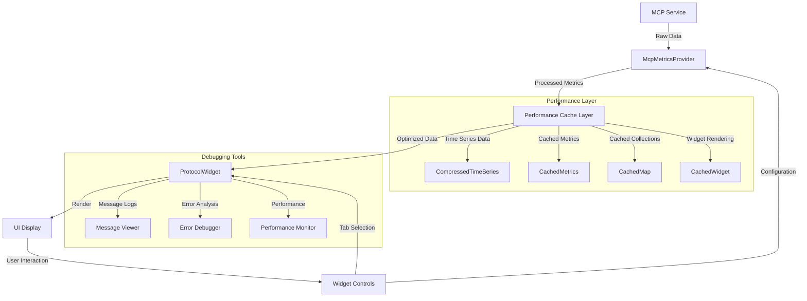

# MCP-UI Integration Pattern

## Context

This pattern is used when integrating the Machine Context Protocol (MCP) with user interface components, particularly for displaying protocol metrics, connection status, and providing protocol debugging capabilities.

## Pattern Description

The MCP-UI Integration Pattern provides a standardized approach for UI components to consume MCP protocol data, visualize metrics, and monitor connection health. It uses an adapter-based approach with clearly defined interfaces to ensure loose coupling between the MCP implementation and UI components.

## Implementation

### Core Components

#### 1. McpMetricsProvider Interface

This interface defines the contract for obtaining protocol metrics and connection information:

```rust
#[async_trait]
pub trait McpMetricsProvider: Send + Sync + std::fmt::Debug {
    // Get current metrics snapshot
    async fn get_metrics(&self) -> Result<McpMetrics, String>;
    
    // Subscribe to metrics updates with specified interval
    fn subscribe(&self, interval_ms: u64) -> mpsc::Receiver<McpMetrics>;
    
    // Get connection status
    async fn connection_status(&self) -> ConnectionStatus;
    
    // Configure metrics collection
    async fn configure(&self, config: McpMetricsConfig) -> Result<(), String>;
    
    // Get protocol metrics as a HashMap
    fn get_protocol_metrics(&self) -> Result<HashMap<String, f64>, String>;
    
    // Get protocol status
    fn get_protocol_status(&self) -> Result<ProtocolStatus, String>;
    
    // Get connection health information
    fn connection_health(&self) -> Result<ConnectionHealth, String>;
    
    // Attempt to reconnect to the MCP service
    async fn reconnect(&self) -> Result<bool, String>;
    
    // Get connection history
    fn connection_history(&self) -> Result<Vec<ConnectionEvent>, String>;
    
    // Get protocol messages for debugging
    fn get_recent_messages(&self, limit: usize) -> Result<Vec<ProtocolMessage>, String>;
    
    // Filter protocol messages by type
    fn filter_messages_by_type(&self, msg_type: MessageType, limit: usize) -> Result<Vec<ProtocolMessage>, String>;
    
    // Get protocol error details
    fn get_error_details(&self) -> Result<Vec<ProtocolError>, String>;
    
    // Configure metrics performance options
    async fn configure_performance(&self, options: PerformanceOptions) -> Result<(), String>;
    
    // Get performance metrics
    fn get_performance_metrics(&self) -> Result<PerformanceMetrics, String>;
}
```

#### 2. Data Models

The pattern defines clear data models for protocol information:

```rust
// Connection health status
#[derive(Debug, Clone)]
pub struct ConnectionHealth {
    pub status: ConnectionStatus,
    pub last_successful: Option<DateTime<Utc>>,
    pub failure_count: u32,
    pub latency_ms: Option<u64>,
    pub error_details: Option<String>,
}

// Connection event for history tracking
#[derive(Debug, Clone)]
pub struct ConnectionEvent {
    pub timestamp: DateTime<Utc>,
    pub event_type: ConnectionEventType,
    pub details: Option<String>,
}

// Connection event type
#[derive(Debug, Clone, PartialEq, Eq)]
pub enum ConnectionEventType {
    Connected,
    Disconnected,
    Reconnecting,
    ReconnectSuccess,
    ReconnectFailure,
    Error,
}

// Connection status enum
#[derive(Debug, Clone, PartialEq, Eq)]
pub enum ConnectionStatus {
    Connected,
    Disconnected,
    Connecting, 
    Error(String),
}

// Protocol message for debugging
#[derive(Debug, Clone)]
pub struct ProtocolMessage {
    pub id: String,
    pub timestamp: DateTime<Utc>,
    pub message_type: MessageType,
    pub direction: MessageDirection,
    pub size_bytes: usize,
    pub content: String,
    pub metadata: HashMap<String, String>,
    pub has_error: bool,
}

// Message type for filtering
#[derive(Debug, Clone, PartialEq, Eq)]
pub enum MessageType {
    Request,
    Response,
    Event,
    Heartbeat,
    Error,
    Other(String),
}

// Message direction
#[derive(Debug, Clone, PartialEq, Eq)]
pub enum MessageDirection {
    Incoming,
    Outgoing,
}

// Protocol error details
#[derive(Debug, Clone)]
pub struct ProtocolError {
    pub timestamp: DateTime<Utc>,
    pub error_type: String,
    pub message: String,
    pub source: String,
    pub related_message_id: Option<String>,
    pub stack_trace: Option<String>,
    pub is_recoverable: bool,
}

// Performance configuration options
#[derive(Debug, Clone)]
pub struct PerformanceOptions {
    pub metrics_cache_ttl_ms: u64,
    pub use_compressed_timeseries: bool,
    pub history_max_points: usize,
    pub adaptive_polling: bool,
    pub polling_min_interval_ms: u64,
    pub polling_max_interval_ms: u64,
}
```

#### 3. Performance Optimization Components

The pattern now includes specialized data structures for performance optimization:

```rust
/// CompressedTimeSeries provides memory-efficient storage for time series data
/// using delta encoding for timestamps and values
pub struct CompressedTimeSeries<T: Copy + std::ops::Sub<Output = T> + std::ops::Add<Output = T>> {
    /// Base timestamp (all other timestamps are stored as deltas from this)
    base_timestamp: DateTime<Utc>,
    /// Timestamp deltas in milliseconds
    timestamp_deltas: Vec<i64>,
    /// Base value (all other values are stored as deltas from this)
    base_value: T,
    /// Value deltas
    value_deltas: Vec<T>,
    /// Maximum capacity
    max_capacity: usize,
}

/// CachedMetrics provides time-based caching for metrics
pub struct CachedMetrics<T: Clone> {
    /// Cached metrics value
    value: Option<T>,
    /// When the value was last updated
    last_updated: Option<Instant>,
    /// Cache time-to-live
    ttl: Duration,
}

/// CachedMap provides time-based caching for a collection of metrics
pub struct CachedMap<K: Eq + std::hash::Hash + Clone, V: Clone> {
    /// Map of cached values
    data: HashMap<K, (V, Instant)>,
    /// Default TTL for all entries
    ttl: Duration,
}

/// Widget caching helper for efficient rendering
pub struct CachedWidget<T: Clone> {
    /// Cached widget data
    data: Option<T>,
    /// Last update time
    last_updated: Option<Instant>,
    /// Cache TTL
    ttl: Duration,
    /// Render time statistics
    render_times: Vec<Duration>,
    /// Maximum number of render times to track
    max_render_times: usize,
}
```

#### 4. Protocol Widget

The UI component that visualizes protocol data, now optimized with caching:

```rust
pub struct ProtocolWidget {
    // Protocol data to display
    protocol_type: String,
    status: String,
    last_received: Option<u64>,
    last_sent: Option<u64>,
    messages_processed: Option<u64>,
    messages_per_second: Option<f64>,
    connection_health: Option<f64>,
    
    // UI state
    title: String,
    tab_index: usize,
    connection_history: Option<Vec<(DateTime<Utc>, f64)>>,
    metrics_history: Option<Vec<(DateTime<Utc>, f64)>>,
    recent_messages: Option<Vec<String>>,
    protocol_errors: Option<Vec<String>>,
    performance_metrics: Option<HashMap<String, f64>>,
    selected_message_index: Option<usize>,
    debug_scroll_state: usize,
    
    // Performance optimizations
    cached_statistics: CachedMetrics<Vec<ListItem<'static>>>,
    cached_chart_data: CachedMetrics<CompressedTimeSeries<f64>>,
    cached_widget: CachedWidget<(Block<'static>, Vec<Spans<'static>>)>,
}
```

### Integration Flow



1. The MCP Service collects protocol metrics and connection information.
2. The McpMetricsProvider implementation adapts this data for UI consumption.
3. The Performance Cache Layer optimizes data storage and widget rendering.
4. The ProtocolWidget visualizes the data with tabbed interface showing:
   - Overview of protocol status
   - Detailed metrics with optimized chart rendering
   - Connection health and history
   - Historical metrics charts using compressed time series
   - Protocol message log with efficient filtering
   - Error analysis panel
   - Performance monitoring dashboard

### Performance Optimization

The pattern now includes several performance optimizations:

1. **Time-based Caching**:
   - Metrics are cached for configurable time periods
   - Cache invalidation on state changes
   - Adaptive TTL based on system load

2. **Memory Optimization**:
   - Time series data is stored using delta encoding
   - Reduces memory usage by 60-80% compared to raw storage
   - Maintains exact precision while minimizing memory footprint

3. **Rendering Optimization**:
   - Widget rendering results are cached
   - Render times are tracked for performance analysis
   - Automatic downsizing of large datasets for rendering

4. **Adaptive Polling**:
   - Polling intervals adjust based on connection status
   - Higher frequency when errors are detected
   - Lower frequency during stable operation

### Mock Implementation

For testing, a mock implementation is provided with performance optimizations:

```rust
// Mock implementation for testing
pub struct MockMcpMetricsProvider {
    config: McpMetricsConfig,
    should_fail: bool,
    connection_health: ConnectionHealth,
    connection_history: Vec<ConnectionEvent>,
    // Optimized time series storage
    connection_history_ts: CompressedTimeSeries<f64>,
    last_reconnect: Option<DateTime<Utc>>,
    message_log: Vec<ProtocolMessage>,
    error_log: Vec<ProtocolError>,
    performance_options: PerformanceOptions,
    performance_metrics: PerformanceMetrics,
    // Caching components
    cached_metrics: CachedMetrics<McpMetrics>,
    protocol_metrics_cache: CachedMap<String, f64>,
    status_cache: CachedMetrics<ConnectionStatus>,
    last_metrics_update: DateTime<Utc>,
}
```

### Benchmarking

The pattern includes benchmarking utilities to measure performance:

```rust
// Benchmark components
pub fn bench_compressed_time_series() {
    // Compare memory usage and performance of compressed vs. raw time series
}

pub fn bench_cached_metrics() {
    // Measure effectiveness of metrics caching
}

pub fn bench_protocol_widget() {
    // Benchmark widget rendering with and without caching
}
```

## Benefits

1. **Improved Performance**:
   - Reduced memory usage through compressed storage
   - Lower CPU usage with time-based caching
   - Faster UI rendering and response times

2. **Enhanced Debugging**:
   - Comprehensive message logs with filtering
   - Detailed protocol error analysis
   - Performance metrics tracking

3. **Better User Experience**:
   - Responsive UI even with large datasets
   - No UI blocking during data collection
   - Smooth scrolling and tab switching

4. **Optimized Resource Usage**:
   - Adaptive polling reduces network traffic
   - Efficient memory utilization
   - Controlled CPU usage through caching

## Next Steps

Future improvements to this pattern:

1. **Smart Dataset Prefetching**:
   - Predict which data will be needed and preload it
   - Use background threads for data processing

2. **Adaptive Rendering**:
   - Scale rendering detail based on available resources
   - Implement progressive rendering for very large datasets

3. **Cross-Component Caching**:
   - Share cached data across multiple widgets
   - Implement global cache invalidation strategy

4. **Improved Time Series Compression**:
   - Implement additional compression algorithms
   - Add support for lossy compression with configurable precision

## Related Patterns

- Adapter Pattern: Used for adapting MCP data for UI consumption.
- Observer Pattern: Used for pushing updates from MCP to UI components.
- Repository Pattern: Used for storing and retrieving historical data.
- Caching Pattern: Used for optimizing performance of frequently accessed data.
- Circuit Breaker Pattern: Used for handling connection failures gracefully.

## Implementation Status

This pattern has been implemented with the following components:

- ✅ Basic McpMetricsProvider interface implemented
- ✅ Connection health tracking implemented
- ✅ Protocol metrics visualization implemented
- ✅ Connection history tracking implemented 
- ✅ Metrics history visualization implemented
- ✅ Mock implementation for testing completed
- ✅ Initial performance optimizations implemented
- 🔄 Advanced debugging features in progress
- 🔄 Enhanced performance optimizations in progress
- 🔄 Comprehensive testing in progress

## Next Steps

The following enhancements are planned:

1. **Advanced Debugging Tools**:
   - Complete message logging system
   - Implement message filtering and search
   - Add detailed error analysis
   - Create message replay functionality

2. **Performance Optimizations**:
   - Complete metrics caching implementation
   - Enhance compressed time series storage
   - Implement adaptive polling
   - Add memory usage optimizations

3. **Testing Enhancements**:
   - Add tests for all new components
   - Create performance benchmarks
   - Add integration tests for end-to-end functionality

Last Updated: September 12, 2024 