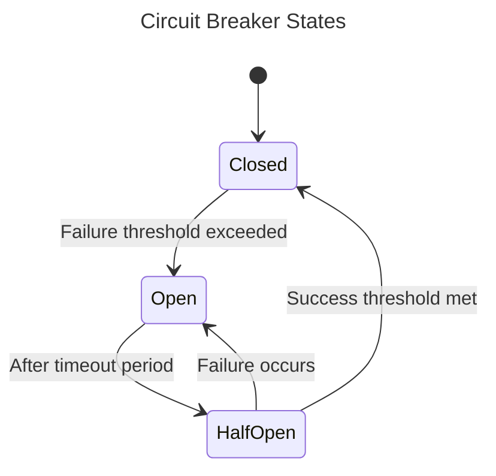

# Circuit Breaker Implementation Pattern

## Context
- When protecting systems from cascading failures
- When interacting with external services or resources
- When implementing resilient communication patterns
- When handling potentially failing operations
- When creating self-healing systems

## Core Concept

The Circuit Breaker pattern prevents system overload and cascading failures by "breaking the circuit" when repeated failures occur. It prevents operations from being attempted when they're likely to fail, allowing time for the underlying issues to be resolved.



## Implementation Guide

### Core Components

#### 1. Circuit Breaker Interface

```rust
/// Circuit breaker interface for resilient operations
#[async_trait]
pub trait CircuitBreaker: Send + Sync {
    /// Execute an operation through the circuit breaker
    async fn execute<F, T, E>(&self, operation: F) -> Result<T, BreakerError<E>>
    where
        F: Future<Output = Result<T, E>> + Send + 'static,
        E: Error + Send + Sync + 'static;
        
    /// Get the current state of the circuit breaker
    async fn state(&self) -> BreakerState;
    
    /// Manually reset the circuit breaker to closed state
    async fn reset(&self) -> Result<(), BreakerError<anyhow::Error>>;
    
    /// Manually trip the circuit breaker to open state
    async fn trip(&self) -> Result<(), BreakerError<anyhow::Error>>;
    
    /// Get metrics about the circuit breaker
    async fn metrics(&self) -> BreakerMetrics;
}
```

#### 2. Circuit Breaker States

```rust
/// States of the circuit breaker
#[derive(Debug, Clone, Copy, PartialEq, Eq, Serialize, Deserialize)]
pub enum BreakerState {
    /// Normal operation - requests are allowed through
    Closed,
    
    /// Circuit is broken - requests are blocked
    Open,
    
    /// Testing if system has recovered - limited requests allowed
    HalfOpen,
}
```

#### 3. Configuration

```rust
/// Configuration for a circuit breaker
#[derive(Debug, Clone)]
pub struct BreakerConfig {
    /// Number of failures required to trip the breaker
    pub failure_threshold: u32,
    
    /// Window of time to count failures (in seconds)
    pub failure_window: Option<Duration>,
    
    /// Time to wait before transitioning to half-open
    pub reset_timeout: Duration,
    
    /// Number of successful test requests needed to close circuit
    pub success_threshold: u32,
    
    /// Timeout for operations (optional)
    pub operation_timeout: Option<Duration>,
}

impl Default for BreakerConfig {
    fn default() -> Self {
        Self {
            failure_threshold: 5,
            failure_window: Some(Duration::from_secs(60)),
            reset_timeout: Duration::from_secs(30),
            success_threshold: 2,
            operation_timeout: Some(Duration::from_secs(10)),
        }
    }
}
```

#### 4. Metrics

```rust
/// Metrics for circuit breaker monitoring
#[derive(Debug, Clone)]
pub struct BreakerMetrics {
    /// Number of successful operations
    pub success_count: u64,
    
    /// Number of failed operations
    pub failure_count: u64,
    
    /// Number of rejected operations (circuit open)
    pub rejection_count: u64,
    
    /// Timestamp of last state change
    pub last_state_change: DateTime<Utc>,
    
    /// Current state of the circuit breaker
    pub current_state: BreakerState,
    
    /// Time spent in current state
    pub time_in_state: Duration,
}
```

### Implementation Example

#### 1. Standard Implementation

```rust
/// Standard implementation of the CircuitBreaker trait
pub struct StandardCircuitBreaker {
    /// Configuration for the circuit breaker
    config: BreakerConfig,
    
    /// Internal state protected by a mutex
    state: Arc<RwLock<BreakerInternalState>>,
}

/// Internal state of the circuit breaker
struct BreakerInternalState {
    /// Current state of the circuit breaker
    current_state: BreakerState,
    
    /// Timestamp of last state change
    last_state_change: DateTime<Utc>,
    
    /// Count of consecutive failures (in Closed state)
    failure_count: u32,
    
    /// Count of consecutive successes (in HalfOpen state)
    success_count: u32,
    
    /// Total success count since creation
    total_success_count: u64,
    
    /// Total failure count since creation
    total_failure_count: u64,
    
    /// Total rejection count since creation
    total_rejection_count: u64,
    
    /// Recent failures with timestamps
    recent_failures: VecDeque<DateTime<Utc>>,
}

impl StandardCircuitBreaker {
    /// Creates a new circuit breaker with the given configuration
    pub fn new(config: BreakerConfig) -> Self {
        Self {
            config,
            state: Arc::new(RwLock::new(BreakerInternalState {
                current_state: BreakerState::Closed,
                last_state_change: Utc::now(),
                failure_count: 0,
                success_count: 0,
                total_success_count: 0,
                total_failure_count: 0,
                total_rejection_count: 0,
                recent_failures: VecDeque::new(),
            })),
        }
    }
    
    /// Creates a new circuit breaker with default configuration
    pub fn default() -> Self {
        Self::new(BreakerConfig::default())
    }
    
    /// Handles a successful operation
    async fn handle_success(&self) {
        let mut state = self.state.write().await;
        
        match state.current_state {
            BreakerState::Closed => {
                // Reset failure count on success
                state.failure_count = 0;
                state.total_success_count += 1;
            }
            BreakerState::HalfOpen => {
                // Increment success count in half-open state
                state.success_count += 1;
                state.total_success_count += 1;
                
                // If success threshold reached, transition to closed
                if state.success_count >= self.config.success_threshold {
                    state.current_state = BreakerState::Closed;
                    state.last_state_change = Utc::now();
                    state.failure_count = 0;
                    state.success_count = 0;
                }
            }
            BreakerState::Open => {
                // This shouldn't happen, but handle gracefully
                state.total_success_count += 1;
            }
        }
    }
    
    /// Handles a failed operation
    async fn handle_failure(&self) {
        let mut state = self.state.write().await;
        
        // Record failure timestamp if we're tracking failure window
        if let Some(window) = self.config.failure_window {
            let now = Utc::now();
            state.recent_failures.push_back(now);
            
            // Remove failures outside the window
            while let Some(timestamp) = state.recent_failures.front() {
                if now.signed_duration_since(*timestamp) > window {
                    state.recent_failures.pop_front();
                } else {
                    break;
                }
            }
        }
        
        match state.current_state {
            BreakerState::Closed => {
                // Increment failure count
                state.failure_count += 1;
                state.total_failure_count += 1;
                
                // Check if threshold exceeded
                let threshold_exceeded = if let Some(_) = self.config.failure_window {
                    // Use the size of recent_failures if we have a window
                    state.recent_failures.len() as u32 >= self.config.failure_threshold
                } else {
                    // Otherwise use consecutive failures
                    state.failure_count >= self.config.failure_threshold
                };
                
                // Trip the breaker if threshold exceeded
                if threshold_exceeded {
                    state.current_state = BreakerState::Open;
                    state.last_state_change = Utc::now();
                }
            }
            BreakerState::HalfOpen => {
                // Any failure in half-open returns to open
                state.current_state = BreakerState::Open;
                state.last_state_change = Utc::now();
                state.failure_count = 0;
                state.success_count = 0;
                state.total_failure_count += 1;
            }
            BreakerState::Open => {
                // This shouldn't happen, but handle gracefully
                state.total_failure_count += 1;
            }
        }
    }
    
    /// Checks if a timeout has elapsed since the last state change
    async fn check_timeout_elapsed(&self) -> bool {
        let state = self.state.read().await;
        if state.current_state == BreakerState::Open {
            let elapsed = Utc::now().signed_duration_since(state.last_state_change);
            elapsed > self.config.reset_timeout
        } else {
            false
        }
    }
}

#[async_trait]
impl CircuitBreaker for StandardCircuitBreaker {
    async fn execute<F, T, E>(&self, operation: F) -> Result<T, BreakerError<E>>
    where
        F: Future<Output = Result<T, E>> + Send + 'static,
        E: Error + Send + Sync + 'static,
    {
        // Check current state and handle accordingly
        let current_state = self.state().await;
        
        match current_state {
            BreakerState::Open => {
                // Check if timeout has elapsed to transition to half-open
                if self.check_timeout_elapsed().await {
                    // Transition to half-open
                    let mut state = self.state.write().await;
                    state.current_state = BreakerState::HalfOpen;
                    state.last_state_change = Utc::now();
                    state.success_count = 0;
                    drop(state); // Release lock before continuing
                } else {
                    // Circuit is open, fast fail
                    let mut state = self.state.write().await;
                    state.total_rejection_count += 1;
                    return Err(BreakerError::CircuitOpen);
                }
            }
            BreakerState::HalfOpen => {
                // In half-open state, only allow limited test requests
                let state = self.state.read().await;
                if state.success_count + state.failure_count >= self.config.success_threshold {
                    // Too many test requests already in progress
                    drop(state);
                    let mut state = self.state.write().await;
                    state.total_rejection_count += 1;
                    return Err(BreakerError::CircuitHalfOpen);
                }
            }
            BreakerState::Closed => {
                // Normal operation, proceed
            }
        }
        
        // Execute the operation with optional timeout
        let result = if let Some(timeout) = self.config.operation_timeout {
            match tokio::time::timeout(timeout, operation).await {
                Ok(result) => result,
                Err(_) => {
                    self.handle_failure().await;
                    return Err(BreakerError::Timeout);
                }
            }
        } else {
            operation.await
        };
        
        // Handle result
        match result {
            Ok(value) => {
                self.handle_success().await;
                Ok(value)
            }
            Err(err) => {
                self.handle_failure().await;
                Err(BreakerError::OperationFailed(err))
            }
        }
    }
    
    async fn state(&self) -> BreakerState {
        let state = self.state.read().await;
        state.current_state
    }
    
    async fn reset(&self) -> Result<(), BreakerError<anyhow::Error>> {
        let mut state = self.state.write().await;
        state.current_state = BreakerState::Closed;
        state.last_state_change = Utc::now();
        state.failure_count = 0;
        state.success_count = 0;
        state.recent_failures.clear();
        Ok(())
    }
    
    async fn trip(&self) -> Result<(), BreakerError<anyhow::Error>> {
        let mut state = self.state.write().await;
        state.current_state = BreakerState::Open;
        state.last_state_change = Utc::now();
        Ok(())
    }
    
    async fn metrics(&self) -> BreakerMetrics {
        let state = self.state.read().await;
        BreakerMetrics {
            success_count: state.total_success_count,
            failure_count: state.total_failure_count,
            rejection_count: state.total_rejection_count,
            last_state_change: state.last_state_change,
            current_state: state.current_state,
            time_in_state: Utc::now().signed_duration_since(state.last_state_change).to_std().unwrap_or_default(),
        }
    }
}
```

### Integration with Monitoring System

Circuit breakers should report their metrics to the monitoring system:

```rust
/// CircuitBreaker with monitoring integration
pub struct MonitoredCircuitBreaker<B: CircuitBreaker> {
    /// Inner circuit breaker
    inner: B,
    
    /// Metrics collector for monitoring
    metrics_collector: Arc<dyn MetricsCollector>,
    
    /// Component name for metrics
    component_name: String,
}

impl<B: CircuitBreaker> MonitoredCircuitBreaker<B> {
    /// Create a new monitored circuit breaker
    pub fn new(
        inner: B, 
        metrics_collector: Arc<dyn MetricsCollector>,
        component_name: impl Into<String>,
    ) -> Self {
        Self {
            inner,
            metrics_collector,
            component_name: component_name.into(),
        }
    }
    
    /// Report metrics to the monitoring system
    async fn report_metrics(&self) {
        let metrics = self.inner.metrics().await;
        let labels = HashMap::from([
            ("component".to_string(), self.component_name.clone()),
            ("state".to_string(), format!("{:?}", metrics.current_state)),
        ]);
        
        self.metrics_collector.record_counter("circuit_breaker.success", metrics.success_count, labels.clone());
        self.metrics_collector.record_counter("circuit_breaker.failure", metrics.failure_count, labels.clone());
        self.metrics_collector.record_counter("circuit_breaker.rejection", metrics.rejection_count, labels.clone());
        
        // State as a gauge: 0=Closed, 1=HalfOpen, 2=Open
        let state_value = match metrics.current_state {
            BreakerState::Closed => 0.0,
            BreakerState::HalfOpen => 1.0,
            BreakerState::Open => 2.0,
        };
        
        self.metrics_collector.record_gauge("circuit_breaker.state", state_value, labels.clone());
        
        // Time in current state (seconds)
        self.metrics_collector.record_gauge(
            "circuit_breaker.time_in_state",
            metrics.time_in_state.as_secs_f64(),
            labels,
        );
    }
}

#[async_trait]
impl<B: CircuitBreaker> CircuitBreaker for MonitoredCircuitBreaker<B> {
    async fn execute<F, T, E>(&self, operation: F) -> Result<T, BreakerError<E>>
    where
        F: Future<Output = Result<T, E>> + Send + 'static,
        E: Error + Send + Sync + 'static,
    {
        // Execute the operation using the inner circuit breaker
        let result = self.inner.execute(operation).await;
        
        // Report metrics after execution
        self.report_metrics().await;
        
        result
    }
    
    async fn state(&self) -> BreakerState {
        self.inner.state().await
    }
    
    async fn reset(&self) -> Result<(), BreakerError<anyhow::Error>> {
        let result = self.inner.reset().await;
        self.report_metrics().await;
        result
    }
    
    async fn trip(&self) -> Result<(), BreakerError<anyhow::Error>> {
        let result = self.inner.trip().await;
        self.report_metrics().await;
        result
    }
    
    async fn metrics(&self) -> BreakerMetrics {
        let metrics = self.inner.metrics().await;
        self.report_metrics().await;
        metrics
    }
}
```

## Usage Examples

### 1. Basic Usage

```rust
/// Example of using a circuit breaker
async fn basic_usage_example() -> Result<(), Box<dyn Error>> {
    // Create a circuit breaker with default settings
    let breaker = StandardCircuitBreaker::default();
    
    // Execute an operation through the circuit breaker
    let result = breaker.execute(async {
        // Some operation that might fail
        api_client.get_data().await
    }).await;
    
    match result {
        Ok(data) => {
            println!("Operation succeeded: {:?}", data);
            Ok(())
        }
        Err(BreakerError::CircuitOpen) => {
            println!("Circuit is open, fast failing");
            Ok(())
        }
        Err(BreakerError::Timeout) => {
            println!("Operation timed out");
            Ok(())
        }
        Err(BreakerError::OperationFailed(err)) => {
            println!("Operation failed: {}", err);
            Ok(())
        }
        Err(err) => Err(err.into()),
    }
}
```

### 2. With Custom Configuration

```rust
/// Example with custom circuit breaker configuration
async fn custom_config_example() -> Result<(), Box<dyn Error>> {
    // Create a circuit breaker with custom settings
    let config = BreakerConfig {
        failure_threshold: 3,
        failure_window: Some(Duration::from_secs(30)),
        reset_timeout: Duration::from_secs(15),
        success_threshold: 1,
        operation_timeout: Some(Duration::from_secs(5)),
    };
    
    let breaker = StandardCircuitBreaker::new(config);
    
    // Execute an operation
    let result = breaker.execute(async {
        external_service.call().await
    }).await;
    
    // Handle result
    // ...
    
    Ok(())
}
```

### 3. With Monitoring Integration

```rust
/// Example with monitoring integration
async fn monitored_example() -> Result<(), Box<dyn Error>> {
    // Create a standard circuit breaker
    let inner_breaker = StandardCircuitBreaker::default();
    
    // Create a metrics collector
    let metrics_collector = Arc::new(PrometheusMetricsCollector::new());
    
    // Create a monitored circuit breaker
    let breaker = MonitoredCircuitBreaker::new(
        inner_breaker,
        metrics_collector,
        "user_service",
    );
    
    // Execute an operation with monitoring
    let result = breaker.execute(async {
        user_repository.get_user(user_id).await
    }).await;
    
    // Handle result
    // ...
    
    Ok(())
}
```

## Best Practices

1. **Configuration Tuning**: Adjust thresholds and timeouts based on the specific service characteristics
2. **Failure Classification**: Not all errors should trip the circuit breaker (e.g., validation errors)
3. **Logging**: Log state transitions for debugging and analysis
4. **Monitoring**: Always integrate with monitoring for visibility
5. **Testing**: Test circuit breaker behavior under various failure scenarios
6. **Fallbacks**: Implement fallback mechanisms for when the circuit is open
7. **Recovery**: Have a strategy for handling the transition back to normal operation
8. **Resource Cleanup**: Ensure resources are properly cleaned up when operations fail
9. **Context Propagation**: Include circuit breaker context in logs and spans
10. **Timeout Handling**: Always set reasonable timeouts for operations

## Technical Metadata
- Category: Resilience Patterns
- Priority: High
- Dependencies:
  - tokio = "1.36"
  - chrono = "0.4"
  - async-trait = "0.1"
- Integration Requirements:
  - Monitoring system
  - Metrics collection
  - Logging infrastructure
  - Tracing system

<version>1.0.0</version> 