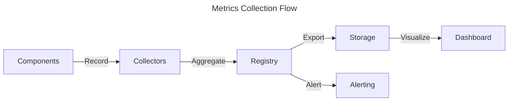

# Metrics Collection Implementation Pattern

## Context
- When tracking system performance and health
- When monitoring component behavior
- When implementing observability features
- When diagnosing system issues
- When creating dashboards for visualization

## Core Concept

The Metrics Collection pattern provides a standardized way to collect, aggregate, and export metrics from all system components, enabling real-time monitoring and analysis of system behavior.



## Implementation Guide

### Core Components

#### 1. Metrics Collector Interface

```rust
/// Interface for collecting metrics across the system
#[async_trait]
pub trait MetricsCollector: Send + Sync {
    /// Record a counter metric (monotonically increasing value)
    fn record_counter(&self, name: &str, value: u64, labels: HashMap<String, String>);
    
    /// Record a gauge metric (value that can go up and down)
    fn record_gauge(&self, name: &str, value: f64, labels: HashMap<String, String>);
    
    /// Record a histogram metric (distribution of values)
    fn record_histogram(&self, name: &str, value: f64, labels: HashMap<String, String>);
    
    /// Start a timer for measuring operation duration
    fn start_timer(&self, name: &str, labels: HashMap<String, String>) -> Timer;
    
    /// Collect all metrics as a snapshot
    async fn collect_metrics(&self) -> Result<MetricsSnapshot, MetricsError>;
}

/// Timer for measuring operation duration
#[derive(Debug)]
pub struct Timer {
    start_time: Instant,
    name: String,
    labels: HashMap<String, String>,
    collector: Weak<dyn MetricsCollector>,
}

impl Timer {
    /// Stop the timer and record the duration
    pub fn stop(self) -> Duration {
        let duration = self.start_time.elapsed();
        
        // If collector still exists, record the duration
        if let Some(collector) = self.collector.upgrade() {
            collector.record_histogram(
                &format!("{}_duration_seconds", self.name),
                duration.as_secs_f64(),
                self.labels,
            );
        }
        
        duration
    }
}
```

#### 2. Metric Types

```rust
/// Types of metrics supported by the system
#[derive(Debug, Clone, Copy, PartialEq, Eq)]
pub enum MetricType {
    Counter,
    Gauge,
    Histogram,
}

/// Snapshot of all metrics at a point in time
#[derive(Debug, Clone)]
pub struct MetricsSnapshot {
    /// Timestamp when the snapshot was taken
    pub timestamp: DateTime<Utc>,
    
    /// Counter metrics
    pub counters: HashMap<String, CounterMetric>,
    
    /// Gauge metrics
    pub gauges: HashMap<String, GaugeMetric>,
    
    /// Histogram metrics
    pub histograms: HashMap<String, HistogramMetric>,
}

/// Counter metric with dimensions
#[derive(Debug, Clone)]
pub struct CounterMetric {
    /// Name of the metric
    pub name: String,
    
    /// Help text describing the metric
    pub help: String,
    
    /// Values for different label combinations
    pub values: HashMap<String, u64>,
}

/// Gauge metric with dimensions
#[derive(Debug, Clone)]
pub struct GaugeMetric {
    /// Name of the metric
    pub name: String,
    
    /// Help text describing the metric
    pub help: String,
    
    /// Values for different label combinations
    pub values: HashMap<String, f64>,
}

/// Histogram metric with dimensions
#[derive(Debug, Clone)]
pub struct HistogramMetric {
    /// Name of the metric
    pub name: String,
    
    /// Help text describing the metric
    pub help: String,
    
    /// Buckets for different label combinations
    pub buckets: HashMap<String, Vec<HistogramBucket>>,
    
    /// Sum for different label combinations
    pub sums: HashMap<String, f64>,
    
    /// Count for different label combinations
    pub counts: HashMap<String, u64>,
}

/// Bucket in a histogram
#[derive(Debug, Clone)]
pub struct HistogramBucket {
    /// Upper bound of the bucket
    pub upper_bound: f64,
    
    /// Count of values in the bucket
    pub count: u64,
}
```

### Implementation Example

```rust
/// Standard implementation of the MetricsCollector trait
pub struct StandardMetricsCollector {
    /// Registry for storing metrics
    registry: Arc<RwLock<MetricsRegistry>>,
    
    /// Default labels to apply to all metrics
    default_labels: HashMap<String, String>,
}

/// Registry for storing metrics
#[derive(Debug, Default)]
struct MetricsRegistry {
    counters: HashMap<String, CounterMetric>,
    gauges: HashMap<String, GaugeMetric>,
    histograms: HashMap<String, HistogramMetric>,
}

impl StandardMetricsCollector {
    /// Create a new metrics collector
    pub fn new() -> Self {
        Self {
            registry: Arc::new(RwLock::new(MetricsRegistry::default())),
            default_labels: HashMap::new(),
        }
    }
    
    /// Create a new metrics collector with default labels
    pub fn with_default_labels(default_labels: HashMap<String, String>) -> Self {
        Self {
            registry: Arc::new(RwLock::new(MetricsRegistry::default())),
            default_labels,
        }
    }
    
    /// Get a key for storing dimensional metrics
    fn get_dimension_key(&self, labels: &HashMap<String, String>) -> String {
        // Combine default labels with provided labels
        let mut combined_labels = self.default_labels.clone();
        combined_labels.extend(labels.clone());
        
        // Sort keys for consistent ordering
        let mut keys: Vec<_> = combined_labels.keys().collect();
        keys.sort();
        
        // Create dimension key from sorted key-value pairs
        keys.into_iter()
            .map(|k| format!("{}=\"{}\"", k, combined_labels.get(k).unwrap()))
            .collect::<Vec<_>>()
            .join(",")
    }
}

#[async_trait]
impl MetricsCollector for StandardMetricsCollector {
    fn record_counter(&self, name: &str, value: u64, labels: HashMap<String, String>) {
        let key = self.get_dimension_key(&labels);
        let mut registry = self.registry.write().unwrap();
        
        // Get or create the counter
        let counter = registry.counters.entry(name.to_string()).or_insert_with(|| {
            CounterMetric {
                name: name.to_string(),
                help: format!("Counter metric: {}", name),
                values: HashMap::new(),
            }
        });
        
        // Update the counter value
        *counter.values.entry(key).or_insert(0) += value;
    }
    
    fn record_gauge(&self, name: &str, value: f64, labels: HashMap<String, String>) {
        let key = self.get_dimension_key(&labels);
        let mut registry = self.registry.write().unwrap();
        
        // Get or create the gauge
        let gauge = registry.gauges.entry(name.to_string()).or_insert_with(|| {
            GaugeMetric {
                name: name.to_string(),
                help: format!("Gauge metric: {}", name),
                values: HashMap::new(),
            }
        });
        
        // Set the gauge value
        gauge.values.insert(key, value);
    }
    
    fn record_histogram(&self, name: &str, value: f64, labels: HashMap<String, String>) {
        let key = self.get_dimension_key(&labels);
        let mut registry = self.registry.write().unwrap();
        
        // Get or create the histogram
        let histogram = registry.histograms.entry(name.to_string()).or_insert_with(|| {
            HistogramMetric {
                name: name.to_string(),
                help: format!("Histogram metric: {}", name),
                buckets: HashMap::new(),
                sums: HashMap::new(),
                counts: HashMap::new(),
            }
        });
        
        // Define standard buckets if none exist
        if !histogram.buckets.contains_key(&key) {
            let standard_buckets = vec![
                HistogramBucket { upper_bound: 0.005, count: 0 },
                HistogramBucket { upper_bound: 0.01, count: 0 },
                HistogramBucket { upper_bound: 0.025, count: 0 },
                HistogramBucket { upper_bound: 0.05, count: 0 },
                HistogramBucket { upper_bound: 0.1, count: 0 },
                HistogramBucket { upper_bound: 0.25, count: 0 },
                HistogramBucket { upper_bound: 0.5, count: 0 },
                HistogramBucket { upper_bound: 1.0, count: 0 },
                HistogramBucket { upper_bound: 2.5, count: 0 },
                HistogramBucket { upper_bound: 5.0, count: 0 },
                HistogramBucket { upper_bound: 10.0, count: 0 },
                HistogramBucket { upper_bound: f64::INFINITY, count: 0 },
            ];
            histogram.buckets.insert(key.clone(), standard_buckets);
            histogram.sums.insert(key.clone(), 0.0);
            histogram.counts.insert(key.clone(), 0);
        }
        
        // Update histogram buckets
        if let Some(buckets) = histogram.buckets.get_mut(&key) {
            for bucket in buckets.iter_mut() {
                if value <= bucket.upper_bound {
                    bucket.count += 1;
                }
            }
        }
        
        // Update sum and count
        *histogram.sums.entry(key.clone()).or_insert(0.0) += value;
        *histogram.counts.entry(key).or_insert(0) += 1;
    }
    
    fn start_timer(&self, name: &str, labels: HashMap<String, String>) -> Timer {
        Timer {
            start_time: Instant::now(),
            name: name.to_string(),
            labels,
            collector: Arc::downgrade(&(Arc::new(self.clone()) as Arc<dyn MetricsCollector>)),
        }
    }
    
    async fn collect_metrics(&self) -> Result<MetricsSnapshot, MetricsError> {
        let registry = self.registry.read().unwrap();
        
        Ok(MetricsSnapshot {
            timestamp: Utc::now(),
            counters: registry.counters.clone(),
            gauges: registry.gauges.clone(),
            histograms: registry.histograms.clone(),
        })
    }
}

impl Clone for StandardMetricsCollector {
    fn clone(&self) -> Self {
        Self {
            registry: self.registry.clone(),
            default_labels: self.default_labels.clone(),
        }
    }
}
```

### Integration with Monitoring System

```rust
/// Metrics adapter for the monitoring system
pub struct MonitoringMetricsAdapter {
    /// Inner metrics collector
    collector: Arc<dyn MetricsCollector>,
    
    /// Monitoring client
    monitoring_client: Arc<dyn MonitoringClient>,
}

impl MonitoringMetricsAdapter {
    /// Create a new monitoring metrics adapter
    pub fn new(
        collector: Arc<dyn MetricsCollector>,
        monitoring_client: Arc<dyn MonitoringClient>,
    ) -> Self {
        Self {
            collector,
            monitoring_client,
        }
    }
    
    /// Export metrics to the monitoring system
    pub async fn export_metrics(&self) -> Result<(), MetricsError> {
        // Collect metrics from the collector
        let snapshot = self.collector.collect_metrics().await?;
        
        // Convert to monitoring system format
        let monitoring_metrics = self.convert_to_monitoring_format(snapshot)?;
        
        // Send to monitoring system
        self.monitoring_client.send_metrics(monitoring_metrics).await?;
        
        Ok(())
    }
    
    /// Convert metrics to monitoring system format
    fn convert_to_monitoring_format(&self, snapshot: MetricsSnapshot) -> Result<MonitoringMetrics, MetricsError> {
        // Implementation depends on monitoring system format
        // ...
        
        Ok(MonitoringMetrics {
            // ...
        })
    }
}
```

## Usage Examples

### 1. Basic Usage

```rust
/// Example of using metrics collection
fn basic_metrics_example() {
    // Create a metrics collector
    let collector = Arc::new(StandardMetricsCollector::new());
    
    // Record a counter
    collector.record_counter(
        "requests_total",
        1,
        HashMap::from([
            ("method".to_string(), "GET".to_string()),
            ("endpoint".to_string(), "/users".to_string()),
        ]),
    );
    
    // Record a gauge
    collector.record_gauge(
        "connections_active",
        42.0,
        HashMap::from([
            ("server".to_string(), "api1".to_string()),
        ]),
    );
    
    // Use a timer
    let timer = collector.start_timer(
        "request_duration",
        HashMap::from([
            ("endpoint".to_string(), "/users".to_string()),
        ]),
    );
    
    // Do some work...
    
    // Stop the timer and record the duration
    let duration = timer.stop();
    println!("Operation took: {:?}", duration);
}
```

### 2. Integration with Component

```rust
/// User service with metrics
pub struct UserService {
    repository: Arc<dyn UserRepository>,
    metrics: Arc<dyn MetricsCollector>,
}

impl UserService {
    pub fn new(repository: Arc<dyn UserRepository>, metrics: Arc<dyn MetricsCollector>) -> Self {
        Self { repository, metrics }
    }
    
    pub async fn get_user(&self, id: Uuid) -> Result<User, ServiceError> {
        // Record request count
        self.metrics.record_counter(
            "user_service_requests_total",
            1,
            HashMap::from([
                ("operation".to_string(), "get_user".to_string()),
            ]),
        );
        
        // Start timer
        let timer = self.metrics.start_timer(
            "user_service_operation_duration",
            HashMap::from([
                ("operation".to_string(), "get_user".to_string()),
            ]),
        );
        
        // Perform operation
        let result = self.repository.find_by_id(id).await;
        
        // Record result
        match &result {
            Ok(_) => {
                self.metrics.record_counter(
                    "user_service_success_total",
                    1,
                    HashMap::from([
                        ("operation".to_string(), "get_user".to_string()),
                    ]),
                );
            }
            Err(_) => {
                self.metrics.record_counter(
                    "user_service_error_total",
                    1,
                    HashMap::from([
                        ("operation".to_string(), "get_user".to_string()),
                    ]),
                );
            }
        }
        
        // Stop timer (automatically records duration)
        timer.stop();
        
        result
    }
}
```

### 3. Exporting to Monitoring System

```rust
/// Example of exporting metrics to monitoring system
async fn export_metrics_example() -> Result<(), Box<dyn Error>> {
    // Create components
    let collector = Arc::new(StandardMetricsCollector::new());
    let monitoring_client = Arc::new(PrometheusClient::new("http://prometheus:9090"));
    
    // Create adapter
    let adapter = MonitoringMetricsAdapter::new(collector.clone(), monitoring_client);
    
    // Set up periodic export
    let export_task = tokio::spawn(async move {
        let mut interval = tokio::time::interval(Duration::from_secs(15));
        
        loop {
            interval.tick().await;
            if let Err(e) = adapter.export_metrics().await {
                eprintln!("Failed to export metrics: {}", e);
            }
        }
    });
    
    // Use the collector in your application
    // ...
    
    // Wait for export task to complete (it won't in this example)
    export_task.await?;
    
    Ok(())
}
```

## Best Practices

1. **Consistent Naming**: Use consistent metric naming conventions
2. **Meaningful Labels**: Choose labels that aid in analysis without cardinality explosion
3. **Performance Awareness**: Be mindful of metrics collection overhead
4. **Appropriate Types**: Use the right metric type (counter, gauge, histogram)
5. **Default Labels**: Add service/component identifiers as default labels
6. **Document Metrics**: Maintain a catalog of available metrics and their meaning
7. **Alert Integration**: Define alerts based on collected metrics
8. **Dashboard Integration**: Create dashboards to visualize key metrics
9. **Sampling**: Use sampling for high-volume metrics
10. **Resource Management**: Monitor resource consumption of metrics collection

## Technical Metadata
- Category: Observability Patterns
- Priority: High
- Dependencies:
  - tokio = "1.36"
  - chrono = "0.4"
  - async-trait = "0.1"
- Integration Requirements:
  - Monitoring system
  - Dashboard system
  - Alerting infrastructure

<version>1.0.0</version> 