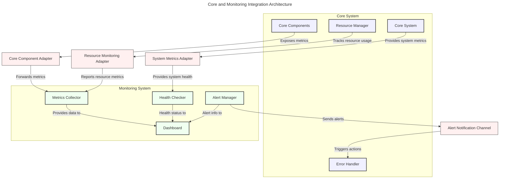

# Core and Monitoring System Integration

## Overview

This document specifies the integration between the Squirrel Core system and the Monitoring system. The integration enables comprehensive observability for core components, efficient resource tracking, and standardized metrics collection across the application.

## Current Implementation Status

The implementation of the Core-Monitoring integration is in progress. The following components are being developed:

1. **CoreComponentAdapter**: A component that adapts core system components to be observable by the monitoring system, enabling health checks and metrics collection.

2. **ResourceMonitoringIntegration**: Integration for tracking system resources used by core components, providing detailed usage metrics.

3. **CoreMetricsExporter**: A service that exports core system metrics to the monitoring system in a standardized format.

4. **CoreHealthCheckProvider**: A provider that exposes core component health status to the monitoring system.

5. **AlertNotificationChannel**: A communication channel for monitoring alerts to reach core components that need to react to system issues.

### Implementation Details

Several key aspects are being addressed during implementation:

1. **Dependency Management**: Ensuring proper dependency structure between core and monitoring crates to avoid circular dependencies.

2. **Performance Considerations**: Optimizing the integration to minimize overhead on core components while providing rich monitoring data.

3. **Type Conversion**: Implementing efficient type conversion between core and monitoring data structures for seamless integration.

4. **Configuration Flexibility**: Enabling configurable integration points to support various deployment scenarios.

5. **Error Handling**: Implementing robust error handling to prevent monitoring issues from affecting core functionality.

### Testing and Validation

The integration will be thoroughly tested:

1. **Unit Tests**: Individual components will have comprehensive unit tests.

2. **Integration Tests**: End-to-end tests will verify the complete data flow between core and monitoring systems.

3. **Performance Tests**: Tests will verify that monitoring adds minimal overhead to core components.

4. **Example Application**: A working example will demonstrate the integration in a realistic scenario.

### Next Steps

The following tasks are planned for completion:

1. **Implementation of Adapters**: Complete the implementation of core component adapters for monitoring.

2. **Resource Monitoring Integration**: Implement detailed resource tracking for core components.

3. **Core Health Check Provider**: Develop health check interfaces for core components.

4. **Alert Notification Channel**: Create bidirectional communication for alerts and notifications.

5. **Example Implementation**: Develop a comprehensive example demonstrating the integration.

## Integration Architecture

The integration follows an adapter pattern, with core components exposing standardized interfaces for monitoring, and the monitoring system providing collection and analysis capabilities.



## Core Integration Components

### 1. Core Component Adapter

The primary adapter for exposing core components to the monitoring system:

```rust
/// Adapter for exposing core components to the monitoring system
pub struct CoreComponentAdapter<T> where T: CoreComponent {
    /// The inner core component
    inner: T,
    
    /// Metrics collector for forwarding metrics
    metrics_collector: Arc<dyn MetricsCollector>,
    
    /// Configuration for the adapter
    config: CoreAdapterConfig,
}

/// Configuration for the core component adapter
#[derive(Debug, Clone)]
pub struct CoreAdapterConfig {
    /// How often to collect metrics (in seconds)
    pub collection_interval: u64,
    
    /// Whether to collect detailed metrics
    pub detailed_metrics: bool,
    
    /// Metrics collection concurrency
    pub concurrency: usize,
}

impl Default for CoreAdapterConfig {
    fn default() -> Self {
        Self {
            collection_interval: 15,
            detailed_metrics: false,
            concurrency: 4,
        }
    }
}
```

### 2. Resource Monitoring Integration

Integration for tracking system resources used by core components:

```rust
/// Integration for tracking system resources used by core components
pub struct ResourceMonitoringIntegration {
    /// Resource metrics collector
    resource_collector: Arc<dyn ResourceMetricsCollector>,
    
    /// Core component registry
    component_registry: Arc<ComponentRegistry>,
    
    /// Configuration for resource monitoring
    config: ResourceMonitoringConfig,
}

/// Configuration for resource monitoring
#[derive(Debug, Clone)]
pub struct ResourceMonitoringConfig {
    /// How often to collect resource metrics (in seconds)
    pub collection_interval: u64,
    
    /// Whether to track per-component resources
    pub per_component_tracking: bool,
    
    /// Resource tracking precision
    pub tracking_precision: ResourceTrackingPrecision,
}

/// Resource tracking precision
#[derive(Debug, Clone, Copy, PartialEq)]
pub enum ResourceTrackingPrecision {
    /// Low precision, less overhead
    Low,
    
    /// Medium precision, balanced overhead
    Medium,
    
    /// High precision, more overhead
    High,
}
```

### 3. Core Metrics Exporter

Service for exporting core metrics to the monitoring system:

```rust
/// Service for exporting core metrics to the monitoring system
pub struct CoreMetricsExporter {
    /// Core metric sources
    sources: Vec<Arc<dyn CoreMetricSource>>,
    
    /// Metrics exporter
    exporter: Arc<dyn MetricsExporter>,
    
    /// Configuration for the exporter
    config: MetricsExporterConfig,
}

/// Configuration for the metrics exporter
#[derive(Debug, Clone)]
pub struct MetricsExporterConfig {
    /// How often to export metrics (in seconds)
    pub export_interval: u64,
    
    /// Batch size for exporting metrics
    pub batch_size: usize,
    
    /// Whether to enable metric filtering
    pub enable_filtering: bool,
    
    /// Filter configuration
    pub filter: Option<MetricFilterConfig>,
}
```

### 4. Alert Notification Channel

Communication channel for monitoring alerts to reach core components:

```rust
/// Communication channel for monitoring alerts to reach core components
pub struct AlertNotificationChannel {
    /// Alert manager for receiving alerts
    alert_manager: Arc<dyn AlertManager>,
    
    /// Handler registry for dispatching alerts to core components
    handler_registry: Arc<AlertHandlerRegistry>,
    
    /// Configuration for the notification channel
    config: NotificationChannelConfig,
}

/// Configuration for the notification channel
#[derive(Debug, Clone)]
pub struct NotificationChannelConfig {
    /// How often to check for new alerts (in seconds)
    pub check_interval: u64,
    
    /// Maximum number of alerts to process in one batch
    pub max_batch_size: usize,
    
    /// Whether to filter alerts by severity
    pub filter_by_severity: bool,
    
    /// Minimum severity to process
    pub min_severity: AlertSeverity,
}
```

## Integration Setup

The following code example demonstrates how to set up the integration between Core and Monitoring systems:

```rust
/// Initialize the integrated core monitoring system
pub async fn initialize_core_monitoring() -> Result<(), Box<dyn std::error::Error>> {
    // 1. Create core components
    let core_system = CoreSystem::new();
    let resource_manager = ResourceManager::new();
    let error_handler = ErrorHandler::new();
    
    // 2. Create monitoring components
    let metrics_collector = MetricsCollector::new();
    let health_checker = HealthChecker::new();
    let alert_manager = AlertManager::new();
    
    // 3. Create adapters
    let core_adapter = CoreComponentAdapter::new(
        core_system.clone(),
        metrics_collector.clone(),
        CoreAdapterConfig::default(),
    );
    
    let resource_adapter = ResourceMonitoringIntegration::new(
        resource_manager.clone(),
        metrics_collector.clone(),
        ResourceMonitoringConfig::default(),
    );
    
    let notification_channel = AlertNotificationChannel::new(
        alert_manager.clone(),
        error_handler.clone(),
        NotificationChannelConfig::default(),
    );
    
    // 4. Start monitoring
    core_adapter.start().await?;
    resource_adapter.start().await?;
    notification_channel.start().await?;
    
    Ok(())
}
```

## Example: Core-Monitoring Integration

Here's a complete example demonstrating the integration:

```rust
use squirrel_core::{CoreSystem, ResourceManager, ErrorHandler};
use squirrel_monitoring::{MetricsCollector, HealthChecker, AlertManager};
use core_monitoring_integration::{
    CoreComponentAdapter, 
    ResourceMonitoringIntegration,
    AlertNotificationChannel
};

#[tokio::main]
async fn main() -> Result<(), Box<dyn std::error::Error>> {
    // Initialize core and monitoring components
    let core_system = CoreSystem::new();
    let metrics_collector = MetricsCollector::new();
    
    // Create and start adapters
    let adapter = CoreComponentAdapter::new(
        core_system,
        metrics_collector.clone(),
        Default::default()
    );
    
    // Start collecting metrics
    adapter.start().await?;
    
    // Simulate some core system activity
    for i in 0..10 {
        // Core system does some work
        tokio::time::sleep(tokio::time::Duration::from_secs(1)).await;
        
        // Display current metrics
        println!("Current metrics:");
        for metric in metrics_collector.get_metrics().await? {
            println!("  {} = {}", metric.name, metric.value);
        }
    }
    
    // Clean shutdown
    adapter.stop().await?;
    
    Ok(())
}
```

## Best Practices for Integration

1. **Minimize Overhead**: Ensure monitoring integration adds minimal overhead to core components.
2. **Graceful Degradation**: Implement the integration to gracefully degrade if monitoring is unavailable.
3. **Configurable Granularity**: Allow configurable metric collection granularity based on deployment needs.
4. **Standardized Metrics**: Use standardized metric names and formats across all core components.
5. **Error Isolation**: Ensure errors in monitoring don't affect core functionality.
6. **Batched Processing**: Process metrics and health checks in batches to reduce overhead.
7. **Asynchronous Integration**: Use asynchronous communication to prevent blocking core operations.
8. **Consistent Naming**: Maintain consistent naming conventions between core and monitoring systems.
9. **Documentation**: Document all integration points and metrics for developer reference.
10. **Testing**: Thoroughly test the integration under various load conditions.

## Conclusion

The Core-Monitoring integration provides comprehensive observability for the Squirrel system while maintaining separation of concerns between core functionality and monitoring capabilities. This integration enables efficient resource tracking, detailed metrics collection, and health monitoring across the entire application.

The implementation work is ongoing, focusing on completing the adapters and example implementations to demonstrate the integration in realistic scenarios.

<version>1.0.0</version> 