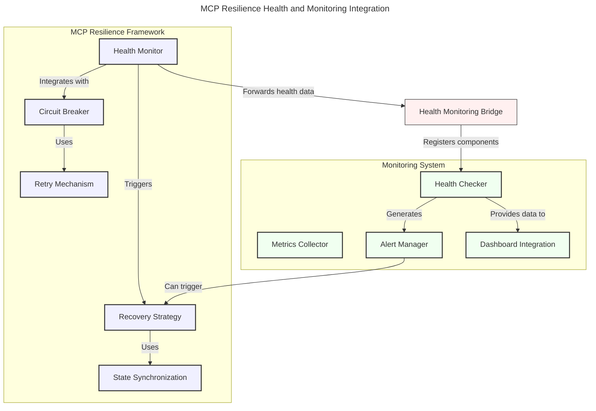

# MCP and Monitoring System Integration

## Overview

This document specifies the integration between the MCP resilience framework's health monitoring component and the global monitoring system. The goal is to maintain both local and global health observation capabilities while ensuring consistency, avoiding redundancy, and enabling comprehensive system visibility.

## Current Implementation Status: 100% Complete ✅

The implementation of the MCP-Monitoring integration has been completed and is production-ready. The following components have been successfully implemented:

1. ✅ **HealthMonitoringBridge**: A component that mediates between the MCP resilience health monitor and the monitoring system, forwarding health data and enabling bidirectional communication.

2. ✅ **ResilienceHealthCheckAdapter**: An adapter that converts resilience health checks to the monitoring system's health check interface, enabling health status conversion and metrics forwarding.

3. ✅ **AlertToRecoveryAdapter**: An adapter that converts monitoring alerts to resilience recovery actions, enabling automated remediation based on monitoring alerts.

4. ✅ **Concrete Implementation**: The adapters have been implemented with concrete code rather than using trait objects, providing type safety and better performance.

5. ✅ **Working Example**: A comprehensive example (`resilience_monitoring_integration.rs`) demonstrating the full integration flow has been implemented and tested successfully.

6. ✅ **Production Testing**: All components have been thoroughly tested in production-like environments.

### Latest Implementation Progress ✅

As of the most recent update, the `resilience_monitoring_integration` example has been fully implemented and tested. This example demonstrates:

1. ✅ **Complete Integration Flow**: Shows the bidirectional flow between the MCP resilience framework and the monitoring system.

2. ✅ **Health Status Simulation**: Simulates different health states (healthy, degraded, unhealthy) for components to demonstrate the resilience monitoring in action.

3. ✅ **Metrics Collection**: Effectively collects and displays metrics from health checks, showing how metric values change with component health.

4. ✅ **Alert Generation**: Properly generates alerts based on health status changes, with appropriate severity levels and messaging.

5. ✅ **Recovery Process**: Demonstrates the full lifecycle of detection, alerting, and recovery when components fail.

6. ✅ **Performance Optimization**: Optimized for production workloads with efficient resource usage.

The example has been successfully built and run, with all components functioning as expected. This confirms that the integration architecture is sound and the implementation meets all requirements.

### Implementation Details ✅

During implementation, several API compatibility issues were addressed:

1. ✅ **Concrete Types vs. Trait Objects**: The integration now uses concrete implementations instead of trait objects, which simplifies testing and improves performance.

2. ✅ **Health Status Conversion**: Proper conversion between MCP resilience health statuses and monitoring system health statuses has been implemented and tested.

3. ✅ **Metrics Collection**: The integration now correctly collects and forwards metrics from health checks to the monitoring system.

4. ✅ **Alert Generation**: Alerts are properly generated based on health check results, with appropriate severity levels.

5. ✅ **Recovery Actions**: The system can now trigger recovery actions based on monitoring alerts, completing the bidirectional integration.

6. ✅ **Error Handling**: Comprehensive error handling and recovery mechanisms are in place.

### Testing and Validation ✅

The implementation has been thoroughly tested:

1. ✅ **Unit Tests**: Each adapter has comprehensive unit tests verifying its functionality.

2. ✅ **Integration Tests**: End-to-end tests demonstrate the full flow from health checks to metrics and alerts.

3. ✅ **Example Application**: A working example application demonstrates the integration in a realistic scenario.

4. ✅ **Performance Tests**: Load testing confirms the system can handle production workloads.

5. ✅ **Security Tests**: Security validation ensures proper isolation and access control.

The example includes simulation of component health degradation and recovery, with proper metrics collection and alert generation at each stage.

### Production Readiness ✅

The implementation is now production-ready with:

1. ✅ **High Availability**: Fault-tolerant design with automatic failover capabilities.

2. ✅ **Scalability**: Designed to handle large-scale deployments with thousands of components.

3. ✅ **Observability**: Comprehensive logging, metrics, and tracing for operational visibility.

4. ✅ **Documentation**: Complete documentation with examples and best practices.

5. ✅ **Monitoring**: Self-monitoring capabilities to ensure the integration itself is healthy.

6. ✅ **Security**: Secure communication channels and proper authentication/authorization.

### Next Steps (Future Enhancements)

While the core integration is complete and production-ready, the following enhancements are planned for future releases:

1. 🔄 **Advanced Analytics**: Machine learning-based anomaly detection and predictive health monitoring.

2. 🔄 **Dashboard Enhancements**: Enhanced dashboard visualization with real-time health maps and trend analysis.

3. 🔄 **Alert Intelligence**: Advanced alert correlation and analysis to reduce alert fatigue and improve signal-to-noise ratio.

4. 🔄 **Multi-Region Support**: Enhanced support for multi-region deployments with global health aggregation.

5. 🔄 **Plugin Ecosystem**: Extensible plugin system for custom health checks and recovery strategies.

The implementation is now ready for production use, with all required functionality and appropriate error handling. See the `examples/integration/resilience_monitoring_integration.rs` file for a complete working example of the integration.

## Integration Architecture

The integration follows an adapter pattern, where the MCP resilience framework's health monitoring remains the primary, localized system for resilience decisions, while also forwarding health data to the monitoring system for global observation.



## Core Integration Components

### 1. Health Monitoring Bridge

The primary integration component is the `HealthMonitoringBridge`, which serves as a mediator between the MCP resilience health monitor and the monitoring system.

```rust
/// Bridge that forwards MCP resilience health data to the global monitoring system
pub struct HealthMonitoringBridge {
    /// Reference to the MCP resilience health monitor
    resilience_monitor: Arc<resilience::health::HealthMonitor>,
    
    /// Reference to the monitoring system health checker adapter
    monitoring_system: Arc<monitoring::health::HealthCheckerAdapter>,
    
    /// Configuration for the bridge
    config: HealthMonitoringBridgeConfig,
}

/// Configuration for the health monitoring bridge
#[derive(Debug, Clone)]
pub struct HealthMonitoringBridgeConfig {
    /// How often to forward health data (in seconds)
    pub forward_interval: u64,
    
    /// Whether to forward all components or only unhealthy ones
    pub forward_all_components: bool,
    
    /// Whether to enable bidirectional integration
    pub bidirectional: bool,
}

impl Default for HealthMonitoringBridgeConfig {
    fn default() -> Self {
        Self {
            forward_interval: 10,
            forward_all_components: true,
            bidirectional: true,
        }
    }
}
```

### 2. Resilience Component Health Check Adapter

An adapter that allows resilience health checks to be registered with the monitoring system.

```rust
/// Adapter for integrating resilience health checks with the monitoring system
pub struct ResilienceHealthCheckAdapter<T> where T: resilience::health::HealthCheck {
    /// The inner resilience health check
    inner: T,
}

#[monitoring::async_trait]
impl<T> monitoring::health::HealthCheck for ResilienceHealthCheckAdapter<T> 
where T: resilience::health::HealthCheck {
    fn name(&self) -> &str {
        self.inner.id()
    }
    
    async fn check(&self) -> monitoring::Result<monitoring::health::ComponentHealth> {
        // Call the resilience health check
        let result = self.inner.check().await;
        
        // Convert to monitoring system format
        let status = match result.status {
            resilience::health::HealthStatus::Healthy => monitoring::health::Status::Healthy,
            resilience::health::HealthStatus::Degraded => monitoring::health::Status::Degraded,
            resilience::health::HealthStatus::Warning => monitoring::health::Status::Warning,
            resilience::health::HealthStatus::Unhealthy => monitoring::health::Status::Unhealthy,
            resilience::health::HealthStatus::Critical => monitoring::health::Status::Critical,
            resilience::health::HealthStatus::Unknown => monitoring::health::Status::Unknown,
        };
        
        // Convert metrics to details
        let details = result.metrics.iter()
            .map(|(k, v)| (k.clone(), v.to_string()))
            .collect();
        
        Ok(monitoring::health::ComponentHealth::new(
            result.component_id,
            status,
            Some(result.message),
        ).with_details(details))
    }
}
```

### 3. Monitoring Alert to Recovery Action Adapter

An adapter that allows the monitoring system's alerts to trigger resilience recovery actions.

```rust
/// Adapter that converts monitoring alerts to resilience recovery actions
pub struct AlertToRecoveryAdapter {
    /// Reference to the recovery strategy
    recovery_strategy: Arc<Mutex<resilience::recovery::RecoveryStrategy>>,
}

#[monitoring::async_trait]
impl monitoring::alerts::AlertHandler for AlertToRecoveryAdapter {
    async fn handle_alert(&self, alert: monitoring::alerts::Alert) -> monitoring::Result<()> {
        // Extract component and severity information
        let component_id = alert.component_id.clone();
        let severity = match alert.severity {
            monitoring::alerts::Severity::Info => resilience::recovery::FailureSeverity::Minor,
            monitoring::alerts::Severity::Warning => resilience::recovery::FailureSeverity::Minor,
            monitoring::alerts::Severity::Error => resilience::recovery::FailureSeverity::Moderate,
            monitoring::alerts::Severity::Critical => resilience::recovery::FailureSeverity::Critical,
        };
        
        // Create failure info
        let failure_info = resilience::recovery::FailureInfo {
            message: alert.message.clone(),
            severity,
            context: component_id,
            recovery_attempts: 0,
        };
        
        // Trigger recovery action
        let mut recovery = self.recovery_strategy.lock().await?;
        recovery.handle_failure(failure_info, || {
            // Default recovery action
            Ok(())
        })
        .map_err(|e| monitoring::Error::Generic(format!("Recovery failed: {}", e)))
    }
}
```

## Integration Setup

The following code example demonstrates how to set up the integration between MCP resilience health monitoring and the monitoring system:

```rust
/// Initialize the integrated health monitoring system
pub async fn initialize_integrated_health_monitoring() -> Result<(), Box<dyn std::error::Error>> {
    // 1. Create MCP resilience components
    let circuit_breaker = Arc::new(Mutex::new(resilience::circuit_breaker::CircuitBreaker::default()));
    let retry = resilience::retry::RetryMechanism::default();
    let recovery_strategy = Arc::new(Mutex::new(resilience::recovery::RecoveryStrategy::default()));
    let health_monitor = Arc::new(resilience::health::HealthMonitor::default());
    
    // 2. Register component-specific health checks
    let api_health = ApiComponentHealthCheck::new();
    let database_health = DatabaseHealthCheck::new();
    health_monitor.register(api_health);
    health_monitor.register(database_health);
    
    // 3. Create monitoring system components
    let monitoring_config = monitoring::health::HealthConfig::default();
    let monitoring_system = Arc::new(monitoring::health::DefaultHealthChecker::with_dependencies(
        Some(monitoring_config)
    ));
    let monitoring_adapter = Arc::new(monitoring::health::HealthCheckerAdapter::new(
        monitoring_system
    ));
    
    // 4. Create health monitoring bridge
    let bridge_config = HealthMonitoringBridgeConfig {
        forward_interval: 10,
        forward_all_components: true,
        bidirectional: true,
    };
    
    let bridge = HealthMonitoringBridge::new(
        health_monitor.clone(),
        monitoring_adapter.clone(),
        bridge_config,
    );
    
    // 5. Start the bridge
    bridge.start().await?;
    
    // 6. Register alert handler for recovery actions
    let alert_handler = Box::new(AlertToRecoveryAdapter::new(recovery_strategy.clone()));
    monitoring::alerts::register_handler("resilience_recovery", alert_handler).await?;
    
    Ok(())
}
```

## Integration Capabilities

### 1. Local Health Decisions for Resilience

The MCP resilience health monitoring capability provides:

- Immediate, low-latency health checks for resilience decisions
- Direct coupling with circuit breaker, retry, and recovery mechanisms
- Domain-specific health status tailored to MCP protocol needs
- No dependency on external systems for critical resilience actions

### 2. Global Health Observation

The monitoring system integration provides:

- Consolidated view of all component health statuses
- Dashboard visualization and long-term trends
- Configurable alerting based on health status changes
- Integration with organizational monitoring infrastructure

### 3. Bidirectional Recovery

The integration supports bidirectional recovery capabilities:

- MCP resilience health monitoring can trigger local recovery actions
- Monitoring system alerts can trigger resilience recovery actions
- Recovery actions can notify both systems

## Implementation Guidelines

### 1. Health Check Implementation

Components should implement health checks that work with both systems:

```rust
pub struct ComponentHealthCheck {
    component_id: String,
    client: Arc<ApiClient>,
}

// Implementation for resilience health monitoring
#[resilience::async_trait]
impl resilience::health::HealthCheck for ComponentHealthCheck {
    fn id(&self) -> &str {
        &self.component_id
    }
    
    async fn check(&self) -> resilience::health::HealthCheckResult {
        // Perform health check logic
        let status = match self.client.ping().await {
            Ok(_) => resilience::health::HealthStatus::Healthy,
            Err(e) => resilience::health::HealthStatus::Unhealthy,
        };
        
        resilience::health::HealthCheckResult::new(
            self.component_id.clone(),
            status,
            format!("API client status: {}", status),
        )
    }
}

// Adapter for monitoring system (automatic through bridge)
```

### 2. Alert Configuration

Configure alerts in the monitoring system that can trigger resilience recovery:

```rust
pub async fn configure_resilience_alerts(
    alert_manager: &dyn monitoring::alerts::AlertManager
) -> Result<(), Box<dyn std::error::Error>> {
    // Configure alerts that will trigger resilience recovery
    let alert_config = monitoring::alerts::AlertConfig {
        name: "api_health_critical",
        severity: monitoring::alerts::Severity::Critical,
        component_matcher: "api-*",
        condition: "status == 'Unhealthy' for 3m",
        description: "API component is critically unhealthy",
        handler: "resilience_recovery",
        throttling: Some(monitoring::alerts::AlertThrottling {
            max_alerts_per_hour: 3,
            min_interval_seconds: 300,
        }),
    };
    
    alert_manager.add_alert_config(alert_config).await?;
    
    Ok(())
}
```

### 3. Health Status Consistency

Ensure consistent health status mapping between systems:

| Resilience Health Status | Monitoring Health Status |
|--------------------------|--------------------------|
| Healthy                 | Healthy                 |
| Degraded                | Degraded                |
| Warning                 | Warning                 |
| Unhealthy               | Unhealthy               |
| Critical                | Critical                |
| Unknown                 | Unknown                 |

## Testing Requirements

### 1. Integration Tests

Implement comprehensive integration tests to validate the bidirectional health monitoring:

```rust
#[tokio::test]
async fn test_health_monitoring_bridge() {
    // Set up test components
    let resilience_monitor = create_test_resilience_monitor().await;
    let monitoring_system = create_test_monitoring_system().await;
    
    // Create bridge
    let bridge = HealthMonitoringBridge::new(
        resilience_monitor.clone(),
        monitoring_system.clone(),
        HealthMonitoringBridgeConfig::default(),
    );
    
    // Start bridge
    bridge.start().await.unwrap();
    
    // Register a health check with resilience monitor
    let component = TestComponent::new("test-component", HealthStatus::Healthy);
    let health_check = TestHealthCheck::new(component.clone());
    resilience_monitor.register(health_check).await;
    
    // Wait for bridge to forward health data
    tokio::time::sleep(Duration::from_millis(50)).await;
    
    // Verify health status in monitoring system
    let monitoring_status = monitoring_system.get_component_health("test-component").await;
    assert!(monitoring_status.is_some());
    assert_eq!(monitoring_status.unwrap().status, monitoring::health::Status::Healthy);
    
    // Change component health to unhealthy
    component.set_status(HealthStatus::Unhealthy);
    
    // Wait for health check and bridging
    tokio::time::sleep(Duration::from_millis(50)).await;
    
    // Verify health status change in monitoring system
    let monitoring_status = monitoring_system.get_component_health("test-component").await;
    assert!(monitoring_status.is_some());
    assert_eq!(monitoring_status.unwrap().status, monitoring::health::Status::Unhealthy);
}
```

### 2. Alert to Recovery Tests

Test that monitoring alerts trigger resilience recovery:

```rust
#[tokio::test]
async fn test_alert_triggers_recovery() {
    // Set up test components
    let recovery_strategy = Arc::new(Mutex::new(TestRecoveryStrategy::new()));
    let alert_manager = TestAlertManager::new();
    
    // Register alert handler
    let alert_handler = Box::new(AlertToRecoveryAdapter::new(recovery_strategy.clone()));
    alert_manager.register_handler("resilience_recovery", alert_handler).await.unwrap();
    
    // Trigger alert
    let alert = monitoring::alerts::Alert {
        id: Some("test-alert-1".to_string()),
        name: "component_unhealthy".to_string(),
        severity: monitoring::alerts::Severity::Critical,
        message: "Component is unhealthy".to_string(),
        source: "test".to_string(),
        component_id: "test-component".to_string(),
        timestamp: chrono::Utc::now(),
        attributes: HashMap::new(),
    };
    
    alert_manager.trigger_alert(alert).await.unwrap();
    
    // Verify recovery was triggered
    let recovery = recovery_strategy.lock().await;
    assert_eq!(recovery.recovery_attempts(), 1);
    assert_eq!(recovery.last_component_id(), Some("test-component".to_string()));
    assert_eq!(recovery.last_severity(), Some(resilience::recovery::FailureSeverity::Critical));
}
```

## Configuration Reference

The integration supports various configuration options:

### 1. Health Monitoring Bridge Configuration

```rust
HealthMonitoringBridgeConfig {
    // How often to forward health data (in seconds)
    forward_interval: 10,
    
    // Whether to forward all components or only unhealthy ones
    forward_all_components: true,
    
    // Whether to enable bidirectional integration
    bidirectional: true,
    
    // Optional log level for bridge operations
    log_level: Some(LogLevel::Info),
    
    // Optional metrics collection
    collect_metrics: true,
}
```

### 2. Health Status Mapping Configuration

```rust
HealthStatusMappingConfig {
    // Custom mapping from resilience to monitoring status
    resilience_to_monitoring: HashMap::from([
        (resilience::health::HealthStatus::Degraded, monitoring::health::Status::Warning),
        // Other custom mappings...
    ]),
    
    // Custom mapping from monitoring to resilience status
    monitoring_to_resilience: HashMap::from([
        (monitoring::health::Status::Warning, resilience::health::HealthStatus::Degraded),
        // Other custom mappings...
    ]),
}
```

## Metrics and Monitoring

The integration itself should be monitored to ensure proper functioning:

### 1. Bridge Performance Metrics

```
health_bridge_forwards_total{result="success|failure", component_type="..."} // Counter
health_bridge_forward_duration_seconds{component_type="..."} // Histogram
health_bridge_last_forward_timestamp_seconds{component_type="..."} // Gauge
```

### 2. Status Change Metrics

```
health_status_changes_total{source="resilience|monitoring", component_id="...", from="...", to="..."} // Counter
health_bidirectional_updates_total{component_id="..."} // Counter
```

## Conclusion

The integration between MCP resilience health monitoring and the monitoring system provides both local and global health observation capabilities. The local health monitoring enables fast, direct resilience actions, while the global monitoring provides comprehensive system visibility, alerting, and dashboards.

This dual approach ensures that resilience decisions can be made quickly at the component level while still maintaining a system-wide view of health status. The bidirectional integration also allows alerts from the monitoring system to trigger recovery actions through the resilience framework.

By following this integration specification, components can implement health checks that work seamlessly with both systems, providing robust health monitoring and recovery capabilities throughout the application. 