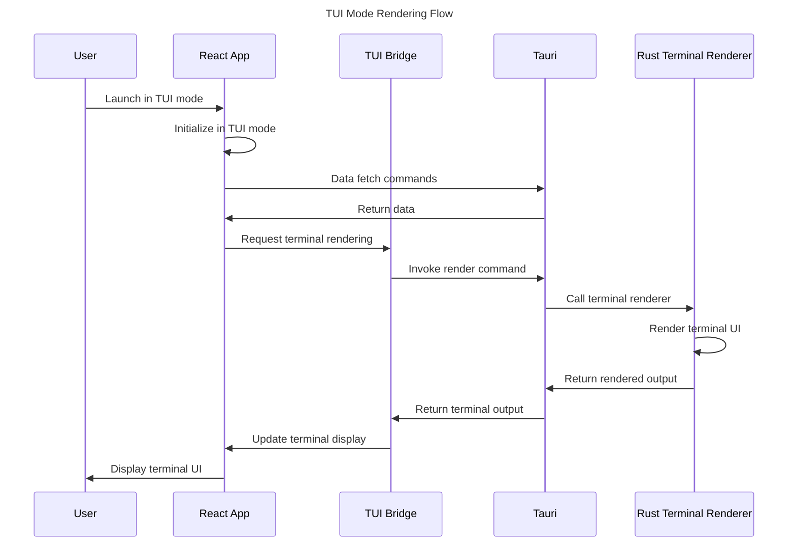

# TUI Mode Implementation Specification

## Overview

This document outlines the implementation details for the Terminal User Interface (TUI) mode within the Squirrel Tauri-React framework. The TUI mode will serve as a fallback interface for headless systems, SSH sessions, or environments where graphical interfaces are not available or desired. This implementation will replace the standalone legacy Terminal UI (`crates/ui-terminal`) with equivalent functionality integrated within the Tauri framework.

## Core Requirements

1. **Feature Parity**: Implement all essential monitoring and management features available in the legacy Terminal UI
2. **Efficient Rendering**: Optimize terminal rendering for minimal resource usage
3. **Keyboard Navigation**: Implement intuitive keyboard-based navigation and commands
4. **SSH Compatibility**: Ensure proper functionality over SSH connections
5. **MCP Integration**: Maintain full integration with the Machine Context Protocol
6. **Cross-Platform Support**: Function consistently across Linux, macOS, and Windows terminals
7. **Fallback Reliability**: Serve as a dependable fallback when GUI mode cannot function

## Implementation Approaches

We have evaluated two primary approaches for implementing the TUI mode:

### Approach 1: Rust-based Terminal Rendering

This approach leverages Rust's terminal libraries (such as `ratatui`) to handle rendering directly:

- **Pros**:
  - Direct access to terminal capabilities
  - Efficient rendering with minimal overhead
  - Strong performance on resource-constrained systems
  - Reuse of existing terminal UI code
  
- **Cons**:
  - More complex integration with Tauri
  - Requires custom command handler for each UI component
  - Dual rendering logic (one in React, one in Rust)
  
- **Implementation Pattern**:
  ```rust
  #[tauri::command]
  fn render_tui_dashboard(state: tauri::State<AppState>) -> Result<String, String> {
      // Using ratatui to render a dashboard
      let mut terminal = Terminal::new(state.get_terminal_backend()?)?;
      
      terminal.draw(|f| {
          // Create dashboard layout
          let layout = Layout::default()
              .direction(Direction::Vertical)
              .constraints([
                  Constraint::Length(3),
                  Constraint::Min(0),
              ])
              .split(f.size());
          
          // Render widgets
          let metrics = state.get_metrics()?;
          let widget = DashboardWidget::new(metrics);
          f.render_widget(widget, layout[1]);
      })?;
      
      // Capture rendered output for Tauri
      Ok(terminal.get_output_buffer().to_string())
  }
  ```

### Approach 2: JavaScript-based Terminal Rendering

This approach uses JavaScript terminal rendering libraries (such as `react-terminal-ui` or `xterm.js`) to handle rendering:

- **Pros**:
  - Consistent React-based component structure
  - Easier integration with Tauri
  - Shared component logic between all UI modes
  - Simpler code maintenance
  
- **Cons**:
  - Higher resource usage due to JavaScript overhead
  - Potential rendering limitations in some terminal environments
  
- **Implementation Pattern**:
  ```tsx
  // React component for terminal-based rendering
  const TuiDashboard: React.FC = () => {
    const [metrics, setMetrics] = useState<SystemMetrics | null>(null);
    
    useEffect(() => {
      const fetchMetrics = async () => {
        const data = await invoke('get_system_metrics');
        setMetrics(data);
      };
      
      fetchMetrics();
      const interval = setInterval(fetchMetrics, 1000);
      return () => clearInterval(interval);
    }, []);
    
    if (!metrics) return <div>Loading...</div>;
    
    // Render ASCII dashboard
    return (
      <AsciiBox title="System Dashboard">
        {`CPU Usage: [${'#'.repeat(metrics.cpu / 2)}] ${metrics.cpu}%\n`}
        {`Memory:   [${'#'.repeat(metrics.memory / 2)}] ${metrics.memory}%\n`}
        {`Disk:     [${'#'.repeat(metrics.disk / 2)}] ${metrics.disk}%\n`}
      </AsciiBox>
    );
  };
  ```

### Selected Approach: Hybrid Implementation

After evaluation, we have selected a **hybrid approach** that combines the strengths of both methods:

1. **Core Terminal Rendering**: Implement low-level terminal rendering in Rust for efficiency
2. **Component Logic**: Keep component business logic in TypeScript/React for consistency
3. **Rendering Bridge**: Create a bridge between React components and Rust rendering

This approach allows us to maintain a unified component model across all UI modes while leveraging Rust's efficient terminal rendering capabilities.

## Architecture Design

### TUI Mode Components

```
crates/ui-tauri-react/
├── src/
│   ├── components/     # Shared component logic
│   │   ├── base/       # Base component classes
│   │   └── tui/        # TUI-specific components
│   ├── tui/            # TUI mode implementation
│   │   ├── bridge.ts   # React-to-Rust bridge
│   │   ├── renderer.ts # Terminal renderer wrapper
│   │   ├── keyboard.ts # Keyboard handling
│   │   └── widgets/    # TUI-specific widgets
│   └── utils/
│       └── modeDetection.ts # UI mode detection
└── src-tauri/
    └── src/
        ├── tui/         # Rust TUI implementation
        │   ├── renderer.rs  # Terminal rendering engine
        │   ├── widgets.rs   # Terminal widget library
        │   └── layout.rs    # Layout management
        └── commands/
            └── tui_commands.rs # TUI-specific commands
```

### Rendering Flow

1. **Mode Detection**: Application detects it should run in TUI mode
2. **Component Initialization**: React components initialize with TUI mode awareness
3. **Data Fetch**: Components fetch data through Tauri commands
4. **Rendering Request**: React component calls TUI renderer through bridge
5. **Rust Rendering**: Rust code renders terminal UI and returns output
6. **Display**: Terminal output is displayed to user



## Component Implementation

### Base Component Pattern

All TUI components will follow a standardized pattern:

```typescript
// src/components/tui/base/TuiComponent.ts

export abstract class TuiComponent<TData, TOptions = {}> {
  protected data: TData | null = null;
  protected options: TOptions;
  protected isLoading: boolean = true;
  protected error: Error | null = null;
  
  constructor(options: TOptions = {} as TOptions) {
    this.options = options;
  }
  
  // Data fetching (shared with GUI components)
  abstract fetchData(): Promise<TData>;
  
  // Terminal-specific rendering
  abstract renderToTerminal(): Promise<string>;
  
  // Keyboard handling
  abstract handleKeypress(key: string): void;
  
  // Format data for terminal display
  protected formatForTerminal(data: TData): string {
    // Default implementation
    return JSON.stringify(data);
  }
}
```

### Specialized Component Example

```typescript
// src/components/tui/MetricsComponent.ts

import { TuiComponent } from './base/TuiComponent';
import { invoke } from '@tauri-apps/api/tauri';
import { SystemMetrics } from '../../types';

export class MetricsComponent extends TuiComponent<SystemMetrics> {
  async fetchData(): Promise<SystemMetrics> {
    try {
      return await invoke('get_system_metrics');
    } catch (err) {
      throw new Error(`Failed to fetch metrics: ${err}`);
    }
  }
  
  async renderToTerminal(): Promise<string> {
    if (!this.data) {
      return "Loading metrics...";
    }
    
    // Format data for terminal
    const formattedData = this.formatForTerminal(this.data);
    
    // Use Rust to render terminal UI
    return await invoke('render_tui_metrics', { metrics: this.data });
  }
  
  handleKeypress(key: string): void {
    switch (key) {
      case 'r':
        this.fetchData(); // Refresh data
        break;
      case 'q':
        // Handle quitting
        break;
      // Other key handlers
    }
  }
  
  protected formatForTerminal(data: SystemMetrics): string {
    const cpuBar = '#'.repeat(Math.round(data.cpu / 2));
    const memBar = '#'.repeat(Math.round(data.memory / 2));
    
    return `
┌─── System Metrics ───────────────────┐
│ CPU: [${cpuBar.padEnd(50)}] ${data.cpu.toFixed(1)}% │
│ MEM: [${memBar.padEnd(50)}] ${data.memory.toFixed(1)}% │
│ Status: ${data.status === 'ok' ? '✓' : 'x'} │
└─────────────────────────────────────┘
    `.trim();
  }
}
```

### React Integration

```tsx
// src/components/tui/TerminalRenderer.tsx

import React, { useEffect, useState, useRef } from 'react';
import { invoke } from '@tauri-apps/api/tauri';
import { listen } from '@tauri-apps/api/event';

export const TerminalRenderer: React.FC = () => {
  const [output, setOutput] = useState<string>('');
  const [activeComponent, setActiveComponent] = useState<string>('dashboard');
  const [keyPressHandlers, setKeyPressHandlers] = useState<Record<string, Function>>({});
  
  // Register key handlers
  useEffect(() => {
    const handleKeypress = async (key: string) => {
      // Global navigation keys
      if (key === '1') setActiveComponent('dashboard');
      if (key === '2') setActiveComponent('plugins');
      if (key === '3') setActiveComponent('metrics');
      
      // Component-specific key handling
      if (keyPressHandlers[key]) {
        keyPressHandlers[key]();
      }
    };
    
    // Listen for keypress events from Rust
    const unlisten = listen('tui://keypress', (event) => {
      handleKeypress(event.payload as string);
    });
    
    return () => {
      unlisten.then(fn => fn());
    };
  }, [keyPressHandlers]);
  
  // Render active component
  useEffect(() => {
    const renderActiveComponent = async () => {
      try {
        const result = await invoke('render_tui_component', { component: activeComponent });
        setOutput(result as string);
      } catch (err) {
        setOutput(`Error: ${err}`);
      }
    };
    
    renderActiveComponent();
    const interval = setInterval(renderActiveComponent, 1000);
    return () => clearInterval(interval);
  }, [activeComponent]);
  
  return (
    <pre className="terminal-output">
      {output}
    </pre>
  );
};
```

## Rust Implementation

The Rust side will manage the actual terminal rendering:

```rust
// src-tauri/src/tui/renderer.rs

use crossterm::{
    event::{self, Event, KeyCode, KeyEvent},
    terminal::{disable_raw_mode, enable_raw_mode, EnterAlternateScreen, LeaveAlternateScreen},
    ExecutableCommand,
};
use ratatui::{
    backend::{Backend, CrosstermBackend},
    layout::{Constraint, Direction, Layout},
    style::{Color, Modifier, Style},
    text::{Span, Spans},
    widgets::{Block, Borders, Paragraph, Wrap},
    Frame, Terminal,
};
use std::io::{self, Stdout};
use std::sync::{Arc, Mutex};
use std::thread;
use std::time::Duration;

pub struct TerminalRenderer {
    terminal: Option<Terminal<CrosstermBackend<Stdout>>>,
    output_buffer: Arc<Mutex<String>>,
    active_component: String,
}

impl TerminalRenderer {
    pub fn new() -> Result<Self, io::Error> {
        let output_buffer = Arc::new(Mutex::new(String::new()));
        
        Ok(Self {
            terminal: None,
            output_buffer,
            active_component: "dashboard".to_string(),
        })
    }
    
    pub fn initialize(&mut self) -> Result<(), io::Error> {
        enable_raw_mode()?;
        io::stdout().execute(EnterAlternateScreen)?;
        
        let backend = CrosstermBackend::new(io::stdout());
        self.terminal = Some(Terminal::new(backend)?);
        
        Ok(())
    }
    
    pub fn render_dashboard(&mut self, metrics: &SystemMetrics) -> Result<(), io::Error> {
        if let Some(terminal) = &mut self.terminal {
            terminal.draw(|f| {
                // Layout definition
                let chunks = Layout::default()
                    .direction(Direction::Vertical)
                    .margin(1)
                    .constraints([
                        Constraint::Length(3),
                        Constraint::Min(10),
                        Constraint::Length(3),
                    ])
                    .split(f.size());
                
                // Header
                let header = Paragraph::new("Squirrel Dashboard - TUI Mode")
                    .style(Style::default().fg(Color::Cyan))
                    .block(Block::default().borders(Borders::ALL));
                f.render_widget(header, chunks[0]);
                
                // Content based on active component
                match self.active_component.as_str() {
                    "dashboard" => self.render_metrics(f, chunks[1], metrics),
                    "plugins" => self.render_plugins(f, chunks[1]),
                    _ => self.render_default(f, chunks[1]),
                }
                
                // Footer with keybindings
                let footer = Paragraph::new(
                    "1: Dashboard | 2: Plugins | 3: Metrics | q: Quit"
                )
                .block(Block::default().borders(Borders::ALL));
                f.render_widget(footer, chunks[2]);
            })?;
        }
        
        Ok(())
    }
    
    pub fn render_metrics(&self, f: &mut Frame<impl Backend>, area: ratatui::layout::Rect, metrics: &SystemMetrics) {
        // Create metrics display
        let cpu_bar = "█".repeat((metrics.cpu as usize) / 2);
        let mem_bar = "█".repeat((metrics.memory as usize) / 2);
        
        let metrics_text = vec![
            Spans::from(vec![
                Span::raw("CPU: ["),
                Span::styled(&cpu_bar, Style::default().fg(Color::Green)),
                Span::raw(format!("] {:.1}%", metrics.cpu)),
            ]),
            Spans::from(vec![
                Span::raw("Memory: ["),
                Span::styled(&mem_bar, Style::default().fg(Color::Blue)),
                Span::raw(format!("] {:.1}%", metrics.memory)),
            ]),
            Spans::from(vec![
                Span::raw("Status: "),
                Span::styled(
                    if metrics.status == "ok" { "✓" } else { "✗" },
                    Style::default().fg(
                        if metrics.status == "ok" { Color::Green } else { Color::Red }
                    ),
                ),
            ]),
        ];
        
        let metrics_widget = Paragraph::new(metrics_text)
            .block(Block::default().title("System Metrics").borders(Borders::ALL))
            .wrap(Wrap { trim: true });
        
        f.render_widget(metrics_widget, area);
    }
    
    // Additional rendering methods...
    
    pub fn set_active_component(&mut self, component: &str) {
        self.active_component = component.to_string();
    }
    
    pub fn handle_events(&mut self) -> Result<bool, io::Error> {
        if event::poll(Duration::from_millis(100))? {
            if let Event::Key(key) = event::read()? {
                match key.code {
                    KeyCode::Char('q') => return Ok(true), // Quit
                    KeyCode::Char('1') => self.set_active_component("dashboard"),
                    KeyCode::Char('2') => self.set_active_component("plugins"),
                    KeyCode::Char('3') => self.set_active_component("metrics"),
                    // Other key handlers
                    _ => {}
                }
            }
        }
        
        Ok(false) // Continue running
    }
    
    pub fn cleanup(&mut self) -> Result<(), io::Error> {
        if let Some(terminal) = &mut self.terminal {
            disable_raw_mode()?;
            terminal.backend_mut().execute(LeaveAlternateScreen)?;
        }
        
        Ok(())
    }
}
```

### Tauri Command Handlers

```rust
// src-tauri/src/commands/tui_commands.rs

use crate::tui::renderer::TerminalRenderer;
use crate::AppState;
use tauri::{command, State};

#[command]
pub fn render_tui_component(
    state: State<AppState>,
    component: String,
) -> Result<String, String> {
    let mut renderer = state.terminal_renderer.lock().map_err(|_| "Failed to lock renderer")?;
    
    // Set the active component
    renderer.set_active_component(&component);
    
    // Get data based on component
    match component.as_str() {
        "dashboard" => {
            let metrics = state.get_metrics()?;
            renderer.render_dashboard(&metrics)?;
        },
        "plugins" => {
            let plugins = state.get_plugins()?;
            renderer.render_plugins(&plugins)?;
        },
        // Other components
        _ => renderer.render_default()?,
    }
    
    // Get rendered output from buffer
    let output = renderer.get_output_buffer().map_err(|e| e.to_string())?;
    Ok(output)
}

#[command]
pub fn start_tui_mode(state: State<AppState>) -> Result<(), String> {
    let mut renderer = state.terminal_renderer.lock().map_err(|_| "Failed to lock renderer")?;
    
    // Initialize terminal
    renderer.initialize().map_err(|e| e.to_string())?;
    
    // Start event handling in a separate thread
    let renderer_clone = renderer.clone();
    std::thread::spawn(move || {
        let mut renderer = renderer_clone;
        loop {
            if let Ok(quit) = renderer.handle_events() {
                if quit {
                    break;
                }
            }
            
            // Render active component
            // ...
            
            std::thread::sleep(std::time::Duration::from_millis(100));
        }
        
        // Cleanup on exit
        if let Err(e) = renderer.cleanup() {
            eprintln!("Error cleaning up terminal: {}", e);
        }
    });
    
    Ok(())
}

#[command]
pub fn stop_tui_mode(state: State<AppState>) -> Result<(), String> {
    let mut renderer = state.terminal_renderer.lock().map_err(|_| "Failed to lock renderer")?;
    renderer.cleanup().map_err(|e| e.to_string())?;
    Ok(())
}
```

## Navigation System

The TUI mode will implement a keyboard-driven navigation system:

### Global Navigation
- **Number keys (1-9)**: Switch between main components/sections
- **Tab/Shift+Tab**: Cycle between interactive elements within a component
- **Arrow keys**: Navigate within components
- **Escape**: Back/Cancel current operation
- **Q**: Quit or exit current view

### Component-Specific Navigation
- **R**: Refresh current view
- **H**: Show help for current component
- **E**: Edit selected item (where applicable)
- **D**: Delete selected item (where applicable)
- **S**: Save current state (where applicable)

### Menu System
Implement a consistent menu system across components:

```
┌─ Squirrel Dashboard ─────────────────────────────────────┐
│                                                          │
│  [1] Dashboard  [2] Plugins  [3] Metrics  [4] MCP        │
│                                                          │
├─────────────────────────────────────────────────────────┤
│                                                          │
│  ... Component Content ...                               │
│                                                          │
├─────────────────────────────────────────────────────────┤
│ Keys: [r]efresh [h]elp [q]uit                           │
└─────────────────────────────────────────────────────────┘
```

## SSH Compatibility

To ensure proper functionality over SSH connections:

1. **Terminal Capability Detection**:
   - Detect terminal capabilities using `terminfo`
   - Adjust rendering based on available features
   - Fallback to basic ASCII when advanced features unavailable

2. **Bandwidth Optimization**:
   - Minimize screen updates for low-bandwidth connections
   - Implement incremental updates when possible
   - Add low-bandwidth mode toggle

3. **Connection Management**:
   - Handle SSH disconnection gracefully
   - Restore session state on reconnection
   - Implement session timeouts for inactive connections

4. **Unicode Support**:
   - Use ASCII fallbacks when Unicode not supported
   - Test rendering in common SSH clients
   - Support both UTF-8 and legacy encodings

## Cross-Platform Considerations

To ensure consistent behavior across platforms:

1. **Terminal Size**:
   - Handle terminal resizing events
   - Implement responsive layouts
   - Set minimum terminal size requirements

2. **Color Support**:
   - Detect color capabilities
   - Provide fallbacks for terminals without color
   - Use ANSI color codes consistently

3. **Platform-Specific Input**:
   - Handle different key mappings between platforms
   - Support both Windows (Command Prompt/PowerShell) and Unix terminals
   - Test on major terminal emulators

## Feature Mapping

This table maps legacy Terminal UI features to their TUI mode implementations:

| Legacy Feature | TUI Mode Implementation | Status |
|----------------|-------------------------|--------|
| Dashboard Overview | `DashboardComponent` | Planned |
| System Metrics | `MetricsComponent` | Planned |
| Network Monitoring | `NetworkComponent` | Planned |
| Plugin Management | `PluginComponent` | Planned |
| Alert Handling | `AlertsComponent` | Planned |
| MCP Integration | `MCPComponent` | Planned |
| Health Status | `HealthComponent` | Planned |
| Command Execution | `CommandComponent` | Planned |

## Implementation Timeline

1. **Week 1**: Core Infrastructure
   - Terminal rendering system
   - Input handling
   - Navigation framework
   - Base component patterns

2. **Week 2**: Essential Components
   - Dashboard implementation
   - System metrics display
   - Plugin listing
   - Alert viewing

3. **Week 3**: Advanced Components
   - Network monitoring
   - MCP integration
   - Command execution
   - Settings management

4. **Week 4**: Testing & Refinement
   - Cross-platform testing
   - SSH compatibility testing
   - Performance optimization
   - Documentation

## Testing Plan

1. **Unit Tests**:
   - Test rendering logic for each component
   - Verify data processing in TUI components
   - Test keyboard handler logic

2. **Integration Tests**:
   - Test TUI mode initialization
   - Verify data flow from backend to UI
   - Test component switching

3. **Manual Testing Matrix**:
   - Test on all target platforms:
     - Windows: cmd.exe, PowerShell, Windows Terminal
     - macOS: Terminal.app, iTerm2
     - Linux: gnome-terminal, xterm, Konsole
   - Test over SSH connections:
     - Local network
     - High-latency connections
     - Various SSH clients
   - Test terminal capabilities:
     - With/without color
     - Various terminal sizes
     - Unicode support
     - Different encoding settings

## Conclusion

The TUI mode implementation will provide a robust fallback interface that maintains all the essential functionality of the legacy Terminal UI while integrating seamlessly with the modern Tauri framework. By implementing this mode, we can safely prune the legacy terminal UI codebase while providing continuous terminal-based access for headless systems and SSH sessions.

This implementation will be completed within a 4-week timeframe and will achieve feature parity with the legacy Terminal UI, enabling the eventual hard pruning of the `ui-terminal` crate from the codebase. 