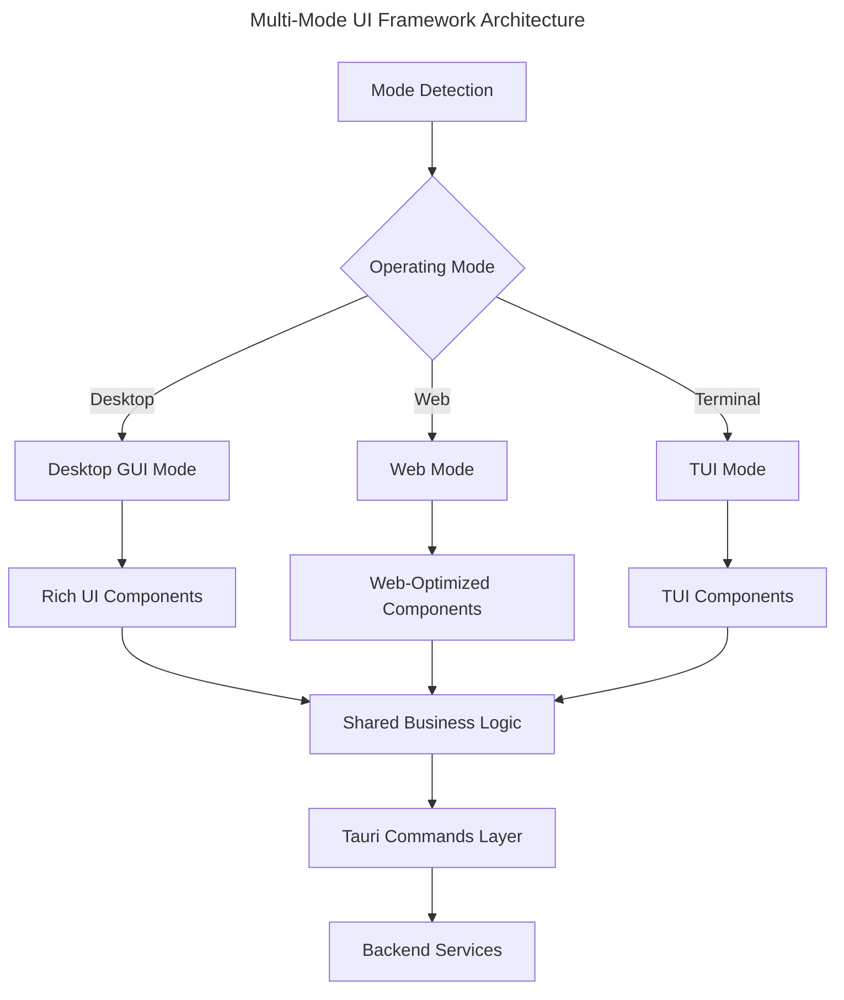

# Multi-Mode UI Framework

## Overview

This document outlines the implementation approach for the Squirrel Multi-Mode UI Framework, which will provide a unified codebase supporting three distinct UI modes:

1. **Desktop GUI Mode**: Primary interface with rich graphics for local monitoring
2. **Web Mode**: Browser-based UI for remote access via LAN/Internet 
3. **TUI Fallback Mode**: Terminal-based UI for headless systems or SSH sessions

The framework is designed to maintain a single source of truth for business logic while adapting the presentation layer based on the detected environment.

## Framework Architecture

### Core Principles

1. **Shared Business Logic**: All modes share the same core logic and data models
2. **Mode Detection**: Runtime detection of operating environment
3. **Adaptive Rendering**: UI components adapt to the detected mode
4. **Feature Availability**: Features are conditionally available based on environment capabilities
5. **Unified Backend Integration**: All modes use the same Tauri commands for backend communication

### Architecture Diagram



## Mode Detection

The framework will detect its operating mode based on environment variables and runtime conditions:

```typescript
// src/utils/modeDetection.ts

export enum UiMode {
  DESKTOP = 'desktop',
  WEB = 'web',
  TUI = 'tui'
}

export function detectUiMode(): UiMode {
  // Check for Tauri environment
  const isTauri = Boolean(window.__TAURI__);
  
  // Check for TUI mode flag
  const isTuiMode = isTauri && process.env.TAURI_TUI_MODE === 'true';
  
  // Check for web mode flag
  const isWebModeForced = import.meta.env.VITE_WEB_MODE === 'true';
  
  if (isTuiMode) {
    return UiMode.TUI;
  } else if (!isTauri || isWebModeForced) {
    return UiMode.WEB;
  } else {
    return UiMode.DESKTOP;
  }
}

export const currentMode = detectUiMode();

export const isDesktopMode = currentMode === UiMode.DESKTOP;
export const isWebMode = currentMode === UiMode.WEB;
export const isTuiMode = currentMode === UiMode.TUI;
```

## Feature Availability Management

Features will be conditionally available based on the detected mode:

```typescript
// src/utils/features.ts

import { isDesktopMode, isWebMode, isTuiMode } from './modeDetection';

export const features = {
  // System integration features
  systemTray: isDesktopMode,
  fileSystemAccess: isDesktopMode,
  nativeNotifications: isDesktopMode,
  
  // Network features
  remoteAccess: isWebMode || isDesktopMode,
  secureAuthentication: isWebMode || isDesktopMode,
  
  // UI features
  richDataVisualization: isDesktopMode || isWebMode,
  animatedTransitions: isDesktopMode || isWebMode,
  
  // TUI specific
  asciiCharts: isTuiMode,
  keyboardShortcuts: true, // Available in all modes
  
  // Mode-specific optimizations
  lowBandwidthMode: isTuiMode,
  offlineCapability: isDesktopMode
};
```

## Component Structure

Components will be organized to support multiple rendering modes:

### Base Component Pattern

```typescript
// src/components/metrics/BaseMetricsWidget.ts

export interface MetricsData {
  cpu: number;
  memory: number;
  disk: number;
  uptime: number;
  status: 'ok' | 'warning' | 'error';
}

export abstract class BaseMetricsWidget {
  protected data: MetricsData | null = null;
  protected isLoading: boolean = true;
  protected error: Error | null = null;
  
  // Shared data fetching logic
  async fetchMetrics(): Promise<MetricsData> {
    try {
      // For Terminal mode, we might want to fetch less data
      const options = { detailed: !isTuiMode };
      return await invoke('get_system_metrics', { options });
    } catch (err) {
      throw new Error(`Failed to fetch metrics: ${err}`);
    }
  }
  
  // Shared data processing logic
  protected processMetrics(data: MetricsData): ProcessedMetricsData {
    // Common processing logic
    return {
      cpuFormatted: `${data.cpu.toFixed(1)}%`,
      memoryFormatted: `${data.memory.toFixed(1)}%`,
      diskFormatted: `${data.disk.toFixed(1)}%`,
      uptimeFormatted: formatUptime(data.uptime),
      statusIndicator: getStatusIndicator(data.status)
    };
  }
  
  // Each mode implements its own rendering
  abstract render(): any;
}
```

### Desktop/Web Implementation

```tsx
// src/components/metrics/GUIMetricsWidget.tsx

import React, { useEffect, useState } from 'react';
import { BaseMetricsWidget, MetricsData } from './BaseMetricsWidget';
import { CPUChart, MemoryChart, DiskChart } from '../charts';

export const GUIMetricsWidget: React.FC = () => {
  const [data, setData] = useState<MetricsData | null>(null);
  const [isLoading, setIsLoading] = useState(true);
  const [error, setError] = useState<Error | null>(null);
  
  useEffect(() => {
    const widget = new BaseMetricsWidget();
    
    const loadData = async () => {
      try {
        const metrics = await widget.fetchMetrics();
        setData(metrics);
      } catch (err) {
        setError(err as Error);
      } finally {
        setIsLoading(false);
      }
    };
    
    loadData();
    const interval = setInterval(loadData, 5000);
    return () => clearInterval(interval);
  }, []);
  
  if (isLoading) return <div>Loading metrics...</div>;
  if (error) return <div>Error: {error.message}</div>;
  if (!data) return <div>No data available</div>;
  
  const processed = widget.processMetrics(data);
  
  return (
    <div className="metrics-widget">
      <h2>System Metrics</h2>
      <div className="charts-container">
        <CPUChart value={data.cpu} />
        <MemoryChart value={data.memory} />
        <DiskChart value={data.disk} />
      </div>
      <div className="metrics-status">
        System Status: {processed.statusIndicator}
      </div>
      <div className="uptime">
        Uptime: {processed.uptimeFormatted}
      </div>
    </div>
  );
};
```

### TUI Implementation

```tsx
// src/components/metrics/TUIMetricsWidget.tsx

import React, { useEffect, useState } from 'react';
import { BaseMetricsWidget, MetricsData } from './BaseMetricsWidget';
import { AsciiChart, AsciiBox } from '../tui';

export const TUIMetricsWidget: React.FC = () => {
  const [data, setData] = useState<MetricsData | null>(null);
  const [isLoading, setIsLoading] = useState(true);
  const [error, setError] = useState<Error | null>(null);
  
  useEffect(() => {
    const widget = new BaseMetricsWidget();
    
    const loadData = async () => {
      try {
        const metrics = await widget.fetchMetrics();
        setData(metrics);
      } catch (err) {
        setError(err as Error);
      } finally {
        setIsLoading(false);
      }
    };
    
    loadData();
    const interval = setInterval(loadData, 5000);
    return () => clearInterval(interval);
  }, []);
  
  if (isLoading) return <AsciiBox>Loading metrics...</AsciiBox>;
  if (error) return <AsciiBox>Error: {error.message}</AsciiBox>;
  if (!data) return <AsciiBox>No data available</AsciiBox>;
  
  // Create ASCII representation of data
  const cpuBar = '#'.repeat(Math.round(data.cpu / 2));
  const memoryBar = '#'.repeat(Math.round(data.memory / 2));
  const diskBar = '#'.repeat(Math.round(data.disk / 2));
  
  return (
    <AsciiBox title="System Metrics">
      {`CPU   : [${cpuBar.padEnd(50)}] ${data.cpu.toFixed(1)}%\n`}
      {`Memory: [${memoryBar.padEnd(50)}] ${data.memory.toFixed(1)}%\n`}
      {`Disk  : [${diskBar.padEnd(50)}] ${data.disk.toFixed(1)}%\n`}
      {`Status: ${data.status === 'ok' ? '✓' : data.status === 'warning' ? '!' : '✗'}\n`}
      {`Uptime: ${formatUptime(data.uptime)}`}
    </AsciiBox>
  );
};
```

### Mode-Adaptive Component Export

```tsx
// src/components/metrics/MetricsWidget.tsx

import { isTuiMode } from '../../utils/modeDetection';
import { GUIMetricsWidget } from './GUIMetricsWidget';
import { TUIMetricsWidget } from './TUIMetricsWidget';

// Export the appropriate component based on the detected mode
export const MetricsWidget = isTuiMode ? TUIMetricsWidget : GUIMetricsWidget;
```

## TUI Renderer Implementation

The TUI Mode will be implemented using a terminal renderer that works within the Tauri framework:

### React-based Terminal Renderer

```tsx
// src/tui/TerminalRenderer.tsx

import React, { useEffect, useState } from 'react';
import { Box, Text } from 'ink';
import { invoke } from '@tauri-apps/api/tauri';

export const TerminalRenderer: React.FC = () => {
  const [output, setOutput] = useState<string>('');
  
  useEffect(() => {
    const renderTUI = async () => {
      // Tauri command that renders the TUI content
      const content = await invoke('render_tui_content');
      setOutput(content as string);
    };
    
    renderTUI();
    const interval = setInterval(renderTUI, 1000);
    return () => clearInterval(interval);
  }, []);
  
  return (
    <Box flexDirection="column">
      <Text>{output}</Text>
    </Box>
  );
};
```

### Rust Implementation of TUI Rendering

```rust
// src-tauri/src/tui.rs

use serde::{Deserialize, Serialize};
use std::sync::{Arc, Mutex};

#[derive(Serialize, Deserialize, Clone, Debug)]
pub struct TuiConfig {
    pub width: usize,
    pub height: usize,
    pub use_color: bool,
}

pub struct TuiRenderer {
    config: TuiConfig,
    content: Arc<Mutex<String>>,
}

impl TuiRenderer {
    pub fn new(config: TuiConfig) -> Self {
        Self {
            config,
            content: Arc::new(Mutex::new(String::new())),
        }
    }
    
    pub fn render_dashboard(&self, metrics: &SystemMetrics) -> String {
        let width = self.config.width;
        let cpu_bar = "#".repeat((metrics.cpu * width as f64 / 100.0) as usize);
        let mem_bar = "#".repeat((metrics.memory * width as f64 / 100.0) as usize);
        let disk_bar = "#".repeat((metrics.disk * width as f64 / 100.0) as usize);
        
        format!(
            "┌─── System Metrics {0:─<width$}┐\n\
             │ CPU   : [{1:<width$}] {2:>5.1}% │\n\
             │ Memory: [{3:<width$}] {4:>5.1}% │\n\
             │ Disk  : [{5:<width$}] {6:>5.1}% │\n\
             │ Status: {7:<width$}      │\n\
             └{0:─<width2$}┘",
            "",
            cpu_bar,
            metrics.cpu,
            mem_bar,
            metrics.memory,
            disk_bar,
            metrics.disk,
            if metrics.status == "ok" { "✓" } else { "✗" },
            width = 50,
            width2 = width + 2
        )
    }
}

#[tauri::command]
pub fn render_tui_content(state: tauri::State<AppState>) -> Result<String, String> {
    let metrics = state.get_metrics()?;
    let renderer = state.get_tui_renderer()?;
    Ok(renderer.render_dashboard(&metrics))
}
```

## Mode Switching

The application will support runtime mode switching in the Desktop version:

```typescript
// src/utils/modeSwitcher.ts

import { UiMode, currentMode } from './modeDetection';
import { invoke } from '@tauri-apps/api/tauri';

export async function switchToMode(targetMode: UiMode): Promise<boolean> {
  if (targetMode === currentMode) {
    return true; // Already in this mode
  }
  
  try {
    // Invoke Tauri command to switch modes
    await invoke('switch_ui_mode', { mode: targetMode });
    
    // For TUI mode, we might need to restart the app
    if (targetMode === UiMode.TUI) {
      await invoke('restart_in_tui_mode');
      return true;
    }
    
    // For Desktop/Web modes, we can reload
    window.location.reload();
    return true;
  } catch (err) {
    console.error('Failed to switch UI mode:', err);
    return false;
  }
}
```

## Backend Implementation

```rust
// src-tauri/src/main.rs

mod tui;

use tui::TuiRenderer;
use std::env;
use std::sync::Mutex;

#[derive(Default)]
struct AppState {
    tui_renderer: Mutex<Option<TuiRenderer>>,
    current_mode: Mutex<String>,
}

#[tauri::command]
fn switch_ui_mode(state: tauri::State<AppState>, mode: String) -> Result<(), String> {
    let mut current_mode = state.current_mode.lock().map_err(|_| "Failed to lock mode")?;
    *current_mode = mode.clone();
    
    // Initialize TUI renderer if switching to TUI mode
    if mode == "tui" {
        let mut tui_renderer = state.tui_renderer.lock().map_err(|_| "Failed to lock renderer")?;
        *tui_renderer = Some(TuiRenderer::new(TuiConfig {
            width: 80,
            height: 24,
            use_color: true,
        }));
    }
    
    Ok(())
}

#[tauri::command]
fn restart_in_tui_mode() -> Result<(), String> {
    // Set environment variable for TUI mode
    env::set_var("TAURI_TUI_MODE", "true");
    
    // Restart the application - implementation depends on platform
    // This is simplified and would need proper platform-specific code
    std::process::Command::new(env::current_exe().map_err(|e| e.to_string())?)
        .env("TAURI_TUI_MODE", "true")
        .spawn()
        .map_err(|e| e.to_string())?;
        
    // Exit current instance
    std::process::exit(0);
}

fn main() {
    // Check if started in TUI mode
    let is_tui_mode = env::var("TAURI_TUI_MODE").unwrap_or_default() == "true";
    
    let app_state = AppState {
        tui_renderer: Mutex::new(if is_tui_mode {
            Some(TuiRenderer::new(TuiConfig {
                width: 80,
                height: 24,
                use_color: true,
            }))
        } else {
            None
        }),
        current_mode: Mutex::new(if is_tui_mode { "tui".to_string() } else { "desktop".to_string() }),
    };
    
    tauri::Builder::default()
        .manage(app_state)
        .invoke_handler(tauri::generate_handler![
            switch_ui_mode,
            restart_in_tui_mode,
            render_tui_content
        ])
        .run(tauri::generate_context!())
        .expect("error while running tauri application");
}
```

## Implementation Timeline

### Week 1: Foundation
- Setup mode detection system
- Implement feature flags
- Create base component patterns
- Develop shared data models

### Week 2-3: Desktop GUI Mode
- Implement rich graphical UI components
- Integrate with system tray
- Add native notifications
- Implement sophisticated visualizations

### Week 2: Web Mode
- Implement responsive web UI
- Setup security and authentication
- Create web-specific optimizations
- Ensure cross-browser compatibility

### Week 3-4: TUI Mode
- Implement terminal renderer
- Develop TUI-specific components
- Create keyboard navigation system
- Ensure SSH compatibility

### Week 4: Integration and Testing
- Test all modes on target environments
- Implement mode switching capabilities
- Fix any cross-mode issues
- Optimize performance for all modes

## Testing Strategy

1. **Unit Tests**: Test each component individually in all rendering modes
2. **Integration Tests**: Test the integration between UI and backend for each mode
3. **Mode-Specific Tests**:
   - **Desktop**: Test native features (system tray, notifications)
   - **Web**: Test authentication, WebSocket updates
   - **TUI**: Test terminal rendering, keyboard navigation

4. **Mode Switching Tests**: Verify seamless switching between modes

## Conclusion

The Multi-Mode UI Framework provides a robust and flexible approach to supporting multiple UI modes within a single unified codebase. By sharing core business logic while adapting the presentation layer, we can provide an optimal user experience across desktop, web, and terminal environments.

This architecture allows for efficient development and maintenance, as well as the ability to add new UI modes in the future if needed. The implementation plan outlined above will deliver a complete multi-mode UI within a 4-week timeframe, enabling the pruning of the legacy terminal UI once complete. 