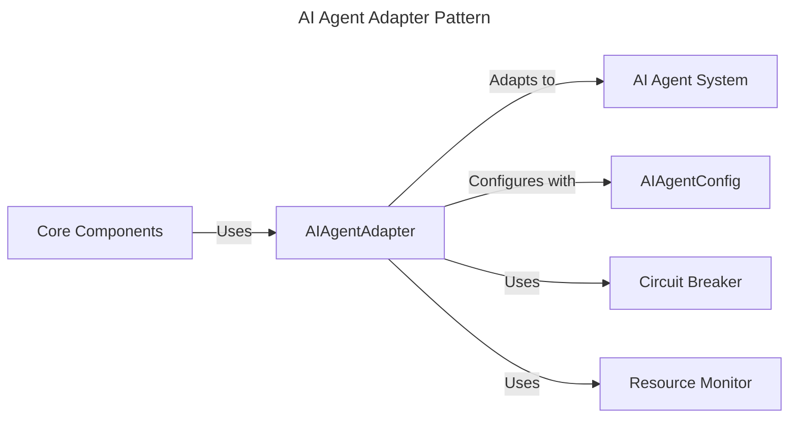
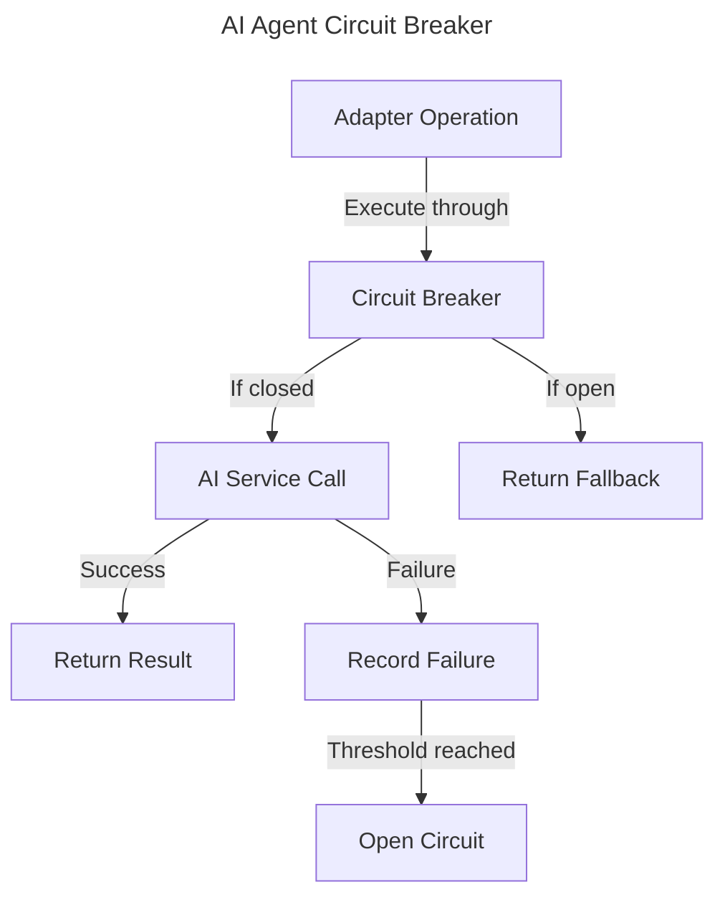

# AI Agent Integration Specification

## Overview

This document specifies the integration between the AI Agent system and other core components of the Squirrel platform. The integration enables AI-assisted operations across the platform while maintaining the system's resilience, security, and observability.

## Integration Components

The AI Agent integration consists of the following main components:

1. **AIAgentAdapter**: Core adapter that bridges AI Agent capabilities with other systems
2. **AIAgentConfig**: Configuration options for the AI agent system
3. **AgentCapabilities**: Definition of agent capabilities and permissions
4. **AgentExecutionContext**: Context for agent execution including security boundaries
5. **Integration Error Handling**: Custom error types for the integration boundary

## Adapter Pattern Implementation

The integration follows the standard adapter pattern used throughout Squirrel:



## Circuit Breaker Integration

The AI Agent adapter implements the circuit breaker pattern for resilience when communicating with AI services:



## Integration Interfaces

### AIAgentAdapter

The `AIAgentAdapter` provides the following operations:

- **Lifecycle Management**:
  - `initialize()`: Initialize the adapter and connections
  - `with_config()`: Create adapter with custom configuration

- **Agent Operations**:
  - `process_request(request: AgentRequest)`: Process a request using AI capabilities
  - `get_suggestions(context: AgentContext)`: Get AI-powered suggestions
  - `analyze_content(content: Content, options: AnalysisOptions)`: Analyze content
  - `generate_content(prompt: Prompt, options: GenerationOptions)`: Generate content

- **Status Operations**:
  - `get_status()`: Get the current adapter status
  - `get_metrics()`: Get performance metrics

### Configuration

The `AIAgentConfig` provides the following configuration options:

- `ai_service_url`: URL of the AI service endpoint
- `api_key`: API key for the AI service (stored securely)
- `timeout_ms`: Timeout for AI operations in milliseconds
- `max_retries`: Maximum number of retry attempts
- `circuit_breaker_config`: Configuration for the circuit breaker
- `resource_limits`: Resource usage limits for AI operations
- `fallback_options`: Configuration for fallback operations when AI is unavailable

## Security Model

The AI Agent integration implements a comprehensive security model:

1. **Agent Capabilities**: Clearly defined permissions for what agents can access and modify
2. **Execution Sandboxing**: Resource-constrained environment for agent execution
3. **Content Validation**: Validation of agent-generated content before use
4. **Rate Limiting**: Prevents overuse of AI services
5. **Circuit Breaking**: Prevents cascading failures during service disruptions

## Resource Monitoring

AI operations are monitored for resource usage:

1. **Compute Resources**: CPU, memory, and time monitoring
2. **API Usage**: Tracking of API calls and tokens used
3. **Cost Tracking**: Monitoring estimated costs of AI operations
4. **Quota Management**: Enforcing usage quotas per user or component

## Observability

The integration exposes the following observability points:

1. **Performance Metrics**:
   - Request latency
   - Token usage
   - Success/failure rates
   - Cache hit rates

2. **Health Status**:
   - Service availability
   - Circuit breaker status
   - Rate limit status

3. **Logging and Tracing**:
   - Request/response logging (sanitized)
   - Error tracing
   - Performance anomalies

## Usage Examples

### Basic Usage

```rust
// Create the adapter with default configuration
let adapter = create_ai_agent_adapter().await?;

// Initialize the adapter
adapter.initialize().await?;

// Process a request
let request = AgentRequest {
    prompt: "Generate a summary of this document",
    content: doc_content,
    options: Default::default(),
};

let response = adapter.process_request(request).await?;
```

### With Custom Configuration

```rust
// Create a custom configuration
let config = AIAgentConfig {
    timeout_ms: 5000,
    max_retries: 3,
    resource_limits: ResourceLimits {
        max_tokens: 1000,
        max_requests_per_minute: 10,
    },
    ..Default::default()
};

// Create the adapter with custom configuration
let adapter = create_ai_agent_adapter_with_config(config).await?;

// Initialize and use the adapter
adapter.initialize().await?;
```

## Error Handling

The integration defines the following error types:

- `AIAgentError::ServiceError`: Error from the AI service
- `AIAgentError::TimeoutError`: Operation timed out
- `AIAgentError::RateLimitExceeded`: Rate limit exceeded
- `AIAgentError::CircuitBreakerOpen`: Circuit breaker is open
- `AIAgentError::ValidationError`: Content validation failed
- `AIAgentError::ResourceExceeded`: Resource limits exceeded
- `AIAgentError::ConfigError`: Configuration error

## Performance Considerations

The adapter implements several performance optimizations:

1. **Caching**: Caches common requests to reduce API calls
2. **Batching**: Batches multiple operations when possible
3. **Streaming**: Supports streaming responses for large content
4. **Parallel Processing**: Uses async tasks for non-blocking operations
5. **Circuit Breaking**: Prevents overloading during failures

## Implementation Plan

The implementation will proceed in phases:

1. **Phase 1: Core Adapter** (2 weeks)
   - Implement `AIAgentAdapter` with basic operations
   - Implement configuration and circuit breaker
   - Add basic error handling and metrics

2. **Phase 2: Security & Resource Monitoring** (2 weeks)
   - Implement execution sandboxing
   - Add resource monitoring and limits
   - Implement rate limiting

3. **Phase 3: Advanced Features** (2 weeks)
   - Add caching and performance optimizations
   - Implement content validation
   - Add streaming support

4. **Phase 4: Observability & Testing** (2 weeks)
   - Integrate with monitoring system
   - Implement comprehensive tests
   - Add detailed documentation

## Testing Strategy

The integration will be tested with:

1. **Unit Tests**: Test individual adapter components
2. **Integration Tests**: Test with real or mocked AI services
3. **Performance Tests**: Verify performance under load
4. **Security Tests**: Verify security boundaries
5. **Failure Recovery Tests**: Test recovery from service failures

## Dependencies

The AI Agent integration has the following dependencies:

- `squirrel-core`: Core system components
- `squirrel-mcp`: MCP for context and communication
- `squirrel-monitoring`: Monitoring integration
- `tokio`: Async runtime
- `reqwest`: HTTP client for AI service communication
- `serde`: Serialization for request/response
- `thiserror`: Error handling 