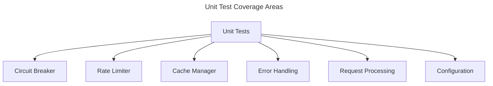
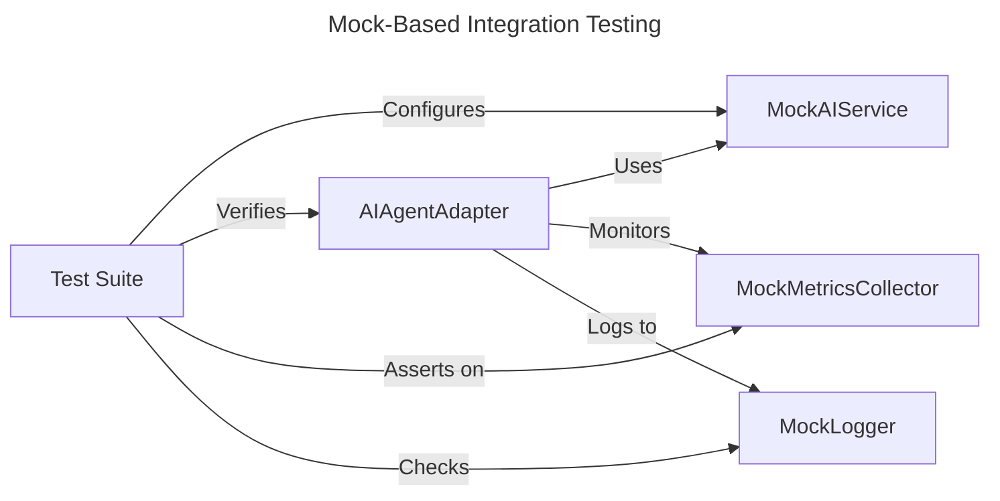
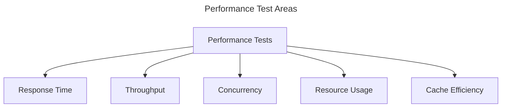
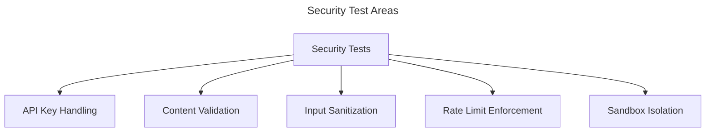
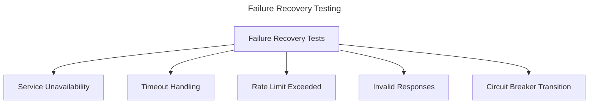
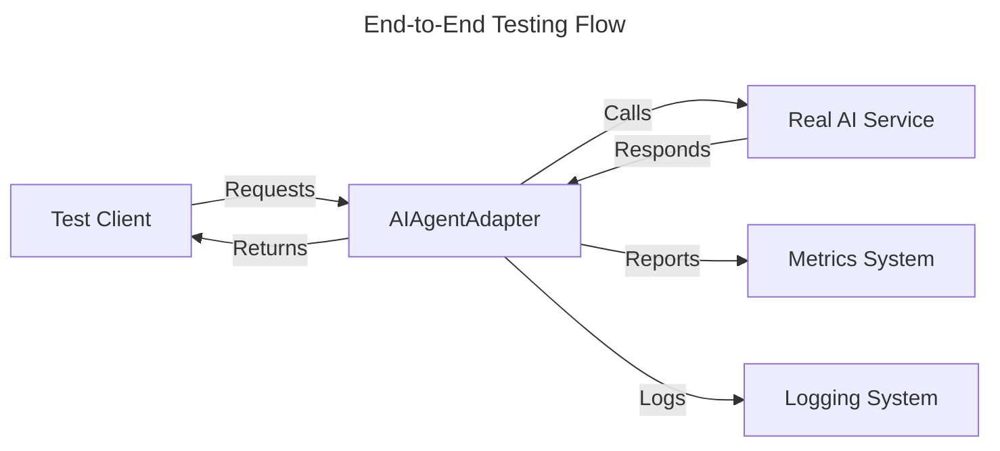

# AI Agent Integration Testing Strategy

## Overview

This document outlines a comprehensive testing strategy for the AI Agent integration in the Squirrel platform. It defines testing requirements, methodologies, tools, and success criteria to ensure the robustness, performance, and security of the AI Agent implementation.

## Testing Objectives

The key objectives of the AI Agent testing strategy are:

1. Verify correct functioning of the adapter pattern integration
2. Validate resilience mechanisms (circuit breaker, rate limiting, caching)
3. Ensure proper error handling and recovery
4. Verify performance characteristics under various loads
5. Validate security boundaries and content safety
6. Ensure compatibility with multiple AI service providers
7. Verify observability mechanisms (metrics, logging, tracing)

## Test Categories

### 1. Unit Tests

Unit tests focus on testing individual components of the AI Agent adapter:



#### Circuit Breaker Tests

- Test all state transitions (Closed → Open → Half-Open → Closed)
- Verify failure counting logic
- Test timeout-based state transitions
- Verify concurrent access to circuit breaker state

#### Rate Limiting Tests

- Test request-based rate limiting
- Test token-based rate limiting
- Verify concurrent request handling
- Test rate limit recovery after time window expiration

#### Caching Tests

- Test cache hit/miss scenarios
- Verify TTL-based expiration
- Test cache size limits and eviction policies
- Measure performance difference between cached and non-cached requests
- Test cache key generation with different request parameters

#### Error Handling Tests

- Test all error types defined in the API
- Verify retry mechanisms
- Test timeout handling
- Verify proper error propagation

### 2. Mock-Based Integration Tests

Mock-based integration tests validate the behavior of the AI Agent without requiring external services:



#### `MockAIAgentAdapter` Implementation

- Create a fully functioning mock adapter implementing the `AIAgentAdapter` trait
- Allow configuration of response delay, failure modes, and token usage
- Simulate service degradation and error conditions
- Track request counts, failures, and resource usage

#### Integration Test Scenarios

- Test complete request-response cycles
- Verify adapter behavior with various configuration options
- Test circuit breaker behavior with simulated failures
- Verify concurrent request handling
- Test adapter initialization and shutdown

### 3. Performance Tests

Performance tests validate the efficiency and scalability of the AI Agent:



#### Response Time Tests

- Measure baseline response time for different request types
- Test response time with various payloads
- Verify timeout enforcement
- Test response time distribution (percentiles)

#### Throughput Tests

- Measure maximum requests per second
- Test sustained load handling
- Verify rate limiting effectiveness
- Test recovery after load spikes

#### Concurrency Tests

- Test handling of multiple simultaneous requests
- Verify thread safety of all components
- Test performance scaling with increasing concurrency
- Verify resource contention handling

#### Resource Usage Tests

- Measure memory usage under load
- Monitor CPU utilization
- Track token usage and API call metrics
- Verify resource limit enforcement

### 4. Security Tests

Security tests verify the AI Agent's protection against threats and misuse:



#### API Key Security Tests

- Verify secure storage of API keys
- Test proper API key rotation
- Verify key access controls
- Test handling of expired or invalid keys

#### Content Security Tests

- Test validation of generated content
- Verify filtering of harmful content
- Test handling of prompt injection attempts
- Verify content sanitization

#### Resource Protection Tests

- Verify effectiveness of rate limits as security controls
- Test resource usage quotas
- Verify multi-tenant isolation
- Test quota enforcement

### 5. Failure Recovery Tests

Failure recovery tests verify the system's resilience to various failure scenarios:



#### Service Failure Tests

- Test behavior when service is completely unavailable
- Verify circuit breaker opens after threshold failures
- Test fallback mechanisms during service outage
- Verify recovery after service restoration

#### Partial Failure Tests

- Test handling of slow responses
- Verify timeout-based failures
- Test handling of malformed responses
- Verify retry strategies

#### Circuit Breaker Transition Tests

- Test transition from Closed to Open state on failures
- Verify appropriate waiting period in Open state
- Test transition to Half-Open state after timeout
- Verify criteria for transitioning back to Closed state
- Test Half-Open to Open transition on continued failures

### 6. End-to-End Tests

End-to-end tests verify the AI Agent integration with actual AI services:



#### Integration with Real Services

- Test with actual OpenAI services (behind feature flags)
- Test with mock service in environments without API access
- Verify handling of real service responses
- Test with different provider implementations

#### Full Workflow Tests

- Test complete request-response cycles
- Verify metrics collection
- Test logging and observability
- Verify cross-component integrations

## Test Implementation Tools and Frameworks

The following tools and frameworks will be used for implementing the test strategy:

1. **Unit and Integration Tests**:
   - `tokio-test` for async testing
   - `mockall` for mocking dependencies
   - `test-context` for test environment setup
   - `proptest` for property-based testing

2. **Performance Tests**:
   - `criterion` for benchmarking
   - `tokio` for concurrent testing
   - Custom load generation tools

3. **End-to-End Tests**:
   - Feature-flagged tests with real services
   - Integration with CI/CD pipeline

## Test Data Management

Test data will be managed according to the following principles:

1. **Test Fixtures**:
   - Pre-defined prompts and expected responses
   - Configurable response templates
   - Synthetic data for performance testing

2. **Sensitive Data**:
   - No real API keys in tests
   - Mock credentials for testing
   - Sanitized test outputs

3. **Test Isolation**:
   - Each test must be independent
   - No shared state between tests
   - Proper cleanup after tests

## Test Coverage Requirements

The test suite must achieve:

1. **Line Coverage**: Minimum 85% coverage of all adapter code
2. **Branch Coverage**: Minimum 80% coverage of conditional branches
3. **Scenario Coverage**: Tests for all defined use cases
4. **Failure Mode Coverage**: Tests for all expected failure scenarios
5. **Performance Verification**: Benchmarks for all performance requirements

## Implementation Plan

The implementation of the test strategy will proceed in phases:

1. **Phase 1: Core Adapter Tests** (1 week)
   - Implement `MockAIAgentAdapter` for controlled testing
   - Add basic circuit breaker tests
   - Implement unit tests for core functionality

2. **Phase 2: Resilience Tests** (1 week)
   - Add comprehensive circuit breaker tests
   - Implement rate limiting tests
   - Add timeout and retry tests
   - Test concurrent request handling

3. **Phase 3: Performance Tests** (1 week)
   - Implement caching tests
   - Add benchmarks for key operations
   - Test performance under load
   - Verify resource usage metrics

4. **Phase 4: Security & Integration Tests** (1 week)
   - Add security boundary tests
   - Implement end-to-end tests with real services
   - Test integration with monitoring systems
   - Final verification and documentation

## Continuous Testing Integration

Tests will be integrated into the CI/CD pipeline:

1. **Pull Request Validation**:
   - Run unit and integration tests
   - Verify code coverage requirements
   - Run security tests

2. **Nightly Builds**:
   - Run performance tests
   - Run comprehensive integration tests
   - Generate performance trend reports

3. **Release Validation**:
   - Run end-to-end tests with real services
   - Perform load testing
   - Verify all requirements

## Success Criteria

The testing strategy will be considered successful when:

1. All test categories are implemented and passing
2. Code coverage meets or exceeds the defined thresholds
3. Performance tests verify the system meets its requirements
4. All failure scenarios are tested and handled appropriately
5. Security tests verify the system is protected against threats
6. End-to-end tests verify the system works with real services

## Appendix: Test Case Examples

### A. Circuit Breaker Test Cases

```rust
// Test normal operation
#[tokio::test]
async fn test_circuit_breaker_normal_operation() {
    let adapter = create_test_adapter();
    adapter.initialize().await.expect("Failed to initialize");
    
    // Process multiple successful requests
    for i in 0..10 {
        let request = create_test_request(&format!("Test request {}", i));
        let result = adapter.process_request(request).await;
        assert!(result.is_ok());
    }
    
    let status = adapter.get_status().await;
    assert_eq!(status.circuit_breaker_state, CircuitBreakerState::Closed);
}

// Test transition to open state
#[tokio::test]
async fn test_circuit_breaker_opens_on_failures() {
    let adapter = create_test_adapter_with_failures();
    adapter.initialize().await.expect("Failed to initialize");
    
    // Process failing requests
    for i in 0..10 {
        let request = create_test_request(&format!("Failing request {}", i));
        let _ = adapter.process_request(request).await;
    }
    
    let status = adapter.get_status().await;
    assert_eq!(status.circuit_breaker_state, CircuitBreakerState::Open);
}
```

### B. Caching Test Cases

```rust
// Test cache hit and miss
#[tokio::test]
async fn test_cache_hit_and_miss() {
    let adapter = create_test_adapter_with_cache();
    adapter.initialize().await.expect("Failed to initialize");
    
    // First request should miss cache
    let request1 = create_test_request("Test request");
    let response1 = adapter.process_request(request1.clone()).await.unwrap();
    
    // Second identical request should hit cache
    let response2 = adapter.process_request(request1.clone()).await.unwrap();
    
    // Verify same response ID for cache hit
    assert_eq!(response1.id, response2.id);
    
    // Different request should miss cache
    let request2 = create_test_request("Different request");
    let response3 = adapter.process_request(request2).await.unwrap();
    
    // Verify different response ID for cache miss
    assert_ne!(response1.id, response3.id);
}
```

### C. Rate Limiting Test Cases

```rust
// Test rate limit enforcement
#[tokio::test]
async fn test_rate_limit_enforcement() {
    let adapter = create_rate_limited_adapter(5); // 5 requests per minute
    adapter.initialize().await.expect("Failed to initialize");
    
    // Send 5 requests (should succeed)
    for i in 0..5 {
        let request = create_test_request(&format!("Request {}", i));
        let result = adapter.process_request(request).await;
        assert!(result.is_ok());
    }
    
    // 6th request should be rate limited
    let request = create_test_request("Rate limited request");
    let result = adapter.process_request(request).await;
    assert!(matches!(result, Err(AIAgentError::RateLimitExceeded(_))));
}
``` 