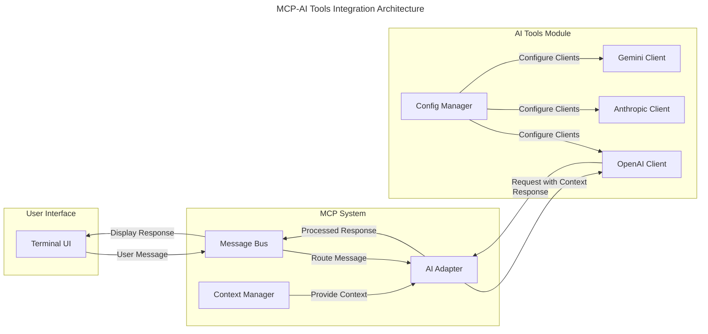

# MCP-AI Tools Integration Specification

## Overview

This specification details the integration between the Machine Context Protocol (MCP) system and the AI Tools module in the Squirrel platform. It provides guidance for the integration team on implementing a seamless flow from user messages through MCP to AI providers like OpenAI, and back to the user interface.

## Architecture

### Component Diagram



## Implementation Details

### Key Components

1. **MCP AI Adapter**: Acts as the bridge between MCP and AI Tools
2. **Context Provider**: Gathers and manages context for AI requests
3. **Message Transformer**: Converts between MCP messages and AI requests/responses
4. **Configuration Manager**: Manages API keys and other settings
5. **Stream Handler**: Handles streaming responses for real-time UI updates

### Integration Interfaces

#### AIAdapter Interface

```rust
/// Adapter for integrating AI Tools with MCP
pub trait AIAdapter {
    /// Initialize the adapter with configuration
    async fn initialize(&mut self, config: AIAdapterConfig) -> Result<(), AIAdapterError>;
    
    /// Process a message and return a response
    async fn process_message(
        &self, 
        message: String, 
        context: MCPContext
    ) -> Result<AIResponse, AIAdapterError>;
    
    /// Process a message and return a stream of response chunks
    async fn process_message_stream(
        &self, 
        message: String, 
        context: MCPContext
    ) -> Result<impl Stream<Item = Result<AIResponseChunk, AIAdapterError>>, AIAdapterError>;
    
    /// Get the current status of the adapter
    fn get_status(&self) -> AIAdapterStatus;
}
```

#### OpenAI Implementation

```rust
pub struct OpenAIAdapter {
    client: OpenAIClient,
    context_provider: Arc<dyn ContextProvider>,
    config: OpenAIAdapterConfig,
}

impl AIAdapter for OpenAIAdapter {
    async fn process_message(
        &self, 
        message: String, 
        context: MCPContext
    ) -> Result<AIResponse, AIAdapterError> {
        // 1. Transform MCP context to OpenAI context
        let openai_context = self.transform_context(context);
        
        // 2. Prepare request with message and context
        let request = self.prepare_request(message, openai_context);
        
        // 3. Send request to OpenAI
        let response = self.client.chat(request).await
            .map_err(|e| AIAdapterError::ProviderError(e.to_string()))?;
        
        // 4. Transform response to AI response
        Ok(self.transform_response(response))
    }
    
    async fn process_message_stream(
        &self, 
        message: String, 
        context: MCPContext
    ) -> Result<impl Stream<Item = Result<AIResponseChunk, AIAdapterError>>, AIAdapterError> {
        // 1. Transform MCP context to OpenAI context
        let openai_context = self.transform_context(context);
        
        // 2. Prepare request with message and context
        let request = self.prepare_request(message, openai_context);
        request.stream = true;
        
        // 3. Send streaming request to OpenAI
        let stream = self.client.chat_stream(request).await
            .map_err(|e| AIAdapterError::ProviderError(e.to_string()))?;
        
        // 4. Transform stream to AI response chunks
        Ok(stream.map(|result| {
            result
                .map(|chunk| self.transform_chunk(chunk))
                .map_err(|e| AIAdapterError::ProviderError(e.to_string()))
        }))
    }
}
```

### Context Provider

```rust
/// Provider for AI context
pub trait ContextProvider {
    /// Get context for AI request
    async fn get_context(&self, mcp_context: &MCPContext) -> AIContext;
    
    /// Get conversation history
    async fn get_conversation_history(&self, mcp_context: &MCPContext) -> Vec<Message>;
    
    /// Get system message
    async fn get_system_message(&self, mcp_context: &MCPContext) -> Option<String>;
}
```

## Message Flow

1. **User Input**:
   - User sends message through Terminal UI
   - Message is wrapped in MCP protocol envelope
   - Message is published to MCP Message Bus

2. **Context Gathering**:
   - MCP Context Manager attaches relevant context
   - Context includes conversation history, user info, project state
   - Context is optimized for token usage

3. **AI Processing**:
   - AI Adapter receives message with context
   - Adapter transforms context to AI-compatible format
   - Request is sent to appropriate AI provider
   - Response is received and processed

4. **Response Handling**:
   - For regular responses, complete message is returned
   - For streaming, chunks are sent as they arrive
   - Messages are transformed back to MCP format
   - Responses are routed back to user through Message Bus

5. **UI Display**:
   - Terminal UI receives response
   - For streaming, updates display incrementally
   - For regular responses, displays complete message

## Configuration Management

### API Key Management

```rust
pub struct AIProviderConfig {
    /// The provider name (openai, anthropic, gemini)
    pub provider: String,
    
    /// Provider-specific configuration
    pub config: HashMap<String, String>,
    
    /// API key (stored securely)
    pub api_key: Option<SecretString>,
}

impl AIProviderConfig {
    pub fn new(provider: &str) -> Self {
        Self {
            provider: provider.to_string(),
            config: HashMap::new(),
            api_key: None,
        }
    }
    
    pub fn with_api_key(mut self, api_key: &str) -> Self {
        self.api_key = Some(SecretString::new(api_key));
        self
    }
}
```

## Security Considerations

1. **API Key Protection**:
   - API keys are stored securely using encryption
   - Keys are never logged or exposed in plaintext
   - Access to keys is restricted and audited

2. **Message Security**:
   - User messages are sanitized before processing
   - PII and sensitive data are filtered automatically
   - All traffic is encrypted in transit

3. **Provider Security**:
   - Requests to AI providers use TLS
   - Rate limiting prevents abuse
   - Timeout handling prevents blocking operations

## Performance Requirements

1. **Response Time**:
   - End-to-end latency < 2 seconds for regular requests
   - First token delivery < 500ms for streaming requests
   - Context preparation < 100ms

2. **Throughput**:
   - Support for concurrent requests based on available tokens
   - Efficient token usage to minimize costs
   - Resource monitoring to prevent overload

3. **Resource Usage**:
   - Memory footprint < 100MB per instance
   - CPU usage < 10% of available resources
   - Network bandwidth optimized for token streaming

## Error Handling

```rust
#[derive(Debug, Error)]
pub enum AIAdapterError {
    #[error("Initialization error: {0}")]
    InitializationError(String),
    
    #[error("Provider error: {0}")]
    ProviderError(String),
    
    #[error("Context error: {0}")]
    ContextError(String),
    
    #[error("Configuration error: {0}")]
    ConfigurationError(String),
    
    #[error("Timeout error: {0}")]
    TimeoutError(String),
    
    #[error("Rate limit error: {0}")]
    RateLimitError(String),
}
```

## Resilience Patterns

1. **Circuit Breaker**:
   - Prevents cascade failures when AI provider is down
   - Automatic recovery when service is restored
   - Configurable thresholds and recovery strategy

2. **Retry Strategy**:
   - Exponential backoff for temporary failures
   - Jitter to prevent thundering herd
   - Maximum retry limit to prevent resource exhaustion

3. **Fallback Mechanisms**:
   - Local fallback responses for critical functionality
   - Degraded mode operation when providers are unavailable
   - Clear error messaging to users

## Implementation Plan

### Phase 1: Basic Integration (Current Status)
1. ✅ Create configuration management for API keys
2. ✅ Implement basic OpenAI client with API access
3. ✅ Add support for both regular and streaming responses
4. ⏳ Design the MCP-AI adapter interface

### Phase 2: MCP Integration
1. Implement AI adapter for MCP
2. Create context provider for AI requests
3. Implement message transformation logic
4. Add basic error handling and recovery

### Phase 3: Enhanced Features
1. Add support for multiple AI providers
2. Implement advanced context management
3. Add resilience patterns
4. Optimize for performance

### Phase 4: UI Integration
1. Connect terminal UI to MCP message bus
2. Implement streaming UI updates
3. Add user feedback mechanisms
4. Polish end-to-end experience

## Testing Strategy

### Unit Tests
1. Test adapter implementation
2. Test context transformation
3. Test message handling
4. Test configuration management

### Integration Tests
1. Test end-to-end message flow
2. Test error handling and recovery
3. Test performance under load
4. Test with different AI providers

### Validation Tests
1. Verify security requirements
2. Validate performance metrics
3. Confirm resilience patterns
4. Check UI responsiveness

## Dependencies

```toml
[dependencies]
squirrel-mcp = { path = "../mcp" }
squirrel-ai-tools = { path = "../ai-tools" }
tokio = { version = "1.0", features = ["full"] }
futures = "0.3"
thiserror = "1.0"
tracing = "0.1"
serde = { version = "1.0", features = ["derive"] }
base64 = "0.21"
```

## Next Steps for Integration Team

1. Review the OpenAI client implementation in the AI Tools module
2. Familiarize with the MCP message bus and context management
3. Implement the AI adapter trait for OpenAI
4. Create initial integration tests for the message flow
5. Coordinate with UI team for terminal integration

## Implementation Progress

As of May 22, 2024, we have made significant progress in implementing the MCP-AI Tools integration:

### Completed Components

1. **MCP-AI Tools Adapter (`McpAiToolsAdapter`)**: 
   - Created a fully functional adapter that bridges MCP and AI Tools modules
   - Implemented conversation management with history tracking
   - Added support for different message types (Human, Assistant, System, FunctionCall)
   - Implemented tool invocation and response handling

2. **OpenAI Integration**:
   - Implemented OpenAI client integration with proper error handling
   - Added configuration management for API keys and model parameters
   - Supported message generation with context

3. **UI Terminal Integration**:
   - Created a working example application (`openai_chat.rs`) demonstrating integration
   - Implemented an async chat interface that properly handles OpenAI responses
   - Added support for displaying different message types with appropriate styling

### Current Status

- The basic integration between UI Terminal → MCP → AI Tools (OpenAI) is working
- Users can send messages to OpenAI and receive responses in the terminal UI
- The system supports conversation history and context management
- Proper error handling and configuration are in place

### Next Steps

1. **Testing Framework**:
   - Implement both mock and live integration tests
   - Create test fixtures for different conversation scenarios
   - Set up CI/CD pipeline for integration testing

2. **Additional AI Providers**:
   - Complete integration for Anthropic and Gemini
   - Ensure consistent behavior across all providers
   - Add provider-specific optimizations

3. **Tool Support Enhancement**:
   - Improve tool registration and discovery
   - Add more predefined tools for common operations
   - Implement better error handling for tool invocations

4. **Performance Optimization**:
   - Optimize context preparation to reduce token usage
   - Implement caching for frequently used contexts
   - Add metrics collection for performance monitoring

5. **Documentation**:
   - Complete user documentation for the MCP-AI Tools integration
   - Add developer guides for extending the integration
   - Create examples for common use cases

<version>1.0.0</version> 