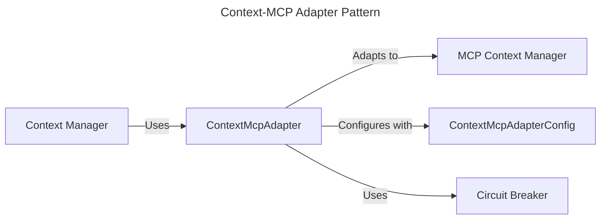
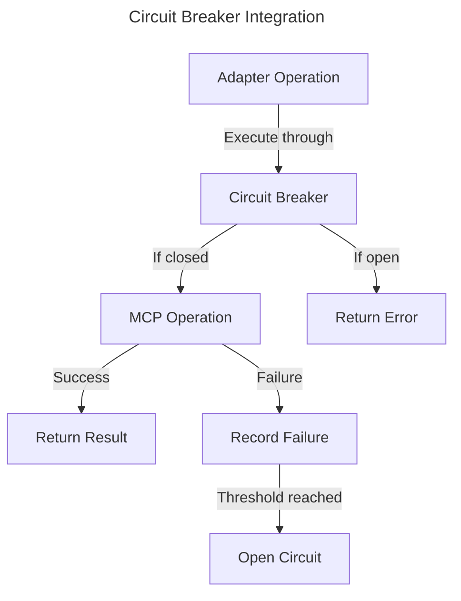
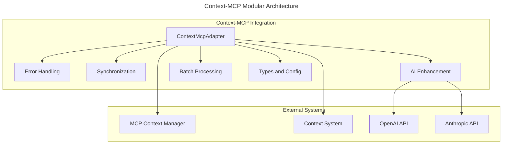

# Context-MCP Integration Specification

## Overview

This document specifies the integration between the Context Management system and the Machine Context Protocol (MCP) in the Squirrel platform. The integration enables bidirectional synchronization of context data between these two subsystems, ensuring consistency and providing a unified context management solution.

## Integration Components

The Context-MCP integration consists of the following main components:

1. **ContextMcpAdapter**: The adapter class that bridges between the Context system and MCP
2. **ContextMcpAdapterConfig**: Configuration options for the adapter
3. **SyncDirection**: Enumeration defining the direction of synchronization
4. **AdapterStatus**: Status information about the adapter
5. **Integration Error Handling**: Custom error types for the integration boundary
6. **AI Enhancement Module**: Tools for enhancing contexts with AI capabilities
7. **Batch Processing Module**: Support for efficient batch operations on multiple contexts
8. **Synchronization Module**: Specialized module for handling bidirectional sync

## Adapter Pattern Implementation

The integration follows the adapter pattern, which provides several benefits:

1. **Loose Coupling**: The Context system and MCP remain independent
2. **Testability**: Each component can be tested separately
3. **Flexibility**: Implementation details can change without affecting interfaces
4. **Extensibility**: New features can be added without modifying existing code



## Circuit Breaker Integration

The Context-MCP adapter implements the circuit breaker pattern for resilience. This prevents cascading failures by "breaking the circuit" when failures exceed a threshold, allowing the system to recover gracefully.



## Integration Interfaces

### ContextMcpAdapter

The `ContextMcpAdapter` provides the following operations:

- **Lifecycle Management**:
  - `initialize()`: Initialize the adapter and connections
  - `with_config()`: Create adapter with custom configuration

- **Synchronization Operations**:
  - `sync_all()`: Synchronize all contexts in both directions
  - `sync_direction()`: Synchronize contexts in a specific direction

- **Status Operations**:
  - `get_status()`: Get the current adapter status

### Configuration

The `ContextMcpAdapterConfig` provides the following configuration options:

- `mcp_config`: Configuration for the MCP context manager
- `context_config`: Configuration for the Squirrel context manager
- `sync_interval_secs`: Interval for automatic synchronization
- `circuit_breaker_config`: Configuration for the circuit breaker
- `max_retries`: Maximum number of retry attempts
- `timeout_ms`: Timeout for operations in milliseconds

## Synchronization Process

The synchronization process handles bidirectional updates between the Context system and MCP:

1. **Context to MCP**:
   - Retrieve all contexts from the Context system
   - For each context, convert to MCP format
   - Create or update contexts in MCP

2. **MCP to Context**:
   - Retrieve all contexts from MCP
   - For each context, convert to Context system format
   - Create or update contexts in the Context system

3. **Real-time Updates**:
   - Subscribe to MCP state change events
   - Process events as they occur
   - Update the Context system accordingly

## Usage Examples

### Basic Usage

```rust
// Create the adapter with default configuration
let adapter = create_context_mcp_adapter().await?;

// Initialize the adapter
adapter.initialize().await?;

// Perform synchronization
adapter.sync_all().await?;

// Get adapter status
let status = adapter.get_status().await;
println!("Status: {:?}", status);
```

### With Custom Configuration

```rust
// Create a custom configuration
let config = ContextMcpAdapterConfig {
    sync_interval_secs: 30,
    max_retries: 5,
    ..Default::default()
};

// Create the adapter with the configuration
let adapter = create_context_mcp_adapter_with_config(config).await?;

// Initialize and use the adapter
adapter.initialize().await?;
```

### AI Enhancement

```rust
// Enhance a context with AI-generated insights
adapter.enhance_with_insights(
    "context-123",
    "openai",
    openai_api_key,
    Some("gpt-4o"),
).await?;

// Enhance a context with a custom enhancement
adapter.enhance_context(
    "context-456",
    ContextEnhancementType::Custom("Analyze this data for security risks".to_string()),
    "anthropic",
    anthropic_api_key,
    Some("claude-3-opus"),
    Some(60000),  // 60 second timeout
    None,
    None,
).await?;
```

### Batch Processing

```rust
// Find contexts with specific tags
let matching_contexts = adapter.find_contexts_by_tags(
    vec!["important".to_string(), "quarterly-report".to_string()],
    false,  // match any of these tags
).await?;

// Batch enhance all matching contexts
let results = adapter.batch_enhance_with_type(
    matching_contexts,
    ContextEnhancementType::Insights,
    "openai",
    openai_api_key,
    Some("gpt-4o"),
    Some(10),  // process 10 contexts concurrently
).await?;

// Check results
for (context_id, result) in results {
    match result {
        Ok(_) => println!("Successfully enhanced context {}", context_id),
        Err(e) => println!("Failed to enhance context {}: {}", context_id, e),
    }
}
```

### Model Evaluation

```rust
// Evaluate which model performs best for trend analysis
let best_model = adapter.evaluate_models_for_enhancement(
    vec!["context-1", "context-2", "context-3"].iter().map(|s| s.to_string()).collect(),
    ContextEnhancementType::TrendAnalysis,
    "openai",
    openai_api_key,
    vec!["gpt-4o", "gpt-4-turbo", "gpt-3.5-turbo"].iter().map(|s| s.to_string()).collect(),
    None,  // use default evaluation function
).await?;

println!("Best model for trend analysis: {}", best_model);
```

## Error Handling

The integration uses custom error types to handle errors at the integration boundary:

- `ContextMcpError::McpError`: Error from the MCP system
- `ContextMcpError::ContextError`: Error from the Context system
- `ContextMcpError::SyncError`: Error during synchronization
- `ContextMcpError::CircuitBreakerOpen`: Circuit breaker is open
- `ContextMcpError::ConfigError`: Configuration error
- `ContextMcpError::NotFound`: Context not found

## Performance Considerations

The adapter implements several performance optimizations:

1. **Efficient ID Mapping**: Maps between MCP UUIDs and Context system IDs
2. **Batched Operations**: Groups operations to reduce network overhead
3. **Periodic Sync**: Configurable sync interval to balance consistency and overhead
4. **Circuit Breaker**: Prevents overloading systems during failure scenarios
5. **Parallel Processing**: Uses async tasks for non-blocking operations

## Security Considerations

The integration addresses the following security concerns:

1. **Safe Data Transfer**: Ensures data integrity during transfer
2. **Error Containment**: Prevents errors from propagating between systems
3. **Resource Protection**: Circuit breaker prevents resource exhaustion

## Testing

The integration is tested with the following test cases:

1. **Unit Tests**: Test individual adapter components
2. **Integration Tests**: Test the adapter with real or mocked systems
3. **Synchronization Tests**: Verify bidirectional synchronization
4. **Failure Recovery Tests**: Test recovery from various failure scenarios
5. **Performance Tests**: Verify efficiency under load

## Future Enhancements

Planned future enhancements for the integration include:

1. **Advanced Conflict Resolution**: More sophisticated conflict resolution strategies
2. **Enhanced Filtering**: Selective synchronization based on context properties
3. **Improved Metrics**: More detailed performance and health metrics
4. **Schema Validation**: Additional validation of context data during synchronization
5. **Multi-Model AI Pipeline**: Sequential processing with different AI models
6. **Custom AI Enhancement Templates**: Reusable templates for common enhancement tasks
7. **AI Enhancement Scheduling**: Automatic periodic enhancement of contexts
8. **Enhanced Model Evaluation**: More sophisticated evaluation metrics for AI models

## Dependencies

The Context-MCP integration has the following dependencies:

- `squirrel-context`: The Context system
- `squirrel-context-adapter`: The Context adapter system
- `squirrel-mcp`: The MCP system
- `tokio`: Async runtime
- `async-trait`: Async trait support
- `uuid`: UUID generation
- `log`: Logging
- `thiserror`: Error handling

## Modularity and Code Organization

The integration follows a modular architecture pattern with clear separation of concerns:



Each module has a specific responsibility:
- **adapter.rs**: Core adapter implementation and initialization
- **errors.rs**: Error types and handling for the integration
- **types.rs**: Common type definitions used across modules
- **sync.rs**: Synchronization logic for bidirectional updates
- **ai_tools.rs**: Integration with AI tools subsystem
- **ai_enhancement.rs**: Context enhancement using AI capabilities
- **batch.rs**: Batch operations and parallel processing

## AI Enhancement Capabilities

The Context-MCP integration includes powerful AI enhancement capabilities through the AI Enhancement module. This module provides several types of AI-powered context enhancements:

1. **Context Insights**: AI-generated insights about context data
2. **Context Summarization**: AI-generated summaries of context contents
3. **Trend Analysis**: AI-powered analysis of trends in context data
4. **Recommendations**: AI-generated recommendations based on context
5. **Anomaly Detection**: AI-powered detection of unusual patterns

### Enhancement Types

```rust
/// Types of AI-powered context enhancements
pub enum ContextEnhancementType {
    /// Generate a summary of the context
    Summarize,
    
    /// Generate insights from the context
    Insights,
    
    /// Analyze trends in the context data
    TrendAnalysis,
    
    /// Generate recommendations based on the context
    Recommendations,
    
    /// Detect anomalies in the context data
    AnomalyDetection,
    
    /// Custom enhancement with specific system prompt
    Custom(String),
}
```

### Enhancement Options

```rust
/// Options for AI context enhancement
pub struct ContextAiEnhancementOptions {
    /// The type of enhancement to apply
    pub enhancement_type: ContextEnhancementType,
    
    /// The AI provider to use (e.g., "openai", "anthropic", "gemini")
    pub provider: String,
    
    /// The API key for the provider
    pub api_key: String,
    
    /// The model to use (optional)
    pub model: Option<String>,
    
    /// Timeout in milliseconds (optional)
    pub timeout_ms: Option<u64>,
    
    /// Custom system prompt (optional)
    pub system_prompt: Option<String>,
    
    /// Additional parameters for the enhancement
    pub parameters: HashMap<String, serde_json::Value>,
}
```

## Batch Processing Capabilities

The integration supports efficient batch processing of multiple contexts through the Batch module. This allows for operations like:

1. **Parallel Enhancement**: Enhance multiple contexts concurrently
2. **Model Evaluation**: Compare different AI models on the same contexts
3. **Batch Synchronization**: Efficiently sync multiple contexts at once

### Batch Enhancement

```rust
/// Batch enhance multiple contexts with AI
pub async fn batch_enhance_contexts(
    &self,
    context_ids: Vec<String>,
    options: ContextAiEnhancementOptions,
    max_concurrent: Option<usize>,
) -> Result<Vec<(String, Result<()>)>>
```

### Multi-Model Enhancement

```rust
/// Enhance contexts with multiple models in parallel
pub async fn batch_enhance_with_multiple_models(
    &self,
    context_ids: Vec<String>,
    enhancement_type: ContextEnhancementType,
    provider: impl Into<String> + Clone,
    api_key: impl Into<String> + Clone,
    models: Vec<String>,
    max_concurrent: Option<usize>,
) -> Result<HashMap<String, HashMap<String, Result<()>>>>
```

## Conclusion

The Context-MCP integration provides a robust and flexible way to synchronize context data between the Context Management system and MCP. The adapter pattern enables loose coupling between these systems, while the circuit breaker pattern ensures resilience during failure scenarios. 