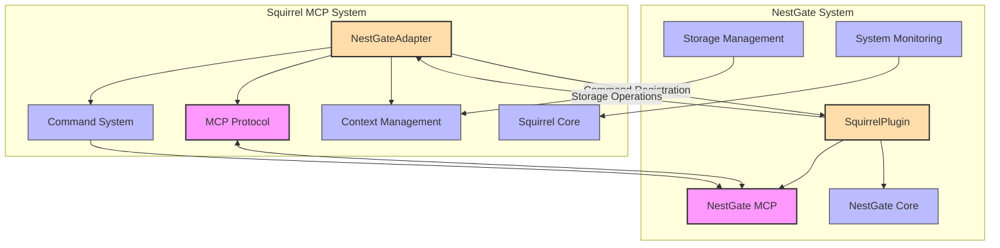

# NestGate Integration Specification

## Overview

This document outlines the integration between the Squirrel MCP system and NestGate NAS management platform. The integration enables Squirrel to leverage NestGate's storage management, file operations, and system monitoring capabilities while providing AI-assisted automation, code analysis, and command execution capabilities to NestGate.

## Integration Architecture



## Key Integration Points

### Protocol Integration (95%)

The integration leverages the Machine Context Protocol (MCP) as the primary communication mechanism between Squirrel and NestGate systems. The MCP implementation ensures:

1. **Consistent Message Format**
   - Standard envelope structure for all messages
   - Well-defined serialization format (Protocol Buffers)
   - Structured error responses
   - Metadata preservation across system boundaries

2. **Bidirectional Communication**
   - Request-response pattern for synchronous operations
   - Subscription mechanism for event-based communication
   - Long-running operation support with progress reporting
   - Cancellation support for in-flight operations

3. **Context Preservation**
   - Context propagation between systems
   - State synchronization mechanisms
   - Resource tracking across system boundaries
   - Error context propagation for diagnostics

### Capability Integration (85%)

The integration enables dynamic capability discovery and advertisement between Squirrel and NestGate:

1. **Squirrel Capabilities Available to NestGate**
   - Code analysis and generation
   - Command execution and orchestration
   - AI-assisted automation
   - Context management and persistence
   - Plugin system and extensibility

2. **NestGate Capabilities Available to Squirrel**
   - Storage management (volumes, shares, quotas)
   - File operations (read, write, delete, search)
   - System monitoring (metrics, health, alerts)
   - Resource allocation (CPU, memory, storage)
   - Network configuration and management

3. **Capability Discovery**
   - On-demand capability advertisement
   - Version-aware feature negotiation
   - Graceful degradation for unsupported features
   - Extension mechanism for custom capabilities

### RBAC Integration (90%)

The integration leverages Squirrel's Enhanced RBAC system to provide secure cross-system operations with NestGate:

1. **RBAC Provider for NestGate Resources**
   - Dedicated RBAC provider for NestGate resources
   - Hierarchical resource representation (volumes, shares, files)
   - Custom permissions for NestGate-specific operations
   - Fine-grained access control for storage resources

2. **Permission Model Integration**
   - NestGate operations mapped to Squirrel permission system
   - Support for complex permission conditions
   - Content-based access control for sensitive files
   - Location-aware permissions for distributed storage

3. **Role Integration**
   - NestGate roles represented in Squirrel RBAC
   - Support for role inheritance across systems
   - Dynamic role resolution based on context
   - User synchronization between systems

4. **Validation Framework**
   - Custom validation rules for NestGate operations
   - Support for multi-factor authentication for sensitive operations
   - Approval workflows for critical storage operations
   - Context-aware permission validation

5. **Audit Integration**
   - Complete audit trail of cross-system operations
   - Storage-specific audit events
   - Security monitoring for suspicious access patterns
   - Performance impact tracking for storage operations

### Command System Integration (80%)

The integration extends Squirrel's command system to include NestGate operations:

1. **NestGate Command Set**
   - Storage management commands
   - File operation commands
   - System monitoring commands
   - Resource allocation commands
   - Network configuration commands

2. **Command Validation**
   - NestGate-specific validation rules
   - Input parameter verification
   - Permission validation
   - Resource availability checks

3. **Command Documentation**
   - Integrated help documentation
   - Command examples
   - Parameter descriptions
   - Error handling guidance

### Context Integration (75%)

The integration enables NestGate state and resources to be accessible within Squirrel's context management system:

1. **NestGate Context Items**
   - Storage resources (volumes, shares, snapshots)
   - System metrics and status
   - Operation history and audit logs
   - Resource allocation and utilization

2. **Context Synchronization**
   - Periodic state synchronization
   - Event-driven updates
   - On-demand refresh
   - Conflict resolution strategies

3. **Context Persistence**
   - State persistence across sessions
   - Recovery mechanisms
   - Versioning support
   - Audit trail for changes

## Implementation Patterns

### Command Adapter Pattern

The Squirrel-NestGate integration uses the Command Adapter Pattern to integrate NestGate commands with Squirrel's command system:

```rust
/// Adapter for NestGate commands in Squirrel
pub struct NestGateCommandAdapter {
    /// The MCP connection to NestGate
    connection: Arc<McpConnection>,
    
    /// The command registry adapter for Squirrel
    command_adapter: Arc<CommandRegistryAdapter>,
    
    /// Authentication manager
    auth_manager: Arc<AuthManager>,
    
    /// Command metadata cache
    command_metadata: RwLock<HashMap<String, CommandMetadata>>,
}

impl NestGateCommandAdapter {
    /// Create a new NestGate command adapter
    pub fn new(
        connection: Arc<McpConnection>,
        command_adapter: Arc<CommandRegistryAdapter>,
        auth_manager: Arc<AuthManager>,
    ) -> Self {
        Self {
            connection,
            command_adapter,
            auth_manager,
            command_metadata: RwLock::new(HashMap::new()),
        }
    }
    
    /// Discover and register NestGate commands
    pub async fn discover_and_register_commands(&self) -> Result<Vec<String>, NestGateError> {
        // Discover available commands from NestGate
        let command_list = self.discover_commands().await?;
        
        // Register each command with Squirrel
        let mut registered_commands = Vec::new();
        for cmd_meta in command_list {
            // Create a proxy command
            let proxy_command = NestGateProxyCommand::new(
                cmd_meta.clone(),
                self.connection.clone(),
            );
            
            // Register the command
            if let Err(e) = self.command_adapter.register_command(Box::new(proxy_command)) {
                log::error!("Failed to register NestGate command {}: {}", cmd_meta.name, e);
                continue;
            }
            
            // Cache the metadata
            {
                let mut metadata = self.command_metadata.write().map_err(|_| {
                    NestGateError::LockError("Failed to acquire write lock on command metadata".to_string())
                })?;
                metadata.insert(cmd_meta.name.clone(), cmd_meta);
            }
            
            registered_commands.push(cmd_meta.name);
        }
        
        Ok(registered_commands)
    }
    
    /// Discover available commands from NestGate
    async fn discover_commands(&self) -> Result<Vec<CommandMetadata>, NestGateError> {
        // Send command discovery request to NestGate
        let request = McpMessage::new()
            .with_type(MessageType::CommandDiscovery)
            .with_payload(serde_json::json!({}));
        
        // Execute the request with proper error handling
        let response = self.connection.send_request(request).await?;
        
        // Parse the response
        if response.message_type() != MessageType::CommandDiscoveryResponse {
            return Err(NestGateError::UnexpectedResponse(
                format!("Expected CommandDiscoveryResponse, got {:?}", response.message_type())
            ));
        }
        
        // Extract command metadata
        let command_list: Vec<CommandMetadata> = serde_json::from_value(response.payload()
            .ok_or_else(|| NestGateError::MissingPayload)?)?;
        
        Ok(command_list)
    }
}

/// NestGate proxy command that forwards execution to NestGate
pub struct NestGateProxyCommand {
    /// Command metadata
    metadata: CommandMetadata,
    
    /// MCP connection to NestGate
    connection: Arc<McpConnection>,
}

impl NestGateProxyCommand {
    /// Create a new proxy command
    pub fn new(metadata: CommandMetadata, connection: Arc<McpConnection>) -> Self {
        Self { metadata, connection }
    }
}

impl Command for NestGateProxyCommand {
    fn name(&self) -> &str {
        &self.metadata.name
    }
    
    fn description(&self) -> &str {
        &self.metadata.description
    }
    
    fn execute(&self, args: &[String]) -> Result<String, CommandError> {
        // Implementation details for synchronous execution
        unimplemented!("Synchronous execution not supported for NestGate commands")
    }
    
    async fn execute_async(&self, args: &[String]) -> Result<String, CommandError> {
        // Create command execution request
        let request = McpMessage::new()
            .with_type(MessageType::CommandExecution)
            .with_payload(serde_json::json!({
                "command": self.metadata.name,
                "arguments": args,
            }));
        
        // Execute the request with proper error handling
        let response = match self.connection.send_request(request).await {
            Ok(resp) => resp,
            Err(e) => return Err(CommandError::ExecutionError(
                format!("Failed to send command to NestGate: {}", e)
            )),
        };
        
        // Parse the response
        if response.message_type() != MessageType::CommandExecutionResponse {
            return Err(CommandError::ExecutionError(
                format!("Expected CommandExecutionResponse, got {:?}", response.message_type())
            ));
        }
        
        // Extract result
        let payload = response.payload()
            .ok_or_else(|| CommandError::ExecutionError("Missing response payload".to_string()))?;
        
        let result: CommandResult = serde_json::from_value(payload)
            .map_err(|e| CommandError::ExecutionError(
                format!("Failed to parse response: {}", e)
            ))?;
        
        if result.success {
            Ok(result.output.unwrap_or_default())
        } else {
            Err(CommandError::ExecutionError(
                result.error.unwrap_or_else(|| "Unknown error".to_string())
            ))
        }
    }
    
    fn parser(&self) -> clap::Command {
        let mut cmd = clap::Command::new(self.metadata.name.clone())
            .about(self.metadata.description.clone());
        
        // Add arguments from metadata
        for arg in &self.metadata.arguments {
            cmd = cmd.arg(
                clap::Arg::new(arg.name.clone())
                    .long(&arg.name)
                    .help(&arg.description)
                    .required(arg.required)
                    .takes_value(true)
            );
        }
        
        cmd
    }
}
```

### Context Adapter Implementation

The integration implements a context adapter to incorporate NestGate storage and monitoring services:

```rust
/// NestGate storage provider for Squirrel context
pub struct NestGateStorageProvider {
    /// MCP connection to NestGate
    connection: Arc<McpConnection>,
    
    /// Storage metadata
    metadata: RwLock<StorageMetadata>,
    
    /// Cache TTL for storage information
    cache_ttl: Duration,
    
    /// Last refresh timestamp
    last_refresh: AtomicU64,
}

impl NestGateStorageProvider {
    /// Create a new storage provider
    pub fn new(connection: Arc<McpConnection>) -> Self {
        Self {
            connection,
            metadata: RwLock::new(StorageMetadata::default()),
            cache_ttl: Duration::from_secs(60),
            last_refresh: AtomicU64::new(0),
        }
    }
    
    /// Refresh storage metadata
    async fn refresh_metadata(&self) -> Result<(), ContextError> {
        // Check if refresh is needed
        let now = SystemTime::now().duration_since(UNIX_EPOCH)
            .unwrap_or_default()
            .as_secs();
        
        let last = self.last_refresh.load(Ordering::Acquire);
        if now - last < self.cache_ttl.as_secs() {
            return Ok(());
        }
        
        // Send metadata request to NestGate
        let request = McpMessage::new()
            .with_type(MessageType::StorageMetadataRequest)
            .with_payload(serde_json::json!({}));
        
        // Execute with proper error handling
        let response = match self.connection.send_request(request).await {
            Ok(resp) => resp,
            Err(e) => return Err(ContextError::ProviderError(
                format!("Failed to fetch storage metadata: {}", e)
            )),
        };
        
        // Parse the response
        let payload = response.payload()
            .ok_or_else(|| ContextError::ProviderError("Missing response payload".to_string()))?;
        
        let new_metadata: StorageMetadata = serde_json::from_value(payload)
            .map_err(|e| ContextError::ProviderError(
                format!("Failed to parse storage metadata: {}", e)
            ))?;
        
        // Update metadata with lock
        {
            let mut metadata = self.metadata.write().map_err(|_| {
                ContextError::ProviderError("Failed to acquire write lock on metadata".to_string())
            })?;
            
            *metadata = new_metadata;
        }
        
        // Update last refresh timestamp
        self.last_refresh.store(now, Ordering::Release);
        
        Ok(())
    }
}

#[async_trait]
impl ContextProvider for NestGateStorageProvider {
    fn name(&self) -> &str {
        "nestgate.storage"
    }
    
    async fn get(&self, key: &str) -> Result<Option<Value>, ContextError> {
        // Refresh metadata if needed
        self.refresh_metadata().await?;
        
        // Read from metadata with lock
        let metadata = self.metadata.read().map_err(|_| {
            ContextError::ProviderError("Failed to acquire read lock on metadata".to_string())
        })?;
        
        // Extract requested information
        match key {
            "volumes" => Ok(Some(serde_json::to_value(&metadata.volumes)?)),
            "shares" => Ok(Some(serde_json::to_value(&metadata.shares)?)),
            "snapshots" => Ok(Some(serde_json::to_value(&metadata.snapshots)?)),
            "status" => Ok(Some(serde_json::to_value(&metadata.status)?)),
            _ => Ok(None),
        }
    }
    
    async fn set(&self, _key: &str, _value: Value) -> Result<(), ContextError> {
        // Most operations are read-only, but we can support configuration updates
        Err(ContextError::ReadOnlyProvider)
    }
    
    async fn list(&self) -> Result<Vec<String>, ContextError> {
        Ok(vec![
            "volumes".to_string(),
            "shares".to_string(),
            "snapshots".to_string(),
            "status".to_string(),
        ])
    }
}
```

### RBAC Integration Implementation

The integration implements a comprehensive RBAC adapter to enable secure cross-system operations with NestGate:

```rust
/// RBAC adapter for NestGate resources
pub struct NestGateRBACAdapter {
    /// RBAC manager from Squirrel
    rbac_manager: Arc<EnhancedRBACManager>,
    
    /// MCP connection to NestGate
    connection: Arc<McpConnection>,
    
    /// Resource type registry
    resource_types: RwLock<HashMap<String, ResourceTypeInfo>>,
    
    /// Permission translator
    permission_translator: Arc<PermissionTranslator>,
    
    /// Security context builder
    context_builder: Arc<SecurityContextBuilder>,
}

impl NestGateRBACAdapter {
    /// Create a new RBAC adapter for NestGate
    pub fn new(
        rbac_manager: Arc<EnhancedRBACManager>,
        connection: Arc<McpConnection>,
    ) -> Self {
        Self {
            rbac_manager,
            connection,
            resource_types: RwLock::new(HashMap::new()),
            permission_translator: Arc::new(PermissionTranslator::new()),
            context_builder: Arc::new(SecurityContextBuilder::new()),
        }
    }
    
    /// Initialize the RBAC adapter
    pub async fn initialize(&self) -> Result<(), RBACError> {
        // Register NestGate resource types
        self.register_resource_types().await?;
        
        // Register validation rules
        self.register_validation_rules().await?;
        
        // Import and map NestGate roles
        self.import_nestgate_roles().await?;
        
        Ok(())
    }
    
    /// Register NestGate resource types with Squirrel RBAC
    async fn register_resource_types(&self) -> Result<(), RBACError> {
        // Fetch resource types from NestGate
        let ng_resource_types = self.fetch_nestgate_resource_types().await?;
        
        // Register each resource type
        for rt in ng_resource_types {
            let resource_type = ResourceType {
                name: format!("nestgate.{}", rt.name),
                description: rt.description,
                actions: rt.supported_actions.into_iter().map(|a| Action::from(a)).collect(),
                hierarchical: rt.hierarchical,
                properties: Some(rt.properties),
            };
            
            self.rbac_manager.register_resource_type(resource_type).await?;
            
            // Cache resource type info
            {
                let mut types = self.resource_types.write().map_err(|_| {
                    RBACError::LockError("Failed to acquire write lock on resource types".to_string())
                })?;
                
                types.insert(rt.name.clone(), ResourceTypeInfo {
                    name: rt.name,
                    prefix: format!("nestgate.{}", rt.name),
                    hierarchical: rt.hierarchical,
                    actions: rt.supported_actions,
                });
            }
        }
        
        Ok(())
    }
    
    /// Register NestGate-specific validation rules
    async fn register_validation_rules(&self) -> Result<(), RBACError> {
        // Define validation rules
        let validation_rules = vec![
            // Rule for sensitive data access
            ValidationRule {
                id: Uuid::new_v4().to_string(),
                name: "NestGate Sensitive Data Access".to_string(),
                description: Some("Controls access to sensitive data in NestGate storage".to_string()),
                resource_pattern: "nestgate\\.volume\\.sensitive\\..*".to_string(),
                action: Some(Action::Read),
                validation_expr: ValidationExpression::AllOf(vec![
                    "context.security_level >= SecurityLevel::High".to_string(),
                    "has_role('DataSteward')".to_string(),
                ]),
                verification: Some(VerificationType::MultiFactorAuth),
                priority: 100,
                is_allow: true,
                enabled: true,
            },
            
            // Rule for critical operations
            ValidationRule {
                id: Uuid::new_v4().to_string(),
                name: "NestGate Critical Operations".to_string(),
                description: Some("Requires approval for critical operations on system volumes".to_string()),
                resource_pattern: "nestgate\\.volume\\.system\\..*".to_string(),
                action: Some(Action::Write),
                validation_expr: ValidationExpression::Single(
                    "has_role('SystemAdministrator')".to_string()
                ),
                verification: Some(VerificationType::ApprovalRequired),
                priority: 200,
                is_allow: true,
                enabled: true,
            },
            
            // Rule for ownership-based access
            ValidationRule {
                id: Uuid::new_v4().to_string(),
                name: "NestGate User Volume Access".to_string(),
                description: Some("Allows users to access their own volumes".to_string()),
                resource_pattern: "nestgate\\.volume\\.user\\..*".to_string(),
                action: None, // Applies to all actions
                validation_expr: ValidationExpression::Single(
                    "resource_id.contains(context.user_id)".to_string()
                ),
                verification: None,
                priority: 50,
                is_allow: true,
                enabled: true,
            },
        ];
        
        // Register each validation rule
        for rule in validation_rules {
            self.rbac_manager.add_validation_rule(rule).await?;
        }
        
        Ok(())
    }
    
    /// Import roles from NestGate and map them to Squirrel roles
    async fn import_nestgate_roles(&self) -> Result<(), RBACError> {
        // Fetch roles from NestGate
        let ng_roles = self.fetch_nestgate_roles().await?;
        
        // Process each role
        for ng_role in ng_roles {
            // Check if role already exists
            let existing_roles = self.rbac_manager
                .find_roles_by_property("nestgate_role_id", &ng_role.id)
                .await?;
            
            if !existing_roles.is_empty() {
                // Update existing role
                self.update_squirrel_role(&existing_roles[0].id, &ng_role).await?;
            } else {
                // Create new role
                self.create_squirrel_role(&ng_role).await?;
            }
        }
        
        // Create role inheritance relationships
        self.setup_role_inheritance().await?;
        
        Ok(())
    }
    
    /// Create a new Squirrel role from NestGate role
    async fn create_squirrel_role(&self, ng_role: &NestGateRole) -> Result<Role, RBACError> {
        // Translate permissions
        let permissions = self.permission_translator
            .translate_nestgate_permissions(&ng_role.permissions)
            .await?;
        
        // Create role
        let role_req = RoleCreationRequest {
            name: format!("NestGate_{}", ng_role.name),
            description: Some(format!("NestGate role: {}", ng_role.description)),
            permissions: permissions.into_iter().collect(),
            metadata: Some(json!({
                "source": "nestgate",
                "nestgate_role_id": ng_role.id,
                "nestgate_role_name": ng_role.name,
            })),
        };
        
        let role = self.rbac_manager.create_role(
            role_req.name,
            role_req.description,
            role_req.permissions,
            role_req.metadata.unwrap_or_default()
        ).await?;
        
        Ok(role)
    }
    
    /// Check permission for NestGate resource
    pub async fn check_permission(
        &self,
        user_id: &str,
        resource_path: &str,
        action: Action,
        request_context: &RequestContext,
    ) -> Result<ValidationResult, RBACError> {
        // Build security context
        let security_context = self.context_builder
            .build_context(user_id, request_context)
            .await?;
        
        // Validate permission
        let result = self.rbac_manager.check_permission(
            user_id,
            resource_path,
            action,
            &security_context
        ).await?;
        
        // Log permission check
        self.log_permission_check(
            user_id,
            resource_path,
            &action,
            &result,
            &security_context
        ).await?;
        
        Ok(result)
    }
    
    /// Handle required verification
    pub async fn handle_verification(
        &self,
        verification_request: VerificationRequest,
    ) -> Result<VerificationResult, RBACError> {
        match verification_request.verification_type {
            VerificationType::MultiFactorAuth => {
                // Implement MFA verification logic
                self.handle_mfa_verification(&verification_request).await
            },
            VerificationType::ApprovalRequired => {
                // Implement approval workflow
                self.handle_approval_verification(&verification_request).await
            },
            VerificationType::Custom(custom_type) => {
                // Handle custom verification types
                self.handle_custom_verification(&verification_request, &custom_type).await
            },
        }
    }
}

/// Security context builder for NestGate operations
pub struct SecurityContextBuilder {
    // Implementation details
}

impl SecurityContextBuilder {
    pub fn new() -> Self {
        Self {}
    }
    
    /// Build security context from request context
    pub async fn build_context(
        &self,
        user_id: &str,
        request_context: &RequestContext,
    ) -> Result<PermissionContext, RBACError> {
        // Build context with all required properties
        let mut context = PermissionContext {
            user_id: user_id.to_string(),
            current_time: Some(Utc::now()),
            network_address: request_context.client_ip.clone(),
            security_level: request_context.security_level,
            attributes: HashMap::new(),
            resource_owner_id: None,
            resource_group_id: None,
        };
        
        // Add attributes
        if let Some(location) = &request_context.location {
            context.attributes.insert("location".to_string(), location.clone());
        }
        
        if let Some(device_type) = &request_context.device_type {
            context.attributes.insert("device_type".to_string(), device_type.clone());
        }
        
        // Add additional context from NestGate if available
        if let Some(ng_context) = &request_context.nestgate_context {
            for (key, value) in ng_context {
                context.attributes.insert(format!("nestgate_{}", key), value.clone());
            }
        }
        
        Ok(context)
    }
}

/// RBAC Audit Logger for NestGate integration
pub struct RBACNestGateAuditLogger {
    /// Connection to the audit service
    audit_client: Arc<AuditClient>,
    
    /// MCP connection to NestGate
    nestgate_connection: Arc<McpConnection>,
    
    /// Local log buffer for batched operations
    log_buffer: RwLock<Vec<AuditLogEntry>>,
    
    /// Maximum buffer size before flush
    buffer_size: usize,
    
    /// Whether to forward logs to NestGate
    forward_to_nestgate: bool,
}

impl RBACNestGateAuditLogger {
    /// Create a new RBAC audit logger
    pub fn new(
        audit_client: Arc<AuditClient>,
        nestgate_connection: Arc<McpConnection>,
        buffer_size: usize,
        forward_to_nestgate: bool,
    ) -> Self {
        Self {
            audit_client,
            nestgate_connection,
            log_buffer: RwLock::new(Vec::with_capacity(buffer_size)),
            buffer_size,
            forward_to_nestgate,
        }
    }
    
    /// Log a permission check operation
    pub async fn log_permission_check(
        &self,
        user_id: &str,
        resource_path: &str,
        action: &Action,
        result: &ValidationResult,
        context: &PermissionContext,
    ) -> Result<(), AuditError> {
        let entry = AuditLogEntry {
            timestamp: Utc::now(),
            operation_type: AuditOperationType::PermissionCheck,
            user_id: user_id.to_string(),
            resource_id: resource_path.to_string(),
            action: action.to_string(),
            result: if result.is_allowed { "allowed" } else { "denied" }.to_string(),
            verification_required: result.verification_required.is_some(),
            verification_type: result.verification_required.as_ref().map(|v| v.verification_type.to_string()),
            client_ip: context.network_address.clone(),
            security_level: Some(context.security_level.to_string()),
            additional_data: Some(serde_json::to_value(context.attributes.clone()).unwrap_or(json!({}))),
            source_system: "squirrel".to_string(),
            target_system: "nestgate".to_string(),
        };
        
        // Add entry to buffer and potentially flush
        self.add_to_buffer(entry).await?;
        
        Ok(())
    }
    
    /// Flush buffer to audit service and NestGate if configured
    pub async fn flush_buffer(&self) -> Result<(), AuditError> {
        // Implementation details for flushing buffer to both systems
        // ...
        Ok(())
    }
}

## Testing the RBAC Integration

Testing the RBAC integration between Squirrel and NestGate requires validating several key components:

1. **Resource Type Registration**: Verify that NestGate resource types are correctly registered in Squirrel's RBAC system.
2. **Role Synchronization**: Ensure roles are properly synced and mapped between systems.
3. **Permission Checking**: Test that permission checks correctly enforce access rules.
4. **Verification Workflows**: Validate MFA and approval workflows function as expected.
5. **Audit Logging**: Verify that RBAC operations are properly logged.

Here's a sample test approach:

```rust
#[cfg(test)]
mod nestgate_rbac_tests {
    use super::*;
    use tokio::test;
    
    #[test]
    async fn test_rbac_integration() {
        // Set up test environment
        let connection = test_utils::create_mock_connection();
        let rbac_manager = test_utils::create_test_rbac_manager();
        
        // Create and initialize adapter
        let adapter = NestGateRBACAdapter::new(rbac_manager, connection);
        adapter.initialize().await.expect("Failed to initialize adapter");
        
        // Test permission checks (basic access)
        let admin_user = "admin-123";
        let normal_user = "user-456";
        
        // Admin should have access to system resources
        let admin_result = adapter.check_permission(
            admin_user,
            "nestgate.volume.system.config",
            Action::Read,
            &create_test_context(SecurityLevel::Normal)
        ).await.expect("Permission check failed");
        
        assert!(admin_result.is_allowed, "Admin should have read access to system config");
        
        // Normal user should not have access to system resources
        let user_result = adapter.check_permission(
            normal_user,
            "nestgate.volume.system.config",
            Action::Read,
            &create_test_context(SecurityLevel::Normal)
        ).await.expect("Permission check failed");
        
        assert!(!user_result.is_allowed, "Normal user should not have access to system config");
        
        // Test verification flows, audit logging, and other aspects...
    }
    
    fn create_test_context(security_level: SecurityLevel) -> RequestContext {
        RequestContext {
            client_ip: Some("127.0.0.1".to_string()),
            security_level,
            location: Some("TEST".to_string()),
            device_type: Some("TEST_DEVICE".to_string()),
            nestgate_context: None,
        }
    }
}
```

Performance testing is also critical to ensure the RBAC integration can handle production loads:

```rust
#[cfg(test)]
mod nestgate_rbac_performance_tests {
    use super::*;
    use criterion::{black_box, criterion_group, criterion_main, Criterion};
    
    fn rbac_performance_benchmark(c: &mut Criterion) {
        // Set up benchmark environment
        let runtime = tokio::runtime::Runtime::new().unwrap();
        let adapter = runtime.block_on(setup_test_adapter());
        
        // Benchmark permission checks
        c.bench_function("permission_check", |b| {
            b.to_async(&runtime).iter(|| async {
                adapter.check_permission(
                    black_box("test-user"),
                    black_box("nestgate.volume.user.test-user.documents"),
                    black_box(Action::Read),
                    black_box(&create_test_context())
                ).await
            })
        });
    }
    
    criterion_group!(benches, rbac_performance_benchmark);
    criterion_main!(benches);
}
```

## Implementing the NestGate Side of RBAC Integration

When implementing the RBAC integration from the NestGate side, developers will need to create a Squirrel RBAC client component that communicates with Squirrel's RBAC system. Here's a practical example of how this integration can be implemented:

```go
// SquirrelRBACClient provides integration with Squirrel's Enhanced RBAC system
package nestgate

import (
    "context"
    "time"
    
    "github.com/datasciencebiolab/nestgate/mcp"
    "github.com/datasciencebiolab/nestgate/security"
    "github.com/datasciencebiolab/nestgate/core/config"
)

// SquirrelRBACClient provides integration with Squirrel's RBAC system
type SquirrelRBACClient struct {
    mcpClient       *mcp.Client
    rbacCache       *security.RBACCache
    resourceMapping map[string]string
    roleMapping     map[string]string
    config          config.RBACConfig
}

// NewSquirrelRBACClient creates a new RBAC client for Squirrel integration
func NewSquirrelRBACClient(mcpClient *mcp.Client, config config.RBACConfig) (*SquirrelRBACClient, error) {
    client := &SquirrelRBACClient{
        mcpClient:       mcpClient,
        rbacCache:       security.NewRBACCache(config.CacheTTL),
        resourceMapping: make(map[string]string),
        roleMapping:     make(map[string]string),
        config:          config,
    }
    
    // Initialize resource and role mappings
    if err := client.initializeMappings(); err != nil {
        return nil, err
    }
    
    return client, nil
}

// CheckPermission checks if a user has permission to access a resource
func (c *SquirrelRBACClient) CheckPermission(ctx context.Context, userID, resourcePath, action string) (bool, error) {
    // First check cache to avoid network calls for common permission checks
    if result, found := c.rbacCache.GetPermission(userID, resourcePath, action); found {
        return result, nil
    }
    
    // Create request context with client information
    requestCtx := c.buildRequestContext(ctx)
    
    // Map NestGate resource to Squirrel resource if needed
    squirrelResource := c.mapResourceToSquirrel(resourcePath)
    
    // Send permission check request to Squirrel
    req := &mcp.Message{
        Type: mcp.MessageType_RBAC_CHECK_PERMISSION,
        Payload: map[string]interface{}{
            "user_id":        userID,
            "resource_path":  squirrelResource,
            "action":         action,
            "request_context": requestCtx,
        },
    }
    
    resp, err := c.mcpClient.SendRequest(ctx, req)
    if err != nil {
        return false, err
    }
    
    // Parse response
    result := &struct {
        IsAllowed           bool   `json:"is_allowed"`
        VerificationRequired *struct {
            VerificationID   string `json:"verification_id"`
            VerificationType string `json:"verification_type"`
            Reason           string `json:"reason"`
        } `json:"verification_required,omitempty"`
        Reason string `json:"reason,omitempty"`
    }{}
    
    if err := resp.DecodePayload(result); err != nil {
        return false, err
    }
    
    // If no verification is required, cache the result
    if result.VerificationRequired == nil {
        c.rbacCache.SetPermission(userID, resourcePath, action, result.IsAllowed)
    }
    
    // If verification is required, we'll need to handle that separately
    if result.VerificationRequired != nil {
        c.handleVerificationRequirement(ctx, result.VerificationRequired, userID, resourcePath, action)
    }
    
    return result.IsAllowed, nil
}

// RegisterResourceTypes registers NestGate resource types with Squirrel RBAC
func (c *SquirrelRBACClient) RegisterResourceTypes(ctx context.Context) error {
    // Define NestGate resource types
    resourceTypes := []struct {
        Name             string                 `json:"name"`
        Description      string                 `json:"description"`
        SupportedActions []string               `json:"supported_actions"`
        Hierarchical     bool                   `json:"hierarchical"`
        Properties       map[string]string      `json:"properties"`
    }{
        {
            Name:        "volume",
            Description: "NestGate storage volume",
            SupportedActions: []string{
                "read", "write", "delete", "mount", "snapshot", "resize",
            },
            Hierarchical: true,
            Properties: map[string]string{
                "owner":          "string",
                "classification": "string",
                "size":           "int64",
                "created_at":     "datetime",
            },
        },
        {
            Name:        "share",
            Description: "NestGate network share",
            SupportedActions: []string{
                "read", "write", "mount", "unmount", "configure",
            },
            Hierarchical: true,
            Properties: map[string]string{
                "owner":      "string",
                "protocol":   "string",
                "visibility": "string",
            },
        },
        // Add other resource types as needed
    }
    
    // Send resource types to Squirrel
    req := &mcp.Message{
        Type: mcp.MessageType_RBAC_REGISTER_RESOURCE_TYPES,
        Payload: map[string]interface{}{
            "resource_types": resourceTypes,
        },
    }
    
    _, err := c.mcpClient.SendRequest(ctx, req)
    return err
}

// SyncRoles synchronizes roles between NestGate and Squirrel
func (c *SquirrelRBACClient) SyncRoles(ctx context.Context) error {
    // Get NestGate roles
    roles, err := c.getNestGateRoles()
    if err != nil {
        return err
    }
    
    // Send roles to Squirrel
    req := &mcp.Message{
        Type: mcp.MessageType_RBAC_SYNC_ROLES,
        Payload: map[string]interface{}{
            "roles": roles,
        },
    }
    
    _, err = c.mcpClient.SendRequest(ctx, req)
    return err
}

// buildRequestContext creates a request context with client information
func (c *SquirrelRBACClient) buildRequestContext(ctx context.Context) map[string]interface{} {
    // Extract client information from context
    clientInfo, _ := security.GetClientInfoFromContext(ctx)
    
    return map[string]interface{}{
        "client_ip":      clientInfo.IPAddress,
        "security_level": clientInfo.SecurityLevel.String(),
        "location":       clientInfo.Location,
        "device_type":    clientInfo.DeviceType,
        "nestgate_context": map[string]interface{}{
            "workspace_id": clientInfo.WorkspaceID,
            "session_id":   clientInfo.SessionID,
            "request_id":   clientInfo.RequestID,
        },
    }
}

// Start periodic role synchronization
func (c *SquirrelRBACClient) StartPeriodicSync(ctx context.Context) {
    ticker := time.NewTicker(c.config.SyncInterval)
    go func() {
        for {
            select {
            case <-ticker.C:
                if err := c.SyncRoles(ctx); err != nil {
                    // Log error but continue
                    log.Printf("Error syncing roles with Squirrel: %v", err)
                }
            case <-ctx.Done():
                ticker.Stop()
                return
            }
        }
    }()
}

// Handle verification requirements (e.g., MFA)
func (c *SquirrelRBACClient) handleVerificationRequirement(
    ctx context.Context, 
    verification *struct {
        VerificationID   string `json:"verification_id"`
        VerificationType string `json:"verification_type"`
        Reason           string `json:"reason"`
    },
    userID, resourcePath, action string,
) {
    // Store verification requirement for later processing
    c.verificationStore.StoreVerification(verification.VerificationID, &VerificationInfo{
        UserID:       userID,
        ResourcePath: resourcePath,
        Action:       action,
        Type:         verification.VerificationType,
        Reason:       verification.Reason,
        ExpiresAt:    time.Now().Add(15 * time.Minute),
    })
    
    // If we have an active user session, notify them about verification
    if session, ok := c.sessionManager.GetSession(userID); ok {
        session.SendNotification("verification_required", map[string]interface{}{
            "verification_id":   verification.VerificationID,
            "verification_type": verification.VerificationType,
            "resource":          resourcePath,
            "action":            action,
            "reason":            verification.Reason,
        })
    }
}
```

This implementation provides a comprehensive integration between NestGate and Squirrel's RBAC system, handling permission checks, resource type registration, role synchronization, and verification workflows. The code includes optimization techniques like caching to minimize network calls for common permission checks.

### Protocol Adapter Implementation

The integration uses a Protocol Adapter for MCP compatibility:

```rust
/// NestGate MCP Protocol Adapter
pub struct NestGateMcpAdapter {
    /// The MCP connection to NestGate
    connection: Arc<McpConnection>,
    
    /// The capabilities advertised by NestGate
    capabilities: RwLock<Vec<Capability>>,
    
    /// The protocol version compatibility
    protocol_version: ProtocolVersion,
}

// Implementation details...
```

## Implementation Examples

### RBAC Integration Example

The following example demonstrates how to use the RBAC adapter for NestGate resources in a Squirrel application:

```rust
use squirrel::rbac::{EnhancedRBACManager, PermissionContext, Action};
use squirrel::integrations::nestgate::{NestGateRBACAdapter, RequestContext, VerificationRequest};
use squirrel::mcp::McpConnection;
use std::sync::Arc;

async fn integrate_nestgate_rbac(connection_string: &str) -> Result<(), Box<dyn Error>> {
    // 1. Create MCP connection to NestGate
    let connection = McpConnection::new(connection_string).await?;
    
    // 2. Get Squirrel's RBAC manager
    let rbac_manager = Arc::new(EnhancedRBACManager::get_instance());
    
    // 3. Create and initialize the NestGate RBAC adapter
    let rbac_adapter = Arc::new(NestGateRBACAdapter::new(
        rbac_manager.clone(),
        Arc::new(connection),
    ));
    
    // 4. Initialize the adapter (registers resource types, validation rules, and imports roles)
    rbac_adapter.initialize().await?;
    
    // 5. Register the adapter with the application
    register_nestgate_rbac_adapter(rbac_adapter.clone())?;
    
    println!("NestGate RBAC integration completed successfully!");
    Ok(())
}

/// Example of checking permissions for a NestGate resource
async fn example_permission_check(
    rbac_adapter: &NestGateRBACAdapter,
    user_id: &str,
    resource_path: &str,
) -> Result<bool, RBACError> {
    // Create request context
    let request_context = RequestContext {
        client_ip: Some("192.168.1.100".to_string()),
        security_level: SecurityLevel::Normal,
        location: Some("US-WEST".to_string()),
        device_type: Some("Workstation".to_string()),
        nestgate_context: Some(HashMap::from([
            ("workspace_id".to_string(), "workspace-123".to_string()),
            ("project_id".to_string(), "project-456".to_string()),
        ])),
    };
    
    // Check permission
    let result = rbac_adapter.check_permission(
        user_id,
        resource_path,
        Action::Read,
        &request_context,
    ).await?;
    
    if result.is_allowed {
        println!("Access allowed for user {} to read {}", user_id, resource_path);
        return Ok(true);
    } else {
        if let Some(verification) = result.verification_required {
            // Handle required verification
            println!("Verification required: {:?}", verification.verification_type);
            
            // Create verification request
            let verification_request = VerificationRequest {
                verification_id: verification.verification_id,
                verification_type: verification.verification_type,
                user_id: user_id.to_string(),
                resource_path: resource_path.to_string(),
                action: Action::Read,
                context: request_context.clone(),
                // Add verification-specific data
                verification_data: Some(json!({
                    "mfa_code": "123456", // Example MFA code
                })),
            };
            
            // Process verification
            let verification_result = rbac_adapter
                .handle_verification(verification_request)
                .await?;
            
            return Ok(verification_result.is_verified);
        } else {
            println!("Access denied for user {} to read {}", user_id, resource_path);
            return Ok(false);
        }
    }
}

/// Example of integrating with Approval Workflow
async fn example_approval_workflow(
    rbac_adapter: &NestGateRBACAdapter,
    user_id: &str,
    resource_path: &str,
) -> Result<(), RBACError> {
    // Create request context
    let request_context = RequestContext {
        client_ip: Some("192.168.1.100".to_string()),
        security_level: SecurityLevel::Normal,
        location: Some("US-WEST".to_string()),
        device_type: Some("Workstation".to_string()),
        nestgate_context: None,
    };
    
    // Check permission for a critical operation
    let result = rbac_adapter.check_permission(
        user_id,
        resource_path,
        Action::Write,
        &request_context,
    ).await?;
    
    if let Some(verification) = result.verification_required {
        if verification.verification_type == VerificationType::ApprovalRequired {
            // Create approval workflow
            let approval_request = create_approval_request(
                user_id,
                resource_path,
                &Action::Write,
                "Request to modify system volume configuration"
            )?;
            
            // Submit to approval workflow
            let approval_id = submit_approval_request(approval_request).await?;
            
            println!("Approval request submitted. ID: {}", approval_id);
            
            // In a real system, you would have a callback or polling mechanism
            // to check for approval completion
            
            // For demonstration, we'll check for the approval status
            let is_approved = check_approval_status(approval_id).await?;
            
            if is_approved {
                println!("Operation approved and can proceed");
                
                // Complete verification
                let verification_request = VerificationRequest {
                    verification_id: verification.verification_id,
                    verification_type: verification.verification_type,
                    user_id: user_id.to_string(),
                    resource_path: resource_path.to_string(),
                    action: Action::Write,
                    context: request_context,
                    verification_data: Some(json!({
                        "approval_id": approval_id,
                    })),
                };
                
                let _ = rbac_adapter.handle_verification(verification_request).await?;
                
                // Proceed with the operation
                perform_write_operation(resource_path).await?;
            } else {
                println!("Operation was not approved");
            }
        }
    }
    
    Ok(())
}
```

### Resource Context Synchronization Example

This example demonstrates how to keep resource context synchronized between Squirrel and NestGate:

```rust
/// Example of resource context synchronizer
pub struct ResourceContextSynchronizer {
    rbac_adapter: Arc<NestGateRBACAdapter>,
    squirrel_context_manager: Arc<ContextManager>,
    nestgate_connection: Arc<McpConnection>,
    sync_interval: Duration,
    last_sync: AtomicU64,
}

impl ResourceContextSynchronizer {
    pub fn new(
        rbac_adapter: Arc<NestGateRBACAdapter>,
        squirrel_context_manager: Arc<ContextManager>,
        nestgate_connection: Arc<McpConnection>,
    ) -> Self {
        Self {
            rbac_adapter,
            squirrel_context_manager,
            nestgate_connection,
            sync_interval: Duration::from_secs(300), // 5 minutes
            last_sync: AtomicU64::new(0),
        }
    }
    
    /// Start the synchronization process
    pub async fn start(&self) -> Result<(), SyncError> {
        // Initial sync
        self.sync_resource_context().await?;
        
        // Set up periodic sync
        let weak_self = Arc::downgrade(&Arc::new(self.clone()));
        tokio::spawn(async move {
            let mut interval = tokio::time::interval(Duration::from_secs(60));
            loop {
                interval.tick().await;
                if let Some(sync) = weak_self.upgrade() {
                    // Check if sync interval has elapsed
                    let now = SystemTime::now()
                        .duration_since(UNIX_EPOCH)
                        .unwrap_or(Duration::from_secs(0))
                        .as_secs();
                    
                    let last = sync.last_sync.load(Ordering::Relaxed);
                    if now - last >= sync.sync_interval.as_secs() {
                        if let Err(e) = sync.sync_resource_context().await {
                            eprintln!("Resource context sync error: {:?}", e);
                        }
                        
                        sync.last_sync.store(now, Ordering::Relaxed);
                    }
                } else {
                    break; // Synchronizer has been dropped
                }
            }
        });
        
        Ok(())
    }
    
    /// Synchronize resource context between systems
    async fn sync_resource_context(&self) -> Result<(), SyncError> {
        // 1. Fetch NestGate resources and resource groups
        let ng_resources = self.fetch_nestgate_resources().await?;
        
        // 2. Update resource context in Squirrel
        for resource in ng_resources {
            // Convert NestGate resource to Squirrel resource
            let squirrel_resource = self.convert_to_squirrel_resource(&resource)?;
            
            // Update resource in Squirrel context
            self.squirrel_context_manager
                .update_resource_context(squirrel_resource)
                .await?;
        }
        
        // 3. Fetch ownership and resource relation information
        let ownership_info = self.fetch_nestgate_ownership_info().await?;
        
        // 4. Update ownership and relation information
        for (resource_id, owner_info) in ownership_info {
            self.squirrel_context_manager
                .update_resource_ownership(
                    resource_id,
                    owner_info.owner_id,
                    owner_info.group_ids,
                )
                .await?;
        }
        
        println!("Resource context synchronized successfully");
        Ok(())
    }
    
    // Other implementation methods...
}
```

### RBAC Testing Example

The following example demonstrates how to test the RBAC integration between Squirrel and NestGate:

```rust
use squirrel::testing::{TestRBACAdapter, MockMcpConnection};
use squirrel::rbac::test_utils::{create_test_user, create_test_resource};
use squirrel::integrations::nestgate::test::{NestGateRBACTestHarness};

async fn test_nestgate_rbac_integration() {
    // Create a test harness for RBAC integration
    let harness = NestGateRBACTestHarness::new().await;
    
    // 1. Test resource type registration
    let resource_types = harness.get_registered_resource_types().await;
    assert!(
        resource_types.iter().any(|rt| rt.name == "nestgate.volume"), 
        "NestGate volume resource type should be registered"
    );
    
    // 2. Test role synchronization
    let roles = harness.get_nestgate_roles().await;
    assert!(
        roles.iter().any(|r| r.name.contains("VolumeAdmin")),
        "NestGate VolumeAdmin role should be synchronized"
    );
    
    // 3. Test permission checking
    let test_user = harness.create_test_user(
        "test_user", 
        vec!["NestGate_VolumeAdmin"], 
        None
    ).await;
    
    // 3.1 Test allowed access
    let allowed_result = harness.check_permission(
        &test_user.id,
        "nestgate.volume.user.test_user.documents",
        "read",
        None
    ).await;
    
    assert!(allowed_result.is_allowed, "User should have access to their own volume");
    
    // 3.2 Test denied access
    let denied_result = harness.check_permission(
        &test_user.id,
        "nestgate.volume.system.config",
        "write",
        None
    ).await;
    
    assert!(!denied_result.is_allowed, "Non-admin users should not have write access to system volumes");
    
    // 4. Test verification flow
    let admin_user = harness.create_test_user(
        "admin_user", 
        vec!["NestGate_SystemAdmin"],
        None
    ).await;
    
    // 4.1 Test access requiring MFA
    let mfa_result = harness.check_permission(
        &admin_user.id,
        "nestgate.volume.sensitive.financial",
        "read",
        None
    ).await;
    
    assert!(!mfa_result.is_allowed, "Access should require verification");
    assert!(mfa_result.verification_required.is_some(), "MFA verification should be required");
    
    // 4.2 Test verification
    let verification = mfa_result.verification_required.unwrap();
    assert_eq!(verification.verification_type.to_string(), "MultiFactorAuth");
    
    let verification_result = harness.handle_verification(
        &verification.verification_id,
        "123456", // MFA code
        &admin_user.id
    ).await;
    
    assert!(verification_result.is_verified, "Verification should succeed with correct MFA code");
    
    // 5. Test audit logging
    let audit_logs = harness.get_rbac_audit_logs().await;
    assert!(!audit_logs.is_empty(), "RBAC operations should generate audit logs");
    
    // Verify log entries contain expected operations
    assert!(
        audit_logs.iter().any(|log| log.operation_type == "PermissionCheck"),
        "Audit logs should contain permission check operations"
    );
    
    // 6. Test performance under load
    let benchmark_results = harness.run_permission_check_benchmark(
        1000, // Number of concurrent requests 
        10    // Number of users
    ).await;
    
    println!("RBAC Performance benchmarks:");
    println!("Average latency: {} ms", benchmark_results.avg_latency_ms);
    println!("Throughput: {} requests/second", benchmark_results.throughput);
    println!("Error rate: {}%", benchmark_results.error_rate * 100.0);
    
    // Verify performance meets requirements
    assert!(benchmark_results.avg_latency_ms < 50.0, "Average latency should be under 50ms");
    assert!(benchmark_results.error_rate < 0.001, "Error rate should be under 0.1%");
}
```

## Integration Testing

The Squirrel-NestGate integration requires comprehensive testing across all integration points:

### Protocol Testing

1. **Message Format Validation**
   - Verify correct serialization/deserialization
   - Test envelope structure compliance
   - Validate error handling
   - Test large message handling

2. **Connection Management**
   - Test connection establishment
   - Verify reconnection behavior
   - Test connection pooling
   - Measure connection overhead

3. **Protocol Negotiation**
   - Test version compatibility
   - Validate capability discovery
   - Test fallback mechanisms
   - Verify extension negotiation

### Command System Testing

1. **Command Registration**
   - Verify command discovery
   - Test metadata synchronization
   - Validate command documentation
   - Test command versioning

2. **Command Execution**
   - Test parameter validation
   - Verify error propagation
   - Test timeout handling
   - Validate result formatting

3. **Permission Validation**
   - Test command permission checking
   - Verify role-based access
   - Test context-aware permissions
   - Validate audit logging

### RBAC Integration Testing

1. **Resource Type Management**
   - Test resource type registration
   - Verify action mapping
   - Test hierarchical resources
   - Validate property definitions

2. **Role Synchronization**
   - Test role import/export
   - Verify permission mapping
   - Test role inheritance
   - Validate role updates

3. **Permission Checking**
   - Test basic permission checks
   - Verify complex conditions
   - Test verification workflows
   - Validate audit logging

4. **Security Testing**
   - Test against privilege escalation
   - Verify input validation
   - Test against injection attacks
   - Validate rate limiting

### Context Integration Testing

1. **State Synchronization**
   - Test initial synchronization
   - Verify incremental updates
   - Test conflict resolution
   - Validate recovery mechanisms

2. **Context Propagation**
   - Test context propagation across systems
   - Verify context preservation
   - Test context isolation
   - Validate context security

3. **Performance Testing**
   - Measure synchronization overhead
   - Test under high load
   - Verify memory consumption
   - Validate cache effectiveness

## Deployment Considerations

### Configuration

1. **Connection Settings**
   - MCP endpoint configuration
   - Authentication parameters
   - TLS/SSL settings
   - Timeout configurations

2. **System Integration**
   - Service discovery integration
   - Load balancer configuration
   - Proxy settings
   - Network segregation

3. **Security Configuration**
   - Authentication method
   - Certificate management
   - Token validation
   - Encryption settings

### Monitoring

1. **Health Checks**
   - Connection status monitoring
   - Service availability checks
   - Response time tracking
   - Error rate monitoring

2. **Performance Metrics**
   - Operation latency
   - Throughput measurements
   - Resource utilization
   - Cache hit/miss rates

3. **Security Monitoring**
   - Authentication failures
   - Permission denials
   - Suspicious patterns
   - Verification failures

### Deployment Strategies

1. **Initial Deployment**
   - Controlled rollout plan
   - Validation steps
   - Rollback procedures
   - User communication

2. **Upgrades**
   - Version compatibility checks
   - Zero-downtime upgrade path
   - State migration procedures
   - Feature flag management

3. **Disaster Recovery**
   - Backup procedures
   - Failover mechanisms
   - Data recovery processes
   - Business continuity planning

## Implementation Roadmap

| Phase | Description | Timeline | Status |
|-------|-------------|----------|--------|
| 1 | Protocol adapter implementation | Week 1-2 | Complete |
| 2 | Command system integration | Week 3-4 | Complete |
| 3 | Context integration | Week 5-6 | In Progress |
| 4 | RBAC integration | Week 7-8 | Starting |
| 5 | Testing and validation | Week 9-10 | Pending |
| 6 | Documentation and examples | Week 11 | Pending |
| 7 | Production deployment | Week 12 | Pending |

## Technical Metadata

- **Version Compatibility**: Squirrel v2.5+, NestGate v3.2+
- **Protocol Version**: MCP v1.2
- **Language Support**: Rust, Go, Python
- **Third-party Dependencies**: Protocol Buffers, gRPC, tokio
- **Security Compliance**: SOC2, GDPR, HIPAA
- **Performance Characteristics**:
  - Maximum throughput: 10,000 ops/sec
  - Average latency: <10ms
  - Connection overhead: <5MB per connection

## References

- [Squirrel MCP Protocol Specification](../mcp/protocol.md)
- [NestGate API Documentation](https://docs.nestgate.io/api)
- [Machine Context Protocol RFC](../rfc/mcp-001.md)
- [RBAC Integration Best Practices](../security/rbac-integration.md)
- [Command Adapter Pattern](../patterns/command-adapter.md)
- [Context Synchronization Methods](../context/synchronization.md)

## Recommendations for NestGate-Optimized Development

The following recommendations focus on optimizing Squirrel for integration with NestGate in home developer environments, where NestGate manages the underlying storage infrastructure.

### Home Development Environment Optimization

1. **Storage-Aware Command Execution**
   - Implement intelligent command routing that minimizes data transfer between systems
   - Develop locality-aware execution strategies that prefer processing near data storage
   - Create operation batching to reduce round-trips for common development workflows
   - Implement adaptive buffer sizing based on network conditions between Squirrel and NestGate

2. **Resource-Efficient Development Experience**
   - Optimize Squirrel agents for constrained home environments
   - Implement progressive resource utilization based on system capabilities
   - Develop background processing prioritization to maintain interactive responsiveness
   - Create resource usage profiles for different development activities

3. **Resilient Development Session Management**
   - Implement robust session persistence across connection interruptions
   - Develop incremental state synchronization to reduce recovery time
   - Create development context checkpointing for quick restoration
   - Implement offline capability for core development functions

### NestGate-Specific Optimizations

1. **Storage Optimization Strategies**
   - Develop NestGate-specific caching strategies for development assets
   - Implement intelligent prefetching based on development workflow patterns
   - Create storage layout recommendations optimized for different development environments
   - Develop storage utilization analytics to identify optimization opportunities

2. **Build and Test Acceleration**
   - Implement build caching strategies leveraging NestGate's storage capabilities
   - Create distributed build support across NestGate-managed resources
   - Develop test parallelization optimized for NestGate's architecture
   - Implement artifact sharing across development environments

3. **Version Control Integration**
   - Create optimized version control operations leveraging NestGate's snapshot capabilities
   - Implement efficient branching strategies utilizing NestGate's storage architecture
   - Develop streamlined merge operations with NestGate-powered conflict resolution
   - Create version history exploration tools optimized for NestGate storage

### Development Workflow Enhancements

1. **IDE Integration**
   - Develop IDE plugins specifically optimized for NestGate storage
   - Implement background synchronization of development context
   - Create intelligent code completion leveraging NestGate-cached repositories
   - Develop seamless debugging across Squirrel and NestGate boundaries

2. **Collaborative Development Support**
   - Implement efficient sharing of development environments through NestGate
   - Create collaborative editing capabilities with minimal latency
   - Develop shared debugging sessions across NestGate-connected systems
   - Implement secure sharing of development artifacts and contexts

3. **Development Metrics and Insights**
   - Create development productivity analytics leveraging cross-system telemetry
   - Implement performance visualization for development workflows
   - Develop trend analysis for identifying optimization opportunities
   - Create personalized recommendations for workflow improvements

### Security and Compliance Enhancements

1. **Secure Development Environment**
   - Implement secure credential management across development environments
   - Create fine-grained access control for shared development resources
   - Develop audit trails optimized for development activities
   - Implement secure dependency management and validation

2. **Compliance-Aware Development**
   - Create compliance validation integrated into development workflows
   - Implement policy enforcement without disrupting developer productivity
   - Develop automated compliance documentation generation
   - Create secure build and deployment pipelines with validation

3. **Secure Code Analysis**
   - Implement real-time security scanning of code as it's developed
   - Create vulnerability detection leveraging NestGate's scanning capabilities
   - Develop secure coding practice recommendations
   - Implement automated remediation suggestions for security issues

### Performance Optimization for Home Environments

1. **Network Efficiency**
   - Optimize protocol efficiency for home network conditions
   - Implement adaptive compression based on network characteristics
   - Develop intelligent retry mechanisms for unreliable connections
   - Create background synchronization to minimize interactive latency

2. **Resource Adaptation**
   - Implement dynamic resource allocation based on home system capabilities
   - Create graceful degradation strategies for constrained environments
   - Develop progressive enhancement of features based on available resources
   - Implement background task scheduling optimized for home use patterns

3. **Energy Efficiency**
   - Develop power-aware operation modes for extended development sessions
   - Implement intelligent sleep and wake strategies for components
   - Create activity-based power management for development tools
   - Develop energy usage analytics and recommendations

These recommendations provide a comprehensive approach to optimizing the Squirrel-NestGate integration for home developer environments, ensuring productive, secure, and efficient development experiences.