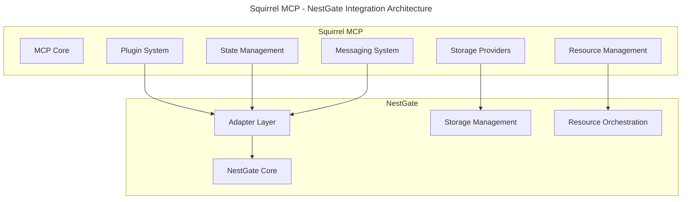

# Squirrel MCP Support for NestGate Integration

## Overview

This document outlines the specifications for implementing support for NestGate within Squirrel MCP. NestGate is a modular Network Attached Storage (NAS) management system that requires specific interfaces and extension points from Squirrel MCP for seamless integration.



## Integration Requirements

### 1. Plugin System Extensions

Squirrel MCP must implement a plugin system that supports NestGate as a plugin:

```rust
/// Plugin interface for Squirrel MCP
pub trait PluginInterface {
    /// Register plugin with MCP
    fn register(&self, registry: &mut Registry) -> Result<(), PluginError>;
    
    /// Initialize plugin
    async fn initialize(&self, context: &PluginContext) -> Result<(), PluginError>;
    
    /// Start plugin operations
    async fn start(&self) -> Result<(), PluginError>;
    
    /// Stop plugin operations
    async fn stop(&self) -> Result<(), PluginError>;
    
    /// Shutdown plugin and clean up resources
    async fn shutdown(&self) -> Result<(), PluginError>;
    
    /// Advertise plugin capabilities
    fn capabilities(&self) -> Vec<Capability>;
    
    /// Register plugin commands
    fn register_commands(&self, registry: &mut CommandRegistry) -> Result<(), PluginError>;
    
    /// Provide extension points
    fn extend_points(&self) -> Vec<ExtensionPoint>;
}

/// Plugin context provided by Squirrel MCP
pub struct PluginContext {
    /// State manager interface
    pub state_manager: Arc<dyn StateManager>,
    
    /// Message broker interface
    pub message_broker: Arc<dyn MessageBroker>,
    
    /// Storage provider registry
    pub storage_registry: Arc<StorageProviderRegistry>,
    
    /// Resource manager interface
    pub resource_manager: Arc<dyn ResourceManager>,
    
    /// Command registry
    pub command_registry: Arc<CommandRegistry>,
    
    /// Plugin configuration
    pub config: PluginConfig,
}
```

### 2. Storage Provider Interface

Squirrel MCP must implement a storage provider interface compatible with NestGate:

```rust
/// Storage provider interface
pub trait StorageProvider: Send + Sync {
    /// Get provider metadata
    fn metadata(&self) -> StorageProviderMetadata;
    
    /// Volume operations
    async fn create_volume(&self, config: VolumeConfig) -> Result<Volume, StorageError>;
    async fn delete_volume(&self, id: &str) -> Result<(), StorageError>;
    async fn list_volumes(&self) -> Result<Vec<Volume>, StorageError>;
    async fn get_volume(&self, id: &str) -> Result<Volume, StorageError>;
    async fn resize_volume(&self, id: &str, new_size: u64) -> Result<Volume, StorageError>;
    
    /// Snapshot operations
    async fn create_snapshot(&self, volume_id: &str, name: &str) -> Result<Snapshot, StorageError>;
    async fn delete_snapshot(&self, id: &str) -> Result<(), StorageError>;
    async fn list_snapshots(&self, volume_id: &str) -> Result<Vec<Snapshot>, StorageError>;
    async fn restore_snapshot(&self, snapshot_id: &str) -> Result<Volume, StorageError>;
    
    /// Backup operations
    async fn create_backup(&self, volume_id: &str, name: &str) -> Result<Backup, StorageError>;
    async fn delete_backup(&self, id: &str) -> Result<(), StorageError>;
    async fn list_backups(&self, volume_id: &str) -> Result<Vec<Backup>, StorageError>;
    async fn restore_backup(&self, backup_id: &str, target_path: &str) -> Result<Volume, StorageError>;
}

/// Storage provider metadata
pub struct StorageProviderMetadata {
    /// Provider name
    pub name: String,
    
    /// Provider version
    pub version: Version,
    
    /// Provider capabilities
    pub capabilities: StorageCapabilities,
    
    /// Provider limits
    pub limits: StorageLimits,
}

/// Storage capabilities
pub struct StorageCapabilities {
    /// Supports volume creation
    pub volume_creation: bool,
    
    /// Supports volume resizing
    pub volume_resize: bool,
    
    /// Supports snapshots
    pub snapshots: bool,
    
    /// Supports backups
    pub backups: bool,
    
    /// Supports encryption
    pub encryption: bool,
    
    /// Supports compression
    pub compression: bool,
    
    /// Supports deduplication
    pub deduplication: bool,
}
```

### 3. Resource Management Interface

Squirrel MCP must implement a resource management interface for NestGate:

```rust
/// Resource manager interface
pub trait ResourceManager: Send + Sync {
    /// Allocate resources
    async fn allocate_resources(&self, request: ResourceRequest) -> Result<ResourceAllocation, ResourceError>;
    
    /// Deallocate resources
    async fn deallocate_resources(&self, allocation_id: &str) -> Result<(), ResourceError>;
    
    /// Update resource allocation
    async fn update_allocation(&self, allocation_id: &str, request: ResourceRequest) -> Result<ResourceAllocation, ResourceError>;
    
    /// Get resource usage
    async fn get_resource_usage(&self) -> Result<ResourceUsage, ResourceError>;
    
    /// Get allocation usage
    async fn get_allocation_usage(&self, allocation_id: &str) -> Result<ResourceUsage, ResourceError>;
    
    /// Set resource limits
    async fn set_resource_limits(&self, limits: ResourceLimits) -> Result<(), ResourceError>;
    
    /// Reserve resources for future allocation
    async fn reserve_resources(&self, request: ResourceReservation) -> Result<ReservationToken, ResourceError>;
    
    /// Release resource reservation
    async fn release_reservation(&self, token: &ReservationToken) -> Result<(), ResourceError>;
}

/// Resource request
pub struct ResourceRequest {
    /// CPU cores or shares
    pub cpu: ResourceQuantity,
    
    /// Memory in bytes
    pub memory: ResourceQuantity,
    
    /// Disk space in bytes
    pub disk: ResourceQuantity,
    
    /// Network bandwidth in bytes per second
    pub network: Option<ResourceQuantity>,
    
    /// Priority (0-100)
    pub priority: Option<u8>,
    
    /// Request metadata
    pub metadata: HashMap<String, String>,
}
```

### 4. State Management Interface

Squirrel MCP must implement a state management interface for NestGate:

```rust
/// State manager interface
pub trait StateManager: Send + Sync {
    /// Get state value
    async fn get_state(&self, key: &str) -> Result<Option<State>, StateError>;
    
    /// Set state value
    async fn set_state(&self, key: &str, state: State) -> Result<(), StateError>;
    
    /// Delete state value
    async fn delete_state(&self, key: &str) -> Result<(), StateError>;
    
    /// Get multiple state values
    async fn get_states(&self, keys: &[&str]) -> Result<HashMap<String, State>, StateError>;
    
    /// Set multiple state values
    async fn set_states(&self, states: HashMap<String, State>) -> Result<(), StateError>;
    
    /// Get state values by pattern
    async fn get_state_by_pattern(&self, pattern: &str) -> Result<HashMap<String, State>, StateError>;
    
    /// Watch for state changes
    async fn watch_state(&self, key: &str) -> Result<StateWatcher, StateError>;
    
    /// Watch for state changes by pattern
    async fn watch_pattern(&self, pattern: &str) -> Result<StateWatcher, StateError>;
}

/// State watcher
pub struct StateWatcher {
    /// Receiver for state events
    pub receiver: mpsc::Receiver<StateEvent>,
    
    /// Watcher ID
    pub id: String,
}

/// State event
pub enum StateEvent {
    /// State created
    Created { key: String, state: State },
    
    /// State updated
    Updated { key: String, old_state: State, new_state: State },
    
    /// State deleted
    Deleted { key: String, state: State },
}
```

### 5. Messaging Interface

Squirrel MCP must implement a messaging interface for NestGate:

```rust
/// Message broker interface
pub trait MessageBroker: Send + Sync {
    /// Send message
    async fn send_message(&self, message: Message) -> Result<MessageId, MessageError>;
    
    /// Receive messages
    async fn receive_messages(&self) -> Result<MessageReceiver, MessageError>;
    
    /// Publish message to topic
    async fn publish(&self, topic: &str, message: Message) -> Result<MessageId, MessageError>;
    
    /// Subscribe to topic
    async fn subscribe(&self, topic: &str) -> Result<Subscription, MessageError>;
    
    /// Unsubscribe from topic
    async fn unsubscribe(&self, subscription: &Subscription) -> Result<(), MessageError>;
    
    /// Acknowledge message receipt
    async fn acknowledge(&self, message_id: &MessageId) -> Result<(), MessageError>;
    
    /// Reject message
    async fn reject(&self, message_id: &MessageId, requeue: bool) -> Result<(), MessageError>;
}

/// Message
pub struct Message {
    /// Message ID
    pub id: Option<MessageId>,
    
    /// Message sender
    pub sender: String,
    
    /// Message recipient
    pub recipient: Option<String>,
    
    /// Message topic
    pub topic: Option<String>,
    
    /// Message payload
    pub payload: Vec<u8>,
    
    /// Message headers
    pub headers: HashMap<String, String>,
    
    /// Message timestamp
    pub timestamp: DateTime<Utc>,
}
```

## Implementation Details

### 1. Plugin Registry Implementation

Squirrel MCP should implement a plugin registry for NestGate integration:

```rust
/// Plugin registry implementation
pub struct PluginRegistry {
    /// Registered plugins
    plugins: DashMap<String, Arc<dyn PluginInterface>>,
    
    /// Plugin states
    states: DashMap<String, PluginState>,
    
    /// Plugin dependencies
    dependencies: DashMap<String, Vec<String>>,
}

impl PluginRegistry {
    /// Register a plugin
    pub fn register_plugin(&self, plugin: Arc<dyn PluginInterface>) -> Result<(), PluginError> {
        // Implementation...
    }
    
    /// Get a registered plugin
    pub fn get_plugin(&self, plugin_id: &str) -> Option<Arc<dyn PluginInterface>> {
        // Implementation...
    }
    
    /// Initialize all registered plugins
    pub async fn initialize_plugins(&self, context: &PluginContext) -> Result<(), PluginError> {
        // Implementation...
    }
    
    /// Start all registered plugins
    pub async fn start_plugins(&self) -> Result<(), PluginError> {
        // Implementation...
    }
    
    /// Stop all registered plugins
    pub async fn stop_plugins(&self) -> Result<(), PluginError> {
        // Implementation...
    }
    
    /// Shutdown all registered plugins
    pub async fn shutdown_plugins(&self) -> Result<(), PluginError> {
        // Implementation...
    }
}
```

### 2. Storage Provider Registry

Squirrel MCP should implement a storage provider registry:

```rust
/// Storage provider registry
pub struct StorageProviderRegistry {
    /// Registered providers
    providers: DashMap<String, Arc<dyn StorageProvider>>,
    
    /// Default provider
    default_provider: RwLock<Option<String>>,
}

impl StorageProviderRegistry {
    /// Register a storage provider
    pub fn register_provider(&self, provider: Arc<dyn StorageProvider>) -> Result<(), StorageError> {
        // Implementation...
    }
    
    /// Unregister a storage provider
    pub fn unregister_provider(&self, provider_id: &str) -> Result<(), StorageError> {
        // Implementation...
    }
    
    /// Get a registered provider
    pub fn get_provider(&self, provider_id: &str) -> Option<Arc<dyn StorageProvider>> {
        // Implementation...
    }
    
    /// Get the default provider
    pub fn get_default_provider(&self) -> Option<Arc<dyn StorageProvider>> {
        // Implementation...
    }
    
    /// Set the default provider
    pub fn set_default_provider(&self, provider_id: &str) -> Result<(), StorageError> {
        // Implementation...
    }
    
    /// List all registered providers
    pub fn list_providers(&self) -> Vec<StorageProviderMetadata> {
        // Implementation...
    }
}
```

### 3. Resource Manager Implementation

Squirrel MCP should implement a resource manager service:

```rust
/// Resource manager service
pub struct ResourceManagerService {
    /// Resource allocations
    allocations: DashMap<String, ResourceAllocation>,
    
    /// Resource reservations
    reservations: DashMap<String, ResourceReservation>,
    
    /// Resource limits
    limits: RwLock<ResourceLimits>,
    
    /// Resource usage tracker
    usage_tracker: Arc<ResourceUsageTracker>,
}

impl ResourceManagerService {
    /// Create a new resource manager service
    pub fn new(config: ResourceManagerConfig) -> Self {
        // Implementation...
    }
    
    /// Start the resource manager service
    pub async fn start(&self) -> Result<(), ResourceError> {
        // Implementation...
    }
    
    /// Stop the resource manager service
    pub async fn stop(&self) -> Result<(), ResourceError> {
        // Implementation...
    }
}

impl ResourceManager for ResourceManagerService {
    // Implementation of ResourceManager trait methods...
}
```

### 4. State Manager Implementation

Squirrel MCP should implement a state manager service:

```rust
/// State manager service
pub struct StateManagerService {
    /// State storage
    storage: Arc<dyn StateStorage>,
    
    /// State watchers
    watchers: Arc<StateWatcherRegistry>,
    
    /// Event publisher
    event_publisher: Arc<EventPublisher>,
}

impl StateManagerService {
    /// Create a new state manager service
    pub fn new(config: StateManagerConfig) -> Self {
        // Implementation...
    }
    
    /// Start the state manager service
    pub async fn start(&self) -> Result<(), StateError> {
        // Implementation...
    }
    
    /// Stop the state manager service
    pub async fn stop(&self) -> Result<(), StateError> {
        // Implementation...
    }
}

impl StateManager for StateManagerService {
    // Implementation of StateManager trait methods...
}
```

### 5. Message Broker Implementation

Squirrel MCP should implement a message broker service:

```rust
/// Message broker service
pub struct MessageBrokerService {
    /// Message storage
    storage: Arc<dyn MessageStorage>,
    
    /// Topic registry
    topics: Arc<TopicRegistry>,
    
    /// Subscription manager
    subscriptions: Arc<SubscriptionManager>,
}

impl MessageBrokerService {
    /// Create a new message broker service
    pub fn new(config: MessageBrokerConfig) -> Self {
        // Implementation...
    }
    
    /// Start the message broker service
    pub async fn start(&self) -> Result<(), MessageError> {
        // Implementation...
    }
    
    /// Stop the message broker service
    pub async fn stop(&self) -> Result<(), MessageError> {
        // Implementation...
    }
}

impl MessageBroker for MessageBrokerService {
    // Implementation of MessageBroker trait methods...
}
```

## Error Handling

Squirrel MCP should implement consistent error handling for NestGate integration:

```rust
/// Plugin errors
#[derive(Debug, thiserror::Error)]
pub enum PluginError {
    #[error("Plugin registration failed: {0}")]
    RegistrationFailed(String),
    
    #[error("Plugin initialization failed: {0}")]
    InitializationFailed(String),
    
    #[error("Plugin start failed: {0}")]
    StartFailed(String),
    
    #[error("Plugin stop failed: {0}")]
    StopFailed(String),
    
    #[error("Plugin shutdown failed: {0}")]
    ShutdownFailed(String),
    
    #[error("Plugin dependency error: {0}")]
    DependencyError(String),
}

/// Storage errors
#[derive(Debug, thiserror::Error)]
pub enum StorageError {
    #[error("Operation failed: {0}")]
    OperationFailed(String),
    
    #[error("Resource not found: {0}")]
    NotFound(String),
    
    #[error("Access denied: {0}")]
    AccessDenied(String),
    
    #[error("Resource already exists: {0}")]
    AlreadyExists(String),
    
    #[error("Resource limit exceeded: {0}")]
    LimitExceeded(String),
    
    #[error("I/O error: {0}")]
    IoError(#[from] std::io::Error),
}

// Similar error types for ResourceError, StateError, and MessageError...
```

## Integration Testing

Squirrel MCP should provide testing support for NestGate integration:

```rust
/// Test storage provider
pub struct TestStorageProvider {
    /// Mock storage data
    volumes: Arc<RwLock<HashMap<String, Volume>>>,
    
    /// Mock snapshots
    snapshots: Arc<RwLock<HashMap<String, Snapshot>>>,
    
    /// Mock backups
    backups: Arc<RwLock<HashMap<String, Backup>>>,
    
    /// Configurable behavior
    behavior: Arc<RwLock<TestBehavior>>,
}

impl TestStorageProvider {
    /// Create a new test storage provider
    pub fn new() -> Self {
        // Implementation...
    }
    
    /// Configure test behavior
    pub async fn configure_behavior(&self, behavior: TestBehavior) {
        // Implementation...
    }
}

impl StorageProvider for TestStorageProvider {
    // Implementation of StorageProvider trait methods...
}

/// Test harness for NestGate integration
pub struct NestGateIntegrationTestHarness {
    /// Test plugin registry
    plugin_registry: Arc<PluginRegistry>,
    
    /// Test storage provider registry
    storage_registry: Arc<StorageProviderRegistry>,
    
    /// Test resource manager
    resource_manager: Arc<TestResourceManager>,
    
    /// Test state manager
    state_manager: Arc<TestStateManager>,
    
    /// Test message broker
    message_broker: Arc<TestMessageBroker>,
}

impl NestGateIntegrationTestHarness {
    /// Create a new test harness
    pub async fn new() -> Self {
        // Implementation...
    }
    
    /// Start the test harness
    pub async fn start(&self) -> Result<(), Box<dyn Error>> {
        // Implementation...
    }
    
    /// Stop the test harness
    pub async fn stop(&self) -> Result<(), Box<dyn Error>> {
        // Implementation...
    }
    
    /// Run a test scenario
    pub async fn run_scenario(&self, scenario: TestScenario) -> Result<TestResult, Box<dyn Error>> {
        // Implementation...
    }
}
```

## Performance Requirements

Squirrel MCP should meet the following performance requirements for NestGate integration:

```yaml
performance_requirements:
  storage_operations:
    create_volume: 
      success_rate: ">99%"
      p99_latency: "<500ms"
      throughput: ">100 ops/sec"
    
    volume_io:
      read_throughput: ">100MB/s"
      write_throughput: ">50MB/s"
      
  state_operations:
    get_state:
      p99_latency: "<50ms"
      throughput: ">1000 ops/sec"
    
    set_state:
      p99_latency: "<100ms"
      throughput: ">500 ops/sec"
      
  messaging:
    publish_latency: "<20ms"
    message_throughput: ">5000 msgs/sec"
    subscription_latency: "<10ms"
```

## Security Requirements

Squirrel MCP should meet the following security requirements for NestGate integration:

```yaml
security_requirements:
  authentication:
    - oauth2:
        grant_types: ["client_credentials", "password", "refresh_token"]
        token_endpoint: "/auth/token"
    - api_key:
        header: "X-API-Key"
    - mutual_tls:
        required: true
        
  authorization:
    - role_based_access_control:
        roles: ["admin", "user", "service"]
        permissions: ["read", "write", "execute", "create", "delete"]
    - resource_scopes:
        format: "<resource_type>:<resource_id>:<action>"
        examples: ["volume:*:read", "snapshot:123:delete"]
        
  data_protection:
    - encryption:
        at_rest: true
        in_transit: true
        algorithms: ["AES-256-GCM", "ChaCha20-Poly1305"]
    - access_logging:
        required: true
        retention: "90 days"
```

## Implementation Roadmap

### Phase 1: Foundation (Q1 2025)

1. Implement plugin system architecture
2. Define interface contracts
3. Create minimal implementations for testing
4. Develop integration test harness

### Phase 2: Core Services (Q2 2025)

1. Implement storage provider registry
2. Implement resource manager service
3. Implement state manager service
4. Implement message broker service
5. Develop comprehensive testing suite

### Phase 3: Full Integration (Q3 2025)

1. Implement full NestGate adapter support
2. Optimize performance for NestGate workloads
3. Enhance security features
4. Conduct integration testing with NestGate
5. Document integration patterns

## Technical Metadata
- Category: Integration Specification
- Priority: Medium
- Last Updated: 2024-09-26
- Dependencies:
  - Squirrel MCP Core v1.5.0+
  - Tokio Async Runtime
  - Serde for serialization
  - Thiserror for error handling 