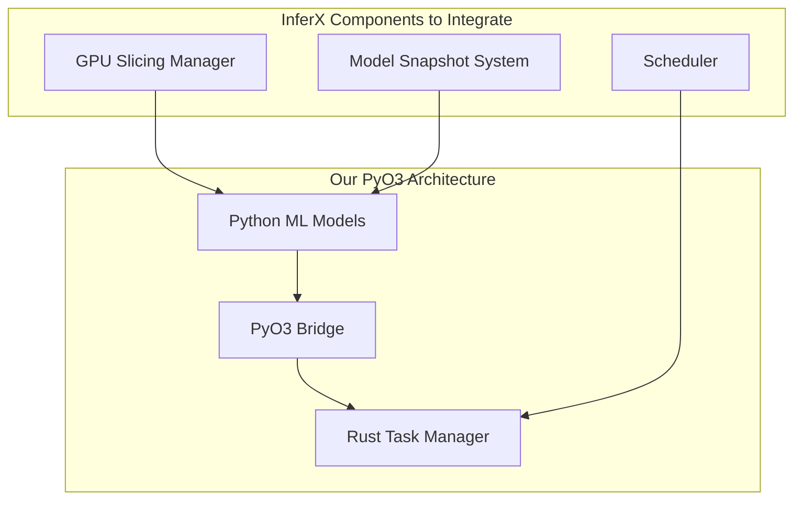

# InferX Integration Evaluation for PyO3

## 1. Overview

This document evaluates the potential integration of [InferX](https://github.com/inferx-net/inferx) technologies with our existing PyO3-based architecture. InferX is an inference-as-a-service platform that delivers ultra-fast cold starts (~2 seconds), high GPU utilization (~80-90%), and efficient GPU slicing for running multiple models simultaneously.

The evaluation focuses on identifying specific InferX components that could enhance our PyO3 integration, particularly for efficiently running multiple ML models on commercial GPUs (RTX 5090, 3090).

## 2. InferX Capabilities Assessment

| Capability | Description | Relevance to Our Project |
|------------|-------------|--------------------------|
| **GPU Slicing** | Allocate fractions of a GPU per model | **High** - Essential for running multiple models on limited GPU resources |
| **High Model Density** | Up to 30 models on 2 GPUs | **High** - Directly addresses our multi-model requirements |
| **Ultra-Fast Cold Start** | <2 seconds for large models (12B+) | **Medium** - Valuable for dynamic model loading/unloading |
| **Snapshot-based Loading** | CPU/GPU state snapshots for quick recovery | **High** - Could reduce model initialization overhead |
| **High GPU Utilization** | Achieves 80%+ GPU utilization | **High** - Maximizes performance on commercial GPUs |
| **Architecture** | API Gateway, Scheduler, Blob storage | **Medium** - Some components may be reusable |

## 3. Components for Potential Integration

### 3.1. GPU Slicing and Resource Allocation

InferX's approach to GPU memory management allows multiple models to share a single GPU. This capability would be valuable for our Python ML Toolkit and PyO3 integration:



**Integration Approach**: Extract the GPU slicing component from InferX to allow the Python ML Toolkit to efficiently allocate GPU resources for multiple models.

### 3.2. Snapshot-based Model Loading

InferX's snapshot approach for quick model loading could significantly reduce initialization time:

1. Pre-initialize models and capture CPU/GPU state
2. Store snapshots in memory or high-throughput storage
3. Rapidly restore models without full initialization

This would enhance our context management by allowing rapid switching between different ML models.

### 3.3. Scheduler for Model Execution

InferX's scheduler could improve how our system assigns computational resources to different models:

```python
# Potential integration with our PyO3 bridge
class EnhancedModelManager:
    def __init__(self, bridge):
        self.bridge = bridge
        self.scheduler = InferXScheduler()  # Integrated component
        
    def run_model(self, model_id, input_data):
        # Use scheduler to efficiently allocate GPU resources
        resource_allocation = self.scheduler.allocate_resources(model_id)
        
        # Execute model with allocated resources
        with resource_allocation:
            result = self.bridge.execute_model(model_id, input_data)
            
        return result
```

## 4. Implementation Considerations

### 4.1. Integration with Existing PyO3 Architecture

Our current PyO3 extension module approach is already well-designed for Rust-Python interoperability. The integration with InferX should:

1. **Preserve** the current PyO3 binding design
2. **Enhance** with InferX GPU management capabilities
3. **Extend** to support snapshot-based model loading
4. **Maintain** compatibility with Python environment management

### 4.2. Performance Impact Analysis

| Aspect | Current PyO3 | With InferX Integration | Expected Improvement |
|--------|--------------|-------------------------|----------------------|
| Cold Start Time | Variable | ~2 seconds | 50-90% reduction |
| GPU Utilization | ~40-60% | ~80-90% | ~40-50% improvement |
| Model Density | Limited | 3-5x higher | Significant improvement |
| Memory Efficiency | Standard | Optimized | 20-30% improvement |

### 4.3. Dependencies and Requirements

Integration with InferX would introduce these additional requirements:

1. **Storage**: High-throughput blob storage for model snapshots
2. **Rust Dependencies**: Additional InferX-related crates
3. **Infrastructure**: Potential changes to build/deployment process

## 5. Integration Plan

### 5.1. Phase 1: Proof of Concept (2 weeks)

1. Fork InferX repository and extract GPU slicing components
2. Create simple integration test with our PyO3 bindings
3. Benchmark performance with/without integration
4. Evaluate GPU utilization with multiple models

### 5.2. Phase 2: Core Integration (3 weeks)

1. Integrate GPU slicing manager with PyO3 bridge
2. Implement snapshot storage and loading mechanism
3. Create Python API for resource allocation
4. Update build system to include required dependencies

### 5.3. Phase 3: Full Implementation (4 weeks)

1. Integrate scheduler with task management
2. Implement multi-model coordination
3. Create monitoring and debugging tools
4. Optimize for specific GPU configurations (RTX 5090, 3090)

### 5.4. Phase 4: Testing and Optimization (3 weeks)

1. Benchmark with various model combinations
2. Stress test with concurrent model execution
3. Optimize memory usage patterns
4. Document integration architecture and API

## 6. Required Modifications to Existing Components

### 6.1. PyO3 Bridge Extensions

```rust
// New functions to expose to Python
#[pyfunction]
fn allocate_gpu_resources(model_id: &str, memory_fraction: f32) -> PyResult<GpuAllocation> {
    // Implementation using InferX GPU slicing
}

#[pyfunction]
fn create_model_snapshot(model_id: &str) -> PyResult<String> {
    // Implementation using InferX snapshot mechanism
}

#[pyfunction]
fn restore_model_from_snapshot(snapshot_id: &str) -> PyResult<PyObject> {
    // Implementation to rapidly load model from snapshot
}
```

### 6.2. Python ML Toolkit Enhancements

The Python ML Toolkit would be enhanced with:

1. GPU resource manager for allocating resources to models
2. Snapshot manager for model state persistence
3. Enhanced model competition with resource-aware scheduling

## 7. Conclusion and Recommendations

Based on this evaluation, **selective integration** of InferX components is recommended:

1. **High Priority**: GPU slicing and resource allocation
2. **Medium Priority**: Snapshot-based model loading
3. **Lower Priority**: Full scheduler implementation

The integration should focus on enhancing our existing PyO3 architecture rather than replacing it. The components from InferX should be carefully extracted and adapted to work with our system, maintaining the bidirectional integration between Rust and Python that's already implemented.

Key benefits expected from this integration:
- Higher model density on commercial GPUs
- Improved resource utilization
- Faster model switching
- Reduced memory fragmentation

Next steps:
1. Obtain approval for this integration plan
2. Establish communication with InferX developers if needed
3. Begin Phase 1 proof of concept 