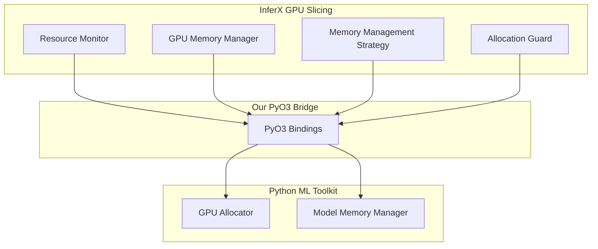
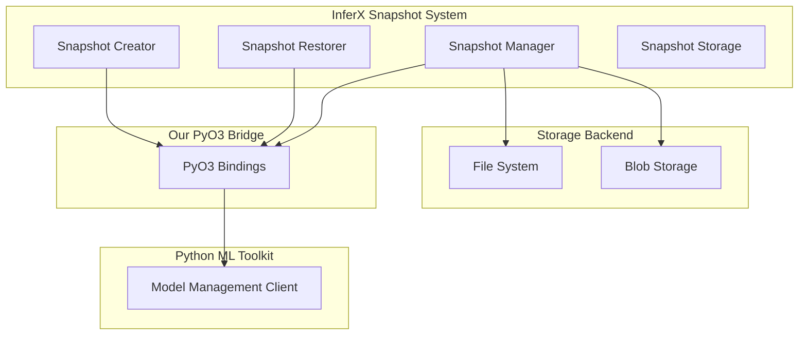

# InferX Integration Implementation Plan

## 1. Overview

This document outlines the detailed implementation plan for integrating selected components from the InferX platform with our PyO3-based architecture. Based on the [InferX evaluation](inferx-evaluation.md), we will focus on the GPU slicing and snapshot-based model loading components to maximize GPU utilization for our ML workloads on commercial GPUs (RTX 5090, 3090).

## 2. Core Components for Integration

### 2.1. GPU Slicing Component



The GPU slicing component will be extracted from InferX and adapted for our use, with these key parts:

1. **GPU Memory Manager**: Core logic for partitioning GPU memory
2. **Resource Monitor**: Tracks GPU memory usage and availability
3. **Memory Management Strategy**: Algorithms for efficient memory allocation
4. **Allocation Guard**: RAII-style resource management for safe releases

### 2.2. Snapshot-Based Model Loading



The snapshot system will enable fast model loading/unloading with these components:

1. **Snapshot Creator**: Captures model state (both CPU and GPU)
2. **Snapshot Restorer**: Rapidly loads models from snapshots
3. **Snapshot Manager**: Tracks available snapshots and their metadata
4. **Snapshot Storage**: Interfaces with storage backends

## 3. Implementation Phases

### 3.1. Phase 1: GPU Slicing Implementation (3 weeks)

#### Week 1: Core Infrastructure

1. **Extract InferX GPU Slicing Code**
   - Fork InferX repository
   - Identify and isolate GPU slicing components
   - Create standalone crate with minimal dependencies

2. **Basic PyO3 Binding Integration**
   - Create PyO3 wrapper functions for core GPU operations
   - Implement memory allocation/deallocation
   - Setup basic test harness

#### Week 2: Memory Management

1. **Implement Memory Strategy Algorithms**
   - Port best-fit allocation strategy
   - Implement memory fragmentation prevention
   - Add support for memory oversubscription

2. **Create Resource Monitoring**
   - Implement GPU memory tracking
   - Add utilization metrics collection
   - Create alerting for memory pressure

#### Week 3: Python Integration

1. **Develop Python API**
   - Create GPU allocator class
   - Implement context manager for resource handling
   - Add helper functions for common operations

2. **Testing and Benchmarking**
   - Test with multiple models on single GPU
   - Measure allocation/deallocation overhead
   - Compare performance with/without slicing

### 3.2. Phase 2: Snapshot System Implementation (3 weeks)

#### Week 1: Snapshot Creation

1. **Extract InferX Snapshot Code**
   - Isolate snapshot creation logic
   - Create standalone module
   - Implement PyO3 bindings

2. **Implement Serialization**
   - Create efficient serialization for model states
   - Implement compression for large models
   - Add metadata tracking

#### Week 2: Snapshot Storage

1. **Implement Storage Backend**
   - Create file system storage
   - Add optional blob storage support
   - Implement caching layer

2. **Develop Snapshot Manager**
   - Create snapshot registry
   - Implement versioning
   - Add garbage collection

#### Week 3: Rapid Restoration

1. **Implement Fast Loading**
   - Create direct GPU memory restoration
   - Optimize CPU state restoration
   - Minimize initialization overhead

2. **Testing and Benchmarking**
   - Measure cold start times with/without snapshots
   - Test with various model sizes
   - Verify state consistency

### 3.3. Phase 3: Integration with ML Toolkit (2 weeks)

#### Week 1: ML Toolkit Adaptation

1. **Enhance Model Competition**
   - Update competition system to use GPU slicing
   - Add resource-aware scheduling
   - Implement parallel model evaluation

2. **Update Model Factory**
   - Add snapshot support to model creation
   - Implement memory-efficient model loading
   - Create model versioning with snapshots

#### Week 2: End-to-End Testing

1. **Create Test Suite**
   - Test with multiple concurrent models
   - Verify resource isolation
   - Validate performance improvements

2. **Documentation and Examples**
   - Update ML toolkit documentation
   - Create example scripts
   - Document best practices

### 3.4. Phase 4: Performance Optimization (2 weeks)

1. **Profiling and Optimization**
   - Identify performance bottlenecks
   - Optimize critical paths
   - Reduce overhead

2. **RTX GPU-Specific Optimizations**
   - Tune for RTX 5090/3090 architectures
   - Optimize for Tensor Cores
   - Create GPU-specific allocation strategies

## 4. Required Code Structure

### 4.1. Rust Components

```rust
// GPU Slicing Manager
pub struct GpuSlicingManager {
    devices: Vec<GpuDevice>,
    allocation_strategy: Box<dyn AllocationStrategy>,
}

impl GpuSlicingManager {
    pub fn new() -> Self {
        // Initialize with available GPUs
    }
    
    pub fn allocate(&mut self, memory_size: usize, 
                   preferences: AllocationPreferences) -> Result<GpuAllocation, AllocationError> {
        // Allocate GPU memory according to strategy
    }
    
    pub fn deallocate(&mut self, allocation: GpuAllocation) {
        // Free GPU memory
    }
    
    pub fn get_utilization(&self) -> HashMap<String, f32> {
        // Return GPU utilization metrics
    }
}

// Snapshot System
pub struct ModelSnapshot {
    id: String,
    model_type: String,
    cpu_state: Vec<u8>,
    gpu_state: Vec<u8>,
    metadata: HashMap<String, String>,
}

pub struct SnapshotManager {
    storage: Box<dyn SnapshotStorage>,
    registry: HashMap<String, SnapshotMetadata>,
}

impl SnapshotManager {
    pub fn create_snapshot(&mut self, model_id: &str) -> Result<String, SnapshotError> {
        // Create and store snapshot
    }
    
    pub fn restore_model(&self, snapshot_id: &str) -> Result<ModelHandle, SnapshotError> {
        // Restore model from snapshot
    }
}
```

### 4.2. PyO3 Bindings

```rust
// GPU Slicing PyO3 Bindings
#[pymodule]
fn gpu_slicing(_py: Python, m: &PyModule) -> PyResult<()> {
    m.add_class::<PyGpuManager>()?;
    m.add_class::<PyGpuAllocation>()?;
    m.add_function(wrap_pyfunction!(allocate_gpu, m)?)?;
    m.add_function(wrap_pyfunction!(get_gpu_utilization, m)?)?;
    Ok(())
}

#[pyclass]
struct PyGpuManager {
    inner: GpuSlicingManager,
}

#[pymethods]
impl PyGpuManager {
    #[new]
    fn new() -> Self {
        Self { inner: GpuSlicingManager::new() }
    }
    
    fn allocate(&mut self, memory_mb: usize) -> PyResult<PyGpuAllocation> {
        // Allocate GPU memory
    }
    
    fn get_utilization(&self) -> PyResult<HashMap<String, f32>> {
        // Get GPU utilization
    }
}

// Snapshot System PyO3 Bindings
#[pymodule]
fn model_snapshot(_py: Python, m: &PyModule) -> PyResult<()> {
    m.add_class::<PySnapshotManager>()?;
    m.add_function(wrap_pyfunction!(create_snapshot, m)?)?;
    m.add_function(wrap_pyfunction!(restore_model, m)?)?;
    Ok(())
}
```

### 4.3. Python Integration

```python
# GPU Allocation
from mcp_pyo3_bindings.gpu_slicing import GpuManager, GpuAllocation

class ModelGpuManager:
    def __init__(self):
        self.gpu_manager = GpuManager()
        self.allocations = {}
        
    def allocate_for_model(self, model_id, memory_mb):
        """Allocate GPU memory for a specific model"""
        allocation = self.gpu_manager.allocate(memory_mb)
        self.allocations[model_id] = allocation
        return allocation
        
    def with_gpu_allocation(self, model_id, memory_mb):
        """Context manager for GPU allocation"""
        class AllocationContext:
            def __init__(self, manager, model_id, memory_mb):
                self.manager = manager
                self.model_id = model_id
                self.memory_mb = memory_mb
                self.allocation = None
                
            def __enter__(self):
                self.allocation = self.manager.allocate_for_model(
                    self.model_id, self.memory_mb)
                return self.allocation
                
            def __exit__(self, exc_type, exc_val, exc_tb):
                if self.allocation:
                    self.manager.release_allocation(self.model_id)
                    
        return AllocationContext(self, model_id, memory_mb)
        
    def release_allocation(self, model_id):
        """Release GPU allocation for a model"""
        if model_id in self.allocations:
            # Allocation automatically released when object is dropped
            del self.allocations[model_id]

# Snapshot Management
from mcp_pyo3_bindings.model_snapshot import SnapshotManager

class ModelSnapshotHandler:
    def __init__(self):
        self.snapshot_manager = SnapshotManager()
        
    def create_model_snapshot(self, model, metadata=None):
        """Create a snapshot of the model state"""
        model_id = getattr(model, "id", str(id(model)))
        return self.snapshot_manager.create_snapshot(model_id, metadata or {})
        
    def restore_model(self, snapshot_id, model_class=None):
        """Restore a model from a snapshot"""
        model_data = self.snapshot_manager.restore_model(snapshot_id)
        
        if model_class:
            # If model class provided, instantiate with restored state
            model = model_class.__new__(model_class)
            model.__dict__.update(model_data)
            return model
        
        return model_data
```

## 5. Integration with ML Competition System

```python
class ResourceAwareModelCompetition(ModelCompetition):
    def __init__(self, bridge, config):
        super().__init__(bridge, config)
        self.gpu_manager = ModelGpuManager()
        self.snapshot_handler = ModelSnapshotHandler()
        
    async def _train_model_on_node(self, node_url, model_type, hyperparams):
        """Train model with GPU resource allocation"""
        # Estimate memory requirements based on model type and hyperparams
        memory_mb = self._estimate_memory_requirement(model_type, hyperparams)
        
        # Allocate GPU memory for training
        with self.gpu_manager.with_gpu_allocation(f"train_{node_url}", memory_mb):
            model_id = await super()._train_model_on_node(node_url, model_type, hyperparams)
            
            # Create snapshot for fast reloading
            snapshot_id = self.snapshot_handler.create_model_snapshot(
                model_id, {"model_type": model_type, "node": node_url})
            
            # Store snapshot ID for later use
            self._store_snapshot_reference(model_id, snapshot_id)
            
        return model_id
        
    def _evaluate_model(self, model_id, test_data):
        """Evaluate model with efficient resource usage"""
        # Get snapshot ID for this model
        snapshot_id = self._get_snapshot_reference(model_id)
        
        # Estimate evaluation memory requirements
        memory_mb = self._estimate_eval_memory_requirement(model_id)
        
        # Allocate memory and restore from snapshot
        with self.gpu_manager.with_gpu_allocation(f"eval_{model_id}", memory_mb):
            if snapshot_id:
                # Fast load from snapshot
                model = self.snapshot_handler.restore_model(snapshot_id)
            else:
                # Regular load
                model = self.bridge.get_model(model_id)
                
            # Evaluate model
            return model.evaluate(test_data)
```

## 6. Benchmark and Validation Plan

### 6.1. Performance Benchmarks

1. **Cold Start Time**
   - Measure time to load models from scratch vs. snapshot
   - Test with various model sizes (1B, 7B, 12B parameters)
   - Record initialization overhead

2. **GPU Utilization**
   - Measure GPU memory utilization
   - Track GPU compute utilization
   - Compare multi-model vs. single-model deployment

3. **Model Density**
   - Determine maximum models per GPU
   - Measure throughput with varying model counts
   - Assess impact on latency

### 6.2. Validation Tests

1. **Resource Isolation**
   - Verify models don't interfere with each other
   - Test with high-memory and high-compute models
   - Validate proper resource release

2. **Memory Leak Detection**
   - Run extended load tests
   - Monitor memory growth over time
   - Validate cleanup mechanisms

3. **Failure Scenarios**
   - Test recovery from GPU errors
   - Validate behavior under memory pressure
   - Verify snapshot corruption handling

## 7. Conclusion

This implementation plan provides a detailed roadmap for integrating the InferX GPU slicing and snapshot capabilities with our PyO3 architecture. The phased approach allows for incremental development and testing, with each phase building on the previous one.

Successful implementation will significantly enhance our Python ML Toolkit's ability to efficiently utilize commercial GPUs, enabling higher model density and improved resource utilization for our multi-model workloads.

## 8. Next Steps

1. Obtain approval for this implementation plan
2. Set up development environment with target GPUs
3. Begin Phase 1 with GPU slicing implementation
4. Create weekly progress tracking and reporting 