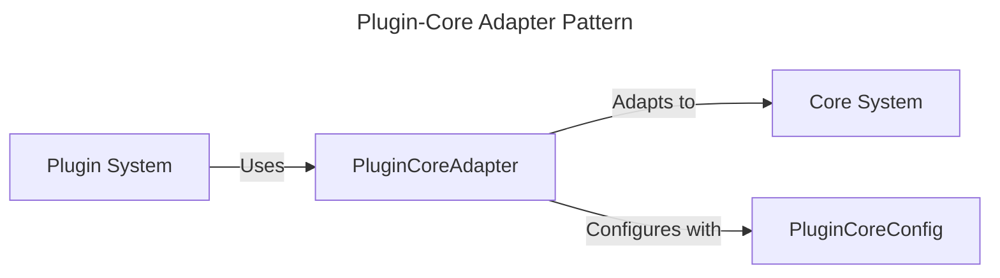

# Plugin-Core Integration Specification

## Overview

This document specifies the integration between the Plugin system and Core components in the Squirrel platform. The integration allows the Plugin system to interact with Core functionality while maintaining loose coupling and separation of concerns.

## Integration Components

The Plugin-Core integration consists of the following main components:

1. **PluginCoreAdapter**: The adapter class that bridges between the Plugin system and Core
2. **PluginCoreConfig**: Configuration options for the adapter
3. **Integration Error Handling**: Custom error types specific to integration boundaries

## Adapter Pattern Implementation

The integration follows the adapter pattern, which provides several benefits:

1. **Loose Coupling**: The Plugin system and Core remain independent
2. **Testability**: Each component can be tested separately
3. **Flexibility**: Implementation details can change without affecting interfaces
4. **Extensibility**: New features can be added without modifying existing code



## Integration Interfaces

### PluginCoreAdapter

The `PluginCoreAdapter` provides the following operations:

- **Lifecycle Management**:
  - `initialize()`: Initialize the adapter
  - `load_plugins()`: Load plugins from a directory
  - `shutdown_all_plugins()`: Shutdown all plugins

- **Plugin Operations**:
  - `register_plugin()`: Register a plugin with the adapter
  - `unregister_plugin()`: Unregister a plugin
  - `get_all_plugins()`: Get all registered plugins
  - `get_plugin_status()`: Get the status of a plugin

- **Core Operations**:
  - `get_core_status()`: Get the status of the core component

### Configuration

The `PluginCoreConfig` provides the following configuration options:

- `auto_initialize_plugins`: Whether to automatically initialize plugins
- `require_core_registration`: Whether plugins must be registered with core
- `plugin_directory`: Directory to search for plugins
- `verify_signatures`: Whether to verify plugin signatures

## Usage Examples

### Basic Usage

```rust
// Create the adapter with default configuration
let mut adapter = PluginCoreAdapter::new();

// Initialize the adapter
adapter.initialize().await?;

// Load plugins from the configured directory
let plugin_ids = adapter.load_plugins().await?;

// Get plugin status
for id in plugin_ids {
    let status = adapter.get_plugin_status(id).await?;
    println!("Plugin {}: {:?}", id, status);
}

// Get core status
let core_status = adapter.get_core_status().await?;
```

### With Custom Configuration

```rust
// Create a custom configuration
let config = PluginCoreConfig {
    auto_initialize_plugins: true,
    require_core_registration: false,
    plugin_directory: "./plugins".to_string(),
    verify_signatures: true,
};

// Create the adapter with the configuration
let mut adapter = PluginCoreAdapter::with_config(config);

// Initialize and use the adapter
adapter.initialize().await?;
```

### With Dependency Injection

```rust
// Function that uses the adapter through dependency injection
async fn process_plugins(adapter: Arc<PluginCoreAdapter>) -> Result<()> {
    // Get all plugins
    let plugins = adapter.get_all_plugins().await?;
    
    // Process each plugin
    for plugin in plugins {
        // Do something with the plugin
    }
    
    Ok(())
}
```

## Error Handling

The integration uses custom error types to handle errors at the integration boundary:

- `IntegrationError::NotInitialized`: Adapter not initialized
- `IntegrationError::AlreadyInitialized`: Adapter already initialized
- `IntegrationError::PluginError`: Error from the plugin system
- `IntegrationError::CoreError`: Error from the core system

## Implementation Status

The Plugin-Core integration is complete with the following components implemented:

- ✅ PluginCoreAdapter
- ✅ PluginCoreConfig
- ✅ Error handling
- ✅ Basic usage examples
- ✅ Test coverage

## Integration Testing

The integration is tested with the following test cases:

1. **Initialization Tests**: Test adapter initialization and reinitialization
2. **Configuration Tests**: Test custom configuration options
3. **Plugin Loading Tests**: Test loading plugins from a directory
4. **Plugin Registration Tests**: Test registering and unregistering plugins
5. **Status Tests**: Test retrieving plugin and core status

## Security Considerations

The integration addresses the following security concerns:

1. **Plugin Verification**: Option to verify plugin signatures
2. **Resource Isolation**: Plugins are isolated from core components
3. **Error Boundary**: Errors in plugins don't affect core functionality

## Performance Considerations

The integration takes the following approach to performance:

1. **Lazy Loading**: Plugins are loaded only when needed
2. **Optimized Status Tracking**: Plugin statuses are cached
3. **Minimal Overhead**: Adapter adds minimal overhead to operations

## Future Enhancements

Planned future enhancements for the integration include:

1. **Event System**: Add event-based communication between plugins and core
2. **Resource Sharing**: Enhanced mechanisms for resource sharing
3. **Plugin Capabilities**: More fine-grained control over plugin capabilities
4. **Enhanced Security**: Additional security verification mechanisms

## Dependencies

The Plugin-Core integration has the following dependencies:

- `squirrel-core`: The core system
- `squirrel-plugins`: The plugin system
- `tokio`: Async runtime
- `async-trait`: Async trait support
- `uuid`: UUID generation
- `log`: Logging
- `thiserror`: Error handling

## Conclusion

The Plugin-Core integration provides a robust and flexible way to connect the Plugin system with Core components while maintaining separation of concerns. The adapter pattern enables loose coupling between these systems, making the integration maintainable and extensible. 