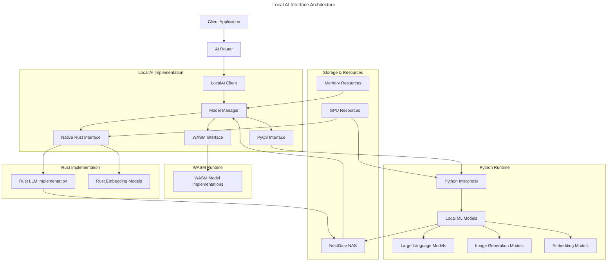

# Local AI Interface Specification

## Overview

This document specifies the architecture for the local AI interface in the Squirrel ecosystem. This interface enables seamless interaction with local AI models running either through PyO3 bindings or as native Rust implementations.



## Core Requirements

1. **PyO3 Bridge**: Seamless integration with Python ML libraries
2. **Resource Management**: Efficient GPU and memory utilization
3. **Model Loading**: Dynamic loading and unloading of models
4. **Performance Optimization**: Minimal overhead for local inference
5. **Unified Interface**: Consistent API regardless of implementation
6. **Hardware Adaptation**: Support for different hardware capabilities

## Architectural Components

### 1. Local AI Client

The main client interface for local AI models:

```rust
pub struct LocalAIClient {
    /// Model manager
    model_manager: Arc<ModelManager>,
    
    /// Client capabilities
    capabilities: AICapabilities,
    
    /// Routing preferences
    routing_preferences: RoutingPreferences,
    
    /// Resource monitor
    resource_monitor: Arc<ResourceMonitor>,
    
    /// Default model ID
    default_model_id: String,
    
    /// Active models
    active_models: Arc<RwLock<HashMap<String, ModelInstance>>>,
}

impl LocalAIClient {
    /// Create a new local AI client
    pub fn new(
        config: LocalAIConfig,
        capabilities: AICapabilities,
        routing_preferences: RoutingPreferences,
    ) -> Result<Self>;
    
    /// Get a model instance
    pub async fn get_model(&self, model_id: &str) -> Result<Arc<ModelInstance>>;
    
    /// List available models
    pub async fn list_available_models(&self) -> Result<Vec<ModelInfo>>;
    
    /// Load a model
    pub async fn load_model(&self, model_id: &str, config: ModelLoadConfig) -> Result<Arc<ModelInstance>>;
    
    /// Unload a model
    pub async fn unload_model(&self, model_id: &str) -> Result<()>;
}

#[async_trait]
impl AIClient for LocalAIClient {
    // Implementation of the AIClient trait
}
```

### 2. PyO3 Interface

Bridge between Rust and Python AI libraries:

```rust
pub struct PyO3AIInterface {
    /// Python interpreter
    py_interpreter: Arc<PyInterpreter>,
    
    /// Python module cache
    module_cache: Arc<RwLock<HashMap<String, PyObject>>>,
    
    /// Python GIL management
    gil_manager: GILManager,
    
    /// Configuration
    config: PyO3Config,
}

impl PyO3AIInterface {
    /// Create a new PyO3 interface
    pub fn new(config: PyO3Config) -> Result<Self>;
    
    /// Load a Python model
    pub async fn load_model(&self, model_path: &str, model_config: &PyModelConfig) -> Result<PyModelHandle>;
    
    /// Run inference on a loaded model
    pub async fn run_inference(&self, model_handle: &PyModelHandle, input: &PyModelInput) -> Result<PyModelOutput>;
    
    /// Get model information
    pub async fn get_model_info(&self, model_path: &str) -> Result<ModelInfo>;
    
    /// Release model resources
    pub async fn unload_model(&self, model_handle: &PyModelHandle) -> Result<()>;
}
```

### 3. Model Manager

Manages the lifecycle of AI models:

```rust
pub struct ModelManager {
    /// PyO3 interface
    pyo3_interface: Option<Arc<PyO3AIInterface>>,
    
    /// Native interface
    native_interface: Option<Arc<NativeAIInterface>>,
    
    /// WASM interface
    wasm_interface: Option<Arc<WasmAIInterface>>,
    
    /// Model registry
    model_registry: Arc<ModelRegistry>,
    
    /// Resource allocator
    resource_allocator: Arc<ResourceAllocator>,
    
    /// Model cache
    model_cache: Arc<ModelCache>,
}

impl ModelManager {
    /// Create a new model manager
    pub fn new(config: ModelManagerConfig) -> Result<Self>;
    
    /// Get a model instance
    pub async fn get_model(&self, model_id: &str) -> Result<Arc<ModelInstance>>;
    
    /// Load a model
    pub async fn load_model(&self, model_id: &str, config: ModelLoadConfig) -> Result<Arc<ModelInstance>>;
    
    /// Unload a model
    pub async fn unload_model(&self, model_id: &str) -> Result<()>;
    
    /// List available models
    pub async fn list_available_models(&self) -> Result<Vec<ModelInfo>>;
    
    /// Get model info
    pub async fn get_model_info(&self, model_id: &str) -> Result<ModelInfo>;
    
    /// Run garbage collection
    pub async fn run_gc(&self) -> Result<GCStats>;
}
```

### 4. Resource Monitor

Monitors and manages system resources:

```rust
pub struct ResourceMonitor {
    /// Memory monitor
    memory_monitor: Arc<MemoryMonitor>,
    
    /// GPU monitor
    gpu_monitor: Option<Arc<GPUMonitor>>,
    
    /// CPU monitor
    cpu_monitor: Arc<CPUMonitor>,
    
    /// Monitoring configuration
    config: MonitorConfig,
    
    /// Resource limits
    limits: ResourceLimits,
}

impl ResourceMonitor {
    /// Create a new resource monitor
    pub fn new(config: MonitorConfig, limits: ResourceLimits) -> Result<Self>;
    
    /// Get current resource usage
    pub fn current_usage(&self) -> ResourceUsage;
    
    /// Check if resources are available
    pub fn check_resources(&self, request: &ResourceRequest) -> Result<ResourceAllocation>;
    
    /// Reserve resources
    pub fn reserve_resources(&self, request: &ResourceRequest) -> Result<ResourceReservation>;
    
    /// Release resources
    pub fn release_resources(&self, reservation: ResourceReservation) -> Result<()>;
    
    /// Set resource limits
    pub fn set_limits(&mut self, limits: ResourceLimits) -> Result<()>;
}
```

### 5. Model Registry

Registry of available models and their capabilities:

```rust
pub struct ModelRegistry {
    /// Available models
    models: RwLock<HashMap<String, ModelInfo>>,
    
    /// Model sources
    sources: Vec<ModelSource>,
    
    /// Registry configuration
    config: RegistryConfig,
}

impl ModelRegistry {
    /// Create a new model registry
    pub fn new(config: RegistryConfig) -> Result<Self>;
    
    /// Register a model
    pub async fn register_model(&self, model_info: ModelInfo) -> Result<()>;
    
    /// Unregister a model
    pub async fn unregister_model(&self, model_id: &str) -> Result<()>;
    
    /// Get model info
    pub fn get_model_info(&self, model_id: &str) -> Result<ModelInfo>;
    
    /// List models
    pub fn list_models(&self, filter: Option<ModelFilter>) -> Vec<ModelInfo>;
    
    /// Refresh registry from sources
    pub async fn refresh(&self) -> Result<()>;
}
```

## Implementation Details

### PyO3 Integration

The PyO3 integration provides a bridge to Python-based AI libraries:

```rust
// Example PyO3 integration for running a local LLM
pub async fn run_llm_inference(
    model: &PyModelHandle,
    prompt: &str,
    parameters: &ModelParameters,
) -> Result<String> {
    Python::with_gil(|py| {
        // Get the model object
        let model_obj = model.model_object(py)?;
        
        // Convert parameters to Python dict
        let params_dict = parameters_to_py_dict(py, parameters)?;
        
        // Call the generate method
        let result = model_obj.call_method1(py, "generate", (prompt, params_dict))?;
        
        // Convert result to string
        let output: String = result.extract(py)?;
        
        Ok(output)
    })
}
```

### Model Loading Strategy

The model loading process is optimized for both performance and resource efficiency:

```rust
// Model loading process
pub async fn load_model(model_id: &str, config: &ModelLoadConfig) -> Result<Arc<ModelInstance>> {
    // 1. Check cache for already loaded model
    if let Some(model) = model_cache.get(model_id) {
        return Ok(model);
    }
    
    // 2. Get model info from registry
    let model_info = model_registry.get_model_info(model_id)?;
    
    // 3. Check resource availability
    let resource_request = ResourceRequest::from_model_info(&model_info);
    let allocation = resource_monitor.reserve_resources(&resource_request)?;
    
    // 4. Determine loading strategy based on model type
    let model_instance = match model_info.implementation_type {
        ImplementationType::Python => {
            load_python_model(&model_info, config).await?
        }
        ImplementationType::Rust => {
            load_rust_model(&model_info, config).await?
        }
        ImplementationType::Wasm => {
            load_wasm_model(&model_info, config).await?
        }
    };
    
    // 5. Add to cache
    model_cache.insert(model_id, Arc::clone(&model_instance));
    
    Ok(model_instance)
}
```

### Resource Allocation

Resources are carefully managed to prevent oversubscription:

```rust
// Resource allocation example
pub fn allocate_gpu_memory(request: &GpuMemoryRequest) -> Result<GpuMemoryAllocation> {
    // 1. Get available GPU devices
    let available_devices = list_available_gpus()?;
    
    // 2. Calculate memory requirements
    let required_memory = calculate_model_memory_requirements(&request.model_info);
    
    // 3. Find suitable GPU
    let selected_gpu = select_best_gpu(&available_devices, required_memory)?;
    
    // 4. Reserve memory
    reserve_gpu_memory(&selected_gpu, required_memory)?;
    
    // 5. Create allocation record
    let allocation = GpuMemoryAllocation {
        device_id: selected_gpu.device_id,
        memory_mb: required_memory,
        allocation_id: generate_allocation_id(),
    };
    
    Ok(allocation)
}
```

## Configuration Schema

### Local AI Configuration

```toml
# Local AI configuration
[local_ai]
# Directory where models are stored
model_dir = "/path/to/models"

# PyO3 Python environment
[local_ai.python]
# Python executable path (optional, uses system Python if not specified)
executable_path = "/path/to/python"
# Virtual environment path (optional)
venv_path = "/path/to/venv"
# Required packages
required_packages = [
    "torch>=2.0.0",
    "transformers>=4.30.0",
    "numpy>=1.24.0"
]

# Resource limits
[local_ai.resources]
# Maximum memory usage in MB
max_memory_mb = 16384
# Maximum GPU memory usage in MB
max_gpu_memory_mb = 16384
# Maximum models loaded simultaneously
max_loaded_models = 5
# Enable or disable GPU usage
enable_gpu = true
# Specific GPU devices to use (empty = all available)
gpu_devices = [0, 1]

# Model-specific configurations
[[local_ai.models]]
name = "llama3-8b"
path = "llama3-8b"
implementation = "python"
min_memory_mb = 8192
min_gpu_memory_mb = 8192
supports_batching = true
max_batch_size = 16

[[local_ai.models]]
name = "clip-vit-base"
path = "clip-vit-base"
implementation = "rust"
min_memory_mb = 2048
min_gpu_memory_mb = 0  # CPU only
supports_batching = true
max_batch_size = 64
```

### PyO3 Python Environment

```python
# Python entrypoint for model loading
def load_model(model_path, config):
    """
    Load an AI model
    
    Args:
        model_path (str): Path to the model
        config (dict): Model configuration
        
    Returns:
        Model: The loaded model
    """
    import torch
    from transformers import AutoModelForCausalLM, AutoTokenizer
    
    # Set device
    device = "cuda" if torch.cuda.is_available() and config.get("use_gpu", True) else "cpu"
    
    # Load tokenizer
    tokenizer = AutoTokenizer.from_pretrained(model_path)
    
    # Load model with specified parameters
    model = AutoModelForCausalLM.from_pretrained(
        model_path,
        device_map=device,
        torch_dtype=torch.float16 if config.get("use_half_precision", True) else torch.float32,
        low_cpu_mem_usage=config.get("low_cpu_mem_usage", True),
    )
    
    return {
        "model": model,
        "tokenizer": tokenizer,
        "device": device
    }

def generate(model_data, prompt, params):
    """
    Generate text using the model
    
    Args:
        model_data (dict): Model data from load_model
        prompt (str): Input prompt
        params (dict): Generation parameters
        
    Returns:
        str: Generated text
    """
    model = model_data["model"]
    tokenizer = model_data["tokenizer"]
    
    # Prepare inputs
    inputs = tokenizer(prompt, return_tensors="pt").to(model_data["device"])
    
    # Extract generation parameters
    temperature = params.get("temperature", 0.7)
    max_tokens = params.get("max_tokens", 512)
    top_p = params.get("top_p", 0.9)
    
    # Generate
    with torch.no_grad():
        outputs = model.generate(
            inputs.input_ids,
            max_new_tokens=max_tokens,
            temperature=temperature,
            top_p=top_p,
            do_sample=temperature > 0.0,
        )
    
    # Decode and return
    return tokenizer.decode(outputs[0], skip_special_tokens=True)
```

## API Examples

### Basic Usage

```rust
// Initialize the local AI client
let local_ai_config = LocalAIConfig::new()
    .with_model_directory("/path/to/models")
    .with_python_config(PyO3Config::new()
        .with_venv_path("/path/to/venv"));

// Create the client
let local_ai_client = LocalAIClient::new(
    local_ai_config,
    default_capabilities(),
    default_routing_preferences(),
).await?;

// List available models
let models = local_ai_client.list_available_models().await?;
println!("Available models: {:?}", models);

// Load a specific model
let model = local_ai_client.load_model(
    "llama3-8b", 
    ModelLoadConfig::new()
        .with_gpu(true)
        .with_half_precision(true)
).await?;

// Create a chat request
let request = ChatRequest::new()
    .with_model("llama3-8b")
    .with_messages(vec![
        ChatMessage::system("You are a helpful assistant."),
        ChatMessage::user("Explain quantum computing in simple terms."),
    ]);

// Send the request to the local AI
let response = local_ai_client.chat(request).await?;
println!("Response: {}", response.message.content);
```

### Streaming Response

```rust
// Create a chat request for streaming
let request = ChatRequest::new()
    .with_model("llama3-8b")
    .with_messages(vec![
        ChatMessage::system("You are a helpful assistant."),
        ChatMessage::user("Write a short story about a robot."),
    ]);

// Stream the response
let mut stream = local_ai_client.chat_stream(request).await?;

while let Some(chunk) = stream.try_next().await? {
    print!("{}", chunk.message.content);
    std::io::stdout().flush()?;
}
println!();
```

### Model Management

```rust
// Get resource usage before loading
let initial_usage = local_ai_client.resource_monitor.current_usage();

// Load multiple models
let model1 = local_ai_client.load_model("llama3-8b", ModelLoadConfig::default()).await?;
let model2 = local_ai_client.load_model("clip-vit-base", ModelLoadConfig::default()).await?;

// Check resource usage after loading
let current_usage = local_ai_client.resource_monitor.current_usage();
println!("Memory usage: {} MB", current_usage.memory_mb);
println!("GPU memory usage: {} MB", current_usage.gpu_memory_mb);

// Unload a model when done
local_ai_client.unload_model("llama3-8b").await?;

// Run garbage collection to free resources
let gc_stats = local_ai_client.model_manager.run_gc().await?;
println!("Freed memory: {} MB", gc_stats.freed_memory_mb);
```

## Integration with NestGate

The local AI interface integrates with NestGate for model storage and data access:

```rust
// Configure NestGate integration
let nestgate_config = NestGateConfig::new()
    .with_endpoint("http://nestgate.local:8080")
    .with_credentials(nestgate_credentials);

// Create NestGate client
let nestgate_client = NestGateClient::new(nestgate_config)?;

// Configure LocalAI with NestGate
let local_ai_config = LocalAIConfig::new()
    .with_model_source(ModelSource::NestGate(nestgate_client.clone()))
    .with_python_config(PyO3Config::default());

// Create LocalAI client
let local_ai_client = LocalAIClient::new(
    local_ai_config,
    default_capabilities(),
    default_routing_preferences(),
).await?;

// Load a model stored in NestGate
let model = local_ai_client.load_model(
    "nestgate://models/llama3-8b",
    ModelLoadConfig::default(),
).await?;

// Use model with data from NestGate
let data_provider = nestgate_client.get_data_provider(
    DataAccessRequest::new()
        .with_path("/data/datasets/financial")
        .with_permission(AccessPermission::Read)
).await?;

// Create a request that uses the data
let request = ChatRequest::new()
    .with_model("llama3-8b")
    .with_messages(vec![
        ChatMessage::system("You are a financial analyst."),
        ChatMessage::user("Analyze this financial dataset and provide insights."),
    ])
    .with_data_provider(data_provider);

// Process the request
let response = local_ai_client.chat(request).await?;
```

## Security Considerations

1. **Model Security**:
   - Verify model checksums before loading
   - Implement sandboxing for untrusted models
   - Prevent unauthorized model access

2. **Resource Protection**:
   - Enforce strict resource limits
   - Implement fair scheduling
   - Prevent denial of service

3. **Data Protection**:
   - Apply appropriate access controls to model data
   - Implement secure storage for sensitive models
   - Apply data minimization principles

## Performance Optimizations

1. **Memory Management**:
   - Implement model quantization
   - Use memory-mapped model loading
   - Implement transparent model swapping

2. **GPU Acceleration**:
   - Support mixed-precision inference
   - Optimize tensor operations
   - Implement efficient batching

3. **Python Integration**:
   - Minimize GIL contention
   - Optimize Python/Rust data transfer
   - Pre-compile critical paths

## Testing Strategy

1. **Unit Tests**:
   - Test model loading/unloading
   - Verify resource management
   - Test error handling

2. **Integration Tests**:
   - Test PyO3 bridge functionality
   - Verify NestGate integration
   - Test model switching

3. **Performance Tests**:
   - Measure inference latency
   - Test memory usage
   - Benchmark throughput
   - Test under load

## Future Enhancements

1. **Advanced Model Management**:
   - Predictive model preloading
   - Adaptive quantization
   - Content-aware batching

2. **Hardware Optimizations**:
   - Custom kernel implementations
   - Multi-GPU support
   - Specialized hardware support (NPU/TPU)

3. **Model Distribution**:
   - Federated model training
   - Distributed inference
   - Model sharding across devices

## Technical Metadata
- Category: AI Integration
- Priority: High
- Dependencies:
  - PyO3 = "0.18"
  - Squirrel MCP Core
  - NestGate Storage Provider
  - CUDA/ROCm for GPU support
- Testing Requirements:
  - Performance benchmarks
  - Memory leak detection
  - Resource monitoring
  - Integration with AI providers

## Version History
- 0.1.0 (2023-05-16): Initial draft 