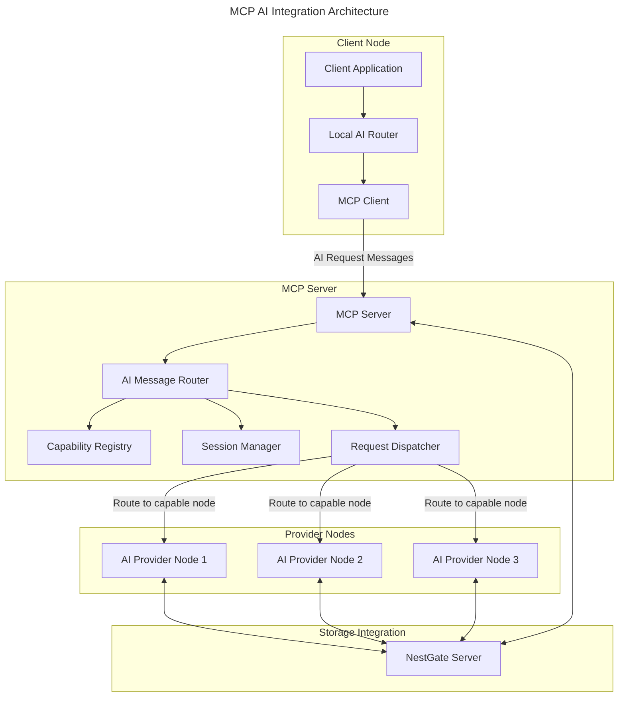

# MCP AI Integration Specification

## Overview

This document specifies the architecture for integrating AI capabilities into the Machine Context Protocol (MCP). The integration enables seamless routing of AI requests between nodes, capability discovery, and cross-node collaboration.



## Core Requirements

1. **Protocol Extension**: Extend MCP protocol to support AI capabilities and requests
2. **Capability Broadcasting**: Allow nodes to broadcast AI capabilities to the network
3. **Request Routing**: Route AI requests to nodes with appropriate capabilities
4. **Session Persistence**: Maintain conversational state across nodes
5. **Resource Coordination**: Coordinate resource usage across the network
6. **Security Integration**: Apply security model to AI operations

## Protocol Extensions

### AI Message Types

New message types added to the MCP protocol:

```rust
/// AI capability advertisement
#[derive(Debug, Clone, Serialize, Deserialize)]
pub struct AICapabilityMessage {
    /// Node ID
    pub node_id: NodeId,
    
    /// Provider ID within the node
    pub provider_id: String,
    
    /// Provider capabilities
    pub capabilities: AIProviderCapabilities,
    
    /// Status (online, offline, busy)
    pub status: ProviderStatus,
    
    /// Resource availability
    pub resources: ResourceAvailability,
    
    /// Timestamp
    pub timestamp: Timestamp,
}

/// AI request message
#[derive(Debug, Clone, Serialize, Deserialize)]
pub struct AIRequestMessage {
    /// Request ID
    pub request_id: uuid::Uuid,
    
    /// Session ID (for conversational context)
    pub session_id: Option<uuid::Uuid>,
    
    /// Request metadata
    pub metadata: RequestMetadata,
    
    /// Security context
    pub security_context: SecurityContext,
    
    /// Task type
    pub task_type: AITaskType,
    
    /// Provider preferences
    pub provider_preferences: ProviderPreferences,
    
    /// Request payload
    pub payload: AIRequestPayload,
    
    /// Priority
    pub priority: RequestPriority,
    
    /// Request timeout
    pub timeout_ms: Option<u64>,
}

/// AI response message
#[derive(Debug, Clone, Serialize, Deserialize)]
pub struct AIResponseMessage {
    /// Request ID this is responding to
    pub request_id: uuid::Uuid,
    
    /// Session ID
    pub session_id: Option<uuid::Uuid>,
    
    /// Response metadata
    pub metadata: ResponseMetadata,
    
    /// Response status
    pub status: ResponseStatus,
    
    /// Provider ID that fulfilled the request
    pub provider_id: String,
    
    /// Response payload
    pub payload: AIResponsePayload,
    
    /// Resource usage statistics
    pub resource_usage: ResourceUsage,
}

/// AI streaming response chunk
#[derive(Debug, Clone, Serialize, Deserialize)]
pub struct AIStreamChunkMessage {
    /// Request ID this is responding to
    pub request_id: uuid::Uuid,
    
    /// Chunk sequence number
    pub sequence: u32,
    
    /// Whether this is the last chunk
    pub is_last: bool,
    
    /// Chunk data
    pub chunk: AIChunkData,
}
```

### Payload Types

Specialized payload types for different AI tasks:

```rust
#[derive(Debug, Clone, Serialize, Deserialize)]
#[serde(tag = "type", content = "content")]
pub enum AIRequestPayload {
    /// Text generation request
    TextGeneration(TextGenerationRequest),
    
    /// Image generation request
    ImageGeneration(ImageGenerationRequest),
    
    /// Embedding generation request
    Embedding(EmbeddingRequest),
    
    /// Function execution request
    FunctionExecution(FunctionExecutionRequest),
    
    /// Audio transcription request
    AudioTranscription(AudioTranscriptionRequest),
    
    /// Custom task request
    Custom(CustomTaskRequest),
}

#[derive(Debug, Clone, Serialize, Deserialize)]
#[serde(tag = "type", content = "content")]
pub enum AIResponsePayload {
    /// Text generation response
    TextGeneration(TextGenerationResponse),
    
    /// Image generation response
    ImageGeneration(ImageGenerationResponse),
    
    /// Embedding generation response
    Embedding(EmbeddingResponse),
    
    /// Function execution response
    FunctionExecution(FunctionExecutionResponse),
    
    /// Audio transcription response
    AudioTranscription(AudioTranscriptionResponse),
    
    /// Custom task response
    Custom(CustomTaskResponse),
    
    /// Error response
    Error(ErrorResponse),
}
```

## Capability Broadcasting

Nodes broadcast their AI capabilities to the MCP network:

```rust
/// Broadcast AI capabilities to the network
pub async fn broadcast_ai_capabilities(
    mcp_client: &MCPClient,
    capabilities: Vec<AIProviderCapabilities>,
) -> Result<()> {
    for provider_cap in capabilities {
        let msg = AICapabilityMessage {
            node_id: mcp_client.node_id(),
            provider_id: provider_cap.provider_id.clone(),
            capabilities: provider_cap.clone(),
            status: ProviderStatus::Online,
            resources: get_current_resources()?,
            timestamp: current_timestamp(),
        };
        
        mcp_client.publish(
            Topic::AICapabilities, 
            serialize_message(&msg)?,
            PublishOptions::default(),
        ).await?;
    }
    
    Ok(())
}
```

### Capability Registry

MCP maintains a registry of AI capabilities:

```rust
pub struct AICapabilityRegistry {
    /// Capabilities by node and provider
    capabilities: HashMap<NodeId, HashMap<String, AIProviderCapabilities>>,
    
    /// Provider status
    status: HashMap<NodeId, HashMap<String, ProviderStatus>>,
    
    /// Resource availability
    resources: HashMap<NodeId, ResourceAvailability>,
    
    /// Last update timestamps
    last_updates: HashMap<NodeId, Timestamp>,
}

impl AICapabilityRegistry {
    /// Update registry with new capability information
    pub fn update_capabilities(&mut self, msg: AICapabilityMessage) {
        // Update the registry with new information
    }
    
    /// Find providers for a given request
    pub fn find_providers_for_request(
        &self, 
        request: &AIRequestMessage,
    ) -> Vec<(NodeId, String)> {
        // Find providers that can handle this request
    }
    
    /// Get capabilities for a provider
    pub fn get_provider_capabilities(
        &self,
        node_id: &NodeId,
        provider_id: &str,
    ) -> Option<&AIProviderCapabilities> {
        // Retrieve capabilities for the specified provider
    }
}
```

## Request Routing

The AI Request Dispatcher routes requests to capable nodes:

```rust
pub struct AIRequestDispatcher {
    /// Capability registry
    registry: Arc<RwLock<AICapabilityRegistry>>,
    
    /// MCP client
    mcp_client: Arc<MCPClient>,
    
    /// Session manager
    session_manager: Arc<SessionManager>,
    
    /// Request tracker
    request_tracker: Arc<RequestTracker>,
    
    /// Router configuration
    config: RouterConfig,
}

impl AIRequestDispatcher {
    /// Dispatch an AI request to an appropriate provider
    pub async fn dispatch_request(&self, request: AIRequestMessage) -> Result<()> {
        // 1. Find capable providers
        let providers = self.registry.read().await.find_providers_for_request(&request);
        
        // 2. Filter by preferences and constraints
        let filtered_providers = self.filter_providers(providers, &request);
        
        // 3. Select best provider based on routing strategy
        let selected_provider = self.select_provider(filtered_providers, &request)?;
        
        // 4. Route the request to the selected provider
        self.route_request(selected_provider, request).await?;
        
        Ok(())
    }
    
    /// Filter providers based on request preferences and constraints
    fn filter_providers(
        &self,
        providers: Vec<(NodeId, String)>,
        request: &AIRequestMessage,
    ) -> Vec<(NodeId, String)> {
        // Apply filtering based on preferences
    }
    
    /// Select the best provider based on routing strategy
    fn select_provider(
        &self,
        providers: Vec<(NodeId, String)>,
        request: &AIRequestMessage,
    ) -> Result<(NodeId, String)> {
        // Select provider based on strategy (round-robin, load, performance, etc.)
    }
    
    /// Route the request to the selected provider
    async fn route_request(
        &self,
        provider: (NodeId, String),
        request: AIRequestMessage,
    ) -> Result<()> {
        // Send the request to the selected provider
        let (node_id, provider_id) = provider;
        
        // Track the request
        self.request_tracker.track_request(
            request.request_id,
            node_id.clone(),
            provider_id.clone(),
        )?;
        
        // Send the request
        self.mcp_client.send_message(
            node_id,
            Topic::AIRequests,
            serialize_message(&request)?,
        ).await?;
        
        Ok(())
    }
}
```

## Session Management

The Session Manager maintains conversational state:

```rust
pub struct SessionManager {
    /// Active sessions
    sessions: RwLock<HashMap<uuid::Uuid, SessionState>>,
    
    /// Session storage
    storage: Arc<dyn SessionStorage>,
    
    /// Configuration
    config: SessionConfig,
}

pub struct SessionState {
    /// Session ID
    id: uuid::Uuid,
    
    /// User ID
    user_id: Option<String>,
    
    /// Created timestamp
    created_at: Timestamp,
    
    /// Last updated timestamp
    updated_at: Timestamp,
    
    /// Session metadata
    metadata: HashMap<String, Value>,
    
    /// Message history
    message_history: Vec<AIMessage>,
    
    /// Provider history (which providers have been used in this session)
    provider_history: Vec<(NodeId, String)>,
}

impl SessionManager {
    /// Create a new session
    pub async fn create_session(&self, user_id: Option<String>) -> Result<uuid::Uuid> {
        // Create and store a new session
    }
    
    /// Get session state
    pub async fn get_session(&self, session_id: &uuid::Uuid) -> Result<Option<SessionState>> {
        // Retrieve session state
    }
    
    /// Update session with new message
    pub async fn add_message(
        &self,
        session_id: &uuid::Uuid,
        message: AIMessage,
    ) -> Result<()> {
        // Add message to session history
    }
    
    /// Get message history for a session
    pub async fn get_message_history(
        &self,
        session_id: &uuid::Uuid,
    ) -> Result<Vec<AIMessage>> {
        // Retrieve message history
    }
}
```

## Integration with Security Model

The security model is integrated into AI operations:

```rust
/// Check if a request is authorized
pub async fn authorize_ai_request(
    request: &AIRequestMessage,
    security_context: &SecurityContext,
) -> Result<()> {
    // 1. Verify user has permission to use AI services
    if !security_context.has_permission(Permission::AI_USE) {
        return Err(Error::PermissionDenied("AI use not permitted".into()));
    }
    
    // 2. Check task-specific permissions
    match request.task_type {
        AITaskType::TextGeneration => {
            if !security_context.has_permission(Permission::AI_TEXT_GENERATION) {
                return Err(Error::PermissionDenied("Text generation not permitted".into()));
            }
        }
        AITaskType::ImageGeneration => {
            if !security_context.has_permission(Permission::AI_IMAGE_GENERATION) {
                return Err(Error::PermissionDenied("Image generation not permitted".into()));
            }
        }
        // Check other task types
        _ => {}
    }
    
    // 3. Check data access permissions
    if let Some(data_refs) = request.metadata.data_references() {
        for data_ref in data_refs {
            if !authorize_data_access(security_context, &data_ref)? {
                return Err(Error::PermissionDenied(format!("Access denied to data: {}", data_ref)));
            }
        }
    }
    
    Ok(())
}
```

## Resource Coordination

Resource usage is coordinated across the network:

```rust
pub struct NetworkResourceCoordinator {
    /// Node resource availability
    node_resources: RwLock<HashMap<NodeId, ResourceAvailability>>,
    
    /// Resource reservations
    reservations: RwLock<HashMap<uuid::Uuid, ResourceReservation>>,
    
    /// Resource limits
    limits: ResourceLimits,
    
    /// MCP client
    mcp_client: Arc<MCPClient>,
}

impl NetworkResourceCoordinator {
    /// Check if resources are available across the network
    pub async fn check_network_resources(
        &self,
        request: &ResourceRequest,
    ) -> Result<Vec<NodeId>> {
        // Find nodes with sufficient resources
    }
    
    /// Reserve resources on a specific node
    pub async fn reserve_resources(
        &self,
        node_id: &NodeId,
        request: &ResourceRequest,
    ) -> Result<ResourceReservation> {
        // Attempt to reserve resources on the target node
    }
    
    /// Release resources
    pub async fn release_resources(
        &self,
        reservation_id: &uuid::Uuid,
    ) -> Result<()> {
        // Release previously reserved resources
    }
    
    /// Update node resource availability
    pub async fn update_node_resources(
        &self,
        node_id: &NodeId,
        resources: ResourceAvailability,
    ) -> Result<()> {
        // Update the resource map with new information
    }
}
```

## Command-Line Interface

The MCP CLI is extended with AI-related commands:

```
# List AI providers in the network
mcp ai providers list

# Show capabilities of a specific provider
mcp ai providers show <node_id> <provider_id>

# Send a text generation request
mcp ai generate-text --prompt "Explain quantum computing" --model llama3-8b

# Send an image generation request
mcp ai generate-image --prompt "A cat in space" --size 512x512

# Start an interactive AI session
mcp ai session start

# List active AI sessions
mcp ai sessions list

# Continue an existing session
mcp ai session continue <session_id>
```

## API Examples

### Broadcasting Capabilities

```rust
// Initialize MCP client
let mcp_client = MCPClient::new(mcp_config)?;

// Define local AI capabilities
let local_capabilities = vec![
    AIProviderCapabilities {
        provider_id: "local-llm".to_string(),
        provider_type: ProviderType::LocalAI,
        supported_models: vec!["llama3-8b".to_string()],
        supported_tasks: vec![
            AITaskType::TextGeneration,
            AITaskType::Embedding,
        ],
        max_context_size: Some(8192),
        supports_streaming: true,
        performance_metrics: PerformanceMetrics::default(),
        resource_requirements: ResourceRequirements {
            min_memory_mb: 8192,
            min_gpu_memory_mb: Some(8192),
            ..Default::default()
        },
    },
];

// Broadcast capabilities
broadcast_ai_capabilities(&mcp_client, local_capabilities).await?;
```

### Sending AI Requests

```rust
// Create a text generation request
let request = AIRequestMessage {
    request_id: uuid::Uuid::new_v4(),
    session_id: Some(session_id),
    metadata: RequestMetadata::default(),
    security_context: current_security_context()?,
    task_type: AITaskType::TextGeneration,
    provider_preferences: ProviderPreferences {
        preferred_providers: vec![],
        preferred_models: vec!["llama3-8b".to_string()],
        allow_remote: true,
    },
    payload: AIRequestPayload::TextGeneration(TextGenerationRequest {
        prompt: "Explain quantum computing in simple terms".to_string(),
        parameters: ModelParameters {
            temperature: Some(0.7),
            max_tokens: Some(512),
            ..Default::default()
        },
    }),
    priority: RequestPriority::Normal,
    timeout_ms: Some(30000),
};

// Send the request through MCP
mcp_client.send_message(
    NodeId::Broadcast,
    Topic::AIRequests,
    serialize_message(&request)?,
).await?;
```

### Handling AI Responses

```rust
// Subscribe to AI responses
let mut response_stream = mcp_client.subscribe(
    Topic::AIResponses,
    SubscribeOptions::default(),
).await?;

// Process responses
while let Some(message) = response_stream.next().await {
    let response: AIResponseMessage = deserialize_message(&message.payload)?;
    
    if response.request_id == original_request_id {
        match response.payload {
            AIResponsePayload::TextGeneration(text_response) => {
                println!("Response: {}", text_response.text);
            },
            AIResponsePayload::Error(error) => {
                println!("Error: {}", error.message);
            },
            _ => {
                println!("Unexpected response type");
            }
        }
    }
}
```

### Stream Processing

```rust
// Subscribe to AI stream chunks
let mut chunk_stream = mcp_client.subscribe(
    Topic::AIStreamChunks,
    SubscribeOptions::default(),
).await?;

// Process streaming chunks
let mut chunks = Vec::new();
while let Some(message) = chunk_stream.next().await {
    let chunk: AIStreamChunkMessage = deserialize_message(&message.payload)?;
    
    if chunk.request_id == original_request_id {
        print!("{}", chunk.chunk.text);
        std::io::stdout().flush()?;
        
        chunks.push(chunk);
        
        if chunk.is_last {
            break;
        }
    }
}
```

## Integration with NestGate

The MCP AI integration works with NestGate for data access:

```rust
// Create a data reference
let data_reference = DataReference {
    source: DataSource::NestGate,
    path: "/data/datasets/financial".to_string(),
    access_type: AccessType::Read,
};

// Use the data reference in an AI request
let request = AIRequestMessage {
    request_id: uuid::Uuid::new_v4(),
    session_id: None,
    metadata: RequestMetadata::with_data_references(vec![data_reference]),
    security_context: current_security_context()?,
    task_type: AITaskType::TextGeneration,
    provider_preferences: ProviderPreferences::default(),
    payload: AIRequestPayload::TextGeneration(TextGenerationRequest {
        prompt: "Analyze this financial dataset and provide insights".to_string(),
        parameters: ModelParameters::default(),
    }),
    priority: RequestPriority::Normal,
    timeout_ms: None,
};

// Send request through MCP
mcp_client.send_message(
    NodeId::Broadcast,
    Topic::AIRequests,
    serialize_message(&request)?,
).await?;
```

## Implementation Plan

### Phase 1: Protocol Extensions (Month 1)

1. **Message Types**:
   - Define AI-related message types
   - Implement serialization/deserialization
   - Add protocol version handling

2. **Capability Broadcasting**:
   - Implement capability broadcasting mechanism
   - Create capability registry
   - Add capability discovery API

3. **Basic Request Routing**:
   - Implement request message format
   - Create simple routing mechanism
   - Implement response handling

### Phase 2: Core Integration (Month 2)

1. **Session Management**:
   - Implement session storage
   - Create session state management
   - Add conversation history handling

2. **Security Integration**:
   - Implement AI-specific permissions
   - Add authorization checks
   - Create security audit logging

3. **Resource Coordination**:
   - Implement resource tracking
   - Create reservation system
   - Add load balancing

### Phase 3: Advanced Features (Month 3)

1. **Streaming Support**:
   - Implement chunk streaming protocol
   - Add stream routing
   - Create stream reassembly

2. **Advanced Routing**:
   - Implement advanced routing strategies
   - Add fallback mechanisms
   - Create routing metrics

3. **Data Integration**:
   - Implement NestGate data references
   - Add data access control
   - Create data caching mechanism

### Phase 4: CLI and Tooling (Month 4)

1. **Command-Line Interface**:
   - Add AI commands to MCP CLI
   - Create interactive session mode
   - Implement configuration management

2. **Monitoring**:
   - Implement AI metrics collection
   - Create monitoring dashboard
   - Add alerting for issues

3. **Documentation and Examples**:
   - Create comprehensive documentation
   - Build example applications
   - Create tutorials and guides

## Security Considerations

1. **Authentication and Authorization**:
   - All AI requests require authentication
   - Permission checking for all AI operations
   - Audit logging for security events

2. **Data Privacy**:
   - Secure handling of prompts and responses
   - Data minimization in logs
   - Privacy controls for sensitive information

3. **Resource Protection**:
   - Rate limiting to prevent abuse
   - Resource quotas for users
   - Isolation of AI workloads

## Testing Strategy

1. **Unit Tests**:
   - Test message serialization/deserialization
   - Validate routing logic
   - Verify security checks

2. **Integration Tests**:
   - Test capability broadcasting
   - Verify request routing
   - Test session management

3. **System Tests**:
   - End-to-end tests with multiple nodes
   - Performance tests under load
   - Security penetration testing

## Technical Metadata
- Category: AI Integration
- Priority: High
- Dependencies:
  - Squirrel MCP Core
  - AI Tools Crate
  - NestGate Storage Provider
- Validation Requirements:
  - Performance benchmarks
  - Security audit
  - Multi-node testing

## Version History
- 0.1.0 (2023-05-16): Initial draft 