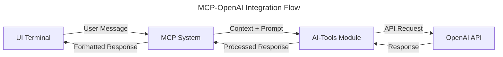

# MCP-OpenAI Integration Specification

## Overview
This specification details the integration between the Machine Context Protocol (MCP) system and the OpenAI client implementation. It covers message passing, context handling, and response processing for a complete end-to-end AI interaction flow.

## Architecture

### Component Diagram


## Implementation Details

### Message Flow
1. User sends message from UI Terminal
2. MCP receives message and attaches relevant context
3. MCP forwards message to AI-Tools module
4. AI-Tools prepares OpenAI request with proper configuration
5. OpenAI API processes request and returns response
6. AI-Tools processes response
7. MCP receives processed response
8. UI Terminal displays response to user

### Context Handling
```rust
pub struct MCPContext {
    /// The conversation history
    pub history: Vec<Message>,
    
    /// User-specific context
    pub user_context: UserContext,
    
    /// Project-specific context
    pub project_context: ProjectContext,
    
    /// Environment information
    pub environment: Environment,
}

impl MCPContext {
    pub fn to_openai_context(&self) -> OpenAIContext {
        // Convert MCP context to OpenAI-compatible format
    }
}
```

### Message Handler Interface
```rust
pub trait AIMessageHandler {
    /// Process an AI request and return a response
    async fn process_request(&self, context: MCPContext, message: String) -> Result<AIResponse, AIError>;
    
    /// Process a streaming AI request and return a stream of responses
    async fn process_streaming_request(
        &self, 
        context: MCPContext, 
        message: String
    ) -> Result<impl Stream<Item = Result<AIResponseChunk, AIError>>, AIError>;
}

pub struct OpenAIMessageHandler {
    client: OpenAIClient,
    config: OpenAIConfig,
}

impl AIMessageHandler for OpenAIMessageHandler {
    // Implementation of message processing using OpenAI client
}
```

## Integration Points

### MCP Integration
```rust
// In MCP module
pub struct AIChatModule {
    message_handler: Box<dyn AIMessageHandler>,
}

impl AIChatModule {
    pub fn new(message_handler: Box<dyn AIMessageHandler>) -> Self {
        Self { message_handler }
    }
    
    pub async fn handle_message(&self, context: MCPContext, message: String) -> Result<AIResponse, MCPError> {
        self.message_handler.process_request(context, message)
            .await
            .map_err(|e| MCPError::AIError(e.to_string()))
    }
}
```

### UI Terminal Integration
```rust
// In UI Terminal module
pub struct ChatView {
    mcp_client: MCPClient,
}

impl ChatView {
    pub async fn send_message(&self, message: String) -> Result<(), UIError> {
        let response = self.mcp_client.send_ai_message(message).await?;
        self.display_response(response);
        Ok(())
    }
}
```

## Security Requirements

### Context Protection
1. Sanitize all context information before sending to AI
2. Implement proper permission checks for sensitive context
3. Audit all context access
4. Anonymize personal information where appropriate

### Message Validation
1. Validate all incoming messages
2. Sanitize output before displaying to user
3. Implement content filtering for inappropriate responses
4. Log all message transactions

## Performance Requirements

### Latency Targets
1. End-to-end response time < 2 seconds for regular requests
2. First token response time < 500ms for streaming requests
3. Message handling overhead < 100ms
4. Context preparation < 50ms

### Resource Management
1. Implement connection pooling
2. Optimize context size to minimize token usage
3. Implement proper timeout handling
4. Gracefully handle service degradation

## Implementation Plan

### Phase 1: Basic Integration
1. Define message handler interfaces
2. Implement basic context conversion
3. Create simple end-to-end flow
4. Add basic error handling

### Phase 2: Enhanced Context
1. Implement rich context gathering
2. Add conversation history management
3. Optimize context preparation
4. Implement context caching

### Phase 3: Advanced Features
1. Add streaming response handling
2. Implement response post-processing
3. Add advanced error recovery
4. Implement cancelation support

### Phase 4: Testing & Refinement
1. Add comprehensive integration tests
2. Performance benchmarking
3. Security auditing
4. Optimize for production

## Dependencies
```toml
[dependencies]
tokio = { version = "1.0", features = ["full"] }
futures = "0.3"
tracing = "0.1"
squirrel-mcp = { path = "../mcp" }
squirrel-ai-tools = { path = "../ai-tools" }
```

## Testing Strategy

### Unit Tests
1. Test message handler implementation
2. Test context conversion
3. Test error handling
4. Test response processing

### Integration Tests
1. Test end-to-end message flow
2. Test streaming responses
3. Test error recovery
4. Test with different context sizes

### Performance Tests
1. Measure response latency
2. Test under concurrent load
3. Measure memory usage
4. Test token optimization

## Next Steps
1. Implement the basic message handler interface
2. Create the context conversion logic
3. Add the AI module to the MCP system
4. Implement basic end-to-end testing 