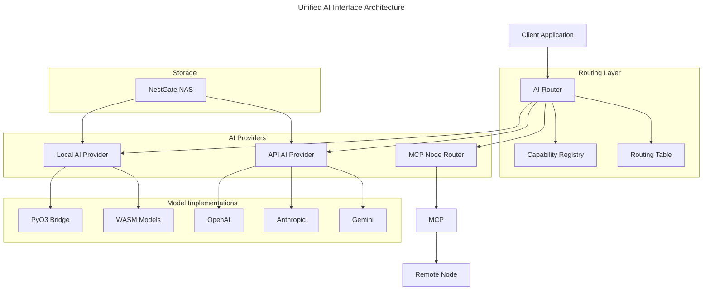

# Unified AI Interface Specification

## Overview

This document specifies the architecture for a unified AI interface in the Squirrel ecosystem. The interface enables seamless interaction with both local and API-based AI models, with automatic routing through MCP for cross-node communication.



## Core Requirements

1. **Unified Interface**: A single API for interacting with AI models regardless of their location or implementation
2. **Transparent Routing**: Automatic routing of requests to the most suitable provider (local or remote)
3. **Capability Discovery**: Automatic discovery and advertisement of AI capabilities across nodes
4. **Seamless Cross-Node Communication**: Transparent handling of cross-node AI requests
5. **Foundation for Autonomy**: Design patterns that enable future AI autonomy features
6. **Extensible Provider Model**: Easy addition of new AI providers (both local and remote)

## Architectural Components

### 1. Core Interfaces

#### AIClient Trait

The central interface for all AI providers:

```rust
#[async_trait]
pub trait AIClient: Send + Sync + 'static {
    /// Get the provider name
    fn provider_name(&self) -> &str;
    
    /// Get the default model name
    fn default_model(&self) -> &str;
    
    /// Get available models
    async fn list_models(&self) -> Result<Vec<String>>;
    
    /// Send a chat request and get a chat response
    async fn chat(&self, request: ChatRequest) -> Result<ChatResponse>;
    
    /// Send a chat request and get a streaming response
    async fn chat_stream(&self, request: ChatRequest) -> Result<ChatResponseStream>;
    
    /// Get the client as Any for downcasting
    fn as_any(&self) -> &dyn Any;
    
    /// Get capabilities of this AI client
    fn capabilities(&self) -> AICapabilities;
    
    /// Check if this client can handle a specific task
    fn can_handle_task(&self, task: &AITask) -> bool;
    
    /// Get routing preferences for this client
    fn routing_preferences(&self) -> RoutingPreferences;
}
```

#### AICapabilities

Describes what the AI provider can do:

```rust
#[derive(Debug, Clone, Serialize, Deserialize)]
pub struct AICapabilities {
    /// Supported model types (embedding, completion, etc.)
    pub supported_model_types: HashSet<ModelType>,
    
    /// Supported task types (text generation, image generation, etc.)
    pub supported_task_types: HashSet<TaskType>,
    
    /// Maximum context size in tokens
    pub max_context_size: Option<usize>,
    
    /// Whether streaming is supported
    pub supports_streaming: bool,
    
    /// Whether function calling is supported
    pub supports_function_calling: bool,
    
    /// Whether tool use is supported
    pub supports_tool_use: bool,
    
    /// Performance metrics (latency, throughput, etc.)
    pub performance_metrics: PerformanceMetrics,
    
    /// Resource requirements
    pub resource_requirements: ResourceRequirements,
    
    /// Cost metrics (for API models)
    pub cost_metrics: Option<CostMetrics>,
}
```

#### RoutingPreferences

Defines how requests should be routed:

```rust
#[derive(Debug, Clone, Serialize, Deserialize)]
pub struct RoutingPreferences {
    /// Priority level (0-100, higher is more preferred)
    pub priority: u8,
    
    /// Whether this provider allows forward routing
    pub allows_forwarding: bool,
    
    /// Whether this provider should be used for sensitive data
    pub handles_sensitive_data: bool,
    
    /// Geographical constraints
    pub geo_constraints: Option<GeoConstraints>,
    
    /// Cost tier (free, low, medium, high)
    pub cost_tier: CostTier,
}
```

### 2. Routing Infrastructure

#### AIRouter

Central component for routing AI requests:

```rust
pub struct AIRouter {
    /// Local AI clients
    local_clients: HashMap<String, Arc<dyn AIClient>>,
    
    /// MCP client for remote communication
    mcp_client: Arc<dyn MCPInterface>,
    
    /// Capability registry for discovery
    capability_registry: Arc<RwLock<CapabilityRegistry>>,
    
    /// Routing table for efficient lookups
    routing_table: Arc<RwLock<RoutingTable>>,
    
    /// Router configuration
    config: RouterConfig,
}
```

#### CapabilityRegistry

Tracks AI capabilities across the network:

```rust
pub struct CapabilityRegistry {
    /// Local node capabilities
    local_capabilities: HashMap<NodeId, HashMap<String, AICapabilities>>,
    
    /// Remote node capabilities
    remote_capabilities: HashMap<NodeId, HashMap<String, AICapabilities>>,
    
    /// Last update timestamps
    last_updates: HashMap<NodeId, Instant>,
    
    /// Capability broadcast interval
    broadcast_interval: Duration,
}
```

### 3. Provider Implementations

#### LocalAIClient

Interface for local AI models:

```rust
pub struct LocalAIClient {
    /// Model identifier
    model_id: String,
    
    /// PyO3 interface for Python models
    pyo3_interface: Option<PyO3AIInterface>,
    
    /// WASM interface for WASM models
    wasm_interface: Option<WasmAIInterface>,
    
    /// Native interface for Rust models
    native_interface: Option<NativeAIInterface>,
    
    /// Client capabilities
    capabilities: AICapabilities,
    
    /// Routing preferences
    routing_preferences: RoutingPreferences,
}
```

#### ApiAIClient

Interface for API-based AI models:

```rust
pub struct ApiAIClient {
    /// Provider type (OpenAI, Anthropic, etc.)
    provider_type: ApiProviderType,
    
    /// API client
    client: Arc<dyn APIClientInterface>,
    
    /// Rate limiter
    rate_limiter: Arc<RateLimiter>,
    
    /// Client capabilities
    capabilities: AICapabilities,
    
    /// Routing preferences
    routing_preferences: RoutingPreferences,
}
```

#### MCPNodeRouter

Interface for routing to remote nodes:

```rust
pub struct MCPNodeRouter {
    /// MCP client
    mcp_client: Arc<dyn MCPInterface>,
    
    /// Node registry
    node_registry: Arc<RwLock<NodeRegistry>>,
    
    /// Session manager
    session_manager: Arc<SessionManager>,
    
    /// Routing preferences
    routing_preferences: RoutingPreferences,
}
```

### 4. Context and State Management

#### AIContext

Maintains state for AI interactions:

```rust
pub struct AIContext {
    /// Context ID
    context_id: uuid::Uuid,
    
    /// Session ID
    session_id: Option<String>,
    
    /// Message history
    message_history: Vec<ChatMessage>,
    
    /// Metadata
    metadata: HashMap<String, Value>,
    
    /// Security context
    security_context: SecurityContext,
    
    /// Resource usage tracking
    resource_usage: ResourceUsage,
}
```

#### ContextPersistence

Handles persistence of AI contexts:

```rust
pub trait ContextPersistence: Send + Sync + 'static {
    /// Save a context
    async fn save_context(&self, context: &AIContext) -> Result<()>;
    
    /// Load a context
    async fn load_context(&self, context_id: &uuid::Uuid) -> Result<Option<AIContext>>;
    
    /// Delete a context
    async fn delete_context(&self, context_id: &uuid::Uuid) -> Result<()>;
    
    /// List contexts
    async fn list_contexts(&self, filter: Option<ContextFilter>) -> Result<Vec<ContextSummary>>;
}
```

## Implementation Plan

### Phase 1: Core Interface (Month 1)

1. **Enhanced AIClient Trait**:
   - Extend the current AIClient trait with capabilities and routing preferences
   - Implement trait for existing OpenAI, Anthropic, and Gemini clients

2. **Capability System**:
   - Create the AICapabilities structure
   - Implement capability discovery for existing API clients
   - Create tests for capability matching

3. **Basic Local AI Support**:
   - Create PyO3AIInterface implementation 
   - Implement LocalAIClient with PyO3 integration
   - Add tests for local model execution

### Phase 2: Routing Infrastructure (Month 2)

1. **AI Router**:
   - Implement the core AIRouter component
   - Add routing logic based on capabilities and preferences
   - Create tests for routing decisions

2. **Capability Registry**:
   - Implement capability broadcasting via MCP
   - Create capability discovery mechanism
   - Add periodic capability updates

3. **MCP Integration**:
   - Implement MCPNodeRouter for cross-node communication
   - Create message formats for AI requests and responses
   - Add tests for cross-node routing

### Phase 3: Context Management (Month 3)

1. **AI Context**:
   - Implement AIContext for state management
   - Add persistence layer for contexts
   - Create tests for context handling

2. **Session Management**:
   - Implement session tracking across nodes
   - Add session correlation for multi-step interactions
   - Create tests for session scenarios

3. **Security Integration**:
   - Implement security contexts for AI requests
   - Add permission checking for AI operations
   - Create tests for security scenarios

### Phase 4: Performance and Scalability (Month 4)

1. **Performance Optimization**:
   - Add caching layer for common requests
   - Implement parallel routing for independent operations
   - Create performance benchmarks

2. **Resource Management**:
   - Implement resource tracking
   - Add throttling based on resource limits
   - Create tests for resource scenarios

3. **Monitoring and Observability**:
   - Add metrics collection
   - Implement logging and tracing
   - Create dashboards for monitoring

## API Examples

### Basic Usage

```rust
// Initialize AI router
let router = AIRouter::new()
    .with_mcp(mcp_client)
    .with_config(router_config);

// Add local client
router.add_client(LocalAIClient::new(
    "local-llama",
    PyO3AIInterface::new("/path/to/model"),
    local_capabilities,
    local_preferences,
));

// Add API client
router.add_client(ApiAIClient::new(
    ApiProviderType::OpenAI,
    openai_client,
    rate_limiter,
    api_capabilities,
    api_preferences,
));

// Use the router to process a request
let request = AIRequest::new()
    .with_prompt("Explain quantum computing")
    .with_model_preference("gpt-4")
    .with_task_type(TaskType::TextGeneration);

let response = router.process_request(request).await?;
```

### Cross-Node Communication

```rust
// Create a request that may be routed to another node
let request = AIRequest::new()
    .with_prompt("Generate an image of a cat")
    .with_task_type(TaskType::ImageGeneration)
    .with_routing_hint(RoutingHint {
        require_capability: Some(TaskType::ImageGeneration),
        preferred_nodes: vec![],
        allow_remote: true,
    });

// Router will automatically send to a capable node
let response = router.process_request(request).await?;
```

### Multi-Turn Conversation

```rust
// Start a conversation
let context = AIContext::new();
let session_id = context.session_id();

// First turn
let request1 = AIRequest::new()
    .with_prompt("Tell me about Mars")
    .with_session_id(session_id);
let response1 = router.process_request(request1).await?;

// Second turn (continues the conversation)
let request2 = AIRequest::new()
    .with_prompt("How long would it take to travel there?")
    .with_session_id(session_id);
let response2 = router.process_request(request2).await?;
```

## Integration with NestGate

The unified AI interface integrates with NestGate NAS for data access:

```rust
// Create a data access request
let data_request = DataAccessRequest::new()
    .with_path("/data/training/dataset1")
    .with_permission(AccessPermission::Read);

// Get data provider
let data_provider = nestgate_client.get_data_provider(data_request).await?;

// Create AI request with data reference
let ai_request = AIRequest::new()
    .with_prompt("Analyze this dataset")
    .with_data_provider(data_provider)
    .with_task_type(TaskType::DataAnalysis);

// Process the request
let response = router.process_request(ai_request).await?;
```

## Security Considerations

1. **Authentication and Authorization**:
   - All AI requests must be authenticated
   - Authorization is checked against task type and data accessed
   - Sensitive data must be processed only by approved providers

2. **Data Protection**:
   - Data flow between nodes must be encrypted
   - API keys must be securely stored using `secrecy`
   - Local data access must respect filesystem permissions

3. **Audit and Logging**:
   - All AI operations must be logged
   - Audit trail must include request origin, routing path, and result
   - Sensitive prompts and responses must be handled according to data classification

## Testing Strategy

1. **Unit Tests**:
   - Test each component in isolation
   - Validate routing decisions with mock clients
   - Verify capability matching logic

2. **Integration Tests**:
   - Test cross-component workflows
   - Verify MCP integration with mock nodes
   - Test persistence layer with actual storage

3. **System Tests**:
   - End-to-end tests with actual AI providers
   - Performance tests under load
   - Resilience tests with node failures

## Future Enhancements

1. **AI Autonomy Layer**:
   - Add goal-based routing
   - Implement task decomposition
   - Create collaborative AI agent framework

2. **Advanced Routing**:
   - Context-aware routing based on request content
   - Learning-based routing that improves over time
   - Cost-optimized routing for commercial deployments

3. **Enhanced Integration**:
   - Deeper NestGate integration for AI-specific storage optimization
   - Specialized hardware support (GPUs, NPUs)
   - Edge computing support for low-latency scenarios

## Technical Metadata
- Category: AI Integration
- Priority: High
- Dependencies:
  - Squirrel MCP Core
  - AI Tools Crate
  - PyO3 Bindings
  - NestGate Storage Provider
- Validation Requirements:
  - Performance benchmarks
  - Security audit
  - Cross-node testing

## Version History
- 0.1.0 (2023-05-16): Initial draft 