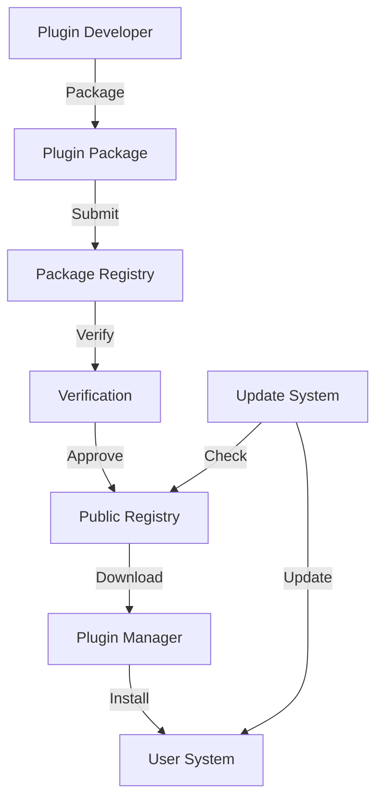

# Plugin Distribution and Packaging

## Overview

This document defines the distribution and packaging system for Squirrel plugins. It outlines standards for packaging, versioning, distribution channels, installation mechanisms, and update processes to ensure a consistent, secure, and user-friendly plugin ecosystem.

## Core Components

The plugin distribution system consists of the following core components:

1. **Plugin Package Format**: Standardized format for plugin distribution
2. **Package Registry**: Central repository for plugin distribution
3. **Distribution Channels**: Methods for distributing plugins
4. **Installation Mechanism**: Process for installing plugins
5. **Update System**: Mechanism for updating plugins
6. **Verification System**: Process for verifying plugin integrity and security



## Plugin Package Format

### Package Structure

Plugins must be packaged in the following format:

```
plugin-name-1.0.0.sqp  # Squirrel Plugin Package (.sqp)
├── manifest.toml       # Plugin metadata
├── signatures/         # Cryptographic signatures
│   ├── plugin.sig      # Package signature
│   └── manifest.sig    # Manifest signature
├── content/            # Plugin content
│   ├── lib/            # Plugin libraries
│   │   └── plugin.wasm # WebAssembly module or native binary
│   ├── resources/      # Plugin resources
│   └── docs/           # Plugin documentation
└── CHANGELOG.md        # Change history
```

### Manifest Format

The manifest.toml file must include the following fields:

```toml
[package]
name = "example-plugin"
version = "1.0.0"
author = "Plugin Developer <dev@example.com>"
license = "MIT"
description = "Example plugin for Squirrel"
repository = "https://github.com/example/plugin"
homepage = "https://example.com/plugin"

[distribution]
registry = "squirrel-registry"
channel = "stable"
min_squirrel_version = "1.0.0"
max_squirrel_version = "2.0.0"
target_platforms = ["windows-x86_64", "macos-x86_64", "linux-x86_64"]

[dependencies]
core-utils = "^1.0.0"
data-processing = "^2.1.0"

[permissions]
file_system = ["read", "write"]
network = ["connect"]
system = []
```

## Versioning

### Semantic Versioning

Plugins must follow Semantic Versioning (SemVer):

- **Major Version**: Incompatible API changes
- **Minor Version**: Backward-compatible functionality
- **Patch Version**: Backward-compatible bug fixes

Example: `1.2.3`

### Version Constraints

Dependencies must specify version constraints:

- **Exact Version**: `=1.2.3`
- **Greater Than**: `>1.2.3`
- **Greater Than or Equal**: `>=1.2.3`
- **Less Than**: `<1.2.3`
- **Less Than or Equal**: `<=1.2.3`
- **Compatible With**: `^1.2.3` (equivalent to `>=1.2.3, <2.0.0`)
- **Tilde Range**: `~1.2.3` (equivalent to `>=1.2.3, <1.3.0`)

### Version Compatibility

Plugins must specify compatibility with Squirrel versions:

```toml
[distribution]
min_squirrel_version = "1.0.0"
max_squirrel_version = "2.0.0"
```

## Distribution Channels

### Official Registry

The official Squirrel Plugin Registry provides:

- **Public Registry**: For verified plugins
- **Private Registry**: For organization-specific plugins
- **Development Registry**: For testing plugins

### Registry API

The Registry API supports:

- **Package Upload**: `POST /packages`
- **Package Download**: `GET /packages/{name}/{version}`
- **Package Search**: `GET /packages?query={query}`
- **Package Metadata**: `GET /packages/{name}/metadata`
- **Package Verification**: `GET /packages/{name}/{version}/verification`

### Alternative Distribution

Plugins can also be distributed via:

- **Direct Download**: From developer websites
- **Git Repositories**: From GitHub, GitLab, etc.
- **Local Installation**: From local files

## Installation Mechanism

### Installation Process

The plugin installation process includes:

1. **Download**: Retrieve the plugin package
2. **Verification**: Verify package integrity and security
3. **Dependency Resolution**: Resolve and download dependencies
4. **Extraction**: Extract package contents
5. **Registration**: Register the plugin with the system
6. **Configuration**: Apply plugin configuration
7. **Activation**: Activate the plugin

### Command Line Installation

```shell
# Install from registry
squirrel plugin install example-plugin

# Install specific version
squirrel plugin install example-plugin@1.2.3

# Install from URL
squirrel plugin install https://example.com/plugins/example-plugin-1.2.3.sqp

# Install from file
squirrel plugin install ./example-plugin-1.2.3.sqp
```

### Programmatic Installation

```rust
use squirrel_plugin_manager::{PluginManager, InstallOptions};

let mut manager = PluginManager::new();

// Install from registry
let result = manager
    .install("example-plugin", None, InstallOptions::default())
    .await;

// Install specific version
let result = manager
    .install("example-plugin", Some("1.2.3"), InstallOptions::default())
    .await;

// Install from URL
let result = manager
    .install_from_url("https://example.com/plugins/example-plugin-1.2.3.sqp", InstallOptions::default())
    .await;

// Install from file
let result = manager
    .install_from_file("./example-plugin-1.2.3.sqp", InstallOptions::default())
    .await;
```

## Update System

### Update Process

The plugin update process includes:

1. **Update Check**: Check for available updates
2. **Update Download**: Download update packages
3. **Update Verification**: Verify update packages
4. **Update Installation**: Install update packages
5. **Update Migration**: Migrate plugin data
6. **Update Cleanup**: Clean up old versions

### Update Commands

```shell
# Check for updates
squirrel plugin update --check

# Update specific plugin
squirrel plugin update example-plugin

# Update all plugins
squirrel plugin update --all

# Update to specific version
squirrel plugin update example-plugin@1.2.3
```

### Update Strategies

Plugins support the following update strategies:

- **Auto Update**: Automatically update plugins
- **Scheduled Update**: Update plugins on a schedule
- **Manual Update**: Update plugins manually
- **Staged Update**: Update plugins in stages
- **Rollback**: Rollback to previous versions

## Verification System

### Signature Verification

All plugin packages must be signed:

1. **Developer Signature**: Signs the package content
2. **Registry Signature**: Signs the package metadata

### Verification Process

The verification process includes:

1. **Integrity Check**: Verify package integrity
2. **Signature Verification**: Verify package signatures
3. **Malware Scan**: Scan for malicious content
4. **Permission Validation**: Validate permission requests
5. **Dependency Check**: Verify dependency integrity

### Trust Levels

Plugins have the following trust levels:

- **Trusted**: Signed by trusted developers
- **Verified**: Verified by the registry
- **Unverified**: Not verified
- **Blocked**: Known security issues

## Security Model

### Plugin Isolation

Plugins are isolated using:

- **Sandboxing**: Run in a sandbox environment
- **Permission Model**: Require explicit permissions
- **Resource Limits**: Limited resource access

### Code Signing

Plugins are signed using:

- **Developer Keys**: RSA or Ed25519 keys
- **Certificate Authority**: Central verification authority
- **Certificate Chain**: Hierarchical trust model

### Content Security

Plugin content is secured using:

- **Content Hashing**: SHA-256 hash verification
- **Tamper Detection**: Detect package tampering
- **Integrity Checking**: Verify file integrity

## Dependency Management

### Dependency Resolution

Dependencies are resolved using:

1. **Version Resolution**: Find compatible versions
2. **Dependency Tree**: Build dependency tree
3. **Conflict Resolution**: Resolve version conflicts
4. **Transitive Dependencies**: Resolve indirect dependencies

### Dependency Graph

```
example-plugin
├── core-utils@1.2.0
│   └── base-utilities@2.0.0
└── data-processing@2.1.0
    ├── algorithm-lib@1.0.0
    └── storage-lib@3.0.0
```

### Dependency Constraints

Dependencies have constraints:

- **Version Constraints**: Compatible versions
- **Platform Constraints**: Supported platforms
- **Feature Constraints**: Required features

## Publishing Workflow

### Plugin Development

1. **Create Plugin**: Develop plugin code
2. **Write Documentation**: Document the plugin
3. **Run Tests**: Test the plugin
4. **Package Plugin**: Package the plugin

### Plugin Publishing

1. **Sign Package**: Sign the plugin package
2. **Submit Package**: Submit to registry
3. **Verification**: Wait for verification
4. **Publication**: Published to registry
5. **Distribution**: Available for installation

### Publishing Commands

```shell
# Package plugin
squirrel plugin package

# Sign plugin
squirrel plugin sign example-plugin-1.0.0.sqp

# Publish plugin
squirrel plugin publish example-plugin-1.0.0.sqp
```

## Implementation Status

The distribution system implementation is currently at an early stage:

### Completed Components (15%)
- [x] Package format definition
- [x] Manifest schema
- [x] Basic installation process

### In Progress Components (25%)
- [✓] Registry API (partial)
- [✓] Signature verification (partial)
- [✓] Dependency resolution (partial)
- [✓] Update system (partial)

### Planned Components (60%)
- [ ] Complete registry implementation
- [ ] Advanced verification system
- [ ] Comprehensive update system
- [ ] Publishing workflow
- [ ] Security hardening
- [ ] Analytics system
- [ ] User feedback system

## Implementation Roadmap

### Phase 1: Core Distribution (2 months)
1. Complete package format implementation
2. Implement basic registry
3. Develop installation mechanism
4. Create simple update system

### Phase 2: Security and Verification (2 months)
1. Implement signature verification
2. Develop security scanning
3. Create trust levels
4. Build permission validation

### Phase 3: Advanced Features (2 months)
1. Implement dependency resolution
2. Develop publishing workflow
3. Create analytics system
4. Build user feedback system

## Best Practices for Plugin Developers

1. **Follow Versioning**: Use semantic versioning
2. **Sign Packages**: Always sign your packages
3. **Minimize Dependencies**: Limit external dependencies
4. **Verify Compatibility**: Test with target Squirrel versions
5. **Document Changes**: Maintain a detailed changelog
6. **Manage Permissions**: Request only necessary permissions
7. **Support Updates**: Provide clean update paths
8. **Target Platforms**: Support all major platforms
9. **Optimize Size**: Minimize package size
10. **Verify Security**: Ensure your plugin is secure

## User Guide

### Installing Plugins

```shell
# List available plugins
squirrel plugin list

# Search for plugins
squirrel plugin search "data processing"

# Get plugin information
squirrel plugin info example-plugin

# Install plugin
squirrel plugin install example-plugin
```

### Managing Plugins

```shell
# List installed plugins
squirrel plugin list --installed

# Enable plugin
squirrel plugin enable example-plugin

# Disable plugin
squirrel plugin disable example-plugin

# Uninstall plugin
squirrel plugin uninstall example-plugin
```

### Updating Plugins

```shell
# Check for updates
squirrel plugin update --check

# Update plugin
squirrel plugin update example-plugin

# Update all plugins
squirrel plugin update --all
```

## Conclusion

The Squirrel plugin distribution and packaging system provides a robust infrastructure for distributing, installing, updating, and verifying plugins. By implementing this system, we ensure that plugin distribution is secure, efficient, and user-friendly.

The current implementation is in early stages, with approximately 15% of the distribution system components completed. The roadmap outlines a clear path to a comprehensive implementation over the next 6 months. 