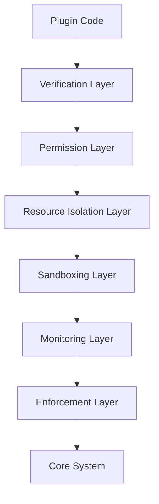

# Plugin System Security Model

## Overview

This document specifies the security model for the Squirrel plugin system. It defines the mechanisms and policies for ensuring that plugins operate within strict security boundaries, protecting the core system and user data from malicious or poorly implemented plugins.

## Core Security Principles

1. **Principle of Least Privilege**: Plugins should have access only to the resources and capabilities they absolutely need
2. **Defense in Depth**: Multiple security layers protect the system, not a single boundary
3. **Secure by Default**: Security features are enabled by default and require explicit opt-out
4. **Fail Secure**: System fails safely when security violations occur
5. **Auditability**: All security-relevant actions are logged and traceable

## Security Architecture

### Security Layers

The plugin security model implements multiple layers of protection:

1. **Plugin Verification**: Code signing and verification before loading
2. **Permission System**: Fine-grained access control for resources
3. **Resource Isolation**: Memory, CPU, and I/O limitations
4. **Sandboxing**: Execution boundary for plugin code
5. **Monitoring**: Runtime detection of security violations
6. **Enforcement**: Active prevention of security breaches



## Permission System

### Permission Types

Permissions are defined using a capability-based model with three components:

1. **Resource Type**: The category of resource (file, network, plugin, etc.)
2. **Resource Name**: Specific resource identifier or pattern
3. **Action**: The operation to perform (read, write, execute, etc.)

```rust
#[derive(Debug, Clone, PartialEq, Eq, Hash, Serialize, Deserialize)]
pub struct Permission {
    pub resource_type: String,
    pub resource_name: String,
    pub action: String,
}
```

### Standard Permissions

| Resource Type | Resource Name | Action | Description |
|---------------|--------------|--------|-------------|
| `file` | `/plugins/data/*` | `read` | Read access to plugin data directory |
| `file` | `/plugins/data/*` | `write` | Write access to plugin data directory |
| `network` | `localhost:*` | `connect` | Connect to services on localhost |
| `network` | `*.example.com` | `connect` | Connect to example.com domains |
| `plugin` | `com.example.plugin-a` | `invoke` | Invoke another plugin |
| `process` | `subprocess` | `spawn` | Spawn subprocesses |
| `system` | `env.READ_VARS` | `read` | Read environment variables |

### Permission Assignment

Permissions are assigned to plugins through:

1. **Manifest Declarations**: Plugin manifests declare required permissions
2. **User Approval**: Critical permissions require explicit user approval
3. **Policy Rules**: Organization-wide policy rules for permission assignment
4. **Default Permissions**: Minimal set of permissions granted by default

```yaml
# Example plugin manifest
name: example-plugin
version: 1.0.0
permissions:
  required:
    - { resource_type: "file", resource_name: "/plugins/data/example-plugin/*", action: "read" }
    - { resource_type: "file", resource_name: "/plugins/data/example-plugin/*", action: "write" }
  optional:
    - { resource_type: "network", resource_name: "api.example.com", action: "connect" }
```

## Resource Isolation

### Resource Limits

Each plugin operates within strictly defined resource limits:

1. **Memory**: Maximum heap and stack allocation
2. **CPU**: Maximum CPU time per operation
3. **Network**: Bandwidth and connection limits
4. **Storage**: Maximum disk space usage
5. **API Rate**: Limits on API call frequency

```rust
#[derive(Debug, Clone, Serialize, Deserialize)]
pub struct ResourceLimits {
    /// Memory limit in bytes
    pub memory_limit: usize,
    /// CPU time limit per operation in milliseconds
    pub cpu_limit: u64,
    /// Network bandwidth limit in bytes per second
    pub network_bandwidth: usize,
    /// Maximum concurrent network connections
    pub network_connections: usize,
    /// Storage space limit in bytes
    pub storage_limit: usize,
    /// API call rate limits
    pub api_rate_limits: HashMap<String, RateLimit>,
}

#[derive(Debug, Clone, Serialize, Deserialize)]
pub struct RateLimit {
    /// Maximum calls per time window
    pub max_calls: usize,
    /// Time window in seconds
    pub time_window: u64,
}
```

### Resource Monitoring

The system actively monitors resource usage:

1. **Usage Tracking**: Real-time tracking of resource consumption
2. **Threshold Alerts**: Warnings when approaching resource limits
3. **Violation Handling**: Actions taken when limits are exceeded
4. **Usage Analytics**: Historical analysis of resource usage patterns

```rust
pub struct ResourceUsageTracker {
    /// Current memory usage
    memory_usage: AtomicUsize,
    /// CPU time usage
    cpu_usage: AtomicU64,
    /// Network bandwidth usage
    network_usage: AtomicUsize,
    /// Storage usage
    storage_usage: AtomicUsize,
    /// API call counters
    api_calls: ConcurrentHashMap<String, AtomicUsize>,
    /// Usage history
    usage_history: RwLock<VecDeque<ResourceUsageSnapshot>>,
}
```

## Sandboxing

### Sandbox Implementation

The plugin sandbox creates execution boundaries:

1. **Memory Isolation**: Protected memory spaces for plugins
2. **Thread Isolation**: Plugin threads run in separate contexts
3. **File System Isolation**: Restricted file system views
4. **Network Isolation**: Controlled network access
5. **API Gateways**: Mediated access to system APIs

```rust
pub struct PluginSandbox {
    /// Plugin identifier
    plugin_id: Uuid,
    /// Permission set
    permissions: HashSet<Permission>,
    /// Resource limits
    resource_limits: ResourceLimits,
    /// Resource usage tracker
    resource_tracker: Arc<ResourceUsageTracker>,
    /// File system view
    fs_view: SandboxedFileSystem,
    /// Network controller
    network_controller: SandboxedNetwork,
    /// API gateway
    api_gateway: ApiGateway,
}
```

### Sandbox Policies

Policies define sandbox behavior:

1. **Containment Policy**: How to isolate plugin code
2. **Failure Policy**: Actions on sandbox violations
3. **Resource Policy**: Resource allocation rules
4. **Interaction Policy**: Rules for cross-plugin communication

## Security Validation

### Static Analysis

Plugins undergo static analysis before loading:

1. **Vulnerability Scanning**: Detection of known vulnerable patterns
2. **Dependency Checking**: Verification of dependencies
3. **Code Signing**: Validation of code signatures
4. **Permission Validation**: Analysis of permission requirements

### Runtime Verification

Runtime checks validate plugin behavior:

1. **Permission Enforcement**: Verification of permission requirements
2. **Resource Monitoring**: Tracking of resource usage
3. **Behavior Analysis**: Detection of suspicious patterns
4. **Integrity Checking**: Validation of plugin integrity

## Security Enforcement

### Violation Responses

The system responds to security violations:

1. **Operation Denial**: Blocking unauthorized operations
2. **Resource Throttling**: Limiting resources on overuse
3. **Plugin Suspension**: Temporarily disabling problematic plugins
4. **Plugin Termination**: Shutting down malicious plugins
5. **Notification**: Alerting users and administrators

```rust
pub enum SecurityViolationResponse {
    /// Deny the operation
    Deny,
    /// Throttle resources
    Throttle(ResourceThrottlePolicy),
    /// Suspend the plugin
    Suspend(Duration),
    /// Terminate the plugin
    Terminate,
    /// Allow but log and notify
    AllowWithWarning,
}
```

### Security Events

Security events are logged for audit:

1. **Permission Denials**: Failed permission checks
2. **Resource Violations**: Resource limit violations
3. **Sandbox Escapes**: Attempts to escape the sandbox
4. **Suspicious Activity**: Unusual behavioral patterns
5. **Administrative Actions**: Security-related admin actions

```rust
#[derive(Debug, Clone, Serialize)]
pub struct SecurityEvent {
    /// Event ID
    pub id: Uuid,
    /// Event timestamp
    pub timestamp: chrono::DateTime<chrono::Utc>,
    /// Plugin ID
    pub plugin_id: Uuid,
    /// Event severity
    pub severity: SecurityEventSeverity,
    /// Event type
    pub event_type: SecurityEventType,
    /// Event description
    pub description: String,
    /// Event context
    pub context: HashMap<String, serde_json::Value>,
}
```

## Implementation Status

The security model implementation is currently at an early stage:

### Completed Components (15%)
- [x] Basic permission definitions
- [x] Simple resource tracking
- [x] Initial security event logging

### In Progress Components (20%)
- [✓] Permission enforcement (partial)
- [✓] Resource limits (partial)
- [✓] Security event types (partial)

### Planned Components (65%)
- [ ] Code signing and verification
- [ ] Advanced sandboxing
- [ ] Comprehensive permission system
- [ ] Advanced resource isolation
- [ ] Security analytics and reporting
- [ ] User-facing security controls
- [ ] Organization policy framework

## Security Testing

### Test Categories

Security testing includes:

1. **Unit Tests**: Testing individual security components
2. **Integration Tests**: Testing security layer interactions
3. **Penetration Tests**: Attempting to bypass security mechanisms
4. **Fuzzing**: Sending malformed inputs to find vulnerabilities
5. **Compliance Tests**: Validating against security standards

### Test Coverage

Security tests should achieve:

1. **Functional Coverage**: All security functions tested
2. **Boundary Coverage**: Limit and edge cases tested
3. **Attack Vector Coverage**: Common attack patterns tested
4. **Policy Coverage**: All security policies verified

## Implementation Roadmap

### Phase 1: Foundation (1 month)
1. Complete permission system implementation
2. Implement basic resource limits
3. Enhance security event logging
4. Create initial security tests

### Phase 2: Core Security (2 months)
1. Implement plugin code validation
2. Add comprehensive permission enforcement
3. Enhance resource isolation
4. Develop basic sandboxing
5. Create security dashboards

### Phase 3: Advanced Security (3 months)
1. Implement full sandboxing solution
2. Add security analytics
3. Develop vulnerability scanning
4. Create organization policy framework
5. Implement automatic security response

## Security Best Practices for Plugin Developers

1. **Request Minimal Permissions**: Only request permissions your plugin truly needs
2. **Handle Failures Gracefully**: Implement proper error handling for permission denials
3. **Optimize Resource Usage**: Minimize resource consumption
4. **Validate All Inputs**: Never trust input data from any source
5. **Secure Data Storage**: Encrypt sensitive data stored by your plugin
6. **Follow Secure Coding Guidelines**: Use secure coding practices
7. **Regular Security Testing**: Test your plugin for security vulnerabilities
8. **Keep Dependencies Updated**: Regularly update dependencies to fix security issues
9. **Document Security Features**: Clearly document your plugin's security model
10. **Implement Proper Authentication**: Use strong authentication when needed

## Conclusion

The Squirrel plugin security model provides comprehensive protection through multiple security layers. By implementing this model, we ensure that plugins can extend the system's functionality without compromising security, stability, or user trust.

The current implementation is in early stages, with approximately 15% of the security model components completed. The roadmap outlines a clear path to a comprehensive implementation over the next 6 months. 