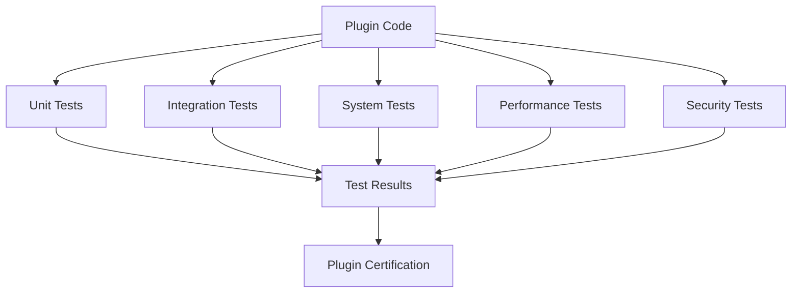

# Plugin System Testing Framework

## Overview

This document specifies the testing framework for the Squirrel plugin system. It outlines a comprehensive approach to validating plugins and the plugin system to ensure reliability, security, and performance. The framework covers unit testing, integration testing, performance testing, and security testing methodologies.

## Testing Goals

The plugin testing framework aims to achieve:

1. **Functional Correctness**: Ensure plugins function as expected
2. **Integration Integrity**: Verify plugins integrate properly with the system
3. **Performance Efficiency**: Validate plugins meet performance requirements
4. **Security Compliance**: Confirm plugins adhere to security policies
5. **Reliability**: Ensure plugins handle edge cases and failures gracefully

## Testing Architecture

### Test Layers

The testing architecture consists of multiple layers:

1. **Unit Tests**: Testing individual plugin components
2. **Integration Tests**: Testing plugin interactions with the system
3. **System Tests**: Testing the complete system with plugins
4. **Performance Tests**: Measuring plugin performance metrics
5. **Security Tests**: Validating plugin security boundaries



## Test Types

### 1. Unit Testing

Unit tests validate individual plugin components:

- **Plugin Interface Conformance**: Tests that plugins implement required interfaces
- **State Management**: Tests plugin state storage and retrieval
- **Lifecycle Methods**: Tests initialization, execution, and cleanup
- **Error Handling**: Tests proper error handling and recovery
- **Event Processing**: Tests event handling and callbacks

```rust
#[cfg(test)]
mod plugin_unit_tests {
    use super::*;
    
    #[tokio::test]
    async fn test_plugin_initialization() {
        let plugin = TestPlugin::new();
        let result = plugin.initialize().await;
        assert!(result.is_ok());
    }
    
    #[tokio::test]
    async fn test_plugin_state_persistence() {
        let plugin = TestPlugin::new();
        
        // Create and set state
        let state = PluginState {
            plugin_id: plugin.metadata().id,
            data: serde_json::json!({ "key": "value" }),
            last_modified: chrono::Utc::now(),
        };
        
        let result = plugin.set_state(state.clone()).await;
        assert!(result.is_ok());
        
        // Retrieve state
        let retrieved = plugin.get_state().await.unwrap().unwrap();
        assert_eq!(retrieved.data, state.data);
    }
    
    #[tokio::test]
    async fn test_plugin_error_handling() {
        let plugin = TestPlugin::new();
        // Test with invalid input
        let result = plugin.execute_with_error().await;
        assert!(result.is_err());
        // Verify error type and handling
        assert_eq!(result.unwrap_err().to_string(), "Expected error");
    }
}
```

### 2. Integration Testing

Integration tests validate plugin interaction with the system:

- **Plugin Loading**: Tests plugin discovery and loading
- **Command Registration**: Tests command registration and execution
- **System API Usage**: Tests interaction with system APIs
- **Event Processing**: Tests system event processing
- **Resource Usage**: Tests resource allocation and cleanup

```rust
#[cfg(test)]
mod plugin_integration_tests {
    use super::*;
    
    #[tokio::test]
    async fn test_plugin_registration() {
        let mut manager = PluginManager::new();
        let plugin = create_test_plugin();
        
        // Register plugin
        let result = manager.register_plugin(plugin).await;
        assert!(result.is_ok());
        
        // Verify registration
        let plugins = manager.list_plugins().await;
        assert_eq!(plugins.len(), 1);
        assert_eq!(plugins[0].metadata().name, "test-plugin");
    }
    
    #[tokio::test]
    async fn test_plugin_command_execution() {
        let mut manager = PluginManager::new();
        let plugin = create_command_plugin();
        manager.register_plugin(plugin).await.unwrap();
        
        // Execute command
        let result = manager
            .execute_command("test-command", serde_json::json!({}))
            .await;
            
        assert!(result.is_ok());
        assert_eq!(
            result.unwrap().as_str().unwrap(), 
            "Command executed successfully"
        );
    }
    
    #[tokio::test]
    async fn test_plugin_event_handling() {
        let mut manager = PluginManager::new();
        let plugin = create_event_plugin();
        manager.register_plugin(plugin).await.unwrap();
        
        // Dispatch event
        let event = SystemEvent::new("test-event", serde_json::json!({}));
        manager.dispatch_event(event).await.unwrap();
        
        // Verify event was processed
        let plugin = manager.get_plugin_by_name("event-plugin").await.unwrap();
        let state = plugin.get_state().await.unwrap().unwrap();
        
        let events_processed = state.data["events_processed"].as_u64().unwrap();
        assert_eq!(events_processed, 1);
    }
}
```

### 3. System Testing

System tests validate the complete system with plugins:

- **End-to-End Scenarios**: Tests complete user workflows
- **Multiple Plugin Interaction**: Tests plugins working together
- **System Stability**: Tests system stability with plugins
- **Resource Contention**: Tests behavior under resource contention
- **Error Propagation**: Tests error handling across the system

```rust
#[cfg(test)]
mod plugin_system_tests {
    use super::*;
    
    #[tokio::test]
    async fn test_end_to_end_workflow() {
        // Create test system
        let system = TestSystem::new();
        
        // Register multiple plugins
        system.register_test_plugins().await;
        
        // Execute end-to-end workflow
        let result = system
            .execute_workflow("test-workflow", serde_json::json!({}))
            .await;
            
        assert!(result.is_ok());
        let output = result.unwrap();
        
        // Verify workflow output
        assert!(output.contains_key("status"));
        assert_eq!(output["status"].as_str().unwrap(), "completed");
        assert!(output.contains_key("results"));
    }
    
    #[tokio::test]
    async fn test_plugin_dependencies() {
        // Create test system
        let system = TestSystem::new();
        
        // Register plugins with dependencies
        system.register_plugins_with_dependencies().await;
        
        // Verify dependency resolution
        let plugin_a = system.get_plugin("plugin-a").await.unwrap();
        let plugin_b = system.get_plugin("plugin-b").await.unwrap();
        
        // Execute command that requires both plugins
        let result = system
            .execute_command("dependent-command", serde_json::json!({}))
            .await;
            
        assert!(result.is_ok());
    }
}
```

### 4. Performance Testing

Performance tests measure plugin efficiency:

- **Resource Usage**: Measures memory, CPU, and I/O usage
- **Response Time**: Measures operation response times
- **Throughput**: Measures operations per second
- **Scalability**: Measures performance under load
- **Startup Impact**: Measures impact on system startup

```rust
#[cfg(test)]
mod plugin_performance_tests {
    use super::*;
    use criterion::{black_box, criterion_group, criterion_main, Criterion};
    
    pub fn plugin_operation_benchmark(c: &mut Criterion) {
        let rt = tokio::runtime::Runtime::new().unwrap();
        let plugin = create_benchmark_plugin();
        
        c.bench_function("plugin_execute_command", |b| {
            b.to_async(&rt).iter(|| async {
                black_box(
                    plugin.execute_command(
                        "bench-command", 
                        serde_json::json!({})
                    ).await
                )
            });
        });
        
        c.bench_function("plugin_state_operations", |b| {
            b.to_async(&rt).iter(|| async {
                let state = PluginState {
                    plugin_id: plugin.metadata().id,
                    data: black_box(serde_json::json!({ "key": "value" })),
                    last_modified: chrono::Utc::now(),
                };
                
                black_box(plugin.set_state(state).await).unwrap();
                black_box(plugin.get_state().await)
            });
        });
    }
    
    criterion_group!(benches, plugin_operation_benchmark);
    criterion_main!(benches);
}
```

### 5. Security Testing

Security tests validate plugin security boundaries:

- **Permission Validation**: Tests permission enforcement
- **Resource Isolation**: Tests resource limit enforcement
- **Data Protection**: Tests data isolation and protection
- **Vulnerability Scanning**: Tests for security vulnerabilities
- **Sandbox Escape**: Tests sandbox containment

```rust
#[cfg(test)]
mod plugin_security_tests {
    use super::*;
    
    #[tokio::test]
    async fn test_permission_enforcement() {
        let security_context = SecurityContext::new();
        
        // Create plugin with limited permissions
        let plugin = create_plugin_with_permissions(vec![
            Permission::new("file", "/plugins/data/test/*", "read"),
        ]);
        
        // Test allowed operation
        let result = security_context
            .verify_operation(
                plugin.metadata().id,
                "file",
                "/plugins/data/test/config.json",
                "read"
            ).await;
            
        assert!(result.is_ok());
        
        // Test disallowed operation
        let result = security_context
            .verify_operation(
                plugin.metadata().id,
                "file",
                "/system/config.json",
                "read"
            ).await;
            
        assert!(result.is_err());
    }
    
    #[tokio::test]
    async fn test_resource_limits() {
        let mut sandbox = PluginSandbox::new();
        
        // Set resource limits
        sandbox.set_resource_limits(ResourceLimits {
            memory_limit: 1024 * 1024, // 1MB
            cpu_limit: 100, // 100ms
            network_bandwidth: 1024 * 10, // 10KB/s
            network_connections: 5,
            storage_limit: 1024 * 1024 * 10, // 10MB
            api_rate_limits: HashMap::new(),
        });
        
        // Create test plugin
        let plugin = create_test_plugin();
        
        // Run plugin in sandbox
        let result = sandbox.run_plugin(plugin).await;
        assert!(result.is_ok());
        
        // Verify resource usage
        let usage = sandbox.get_resource_usage().await;
        assert!(usage.memory_usage <= 1024 * 1024);
        assert!(usage.cpu_usage <= 100);
    }
}
```

## Test Data Management

### Test Plugin Repository

The testing framework includes a repository of test plugins:

- **Example Plugins**: Complete plugin examples for testing
- **Mock Plugins**: Simplified plugins for specific tests
- **Malicious Plugins**: Specially crafted plugins for security testing
- **Performance Plugins**: Plugins designed for performance benchmarks

```rust
pub struct TestPluginRepository {
    plugins: HashMap<String, Box<dyn TestPlugin>>,
}

impl TestPluginRepository {
    pub fn new() -> Self {
        let mut repo = Self {
            plugins: HashMap::new(),
        };
        
        // Add standard test plugins
        repo.add_plugin("basic", BasicTestPlugin::new());
        repo.add_plugin("command", CommandTestPlugin::new());
        repo.add_plugin("event", EventTestPlugin::new());
        repo.add_plugin("malicious", MaliciousTestPlugin::new());
        repo.add_plugin("performance", PerformanceTestPlugin::new());
        
        repo
    }
    
    pub fn get_plugin(&self, name: &str) -> Option<&Box<dyn TestPlugin>> {
        self.plugins.get(name)
    }
    
    pub fn add_plugin(&mut self, name: &str, plugin: Box<dyn TestPlugin>) {
        self.plugins.insert(name.to_string(), plugin);
    }
}
```

### Test Environment

A configurable test environment provides:

- **State Storage**: In-memory or file-based state storage
- **Mock Dependencies**: Mock implementations of system dependencies
- **Configurable Security**: Adjustable security policies
- **Resource Simulation**: Simulation of resource constraints
- **Event Simulation**: Simulation of system events

```rust
pub struct TestEnvironment {
    /// State storage
    state_storage: Box<dyn PluginStateStorage>,
    /// Security context
    security_context: SecurityContext,
    /// Resource simulator
    resource_simulator: ResourceSimulator,
    /// Event dispatcher
    event_dispatcher: EventDispatcher,
    /// Mock services
    services: HashMap<String, Box<dyn MockService>>,
}

impl TestEnvironment {
    pub fn new() -> Self {
        Self {
            state_storage: Box::new(MemoryStateStorage::new()),
            security_context: SecurityContext::new(),
            resource_simulator: ResourceSimulator::new(),
            event_dispatcher: EventDispatcher::new(),
            services: HashMap::new(),
        }
    }
    
    pub fn with_file_storage(path: PathBuf) -> Self {
        let mut env = Self::new();
        env.state_storage = Box::new(FileSystemStateStorage::new(path));
        env
    }
    
    pub fn with_security_level(mut self, level: SecurityLevel) -> Self {
        self.security_context = SecurityContext::with_level(level);
        self
    }
    
    pub fn with_resource_constraints(mut self, constraints: ResourceConstraints) -> Self {
        self.resource_simulator = ResourceSimulator::with_constraints(constraints);
        self
    }
    
    pub fn add_mock_service(&mut self, name: &str, service: Box<dyn MockService>) {
        self.services.insert(name.to_string(), service);
    }
    
    pub fn get_mock_service(&self, name: &str) -> Option<&Box<dyn MockService>> {
        self.services.get(name)
    }
}
```

## Test Automation

### Continuous Integration

The testing framework integrates with CI systems:

- **Automated Test Execution**: Automatic test execution on code changes
- **Test Result Reporting**: Reporting of test results
- **Coverage Analysis**: Analysis of test coverage
- **Performance Trending**: Tracking of performance metrics over time
- **Security Scanning**: Automated security validation

### Plugin Certification

The framework supports plugin certification:

- **Automated Verification**: Verification against certification requirements
- **Compliance Checking**: Checking against policy requirements
- **Quality Metrics**: Measurement of code quality metrics
- **Documentation Validation**: Validation of plugin documentation
- **Security Assessment**: Assessment of security practices

```rust
pub struct PluginCertification {
    /// Plugin ID
    plugin_id: Uuid,
    /// Certification level
    level: CertificationLevel,
    /// Test results
    test_results: HashMap<String, TestResult>,
    /// Security assessment
    security_assessment: SecurityAssessment,
    /// Performance metrics
    performance_metrics: PerformanceMetrics,
    /// Documentation score
    documentation_score: u32,
    /// Overall score
    overall_score: u32,
    /// Certification date
    certification_date: chrono::DateTime<chrono::Utc>,
}

pub enum CertificationLevel {
    /// Basic certification
    Basic,
    /// Standard certification
    Standard,
    /// Premium certification
    Premium,
}
```

## Implementation Status

The testing framework implementation is currently at an early stage:

### Completed Components (10%)
- [x] Basic unit test structure
- [x] Simple mock plugins

### In Progress Components (15%)
- [✓] Test environment (partial)
- [✓] Integration tests (partial)
- [✓] Performance benchmarks (partial)

### Planned Components (75%)
- [ ] Comprehensive test plugins
- [ ] Full test environment
- [ ] System testing framework
- [ ] Performance testing suite
- [ ] Security testing suite
- [ ] Test automation
- [ ] Plugin certification

## Implementation Roadmap

### Phase 1: Foundation (1 month)
1. Complete basic test environment
2. Implement test plugin repository
3. Create unit test suite
4. Develop integration test framework

### Phase 2: Core Testing (2 months)
1. Implement system test suite
2. Add performance benchmarks
3. Create security test suite
4. Develop test automation

### Phase 3: Advanced Testing (3 months)
1. Implement plugin certification
2. Add comprehensive test analytics
3. Create performance trending
4. Develop security assessment
5. Build documentation validation

## Best Practices for Plugin Developers

1. **Write Unit Tests**: Create comprehensive tests for your plugin
2. **Test Edge Cases**: Ensure your plugin handles edge cases
3. **Validate Security**: Test your plugin's security boundaries
4. **Benchmark Performance**: Measure your plugin's performance
5. **Document Testing**: Document your testing approach
6. **Use Test Harnesses**: Utilize the provided test harnesses
7. **Test Installation**: Validate plugin installation and updates
8. **Test Compatibility**: Verify compatibility with different versions
9. **Test Error Handling**: Ensure proper error handling
10. **Automate Testing**: Automate your testing process

## Conclusion

The Squirrel plugin testing framework provides comprehensive tools for validating plugin functionality, performance, and security. By implementing this framework, we ensure that plugins meet quality standards and integrate seamlessly with the system.

The current implementation is in early stages, with approximately 10% of the testing framework components completed. The roadmap outlines a clear path to a comprehensive implementation over the next 6 months. 