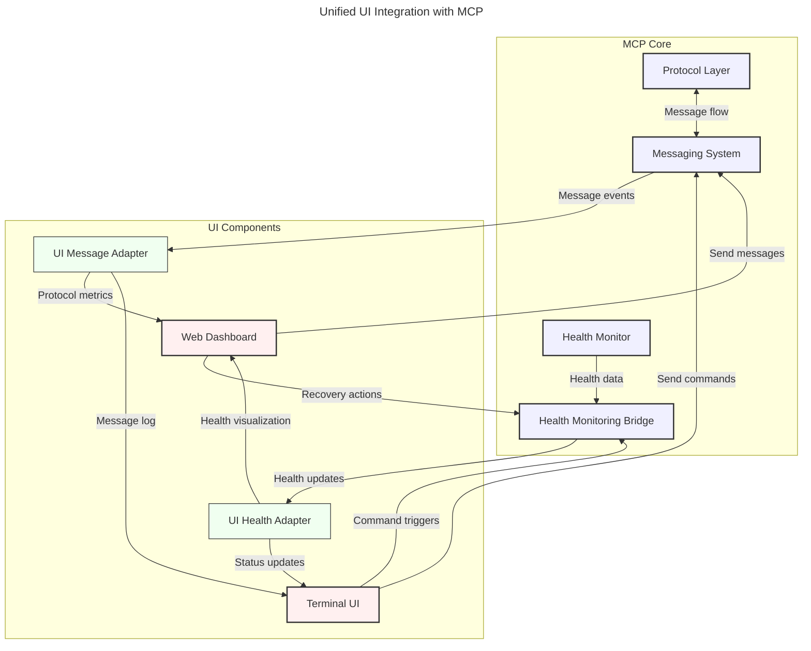

# Unified UI Integration with MCP

## Overview

This document provides a comprehensive guide for integrating UI components (dashboard and terminal) with the Machine Context Protocol (MCP) framework. The integration covers two main aspects:

1. **Health Monitoring Integration**: Real-time visualization of system health through the Health Monitoring Bridge
2. **Messaging System Integration**: Direct access to MCP's messaging system for real-time communication and protocol metrics

## Integration Architecture

The UI components will connect to MCP through dedicated adapters for both the health monitoring system and the messaging system, following established adapter patterns.



## Part 1: Health Monitoring Integration

### UI Health Adapter

Implement a `UIHealthAdapter` that connects to the MCP Health Monitoring Bridge:

```typescript
// TypeScript UI Health Adapter
class MCPHealthAdapter {
  private socket: WebSocket;
  private components: Map<string, ComponentHealth>;
  private listeners: Set<(data: ComponentHealth[]) => void>;
  
  constructor(endpoint: string) {
    this.socket = new WebSocket(endpoint);
    this.components = new Map();
    this.listeners = new Set();
    
    this.socket.onmessage = (event) => {
      const data = JSON.parse(event.data);
      this.processHealthUpdate(data);
    };
  }
  
  private processHealthUpdate(data: any) {
    // Process and store health data
    data.components.forEach((component: any) => {
      this.components.set(component.id, {
        id: component.id,
        status: component.status,
        message: component.message,
        lastUpdated: new Date(),
        metrics: component.metrics || {}
      });
    });
    
    // Notify listeners
    this.notifyListeners();
  }
  
  public addListener(callback: (data: ComponentHealth[]) => void) {
    this.listeners.add(callback);
  }
  
  public removeListener(callback: (data: ComponentHealth[]) => void) {
    this.listeners.delete(callback);
  }
  
  private notifyListeners() {
    const components = Array.from(this.components.values());
    this.listeners.forEach(listener => listener(components));
  }
  
  public triggerRecoveryAction(componentId: string, action: string) {
    this.socket.send(JSON.stringify({
      type: 'recovery',
      componentId,
      action
    }));
  }
}

// Component health interface
interface ComponentHealth {
  id: string;
  status: 'Healthy' | 'Degraded' | 'Warning' | 'Unhealthy' | 'Critical' | 'Unknown';
  message: string;
  lastUpdated: Date;
  metrics: Record<string, any>;
}
```

### Dashboard Health Integration

The web dashboard should implement these key features for health monitoring:

1. **Health Status Overview Panel**:
   - Display all MCP components with their current health status
   - Color-code by status (green for healthy, yellow for degraded, red for unhealthy/critical)
   - Show last update timestamp

2. **Component Details Panel**:
   - Show detailed metrics for selected component
   - Display historical status changes
   - Provide recovery action buttons for unhealthy components

3. **Alerts Panel**:
   - Show recent alerts related to MCP components
   - Allow filtering and sorting of alerts
   - Enable direct navigation to affected components

### Terminal UI Health Integration

The terminal UI should implement:

1. **Health Status Command**:
   - Display current health status of all MCP components
   - Color-code output by status
   - Support filtering by component or status

2. **Health Watch Command**:
   - Continuously update and display status changes
   - Support focusing on specific components
   - Provide immediate notification of critical status changes

3. **Recovery Command**:
   - Allow triggering recovery actions for specific components
   - Show action results and updated status

## Part 2: Messaging System Integration

### UI Message Adapter

Implement a `UIMessageAdapter` that connects to the MCP Messaging System:

```typescript
// TypeScript UI Message Adapter
class MCPMessageAdapter {
  private socket: WebSocket;
  private messageListeners: Set<(message: MCPMessage) => void>;
  private metricsListeners: Set<(metrics: MCPMetrics) => void>;
  private cachedMetrics: MCPMetrics | null = null;
  
  constructor(endpoint: string) {
    this.socket = new WebSocket(endpoint);
    this.messageListeners = new Set();
    this.metricsListeners = new Set();
    
    this.socket.onmessage = (event) => {
      const data = JSON.parse(event.data);
      
      if (data.type === 'message') {
        this.processMessage(data.message);
      } else if (data.type === 'metrics') {
        this.processMetrics(data.metrics);
      }
    };
    
    // Start periodic metrics collection
    setInterval(() => this.requestMetrics(), 5000);
  }
  
  private processMessage(message: MCPMessage) {
    this.messageListeners.forEach(listener => listener(message));
  }
  
  private processMetrics(metrics: MCPMetrics) {
    this.cachedMetrics = metrics;
    this.metricsListeners.forEach(listener => listener(metrics));
  }
  
  private requestMetrics() {
    this.socket.send(JSON.stringify({
      type: 'request_metrics'
    }));
  }
  
  public addMessageListener(callback: (message: MCPMessage) => void) {
    this.messageListeners.add(callback);
  }
  
  public removeMessageListener(callback: (message: MCPMessage) => void) {
    this.messageListeners.delete(callback);
  }
  
  public addMetricsListener(callback: (metrics: MCPMetrics) => void) {
    this.metricsListeners.add(callback);
    // Immediately call with cached metrics if available
    if (this.cachedMetrics) {
      callback(this.cachedMetrics);
    }
  }
  
  public removeMetricsListener(callback: (metrics: MCPMetrics) => void) {
    this.metricsListeners.delete(callback);
  }
  
  public sendMessage(message: MCPMessagePayload) {
    this.socket.send(JSON.stringify({
      type: 'send_message',
      message
    }));
  }
}

// MCP Message interfaces
interface MCPMessage {
  id: string;
  message_type: 'Request' | 'Response' | 'Notification' | 'Error' | 'Control' | 'System' | 'StreamChunk';
  priority: 'Low' | 'Normal' | 'High' | 'Urgent';
  content: string;
  source: string;
  destination: string;
  timestamp: string;
  in_reply_to?: string;
  context_id?: string;
  topic?: string;
  metadata: Record<string, string>;
}

interface MCPMessagePayload {
  message_type: 'Request' | 'Response' | 'Notification' | 'Error' | 'Control' | 'System' | 'StreamChunk';
  content: string;
  destination: string;
  topic?: string;
  context_id?: string;
  in_reply_to?: string;
  metadata?: Record<string, string>;
}

interface MCPMetrics {
  message_stats: {
    total_requests: number;
    total_responses: number;
    total_notifications: number;
    total_errors: number;
    request_rate: number;
    response_rate: number;
    request_types: Record<string, number>;
  };
  transaction_stats: {
    total_transactions: number;
    successful_transactions: number;
    failed_transactions: number;
    transaction_rate: number;
    success_rate: number;
  };
  error_stats: {
    total_errors: number;
    connection_errors: number;
    protocol_errors: number;
    timeout_errors: number;
    error_rate: number;
    error_types: Record<string, number>;
  };
  latency_stats: {
    average_latency_ms: number;
    median_latency_ms: number;
    p95_latency_ms: number;
    p99_latency_ms: number;
    min_latency_ms: number;
    max_latency_ms: number;
    latency_histogram: number[];
  };
  timestamp: string;
}
```

### Dashboard Messaging Integration

The web dashboard should implement these key features for messaging:

1. **Protocol Metrics Panel**:
   - Display MCP message statistics (counts, rates, types)
   - Show transaction success rates and error rates
   - Visualize latency metrics with charts

2. **Message Inspector**:
   - Show recent messages with filtering options
   - Allow inspection of message details (payload, metadata)
   - Support sending test messages

3. **Live Protocol View**:
   - Real-time visualization of message flow
   - Highlight request-response pairs
   - Show error messages prominently

### Terminal UI Messaging Integration

The terminal UI should implement:

1. **Message Stats Command**:
   - Display current message statistics and rates
   - Show error rates and counts
   - Display performance metrics

2. **Message Log Command**:
   - Show recent messages with filtering options
   - Support following message stream in real-time
   - Enable detailed inspection of selected messages

3. **Send Message Command**:
   - Allow composing and sending different types of messages
   - Support templated messages for quick testing
   - Show response for request messages

## MCP Backend Requirements

To support the UI integration, the MCP team needs to expose these endpoints:

### Health Monitoring API

```
# REST API
GET /api/mcp/health
  - Returns current health status of all components

GET /api/mcp/health/{componentId}
  - Returns detailed health status for specific component

POST /api/mcp/health/{componentId}/recovery
  - Triggers recovery action for component
  - Payload: { "action": "restart|failover|reload" }

# WebSocket API
ws://api.example.com/mcp/health
  - Streams health status updates
```

### Messaging System API

```
# REST API
GET /api/mcp/messages
  - Returns recent messages with pagination and filtering
  - Query params: limit, offset, message_type, source, destination, topic

GET /api/mcp/metrics
  - Returns current message and protocol metrics

POST /api/mcp/messages
  - Sends a new message
  - Payload: MCPMessagePayload

# WebSocket API
ws://api.example.com/mcp/messages
  - Streams message events and metrics updates
  - Supports sending messages and requesting metrics
```

## Integration Implementation in Rust

### Adapter Implementations

```rust
/// MCP metrics collection API
pub trait McpMetricsProvider: Send + Sync {
    /// Get current metrics snapshot
    fn get_metrics(&self) -> Result<McpMetrics, McpError>;
    
    /// Subscribe to metrics updates with specified interval
    fn subscribe(&self, interval_ms: u64) -> mpsc::Receiver<McpMetrics>;
}

/// MCP health monitoring API
pub trait McpHealthProvider: Send + Sync {
    /// Get current health status of all components
    fn get_health_status(&self) -> Result<Vec<ComponentHealth>, McpError>;
    
    /// Get detailed health status for a specific component
    fn get_component_health(&self, component_id: &str) -> Result<ComponentHealth, McpError>;
    
    /// Trigger a recovery action for a component
    fn trigger_recovery(&self, component_id: &str, action: &str) -> Result<(), McpError>;
    
    /// Subscribe to health status updates
    fn subscribe_health_updates(&self) -> mpsc::Receiver<Vec<ComponentHealth>>;
}

/// Terminal UI adapter for MCP integration
pub struct McpUiAdapter {
    /// MCP metrics provider
    metrics_provider: Option<Arc<dyn McpMetricsProvider>>,
    
    /// MCP health provider
    health_provider: Option<Arc<dyn McpHealthProvider>>,
    
    /// Cached metrics for fallback
    cached_metrics: Option<McpMetrics>,
    
    /// Cached health status for fallback
    cached_health: Option<Vec<ComponentHealth>>,
    
    /// Last update timestamp
    last_update: DateTime<Utc>,
    
    /// Metrics update channel receiver
    metrics_rx: Option<mpsc::Receiver<McpMetrics>>,
    
    /// Health update channel receiver
    health_rx: Option<mpsc::Receiver<Vec<ComponentHealth>>>,
}

impl McpUiAdapter {
    /// Create a new adapter with MCP providers
    pub fn new(
        metrics_provider: Option<Arc<dyn McpMetricsProvider>>,
        health_provider: Option<Arc<dyn McpHealthProvider>>,
    ) -> Self {
        let metrics_rx = metrics_provider.as_ref().map(|p| p.subscribe(1000));
        let health_rx = health_provider.as_ref().map(|p| p.subscribe_health_updates());
        
        Self {
            metrics_provider,
            health_provider,
            cached_metrics: None,
            cached_health: None,
            last_update: Utc::now(),
            metrics_rx,
            health_rx,
        }
    }
    
    /// Collect metrics and health data for the dashboard
    pub async fn collect_data(&mut self) -> (Option<McpMetrics>, Option<Vec<ComponentHealth>>) {
        let metrics = self.collect_metrics().await;
        let health = self.collect_health().await;
        
        (metrics, health)
    }
    
    /// Collect metrics from MCP
    async fn collect_metrics(&mut self) -> Option<McpMetrics> {
        // Try to get metrics from the update channel first
        if let Some(rx) = &mut self.metrics_rx {
            if let Ok(metrics) = rx.try_recv() {
                self.cached_metrics = Some(metrics.clone());
                self.last_update = Utc::now();
                return Some(metrics);
            }
        }
        
        // If no updates from channel, try direct fetch
        if let Some(provider) = &self.metrics_provider {
            match provider.get_metrics() {
                Ok(metrics) => {
                    self.cached_metrics = Some(metrics.clone());
                    self.last_update = Utc::now();
                    return Some(metrics);
                },
                Err(e) => {
                    log::warn!("Failed to get MCP metrics: {}", e);
                    // Fall back to cached metrics
                    return self.cached_metrics.clone();
                }
            }
        }
        
        None
    }
    
    /// Collect health status from MCP
    async fn collect_health(&mut self) -> Option<Vec<ComponentHealth>> {
        // Try to get health updates from the channel first
        if let Some(rx) = &mut self.health_rx {
            if let Ok(health) = rx.try_recv() {
                self.cached_health = Some(health.clone());
                return Some(health);
            }
        }
        
        // If no updates from channel, try direct fetch
        if let Some(provider) = &self.health_provider {
            match provider.get_health_status() {
                Ok(health) => {
                    self.cached_health = Some(health.clone());
                    return Some(health);
                },
                Err(e) => {
                    log::warn!("Failed to get MCP health status: {}", e);
                    // Fall back to cached health
                    return self.cached_health.clone();
                }
            }
        }
        
        None
    }
    
    /// Trigger a recovery action for a component
    pub async fn trigger_recovery(&self, component_id: &str, action: &str) -> Result<(), McpError> {
        if let Some(provider) = &self.health_provider {
            provider.trigger_recovery(component_id, action)
        } else {
            Err(McpError::new("Health provider not available"))
        }
    }
    
    /// Send a message via MCP
    pub async fn send_message(&self, message: Message) -> Result<(), McpError> {
        // Implementation depends on specific MCP client capabilities
        Err(McpError::new("Not implemented"))
    }
}
```

## Implementation Phases

### Phase 1: Core Adapters (Week 1-2)
1. Implement `UIHealthAdapter` and `UIMessageAdapter` in TypeScript for web
2. Implement `McpUiAdapter` in Rust for terminal UI
3. Create mock implementations for development and testing

### Phase 2: Dashboard Integration (Week 3-4)
1. Implement health monitoring visualization
2. Add protocol metrics and message inspection panels
3. Create recovery action UI and message sending capability

### Phase 3: Terminal UI Integration (Week 5-6)
1. Implement health status commands and views
2. Add message statistics and log viewing capability
3. Create message sending and recovery trigger commands

### Phase 4: Backend API (Week 7-8)
1. Expose health monitoring REST and WebSocket endpoints
2. Implement message history and metrics REST endpoints
3. Create WebSocket streaming for messaging system

## Testing Requirements

### Unit Tests
1. Test adapter implementations with mock data
2. Verify data transformations and error handling
3. Test reconnection and fallback mechanisms

### Integration Tests
1. Test real-time data flow between MCP and UI components
2. Verify recovery actions trigger appropriate responses
3. Test message sending and receiving end-to-end

### Performance Tests
1. Measure UI responsiveness with high message volumes
2. Test health monitoring with many components
3. Verify memory usage remains within acceptable limits

## Sample Mock Data

### Health Status Mock

```json
[
  {
    "id": "mcp-protocol-adapter",
    "status": "Healthy",
    "message": "Protocol adapter is functioning normally",
    "lastUpdated": "2024-09-15T10:15:30Z",
    "metrics": {
      "requestsPerSecond": 120,
      "averageLatencyMs": 15,
      "errorRate": 0.002
    }
  },
  {
    "id": "mcp-security-manager",
    "status": "Degraded",
    "message": "High latency observed in authentication requests",
    "lastUpdated": "2024-09-15T10:14:45Z",
    "metrics": {
      "requestsPerSecond": 75,
      "averageLatencyMs": 250,
      "errorRate": 0.018
    }
  },
  {
    "id": "mcp-transport-layer",
    "status": "Unhealthy",
    "message": "Connection failures detected",
    "lastUpdated": "2024-09-15T10:13:22Z",
    "metrics": {
      "requestsPerSecond": 30,
      "connectionFailures": 12,
      "lastSuccessful": "2024-09-15T10:10:05Z"
    }
  }
]
```

### Message Metrics Mock

```json
{
  "message_stats": {
    "total_requests": 12500,
    "total_responses": 12498,
    "total_notifications": 3750,
    "total_errors": 25,
    "request_rate": 42.3,
    "response_rate": 42.2,
    "request_types": {
      "get_status": 5240,
      "update_config": 3210,
      "process_data": 4050
    }
  },
  "transaction_stats": {
    "total_transactions": 12500,
    "successful_transactions": 12475,
    "failed_transactions": 25,
    "transaction_rate": 42.3,
    "success_rate": 99.8
  },
  "error_stats": {
    "total_errors": 25,
    "connection_errors": 5,
    "protocol_errors": 15,
    "timeout_errors": 5,
    "error_rate": 0.2,
    "error_types": {
      "protocol_version_mismatch": 10,
      "authentication_failure": 5,
      "timeout": 5,
      "connection_lost": 5
    }
  },
  "latency_stats": {
    "average_latency_ms": 23.5,
    "median_latency_ms": 18.2,
    "p95_latency_ms": 42.7,
    "p99_latency_ms": 78.3,
    "min_latency_ms": 5.1,
    "max_latency_ms": 150.2,
    "latency_histogram": [5, 10, 15, 20, 25, 30, 35, 40, 45, 50]
  },
  "timestamp": "2024-09-15T10:15:30Z"
}
```

## Conclusion

The MCP framework is now ready for comprehensive UI integration, covering both health monitoring and messaging systems. The UI team should follow the phased approach outlined in this document, starting with adapter implementation and moving through dashboard and terminal UI integration.

By implementing this unified integration, users will gain comprehensive visibility into the MCP ecosystem, enabling better monitoring, faster issue resolution, and improved system management.

## Related Documents

- [MCP Integration Guide](../../../core/mcp/MCP_INTEGRATION_GUIDE.md)
- [MCP and Monitoring System Integration](../../../integration/monitoring/mcp-monitoring-integration.md)
- [Terminal UI Integration with MCP](mcp_integration.md) 