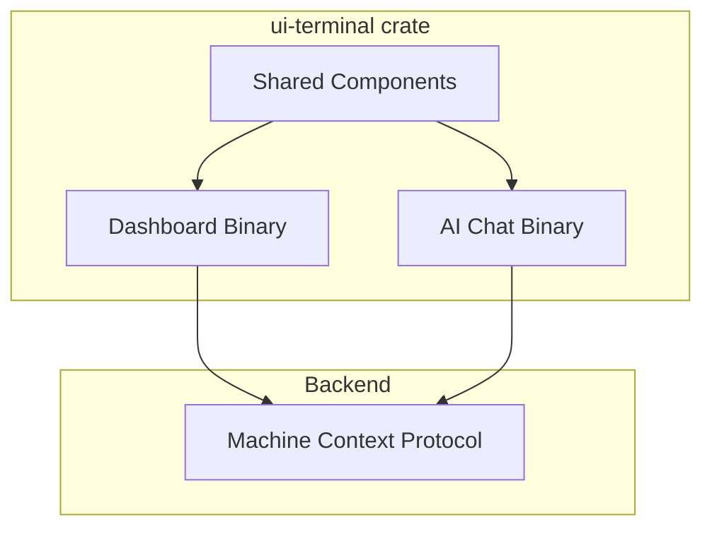

# Separating Dashboard and AI Chat Terminal UIs

## Overview

This specification outlines the approach to separate the existing combined Terminal UI into two distinct applications:
1. A Dashboard Terminal UI for system monitoring
2. An AI Chat Terminal UI for AI interactions

This separation will solve persistent initialization errors, improve maintainability, and allow each component to evolve independently while maintaining communication through the existing Machine Context Protocol (MCP).

## Motivation

The current architecture combines dashboard monitoring and AI chat functionality into a single terminal UI with tabs. This has led to:

1. Persistent initialization errors when attempting to use both functionalities
2. Complex state management trying to balance both concerns
3. Difficult debugging of cross-component issues
4. User experience limitations due to tab-switching instead of simultaneous viewing

By separating these concerns, we can:
1. Improve stability and eliminate cross-component errors
2. Enable simultaneous viewing of dashboard metrics and AI chat
3. Simplify the codebase and improve maintainability
4. Allow independent evolution of each UI

## Implementation Status

### Completed
1. ✅ Updated Cargo.toml with separate binary targets for dashboard and aichat
2. ✅ Implemented dashboard binary entry point (src/bin/dashboard.rs)
3. ✅ Created initial aichat binary entry point (src/bin/aichat.rs)
4. ✅ Refactored shared UI components (widgets, events)
5. ✅ Implemented dashboard-specific widgets (system, network, alerts, protocol)
6. ✅ Created shared error handling mechanism
7. ✅ Basic chat UI widget and message handling
8. ✅ Implemented help overlay for both UIs
9. ✅ Fixed imports and compilation issues
10. ✅ Implemented basic message sending and display
11. ✅ Implemented focus management for AI chat input
12. ✅ Added keyboard shortcuts for navigation and editing
13. ✅ Implemented message scrolling with Up/Down/PgUp/PgDown/Home/End
14. ✅ Created user/AI message alignment (user left, AI right)
15. ✅ Added different styling for user and AI messages
16. ✅ Created mock OpenAI integration for testing

### In Progress
1. ⏳ Integrating with OpenAI API for real responses
2. ⏳ Implementing proper error handling for API failures
3. ⏳ Enhancing message formatting and display

### Pending
1. ❌ Implement AI model selection in chat UI
2. ❌ Create comprehensive test suite for both applications
3. ❌ Add markdown rendering for AI responses
4. ❌ Implement streaming responses for better interactivity

## Technical Approach

### 1. Create New Binary Targets

We have created two separate binary targets in the `ui-terminal` crate:

1. `dashboard` (existing binary renamed)
2. `aichat` (new binary)

Both share core components from the crate but have dedicated entry points.

### 2. Shared Component Architecture



### 3. Component Extraction Plan

#### 3.1 Shared Components
- Extract common widgets and utilities into shared modules ✅
- Ensure UI framework components (TUI, crossterm, etc.) are properly abstracted ✅
- Move common terminal handling (events, rendering) to shared modules ✅

#### 3.2 Dashboard-Specific Components
- Extract dashboard-specific state management ✅
- Move tab-handling for system, network, alerts, etc. to dashboard binary ✅
- Maintain all existing dashboard visualizations ✅

#### 3.3 AI Chat-Specific Components
- Extract AI chat state, models, and widgets ✅
- Create dedicated AI chat interface ✅
- Implement focused AI chat experience ⏳

### 4. Next Development Steps

#### 4.1 Keyboard Focus Management
- Implement separate input modes:
  - Navigation mode: Where 'q', 'h', '?' work as commands
  - Input mode: Where all keys are treated as text input
- Add visual indication of current focus state
- Implement keyboard shortcuts to switch between modes (e.g., 'i' for input, 'Esc' for navigation)
- Ensure cursor is only visible in input mode

#### 4.2 OpenAI API Integration
- Replace mock responses with actual API calls
- Implement API key management and configuration
- Add support for different models (GPT-3.5, GPT-4)
- Implement proper error handling for API failures
- Add request throttling and rate limit handling

#### 4.3 Message Formatting and Display
- Implement syntax highlighting for code blocks
- Add support for markdown rendering
- Improve timestamp and sender display
- Implement proper scrolling for long message history
- Add support for message streaming for real-time responses

#### 4.4 Command Integration
- Add support for slash commands (e.g., /help, /clear)
- Implement command history navigation
- Add support for context management commands

## User Experience Details

### Dashboard Terminal UI

- Focused entirely on system monitoring ✅
- Shows system metrics, network status, alerts, etc. ✅
- Removes AI chat tab and related commands ✅
- Maintains existing dashboard keyboard shortcuts ✅

### AI Chat Terminal UI

- Dedicated to AI interactions ✅
- Full-screen chat interface with message history ✅
- Input box for sending messages ✅
- Help overlay with keyboard shortcuts ✅

#### Planned Improvements:
- Proper focus management for text input
- Clear visual indication of input vs. navigation mode
- Model selection dropdown or command
- Message streaming for real-time responses
- Syntax highlighting and markdown rendering
- Command history navigation (up/down arrow keys)

## Command-Line Usage

```bash
# Run the dashboard UI
cargo run -p ui-terminal --bin squirrel-dashboard

# Run the AI chat UI
cargo run -p ui-terminal --bin squirrel-aichat
```

## Conclusion

The separation of the Terminal UI into dedicated Dashboard and AI Chat applications is progressing well. The basic structure is in place, with both applications functional but requiring further refinement. 

The next major development focus is on improving the AI Chat UI with proper keyboard handling, OpenAI API integration, and enhanced message display. These improvements will deliver a more polished and user-friendly AI chat experience while maintaining the stability and functionality of the dashboard component.

Progress is tracked through the Implementation Status section, which will be updated as development continues. 